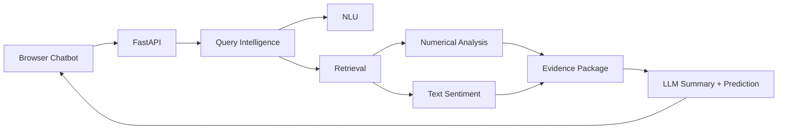

<div align="center">

<h1>FinSight</h1>

<h3>Evidence-first financial analysis chatbot.</h3>

<p>
  <a href="README.md"></a>
  <a href="README_CN.md"></a>
  <a href="LICENSE"></a>
  
  
  
</p>

</div>

---

FinSight is an evidence-first financial analysis chatbot for ARIN7012 Group 4.2. It turns a natural-language finance question into auditable evidence artifacts, then presents a risk-aware answer through a local browser chatbot.

The project is designed around a simple rule: the system should retrieve and expose evidence before it writes a financial answer. The backend identifies intent, entities, required evidence, source plans, retrieved documents, structured market data, numerical signals, sentiment evidence, and cited answer JSON.

## Highlights

- Browser chatbot with Chinese and English queries.
- Explainable Query Intelligence backend for NLU and retrieval.
- China-market runtime coverage for A-shares, ETFs/funds, indices, sectors, macro indicators, policy events, news, announcements, and fundamentals.
- Numerical `analysis_summary` with market, fundamental, macro, technical-indicator, and data-readiness signals.
- Document sentiment pipeline over retrieved evidence.
- LLM summary and next-question prediction over compact evidence, with citation and disclaimer controls.
- Clone-usable runtime assets in `data/runtime/` and shipped model artifacts in `models/`.

## Architecture



Core outputs:

| Artifact | Purpose |
|---|---|
| `nlu_result` | Normalized query, product type, intents, topics, entities, missing slots, risk flags, evidence requirements, and source plan. |
| `retrieval_result` | Executed sources, documents, structured data, coverage, warnings, ranking traces, and `analysis_summary`. |
| `answer_generation` | Frontend-ready answer JSON generated from compact evidence. |
| `next_question_prediction` | Suggested follow-up questions for the chatbot. |

FinSight does not make deterministic buy/sell decisions. It provides evidence, interpretation, uncertainty warnings, and a risk disclaimer.

## Quick Start

Use Python 3.13 or a compatible Python 3 version.

```bash
pip install -r requirements.txt
```

Run a one-shot manual query:

```bash
python manual_test/run_manual_query.py --query "你觉得中国平安怎么样？"
```

Start the local browser chatbot:

```bash
export DEEPSEEK_API_KEY="your_deepseek_api_key_here"
python scripts/launch_chatbot.py
```

Start the FastAPI service:

```bash
uvicorn query_intelligence.api.app:create_app --factory --host 0.0.0.0 --port 8000
```

Enable live providers when needed:

```bash
QI_USE_LIVE_MARKET=1 QI_USE_LIVE_NEWS=1 QI_USE_LIVE_ANNOUNCEMENT=1 \
uvicorn query_intelligence.api.app:create_app --factory --host 0.0.0.0 --port 8000
```

Manual runs write local artifacts to:

```text
manual_test/output/<timestamp>-<query-slug>/
  query.txt
  nlu_result.json
  retrieval_result.json
```

## API Overview

| Endpoint | Purpose |
|---|---|
| `GET /health` | Health check. |
| `GET /` | Local browser chatbot UI. |
| `POST /chat` | End-to-end chatbot response with evidence-backed LLM wording. |
| `POST /nlu/analyze` | NLU only. |
| `POST /retrieval/search` | Retrieval from an existing NLU result. |
| `POST /query/intelligence` | End-to-end NLU and retrieval. |
| `POST /query/intelligence/artifacts` | End-to-end run and write JSON artifacts. |

Example request:

```json
{
  "query": "你觉得中国平安怎么样？",
  "user_profile": {
    "risk_preference": "balanced",
    "preferred_market": "cn",
    "holding_symbols": ["601318.SH"]
  },
  "top_k": 10,
  "debug": false
}
```

See [docs/query-intelligence.md](docs/query-intelligence.md) for full request and response contracts.

## Modules

| Module | Main path | Documentation |
|---|---|---|
| Frontend chatbot | `query_intelligence/chatbot.py`, `query_intelligence/api/app.py` | [docs/frontend-chatbot.md](docs/frontend-chatbot.md) |
| NLU and Retrieval | `query_intelligence/` | [docs/query-intelligence.md](docs/query-intelligence.md) |
| Numerical Analysis | `query_intelligence/retrieval/market_analyzer.py` | [docs/numerical-analysis.md](docs/numerical-analysis.md) |
| Text Analysis | `sentiment/` | [docs/sentiment.md](docs/sentiment.md) |
| LLM Summary and Prediction | `scripts/llm_response.py`, `/chat` | [docs/llm-response.md](docs/llm-response.md) |

For a module-level map, see [docs/modules.md](docs/modules.md).

## Repository Layout

```text
query_intelligence/   FastAPI app, NLU, retrieval, contracts, providers
sentiment/            Document sentiment preprocessing and classification
scripts/              Chatbot launcher, LLM handoff, evaluation utilities
training/             Public-data sync, training, and runtime asset building
manual_test/          Manual query and integration runners
tests/                Pytest coverage
schemas/              JSON schemas for external validation
data/runtime/         Small clone-usable runtime assets
models/               Shipped model artifacts
docs/                 Detailed documentation
submission/           Final report package and evidence files
```

## Configuration

Common environment variables:

| Variable | Purpose |
|---|---|
| `DEEPSEEK_API_KEY` | Enables `/chat` LLM answer polishing. |
| `DEEPSEEK_MODEL` | Overrides the default DeepSeek model. |
| `TUSHARE_TOKEN` | Enables Tushare live market and fundamentals. |
| `QI_USE_LIVE_MARKET` | Enables live market providers. |
| `QI_USE_LIVE_NEWS` | Enables live news providers. |
| `QI_USE_LIVE_ANNOUNCEMENT` | Enables live announcement providers. |
| `QI_USE_LIVE_MACRO` | Enables live macro providers. |
| `QI_POSTGRES_DSN` | Optional PostgreSQL source for structured retrieval. |

Never commit `.env`, tokens, generated outputs, public dataset caches, or local scratch files.

## Testing

Run the grouped test suite:

```bash
python -m scripts.run_test_suite
```

Run focused checks:

```bash
python -m pytest tests/test_query_intelligence.py -q
python -m pytest tests/test_analysis_summary.py tests/test_market_analyzer.py -q
python -m pytest tests/test_sentiment_pipeline.py -q
python -m pytest tests/test_llm_response.py -q
```

See [docs/training.md](docs/training.md) for evaluation, training, and release checks.

## Documentation

Start with [docs/index.md](docs/index.md).

| Topic | Link |
|---|---|
| Module map | [docs/modules.md](docs/modules.md) |
| Query Intelligence | [docs/query-intelligence.md](docs/query-intelligence.md) |
| Frontend chatbot | [docs/frontend-chatbot.md](docs/frontend-chatbot.md) |
| Numerical analysis | [docs/numerical-analysis.md](docs/numerical-analysis.md) |
| Text sentiment | [docs/sentiment.md](docs/sentiment.md) |
| LLM response handoff | [docs/llm-response.md](docs/llm-response.md) |
| Training and runtime assets | [docs/training.md](docs/training.md) |
| Presentation materials | [docs/presentation/README.md](docs/presentation/README.md) |

## Safety

FinSight is a research and coursework prototype. It summarizes evidence and can help inspect financial information, but it is not an investment adviser and must not be used as the sole basis for trading decisions.
