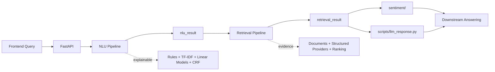

# ARIN Query Intelligence

Languages: English | [中文](README_CN.md)

ARIN Query Intelligence turns a user's financial question into explainable JSON artifacts that downstream systems can analyze and answer from.

It produces:

- `nlu_result`: normalized query, product type, intents, topics, entities, missing slots, risk flags, evidence requirements, and source plan.
- `retrieval_result`: executed sources, document evidence, structured data, coverage, warnings, ranking traces, and `analysis_summary`.

It does not write final investment answers or deterministic buy/sell decisions. Natural-language response generation, sentiment analysis, and statistical reasoning consume these artifacts downstream.

## Architecture



Core rule: NLU and Retrieval use classical, inspectable methods as the main path. LLMs and transformer sentiment models are downstream consumers only.

## Quick Start

Install dependencies:

```bash
pip install -r requirements.txt
```

Run a manual query:

```bash
python manual_test/run_manual_query.py --query "What do you think about Ping An Insurance (601318.SH)?"
```

Start the API:

```bash
uvicorn query_intelligence.api.app:create_app --factory --host 0.0.0.0 --port 8000
```

Enable live market/news/announcement providers:

```bash
QI_USE_LIVE_MARKET=1 QI_USE_LIVE_NEWS=1 QI_USE_LIVE_ANNOUNCEMENT=1 \
uvicorn query_intelligence.api.app:create_app --factory --host 0.0.0.0 --port 8000
```

Generate downstream LLM response JSON with the default DeepSeek V4 Flash backend:

```bash
export DEEPSEEK_API_KEY="your_deepseek_api_key_here"
python scripts/llm_response.py --query "What do you think about Ping An Insurance (601318.SH)?"
```

Manual query output:

```text
manual_test/output/<timestamp>-<query-slug>/
  query.txt
  nlu_result.json
  retrieval_result.json
```

## API

| Endpoint | Purpose | Output |
|---|---|---|
| `GET /health` | Health check | `{"status":"ok"}` |
| `POST /nlu/analyze` | NLU only | `NLUResult` |
| `POST /retrieval/search` | Retrieval from an existing NLU result | `RetrievalResult` |
| `POST /query/intelligence` | End-to-end NLU + Retrieval | `PipelineResponse` |
| `POST /query/intelligence/artifacts` | End-to-end run and write JSON files | `ArtifactResponse` |

Recommended request:

```json
{
  "query": "What do you think about Ping An Insurance (601318.SH)?",
  "user_profile": {
    "risk_preference": "balanced",
    "preferred_market": "cn",
    "holding_symbols": ["601318.SH"]
  },
  "dialog_context": [],
  "top_k": 10,
  "debug": false
}
```

See [Query Intelligence Contracts](docs/query-intelligence.md) for full request and output fields.

## Modules

| Path | Role |
|---|---|
| `query_intelligence/api/` | FastAPI service boundary. |
| `query_intelligence/nlu/` | Normalization, entity resolution, classifiers, clarification, out-of-scope detection, and source planning. |
| `query_intelligence/retrieval/` | Query building, document/structured retrieval, ranking, deduplication, packaging, and market analysis. |
| `query_intelligence/contracts.py` | Pydantic API and artifact contracts. |
| `query_intelligence/integrations/` | Tushare, AKShare, Cninfo, efinance, and macro providers. |
| `sentiment/` | Downstream document sentiment preprocessing and FinBERT classifier. |
| `scripts/llm_response.py` | Downstream answer and next-question JSON generator. |
| `training/` | Classical ML training entry points. |
| `data/runtime/` | Shipped runtime entities, aliases, and document corpus for clone usability. |
| `models/` | Shipped trained model artifacts. |

## Documentation

| Topic | English | Chinese |
|---|---|---|
| Overview and navigation | [docs/index.md](docs/index.md) | [docs/zh/index.md](docs/zh/index.md) |
| Architecture, API, and output contracts | [docs/query-intelligence.md](docs/query-intelligence.md) | [docs/zh/query-intelligence.md](docs/zh/query-intelligence.md) |
| Training and runtime assets | [docs/training.md](docs/training.md) | [docs/zh/training.md](docs/zh/training.md) |
| LLM response handoff | [docs/llm-response.md](docs/llm-response.md) | [docs/zh/llm-response.md](docs/zh/llm-response.md) |
| Document sentiment analysis | [docs/sentiment.md](docs/sentiment.md) | [docs/zh/sentiment.md](docs/zh/sentiment.md) |
| Retrieval output compatibility spec | [docs/retrieval_output_spec.md](docs/retrieval_output_spec.md) | [docs/zh/retrieval_output_spec.md](docs/zh/retrieval_output_spec.md) |

## Configuration

Common environment variables:

| Variable | Purpose |
|---|---|
| `TUSHARE_TOKEN` | Preferred live A-share market and fundamental provider token. |
| `QI_POSTGRES_DSN` | Optional production document/structured store. |
| `QI_USE_LIVE_MARKET` | Enable live market/fundamental providers. |
| `QI_USE_LIVE_NEWS` | Enable live news providers. |
| `QI_USE_LIVE_ANNOUNCEMENT` | Enable Cninfo announcements. |
| `QI_USE_LIVE_MACRO` | Enable live macro indicators. |
| `QI_MODELS_DIR` | Model artifact directory. |
| `QI_API_OUTPUT_DIR` | API artifact output directory. |
| `DEEPSEEK_API_KEY` or `QI_LLM_API_KEY` | Default LLM response backend key. |

Copy `.env.example` to `.env` for a local template. Do not commit real keys or generated outputs.

## Testing

Run focused tests:

```bash
python -m pytest -q tests/test_query_intelligence.py tests/test_llm_response.py
```

Run the grouped suite:

```bash
python -m scripts.run_test_suite
```

Run live source verification:

```bash
QI_USE_LIVE_MARKET=1 QI_USE_LIVE_NEWS=1 QI_USE_LIVE_ANNOUNCEMENT=1 \
python -m scripts.verify_live_sources --query "Is Cambricon (688256.SH) worth buying now?" --debug
```

## Scope

The default shipped runtime focuses on China-market v1:

- A-share stocks, ETFs, funds, indexes, sectors, macro indicators, policy signals, news, announcements, fundamentals, valuation, and risk.
- HK/US stocks and overseas products require additional runtime entities, aliases, providers, documents, and evaluation cases.
- Non-financial questions should be rejected as `out_of_scope` rather than forced through finance retrieval.
