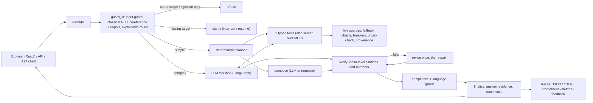

<div align="center">

<h1>FinSight</h1>

<h3>Evidence-first research agent for China A-shares.</h3>

<p>
  <a href="README.md"></a>
  <a href="README_CN.md"></a>
  <a href="LICENSE"></a>
  <a href="https://github.com/beautifulrem/FinSight/actions/workflows/ci.yml"></a>
  
  
  
  
</p>

</div>

---

FinSight answers questions about Chinese listed companies, funds, indices and macro data. A classical, explainable NLU front end routes and guards every question. An LLM orchestrates typed evidence tools in a LangGraph loop. **Every number in the answer is checked by code against the evidence cited in the same sentence**, and a compliance guard then removes anything that reads like investment advice. Without an LLM key, the same graph runs on a deterministic planner.

**In 30 seconds**

- **Numbers you can trace.** The claim-level verifier rejected 98.8% of 4,016 corrupted answers and accepted all 227 correct ones (`verifier_stress.json`, `25205d4`, a pinned gold set: a second run is identical). A number swapped in from another company passed 0 of 910 times (0.7% with derived numbers allowed, the default); with the original check it passed 100% of the time. Answers that fail are repaired by deleting whole sentences: 100% readable, where the old clause salvage left 26% readable (`verifier_stress-clause-salvage.json`).
- **Measured on a set nobody tuned against.** On test v3 (130 tasks written by a separate author, first LLM run at the final commit `9536abf`), the DeepSeek agent passes **0.869 [0.81, 0.92]** of tasks, LLM composition 0.831, the deterministic workflow 0.769 and an LLM without tools 0 (strict, citation-gated scoring). The agent beats the workflow significantly (+0.100 [+0.049, +0.156], McNemar p = 0.007) and composition per run (+0.038 [+0.003, +0.082]), but not on pass^3. With GLM the agent is no better than composition (−0.003 [−0.044, +0.041]) and its P95 is 82 s.
- **Out of sample, after the fixes.** Each review's author writes a held-out slice from the bugs they found, before any fix; the engineers who fix those bug classes never open it, and it is run once before and once after. Round 7 (53 chat sessions: gap and ratio follow-ups, derived metrics, implied price, HK listings): **0.264 → 0.830** (gap follow-ups 0.17 → 0.83, derived metrics 0.09 → 0.64; [per-class table](#the-round-7-slice-per-class)). Round 6: claims **0.537 → 0.836**, chat **0.579 → 0.816**. The fixes carry over to the slice author's phrasings, but not to everyone's: the round-8 reviewer reworded the same classes and the code at `40e8685` scored 0.275 on them ([Known open issues](#known-open-issues)).
- **Every independent set is reported twice: first run, then after exposure.** Separate authors wrote a multi-turn set, test v3, two router label sets and three round-4 held-out slices without seeing the code. First runs: multi-turn 0.224 (no LLM) / 0.361 (agent), router labels 0.740, round-4 claims 0.716, round-4 multi-turn 0.667, planted-document attacks 0/168 on the template path. Numbers measured after fixing what a set exposed are labelled "after exposure"; a fresh router set scored 0.801 on its first run (0.842 at `40e8685`, after exposure), and the round-5 held-out slice scored 0.821 on claims and 0.921 on chat on its first run.
- **Honest statistics.** Every rate has a 95% bootstrap CI, and paths are compared with paired bootstrap + exact McNemar. On held-out the agent (1.000) is not significantly better than composition (0.981); after the round-8 output-layer fixes the LLM paths still state 0–3.4% of planted-document payloads as fact (2.8–6.8% raw detector hits) where the template path lets none through (see [Known open issues](#known-open-issues)).
- **Runs like a service.**
  - It works without an LLM, and every LLM call is bounded by the run deadline.
  - The DeepSeek agent's P95 is 15–17 s, and the first answer token arrives after about 3 s.
  - It has been load- and chaos-tested (8 users without an LLM while the chaos drill blocks the market sources: 0 errors in 400 requests, [performance.md §1b](docs/performance.md#1b-workflow-path-under-the-source-chaos-drill-no-llm-8-users)), and runs on k3s with Postgres-shared sessions, tasks and traces.
  - It exposes MCP (server and client) and A2A, and ships Prometheus/Grafana/Jaeger monitoring.
- **Why not just use 豆包 / 问财?** [docs/comparison.md](docs/comparison.md) covers what they do better, what none of them publishes, and a fair head-to-head test (designed, not run).

<p align="center"></p>

## Why it is built this way

| Decision | Reason | Where |
|---|---|---|
| Classical NLU routes; an LLM orchestrates | Routing and guarding must be explainable and cheap, so the LLM is used only where it adds value: choosing tools and writing. A fixed workflow handles simple questions; the LLM loop handles comparisons, "why" questions and multi-hop ones. Every routing decision is logged as a reason. | `agent/router.py`, `agent/graph.py` |
| Claim-level number verification | A number must appear in the evidence cited in *its own sentence*, matched with awareness of units, precision and sign. An unverifiable sentence goes back to the LLM for one revision; if it still fails, it is deleted. | `agent/verifier.py` |
| Deterministic fallback everywhere | No key, a provider outage, an exhausted budget or a passed deadline all degrade to the planner + template answer, which is still cited and verified. | `agent/planner.py`, `agent/llm.py` |
| Evidence as untrusted data | Tool output is wrapped, normalised and filtered for injected instructions; the user's own message goes through an input guard; all tools are read-only. | `agent/injection.py` |

## Results

Strict ("dealbreaker") scoring: a task succeeds only if every one of these holds:

- the behaviour is right (answer, clarify or refuse);
- every required fact is stated **and** cited;
- the required tools were used;
- a judgment question gets hedged;
- no trading instruction appears anywhere.

Online runs use 3 repeats per task, and costs are as billed by the gateway. Each number below comes from a committed file in [`evaluation/results/`](evaluation/results/), which records the commit, the prompt hashes and the command of its run. Per-category tables and every paired comparison are in [docs/agent-eval.md](docs/agent-eval.md). A Chinese summary is in [docs/zh/evaluation.md](docs/zh/evaluation.md).

### Task sets and who wrote them

| Set | Size | Written by | Status |
|---|---|---|---|
| Development | 370 tasks | project author | used to drive fixes |
| Held-out | 53 tasks | project author, after the rules were tuned | also used to choose prompts, so a validation set |
| Test v2 | 121 tasks / 174 turns | project author, blind, in one pass | failure classes read after its first runs and fixed on dev-style tasks, so **after exposure** since round 2 |
| Multi-turn v1 | 49 conversations / 206 turns | a separate author who did not read the routing code or any task file ([protocol](evaluation/agent_eval/tasks/README_multiturn_v1.md)) | first runs below; fixed afterwards, so after exposure |
| Test v3 | 130 tasks / 155 turns | a separate author, same rules ([protocol](evaluation/agent_eval/tasks/README_test_v3.md)) | no fix has looked at it; first LLM run at `9536abf`; used once, at `bc42017`, to choose the default prompt (v3 vs v4), so later test v3 numbers with v4 are no longer untouched |
| Round-4 held-out slices | 67 claims, 24 conversations, 21 planted attacks | a separate author, before the round-4 fixes ([protocol](evaluation/heldout_r4/README.md)) | run once at `817a2d8`; claims and multi-turn fixed afterwards, so after exposure |
| Round-5 held-out slice | 56 claims, 38 chat tasks / 41 turns | a separate author ([protocol](evaluation/heldout_r5/README.md)) | first run at `f01097a`; both parts fixed in round 9 and re-scored after it (chat at `d78a556`, claims at `2be73d6`), so after exposure |
| Round-6 held-out slice | 67 claims, 38 chat tasks / 61 turns | a separate author, against `bc42017`, before the round-10 fixes ([protocol](evaluation/heldout_r6/README.md)) | run once before the fixes (`05c4d7b`) and once after them (`68279eb`); the engineers who made the fixes **never saw it**, so both runs are out-of-sample |
| Router labels, independent v1 / v2 | 154 / 241 queries | separate authors labelling against a written policy ([v2 protocol](evaluation/agent_eval/tasks/README_router_labels_independent_v2.md)) | v1 exposed after its first run; v2 first run 0.801, rerun at HEAD after exposure |

### Final online run (commit `9536abf`)

Task success with 95% CIs, 3 repeats per task, DeepSeek V4.1 Flash unless stated. Sources: `ablation-final4-deepseek-testv3-holdout.json`, `ablation-final4-deepseek-testv2-multiturn.json`, `ablation-final4-glm-testv3.json`, `ablation-test_v3-purellm-deepseek.json` (the no-tools row, `3730408`). The run command, prompt hashes and model are recorded in each file.

| Answer path | **Test v3** (first run) | Test v3 · GLM | Held-out (validation) | Test v2 (after exposure) | Multi-turn v1 (after exposure) |
|---|---|---|---|---|---|
| Original `/chat`, no LLM | 0.008 [0.00, 0.02] | 0.008 | 0.208 [0.11, 0.32] | 0.223 [0.15, 0.30] | 0.000 |
| LLM without tools | 0.000 (0/130) | – | – | – | – |
| Deterministic workflow (no LLM) | 0.769 [0.69, 0.84] | 0.769 | 0.943 [0.89, 1.00] | 0.901 [0.84, 0.95] | 1.000 |
| Workflow + LLM composition | 0.831 [0.76, 0.89], pass^3 0.823 | 0.818 [0.75, 0.88], pass^3 0.800 | 0.981 [0.94, 1.00] | 0.931 [0.88, 0.97] | 0.980 [0.94, 1.00] |
| **LLM agent (tool loop)** | **0.869 [0.81, 0.92]**, pass^3 0.854 | 0.815 [0.76, 0.87], pass^3 0.731 | **1.000** | **0.959 [0.92, 0.99]** | 0.959 [0.90, 1.00] |
| Agent P95 / cost per task | 18.4 s / $0.00114 | **81.9 s** / $0.00139 | 21.3 s / $0.00085 | 15.5 s / $0.00135 | 14.8 s / $0.00391 |
| LLM-error turns (agent · composition), share that was HTTP 429 | 0.000 · 0.000 | 0.013 · 0.002, none 429 | 0.000 · 0.000 | 0.008 (all 429) · 0.015 (none 429) | 0.000 · 0.000 |

- **Paired comparisons (DeepSeek, test v3):** agent vs workflow +0.100 [+0.049, +0.156], McNemar 13 vs 2, p = 0.007; composition vs workflow +0.062 [+0.023, +0.105], p = 0.039; agent vs composition +0.038 [+0.003, +0.082] per run, pass^3 +0.031 [−0.008, +0.077], McNemar 6 vs 2, p = 0.29 (not significant). On test v2 (after exposure) agent vs composition is +0.028 [+0.003, +0.058]; on held-out and multi-turn v1 the difference is not significant.
- **GLM:** agent and composition are tied on test v3 (−0.003 [−0.044, +0.041]); the agent's pass^3 is lower (0.731) and its P95 is 82 s against 27 s for composition. Since `66c0ef2`, `mode=auto` therefore sends agent-route questions to composition when the model is a slow reasoning model (route reason `model_policy:composition_for_slow_model`; `QI_AGENT_SLOW_MODEL_POLICY=off` disables it, `mode=agent` still runs the loop). The policy rests on these committed GLM runs; no GLM run through `auto` has been made since. Lowering GLM's reasoning effort instead was measured and not adopted: on held-out (agent, 1 repeat) P95 35.8 → 17.7 s and cost −37%, but task success 1.000 → 0.962 (not significant) and hedging on judgment questions 1.00 → 0.82 (`ablation-glm-effort-default-holdout.json`, `ablation-glm-effort-low-holdout.json`, `bc42017`).
- **The LLM alone passes nothing.** Without tools it passes 0 of 130 on test v3 and 0 of 381 on dev, held-out and test v2 (`ablation-final.json`, `ablation-test_v2-deepseek.json`). It cannot cite evidence and its prices cannot be verified, so under citation-gated scoring its 0 is by construction; scored without citations, 4–8% of the required numbers in its answers match the snapshot ([agent-eval.md](docs/agent-eval.md#the-no-tools-llm-baseline-strict-scoring-vs-uncited-correctness)).
- **Earlier runs.** The round-2 online run at `d1c007c` (`ablation-final2-deepseek.json`, `ablation-final2-glm.json`) is kept for history: on its DeepSeek agent turns 7.1% (held-out) and 4.4% (test v2) of calls failed with HTTP 429 and fell back, so its cells mix the agent with the template path. A rerun during round 4 hit the ClinePass weekly cap; every call returned 429, the tooling marked it invalid, and it was not committed.
- **Prompt versions.** The v2/v3 quality gain claimed in round 1 was withdrawn (inside run-to-run spread); the supported result is the cost cut (−69% agent cost per dev task, v1 → v2). Prompt v4 (document-content rules, round 7) is the **default since `66c0ef2`**. The A/B on test v3 at `bc42017` (DeepSeek, 2 repeats, back to back; `ablation-ab-prompt-v3-testv3.json`, `ablation-ab-prompt-v4-testv3.json`) found no task-success cost: agent 0.858 → 0.877 (+0.019 [+0.000, +0.038], McNemar 6 vs 1, p = 0.125), pass^2 0.831 → 0.869; composition 0.831 → 0.823 (p = 1.0). v4's rules are what the red team needs, so it was chosen; the price is agent P95 15.9 → 19.2 s and +11% cost per task. The A/B used the prompts before the round-10 arithmetic patch, which is the same text in v3 and v4; the shipped prompt (v4 + patch) was then run once on test v3 at `9aa4638` (`ablation-v4default-testv3.json`, 1 repeat): agent 0.869, composition 0.823, in line with the A/B. This choice used test v3.

### Independent sets: first runs vs after exposure

| Set | First run (honest estimate) | After exposure (tuned, not an estimate) |
|---|---|---|
| Multi-turn v1, deterministic path | task 0.224 [0.12, 0.35], turn 0.709 (`multiturn_v1-auto-nollm-first-run.json`, `1bd1932`) | task 1.000, turn 1.000 (`multiturn_v1-auto-nollm-after-fixes.json`, `7513376`) |
| Multi-turn v1, DeepSeek | agent task 0.361 [0.24, 0.49], pass^3 0.286, turn 0.795. Composition task 0.286, pass^3 0.245. LLM-error turns: agent 0.003 (no 429), composition 0.000 (`ablation-multiturn_v1-deepseek-first-run.json`, `527a611`) | agent 0.959 [0.90, 1.00], composition 0.980 (`ablation-final4-deepseek-testv2-multiturn.json`, `9536abf`) |
| Router labels, independent v1 (154) | 0.740 (`router_eval-independent_v1-first-run.json`, `882745d`) | 1.000 (`router_eval-round4-independent-after-exposure.json`, `075caad`) |
| Router labels, independent v2 (241, fresh) | **0.801** after the round-4 router changes (`router_eval-independent_v2-first-run.json`, `3080bfe`) | 0.842 after round 11 (`router_eval-independent_v2-round11.json`, `40e8685`; 0.838 after round 10, 0.830 after round 9) |
| Router labels, own (not independent) | 0.988 on 162 (`router_eval-round3b.json`) | 1.000 on 372 (`router_eval-round11-own.json`) |
| Test v3, deterministic path | task 0.762 [0.68, 0.83], turn 0.794 (`test_v3-auto-nollm-first-run.json`, `882745d`) | – (no fix has looked at it) |
| Test v3, DeepSeek (first LLM run) | agent **0.869 [0.81, 0.92]**, composition 0.831, workflow 0.769 (`ablation-final4-deepseek-testv3-holdout.json`, `9536abf`) | – (no fix has looked at it) |
| Round-4 claims (67 move / relational / macro) | verdict accuracy 0.716 [0.61, 0.82], per-number 0.639, comparator 0.435 (`claim_bench-heldout_r4-first-run.json`, `817a2d8`) | verdict 1.000, per-number 0.920 (`claim_bench-heldout_r4-after-exposure.json`, `c731dba`) |
| Round-4 multi-turn (24 conversations), deterministic path | task 0.667 [0.50, 0.83], turn 0.810 (`multiturn_r4_heldout-auto-nollm-first-run.json`, `817a2d8`) | task 0.917 [0.79, 1.00] (`multiturn_r4_heldout-after-exposure.json`, `c731dba`) |
| Round-4 planted attacks (21 × 8 runs), template path | 0/168 succeeded (`redteam-holdout5-first-run.json`, `817a2d8`) | LLM paths at `9536abf`: composition 9.5%, agent 4.8% (`redteam-final4-llm.json`); after round 8 (`0473968`): raw 3.6% / 3.0%, stated as fact 1.2% / 2.4% (`redteam-r8-llm.json`) |
| Round-5 claims (56: multi-clause, industry average, turnover, ratio) | verdict accuracy **0.821 [0.71, 0.91]**, per-number 0.814, comparator 0.835 (`claim_bench-heldout_r5-first-run.json`, `f01097a`) | 1.000 after exposure (`claim_bench-heldout_r5-after-exposure.json`; round 9 fixed E1, E2, E9 and the slice's failure classes, so this is not a fresh estimate) |
| Round-5 chat (38 tasks), deterministic path | task **0.921 [0.82, 1.00]**; failed r5t006 (fair value), r5t019 (平安 as a bank), r5t029 (net margin as a share of revenue) (`chat_heldout_r5-auto-nollm-first-run.json`, `f01097a`) | task 1.000 (`chat_heldout_r5-auto-nollm-after-exposure.json`, `d78a556`) |
| Round-6 claims (67: stated industry average, two-company difference, approximate Chinese numerals, controls) | verdict accuracy **0.537 [0.42, 0.66]**, per-number 0.533, comparator 0.294 (`claim_bench-heldout_r6-prefix.json`, `05c4d7b`) | **not exposed**: after the round-10 fixes, made without seeing the slice, verdict **0.836 [0.75, 0.93]**, per-number 0.717, comparator 0.284 (`claim_bench-heldout_r6-after-fix.json`, `68279eb`) |
| Round-6 chat (38 tasks / 61 turns), deterministic path | task **0.579 [0.42, 0.74]**, turn 0.721 (`chat_heldout_r6-auto-nollm-prefix.json`, `05c4d7b`) | **not exposed**: task **0.816 [0.68, 0.92]**, turn 0.869, behaviour 0.984 after the round-10 fixes (`chat_heldout_r6-auto-nollm-after-fix.json`, `68279eb`) |
| Round-7 chat (53 tasks / 129 turns: gap and ratio follow-ups, derived metrics, implied price, HK listings), deterministic path | task **0.264 [0.15, 0.38]**, turn 0.643 (`chat_heldout_r7-auto-nollm-prefix.json`, `12a28eb`) | **not exposed**: task **0.830 [0.74, 0.92]**, turn 0.907, behaviour 0.977 after the round-11 fixes (`chat_heldout_r7-auto-nollm-after-fix.json`, `960432d`); four round-11 dev turns in three tasks match slice turns verbatim by coincidence (count corrected by the round-8 review), and without those three tasks it is 13/50 → 43/50 |
| Claim check, held-out claims (47) | verdict accuracy 0.936 [0.851, 1.000], per-number check accuracy 0.944 (`claim_bench-holdout.json`, `2fcb4f0`) | 1.000 after the round-8 fix of its h038 class (`claim_bench-holdout-after-round8.json`); the dev claims went 0.527 → 1.000 after tuning (`claim_bench-dev-baseline.json`, `claim_bench-dev.json`) |

The gap between the author's own router labels (0.988) and the first independent set (0.740) was the most useful finding of round 3. The rules had been fitted to the phrasings their author thought of. Each fix after that was generalised into a policy class, and a new independent set measured the result. The multi-turn story follows the same pattern and is described in [docs/presentation/agent-design-notes.md](docs/presentation/agent-design-notes.md).

**The round-6 slice answers "do the fixes generalise?"** Its author wrote it from the round-6 review's bug classes before any fix, without reading the code; the engineers who fixed those classes in round 10 never opened it. Run once before and once after, it moved claims 0.537 → 0.836 and chat 0.579 → 0.816, so the fixes carried over to phrasings nobody tuned against, but not completely. What is still wrong: 11 of 67 claim verdicts (stated industry averages r6c04/r6c10/r6c15, English two-company differences r6c33/r6c34/r6c38, and approximate expressions: 将近一半, 一成半, 一千四百出头, 一万二千多亿, 近四成), and 7 of 38 chat tasks (6 follow-ups like "它比行业低了多少" get both operands but not the difference, one of them is refused as off-topic; an English net-margin gap). The comparator score (0.294 → 0.284) did not move: the slice labels each comparison as a relation check plus a stated-value check, and the checker emits a different check structure (stated values as `eq` instead of `approx`), so the bench cannot pair many expected checks even where the verdict is right. It measures check-structure agreement, not verdict correctness, and is reported as is.


#### The round-6 slice per class

First run (`05c4d7b`) → after the round-10 fixes (`68279eb`), from `by_category` of `claim_bench-heldout_r6-prefix.json`, `claim_bench-heldout_r6-after-fix.json`, `chat_heldout_r6-auto-nollm-prefix.json` and `chat_heldout_r6-auto-nollm-after-fix.json`:

| Class | Items | First run | After the fixes |
|---|---|---|---|
| Claims: approximate Chinese numerals | 20 | 0.30 | 0.80 |
| Claims: two-company difference | 20 | 0.40 | 0.80 |
| Claims: stated industry average | 19 | 0.74 | 0.84 |
| Claims: controls | 8 | 1.00 | 1.00 |
| Chat: difference follow-up | 8 | 0.125 | **0.25** |
| Chat: fair value | 7 | 1.00 | 1.00 |
| Chat: out of coverage | 7 | 0.29 | 1.00 |
| Chat: derived metric | 6 | 0.67 | 0.83 |
| Chat: comparison winner | 4 | 0.75 | 1.00 |
| Chat: news corroborated | 3 | 1.00 | 1.00 |
| Chat: news control | 2 | 1.00 | 1.00 |
| Chat: two-target compare | 1 | 0.00 | 1.00 |

The chat headline (0.579 → 0.816) hides that its largest class barely moved: 6 of 8 difference follow-ups still fail, and so do most of the round-7 review's new three-turn sessions ("五粮液的ROE多少 → 茅台呢 → 两者差几个点"). From round 11 on the engineers may read the slice, so every later run is labelled **after exposure (round 11)**; the first one, the claim slice at `4796e24`, is unchanged at 0.836 (`claim_bench-heldout_r6-after-exposure-round11.json`). After the round-11 session comparison frame the chat slice is 0.921 (35/38; difference follow-ups 6 of 8) at `960432d` (`chat_heldout_r6-auto-nollm-after-exposure-round11.json`), an after-exposure number; the out-of-sample check of the same fixes is the round-7 slice below.

#### The round-7 slice per class

The round-7 review's author wrote 53 sessions from its G1–G6 findings before round 11 started; the round-11 engineers fixed those classes with their own examples (a session comparison frame, derived chat metrics, H-share handling) and never opened the slice. First run (`12a28eb`) → after the fixes (`960432d`), from `by_category` of `chat_heldout_r7-auto-nollm-prefix.json` and `chat_heldout_r7-auto-nollm-after-fix.json`:

| Class | Tasks | First run | After the fixes |
|---|---|---|---|
| Gap / ratio follow-up ("五粮液的ROE多少 → 茅台呢 → 两者差几个点") | 23 | 0.174 | **0.826** |
| Derived metric (holding value, net profit as a share of revenue, EPS) | 11 | 0.091 | **0.636** |
| Implied price / fair value | 6 | 0.333 | 1.000 |
| HK listing out of coverage | 8 | 0.250 | 0.875 |
| Controls | 5 | 1.000 | 1.000 |

Still failing (9 of 53): a turnover ("成交了多少钱", "trading value") answered with the close, so the following ratio turn has no metric to compare (r7h_gap_zh_09, r7h_gap_en_07); two English gap turns ("so what's the difference in points?" refused as unresolved, "Which one is higher and by how many points?" without the number; r7h_gap_en_06, r7h_gap_en_04, the latter one of the coincidental overlaps); holding values carried to a second stock ("要是同样300股换成五粮液呢"), asked in English, or for an ETF (r7h_derived_zh_03, r7h_derived_en_02, r7h_derived_zh_05); "What percent of that revenue ends up as net profit?" (r7h_derived_en_03); and "那它在香港上市的股票呢" answered with the A share (r7h_hk_zh_02). From round 12 the engineers may read this slice, so later runs are labelled after exposure.

### Other measurements

| Measurement | Result | Evidence |
|---|---|---|
| Verifier stress test: 227 correct answers, 4,016 corrupted variants (round 11) | False accepts: original check 33.0%, run-level check 24.6%, claim-level **1.17%** (1.32% with derived numbers allowed, the default). Numbers swapped between companies: 100% → **0.0%** (0.66% with derived numbers). Correct answers accepted: 100%. The gold set is pinned: the result records its task ids and a sha256, two runs at the same commit are identical, and a tool timeout or replay miss fails the run instead of dropping a task. Earlier runs: `9f0e46b` 202 correct answers, 1.94% (`verifier_stress-9f0e46b.json`); round 9 `d78a556` 240, 1.87% (`verifier_stress-round9.json`); round 10 `53454f5` 227, 1.25% (`verifier_stress-round10.json`). The gold counts differ because the commits differ, not because of load. | `verifier_stress.json` (`25205d4`) |
| Repair of failed answers (3,969 rejected variants) | Whole-sentence deletion: 100% readable and verified, 0% fragments, 97.6% of untouched sentences kept, 17.8% fall back to the template answer (3,333 / 98.0% / 18.3% at `9f0e46b`). The old clause salvage, re-measured in round 8 at `2494656` on the same set (2,382 rejected variants of 159 gold answers), leaves 26% readable, 96% with fragments, 76% verifying (`verifier_stress-clause-salvage.json`); the 29% quoted earlier from a commit message was not reproduced. | `verifier_stress.json` (`25205d4`), `verifier_stress-9f0e46b.json` |
| Prompt-injection red team: attacks planted in search results, 4 obfuscations each | **Template path (no LLM):** 0 successes on all nine attack sets, including the round-3 reviewer's attacks (holdout4, 0/240, was 52/240 before round 4), the independent round-4 attacks (holdout5, 0/168), the round-4 reviewer's attacks (holdout6, 0/320; their titles in the evidence ledger 16/320 → 0/320) the round-5 reviewer's new-style attacks (holdout7, 0/280; titles in the ledger 32/280 → 0/280) and the round-6 reviewer's (holdout8, 0/280; titles in the ledger 12/280 → 0/280) (`redteam-offline-r10.json`, `4325bc1`; before the fixes `redteam-holdout6-prefix.json`, `redteam-holdout7-prefix.json`, `redteam-holdout8-prefix.json`; rounds 8/9: `redteam-offline-r8.json`, `redteam-offline-r9.json`). **LLM paths at `9536abf`, DeepSeek** (`redteam-final4-llm.json`): holdout3 / holdout4 / holdout5 — composition 5.7% / 7.1% / 9.5%, agent 2.3% / 5.8% / 4.8%, no LLM errors. The model restated planted "facts", scam contact details and a fake regulator notice. **Round-7 output layer** (every answer: contact details, promotions and trading calls from documents replaced by one note; single-source regulatory or corporate-action claims attributed; document figures contradicting structured data dropped): replaying 20 previously leaking cases, hits stated as fact 3 → 0 (`redteam-r7-targeted.json`). **Round 8** (the layer attributes single-source figures that conflict with another answer sentence, a document or the fundamentals, and share-capital rumours; only unattributed restatements count as successes): **LLM paths at `0473968`** (`redteam-r8-llm.json`, same model and prompts, 3,548 calls, no LLM errors or 429s): raw detector hits holdout3 / 4 / 5 — composition 6.8% / 5.0% / 3.6%, agent 0.0% / 4.6% / 3.0%; stated as fact composition 3.4% / 0.0% / 1.2%, agent 0.0% / 0.8% / 2.4%; holdout6 composition 0.9%, agent 0.0% stated as fact. Most remaining cases mention the payload in order to reject it, without a phrase the harness recognises. **Round 9** (the layer marks any figure that one document states and the structured data does not contain, in the answer and the key points; the ledger hides headlines with such a figure or an unconfirmed-source shape): **LLM paths on holdout7 at `3d7afd5`** (`redteam-r9-holdout7-llm.json`, 168 runs, 347 calls, no LLM errors or 429s): stated as fact composition 2/112, agent 0/56; raw detector hits 22/112 and 9/56, all others carrying the layer's marker, including the insider "一季度净利润同比增长63.5%" the round-5 review saw relayed unmarked. **Round 10** (Chinese-numeral figures, data rows and cut-off figure titles kept out of the ledger; report figures the named company's fundamentals confirm left unmarked on news questions): **LLM paths on holdout8 at `12b710c`** (`redteam-r10-holdout8-llm.json`, 140 runs, 295 calls, no LLM errors or 429s): stated as fact composition 1/112, agent 1/28; raw detector hits 13/112 and 3/28; the agent case was a layer gap (one planted sentence in two documents counted as two sources), and the same drafts replayed after its fix give 0/28 (`redteam-r10-holdout8-llm-replay.json`). | `redteam-offline-r10.json`, `redteam-r10-holdout8-llm.json`, `redteam-offline-r9.json`, `redteam-final4-llm.json`, `redteam-r7-targeted.json`, `redteam-r8-llm.json`, `redteam-r9-holdout7-llm.json` |
| LLM memory summary, multiturn_v1 (after exposure), DeepSeek agent, 1 repeat | Off vs on: task 0.980 vs 0.980, turn 0.995 vs 0.995, tokens per turn 7,105 vs 7,053, LLM calls per turn 1.51 vs 1.75, same cost. No benefit on conversations of at most five turns, so it stays off. | `ablation-memsum-0-multiturn_v1.json`, `ablation-memsum-1-multiturn_v1.json` (`bc42017`) |
| Injection classifier (second filter on document text) | Recall on unseen attacks (holdout2–4, 62) 0.39 [0.28, 0.51] alone, 0.42 with the lexical filter; false positives 0.47% of 3,000 held-out clean documents. It learned what instructions look like and misses hype, fake facts and contact solicitation, which the output layer covers. | `injection_classifier-r4.json` |
| Fault injection: timeouts, 5xx, empty data, huge documents, LLM down, malformed tool calls, endless loops | 11/11 scenarios degrade gracefully | `fault_injection.json` |
| Agent latency, DeepSeek, held-out / test v2 | P95 27.1 → **15.4 s** / 24.2 → **17.3 s**. First token P50 about 5.5 → **3.0 / 2.8 s**. LLM calls per turn 2.30 → 1.39. Task success unchanged or higher: paired Δ +0.006 [0.000, +0.019] on held-out, +0.003 [−0.005, +0.014] on test v2 against the same code with the switches off. LLM-error turns 0.000 / 0.000 in the final run (`perf-merged-prefetch-deepseek.json`); 0.018 / 0.006 in the baseline, none of them HTTP 429. | [performance.md §2a](docs/performance.md#2a-agent-path-latency-profile-changes-and-beforeafter), `perf-*.json` |
| Load, LLM agent path, 4 users, streamed | P95 26.7 s on harder multi-tool questions (29.6 s with the switches off), 0 errors, 0 of 24 requests with an LLM error, ¥12.6 per 1,000 questions | `docs/results/perf/agent/load_test-agent-4-*.json` |
| Load, deterministic path | One checkpoint per run instead of per step: 4.8 → 6.5 req/s at 1 user, session store 64 MB → 9.4 MB for the same 820 requests. An earlier "11x" claim did not reproduce; the real gain is 1.3–1.6x. | [performance.md](docs/performance.md) |
| Start-up | Service build 24.1 s cold, 3.7 s rebuilt in-process, 6.8 s after a restart with the index cached on disk. Container from `docker run` to `/ready` 200: median 46 s. | `docs/results/perf/startup.json`, `startup-container.json` |
| k3s, Postgres-shared sessions | 1 → 3 replicas: 3.75 → 11.72 req/s at 32 users, 0 errors. A follow-up sent to pod B resolved "它" from a turn served by pod A. A2A tasks and traces are shared as well: a task paused on replica 1 was resumed on replica 2. | [performance.md](docs/performance.md), `docs/results/protocols/` |
| Chaos drill against the real gateway and live sources | **LLM:** primary model broken → breaker opened → GLM answered → half-open trial → closed. **Sources:** Sina/Tencent/Eastmoney blocked → 60 s cache → last-known-good → the answer states the limitation instead of serving an April price. Both rerun on 2026-09-30 at clean commits (`3b03369`, `3d7afd5`); with the run deadline a slow fallback now ends in the verified deterministic answer at about 90 s instead of a 504. | [a2a-and-observability.md](docs/a2a-and-observability.md#chaos-drill) |
| Live data audit: 64 probes (67 with the intraday probes) | 49 OK, 10/10 fallback chains OK; the same 15 probes failed in all three committed runs (09-28 afternoon, night, 09-29 during the session: 52/67, 10/10). Fixed a wrong M2 series, stale CPI/PMI, always-null PE/PB and empty announcements. Sina/THS growth rates are cross-checked against reported levels. | `docs/results/data_sources/audit-20260928-6dde495.json`, `audit-20260928T1955Z-4742453.json`, `audit-20260929T0257Z-5d4c192.json`, [data-sources.md](docs/data-sources.md) |

## Architecture


```mermaid
flowchart LR
  U["Browser (React) / API / A2A client"] --> API["FastAPI"]
  API --> G["guard_in: input guard, classical NLU, coreference + ellipsis, explainable router"]
  G -->|out of scope / injection only| RF["refuse"]
  G -->|missing target| CL["clarify (interrupt / resume)"]
  G -->|simple| WF["deterministic planner"]
  G -->|complex| AL["LLM tool loop (LangGraph)"]
  WF --> T["9 typed tools (also served over MCP)"]
  AL <--> T
  T --> DS["live sources: fallback chains, breakers, cross-check, provenance"]
  WF --> C["compose (LLM or template)"]
  AL --> V["verify: claim-level citations and numbers"]
  C --> V
  V -->|fails| RV["revise once, then repair"] --> V
  V --> K["compliance + language guard"] --> F["finalize: answer, evidence, trace, cost"]
  F --> U
  F -.-> O["traces: JSON / OTLP · Prometheus /metrics · feedback"]
```

Sessions are LangGraph checkpoints (memory, SQLite or Postgres). This lets a clarification pause a run, and lets any replica continue a conversation. Each session is scoped to the API key that created it. See [docs/agent.md](docs/agent.md).

## Features

- **Agent**
  - Routing with logged reasons, parallel tool calls, and step/tool/token budgets.
  - A run deadline that also bounds every LLM request, retry and failover.
  - One LLM revision after failed verification.
  - Clarification interrupts with resume.
  - Session memory: recent targets, stated constraints and holdings.
  - Follow-ups: pronouns ("它"), plurals and group references ("这两家", "三家里哪家", "前者/后者", "the latter"), elliptical questions ("ROE呢", "换成五粮液呢", "And the P/B?"), bare "why" follow-ups, and questions about a discussed stock's sector. Off-topic requests are still refused inside a finance conversation, and every rewrite is logged as a route reason.
  - Coverage: crypto and US/HK stocks get a clear "not covered" refusal. Periods or metrics the data lacks are stated rather than silently replaced ("没有2019年数据，以下为2025年报").
  - Per-node reasoning levels, and model failover with a circuit breaker.
  - Versioned prompts pinned by hash.
- **Evidence tools**
  - Entity resolution, price history, technical indicators, fundamentals, macro indicators, news, announcements, knowledge search and document sentiment.
  - Each has a Pydantic schema, a timeout, retries, a TTL cache and actionable error hints.
- **Claim check** (`POST /agent/claim-check`): paste a claim such as "茅台市盈率只有15倍，股价跌了5%". Each number is tied to a metric and compared with market and fundamental data, with no LLM involved. The result is supported, contradicted, partially supported or unverifiable, with the evidence id, source and as-of date. Comparators (超过/不到/以上/between), negation, ranges, YoY growth and Chinese numerals are handled. On the fresh round-5 held-out slice (56 claims by a separate author, first run) the verdict accuracy is 0.821 (95% CI 0.71–0.91); the older 47-claim held-out set scored 0.936 on its first run and has been exposed since. See [docs/claim-check.md](docs/claim-check.md).
- **Live data**
  - Eastmoney → Sina → Tencent → cache → last-known-good → snapshot chains, with a circuit breaker per source.
  - Upstream calls run on a bounded pool.
  - Sina vs THS fundamentals are cross-checked against the reported levels.
  - Every record carries its provenance. An active probe is available at `GET /sources/health?probe=1`, rate limited.
- **Protocols**: an MCP server for the tools, plus an MCP client that registers tools from external MCP servers (`QI_MCP_SERVERS`, sandboxed as untrusted data). An A2A 1.0 endpoint serves the whole agent: a clarification maps to `input-required`, streaming reports progress, and tasks are shared through Postgres. A committed a2a-sdk client demo (`scripts/a2a_client_demo.py`) exercises the endpoint.
- **Observability**
  - A trace for every run: nodes, tools, LLM calls with context composition and JSON status, tokens, cost and prompt versions.
  - A run inspector API and OpenTelemetry export.
  - Prometheus metrics, labelled by the model that actually answered.
  - A Grafana dashboard (25 panels in 5 rows, including verification failure and repair rate by prompt version, the user-feedback ratio and output-safety edits by kind), 13 alert rules, and Jaeger.
  - An audit log: one structured event per refusal and per compliance edit, with hashed ids and no user text.
  - User feedback (`POST /agent/feedback`), turned into candidate evaluation tasks by `scripts/feedback_to_tasks.py`.
- **Web UI** (React 19, TypeScript, Tailwind v4, Radix, Motion, Lightweight Charts)
  - Before the first token, a live progress panel shows the current step (plan → data → draft → verify), the tools being called with their targets, elapsed time and a Stop button. The answer then streams as it is written, next to the run timeline. Time to first token and total time appear in the run details.
  - A fact-check view for pasted claims shows each number's comparator, claimed vs actual value, source and date. A chat message like "听说…是真的吗" offers to open it.
  - Citation chips link to an evidence ledger that shows freshness.
  - Price charts, run cost and latency.
  - The Trace and Run tabs show every route reason in words ("Computed the ROE gap: Wuliangye vs Kweichow Moutai"), and a reload shows the restored turns under their banner.
  - Feedback buttons and Markdown export.
  - zh/en (system notices switch too), dark mode, mobile. Playwright tests in Chrome cover a three-turn gap session and a fact-check against the offline server (`cd frontend && pnpm run e2e`).
- **Security**
  - Optional API keys, with sessions and traces scoped to the key (a hash, never the key itself).
  - Rate limiting, CORS and body limits.
  - An input guard against instructions in the user turn.
  - The container runs as non-root on a read-only root filesystem. The Kubernetes manifests carry NetworkPolicies and no plaintext Secret.
  - CI scans the full git history with gitleaks, and pre-commit hooks run the same scan ([SECURITY.md](SECURITY.md)).

<p align="center">
  
  
</p>

## Quick start

```bash
pip install -r requirements.txt
uvicorn query_intelligence.api.app:create_app --factory --port 8765   # open http://127.0.0.1:8765
```

Without a key, answers come from the deterministic path. To enable the LLM agent, point it at any OpenAI-compatible endpoint:

```bash
export DEEPSEEK_API_KEY=...                      # read from the environment, never from the config file
export DEEPSEEK_BASE_URL=https://api.deepseek.com # or a gateway, e.g. https://api.cline.bot/api/v1
export DEEPSEEK_MODEL=deepseek-v4-flash
export QI_LLM_FALLBACK_MODELS=...                 # optional failover models on the same endpoint
```

Live market, news, announcement and macro providers are on by default. For the shipped offline snapshot, set `QI_USE_LIVE_MARKET=0` (and the same for `_NEWS`, `_ANNOUNCEMENT` and `_MACRO`).

Docker, Kubernetes and the monitoring stack are covered in [docs/deployment.md](docs/deployment.md). On Kubernetes, replicas share sessions through Postgres and run on a read-only root filesystem.

```bash
docker build -f docker/Dockerfile -t finsight:$(git rev-parse --short=7 HEAD) .   # images are tagged by commit
kubectl apply -k deploy/k8s        # after creating the finsight-db Secret (docs/deployment.md#secrets)
docker compose -f docker/docker-compose.yml --profile monitoring up -d   # + Prometheus, Grafana, Jaeger
```

## API

| Endpoint | Purpose |
|---|---|
| `POST /agent/chat`, `POST /agent/chat/stream` (SSE), `POST /agent/resume` | Agent answer with evidence, verification, trace id and cost. The stream carries node events and `answer_delta` text as it is written. Resume answers a pending clarification. |
| `POST /agent/claim-check` | Check the numbers in a pasted market claim against data (deterministic). |
| `POST /agent/feedback` | Thumbs up/down on an answer, stored with its trace. |
| `GET /agent/sessions/{id}`, `GET /agent/traces`, `GET /agent/traces/{id}` | Session memory, recent runs and a full run trace, scoped to the caller. |
| `GET /.well-known/agent-card.json`, `POST /a2a` | A2A agent card and JSON-RPC endpoint. |
| `GET /metrics`, `GET /sources/health[?probe=1]` | Prometheus metrics; live source status (active probe of all 19 sources on request, unprobed ones marked). |
| `GET /health`, `GET /ready` | Liveness; readiness (checkpoint store reachable and writable, LLM config, retrieval index), 503 when not ready. |
| `POST /chat` | Original chatbot endpoint: `mode=workflow` keeps the original pipeline; `agent` and `auto` use the agent. |
| `POST /nlu/analyze`, `POST /retrieval/search`, `POST /query/intelligence` | Classical NLU and retrieval artifacts. |

Schemas are in `schemas/agent_*.schema.json`, generated from `query_intelligence/contracts.py`.

## Evaluation and tests

```bash
python -m pytest -q tests                                  # offline; live sources off unless QI_TEST_LIVE=1
python -m evaluation.agent_eval.gate                       # replayed dev + held-out against committed baselines
python -m evaluation.agent_eval.router_eval                # route accuracy and confusion matrix
python -m evaluation.agent_eval.ablation --llm deepseek --repeats 3 --workers 3 --sets holdout,test_v2
python -m evaluation.agent_eval.verifier_stress            # verifier false-accept rate
python -m evaluation.agent_eval.redteam --llm deepseek     # prompt-injection red team
python -m evaluation.agent_eval.fault_injection            # graceful degradation
python -m evaluation.agent_eval.report --check             # docs/agent-eval.md matches evaluation/results/
python -m scripts.load_test --base-url http://127.0.0.1:8000 --users 8
python -m scripts.chaos_drill --scenario sources           # blocked upstreams against a live server
```

`--llm deepseek` selects the client, the OpenAI-compatible one configured by `DEEPSEEK_API_KEY` and `DEEPSEEK_BASE_URL`. It does not select the model. The model comes from `--model`, else `DEEPSEEK_MODEL`, else `deepseek.model` in `config/app_config.json`, so the GLM runs were started with `--llm deepseek` and `DEEPSEEK_MODEL=cline-pass/glm-5.3-flash`. Every result file records the model it actually called (`config.model`), the client (`llm_client`) and where the model came from (`model_source`).

CI runs the following:

- lint;
- a gitleaks secret scan of the full git history ([SECURITY.md](SECURITY.md));
- the frontend checks: typecheck, lint, unit tests and a reproducible build;
- the full test suite, run once, with a Postgres service, including the axe accessibility tests (they fail rather than skip in CI), and branch-coverage floors: `query_intelligence/agent` 88% (measured 90.17%), `query_intelligence/api` 90% (92.13%), `answer_guards.py` 81% (83.74%), from [`coverage-ef07a7f.json`](docs/results/coverage/coverage-ef07a7f.json). The 90.3% quoted earlier came from the agent test subset only;
- the evaluation gate against committed baselines, and a check that the evaluation page is up to date;
- the Docker build with a smoke test on a read-only root filesystem (waits for `/ready`), plus a check that an unwritable state volume makes the container unready;
- a Kubernetes smoke test: the kustomization is applied to a throwaway kind cluster through [`deploy/k8s-smoke`](deploy/k8s-smoke/smoke.sh), with NetworkPolicies enforced. It waits for `/ready`, then gets one verified `/agent/chat` answer from an admitted client pod ([local run](docs/results/k8s-smoke/));
- Kubernetes manifest validation (rendered kustomization, no committed Secret, commit-tagged image).

`pre-commit install` runs gitleaks, ruff and the evaluation-page check before each commit.

Human evaluation: [evaluation/human/](evaluation/human/README.md) is a kit for the four inputs only a person can give (labels on 100 answers, a head-to-head against 问财 / 豆包 / Kimi on 30 frozen questions, real claims from research notes and social media, a small user study with SUS). Each input goes through one scoring command that writes a result with commit, command and input hashes to `evaluation/results/`; no human results are committed yet.

## Documentation

| Topic | Link |
|---|---|
| Agent layer: graph, tools, memory, API, configuration | [docs/agent.md](docs/agent.md) |
| Evaluation: task sets, CIs, online ablation, second model, prompt A/B, red team, verifier stress | [docs/agent-eval.md](docs/agent-eval.md) |
| Comparison with 问财, 豆包, Kimi, Wind Alice, 妙想 | [docs/comparison.md](docs/comparison.md) |
| Human evaluation kit: answer labels, head-to-head, real claims, user study | [evaluation/human/README.md](evaluation/human/README.md) |
| A2A, model failover, gateway cost, metrics, dashboards, chaos drill | [docs/a2a-and-observability.md](docs/a2a-and-observability.md) |
| Live data sources | [docs/data-sources.md](docs/data-sources.md) |
| Performance, load and scaling | [docs/performance.md](docs/performance.md) |
| Deployment | [docs/deployment.md](docs/deployment.md) |
| Design notes: trade-offs, built vs reused, failure cases (Chinese) | [docs/presentation/agent-design-notes.md](docs/presentation/agent-design-notes.md) |
| Interview script: 30-second pitch, three defended numbers, a failure story, whiteboard outline (Chinese) | [docs/presentation/interview-script.md](docs/presentation/interview-script.md) |
| Claim check: rules, comparators, benchmark | [docs/claim-check.md](docs/claim-check.md) |
| Agent and prompt-engineering practice research | [docs/research/agent-architecture-practices-2026.md](docs/research/agent-architecture-practices-2026.md) |
| Query Intelligence (classical NLU and retrieval) | [docs/query-intelligence.md](docs/query-intelligence.md) |
| Web UI | [docs/frontend-chatbot.md](docs/frontend-chatbot.md) |
| All pages | [docs/index.md](docs/index.md) |

## Limits

- **Two model families, both flash-class, both through one gateway.** The final online run is at `9536abf`; the round-7/8 output layer and later UI fixes came after it (they do not change offline task success; the LLM-path red team was re-run after them at `0473968`).
- **Few unexposed task sets.** Test v3 has never been used for a fix, but it chose the default prompt at `bc42017`. The round-6 slice was never seen by the engineers who fixed its bug classes, so its after-fix run (claims 0.836, chat 0.816) is out of sample; it is small (67 claims, 38 chat tasks) and from round 11 on the engineers may read it, so later runs are after exposure (round 11). Held-out chose prompts; test v2, multi-turn v1, router labels v1 and the round-4 and round-5 slices are after exposure.
- **Routing still misses about one question in five on fresh phrasing.** The fresh independent router set scored 0.801 on its first run and 0.842 at `40e8685` (after exposure). Advice with no target and borderline clarify-or-refuse cases are the main misses.
- **The agent loop is only slightly better than LLM composition.** On test v3 with DeepSeek it is ahead per run (+0.038) but not on pass^3; with GLM they are tied; the agent costs 1.1–4x as much.
- **The verifier proves traceability, not truth.** It checks that numbers come from the cited evidence. It cannot tell whether the right period or metric was chosen when one evidence item holds several. A fake price planted inside a news excerpt passes, because it *is* in the evidence.
- **Injection defence is layered, and the LLM path still leaks.** The lexical filter and the classifier catch 42% of unseen document attacks; the template path lets none through; the LLM paths let 2–10% through at `9536abf`. After the round-7/8 output layer the full LLM red team (`0473968`) finds 0–3.4% stated as fact per set and path (2.8–6.8% raw detector hits on composition, up to 4.6% on the agent); the layer attributes or removes, it cannot stop the model from mentioning a payload.
- **Follow-up handling is rule-based.** Session rules resolve pronouns, plurals, group references and ellipsis, and every rewrite is logged. Their wording lists came from what their author and the exposed sets showed. English company aliases cover major names only.
- **Latency.** With DeepSeek the agent's P95 is 15.4 s on held-out and 17.3 s on test v2, and the first answer token arrives after about 3 s (P50). Planner prefetch, citation repair and a 20 s stall timeout brought it down from 22–27 s without a loss in task success ([performance.md](docs/performance.md#2a-agent-path-latency-profile-changes-and-beforeafter)). On harder multi-tool questions at 4 concurrent users the P95 is 26.7 s. With GLM the agent's P95 is 82 s on test v3, driven by per-call variance; since `66c0ef2` `mode=auto` sends GLM's agent-route questions to composition (P95 27 s) instead. Every LLM request is capped by the run deadline (90 s + 20 s for the answer, below the API's 120 s timeout).
- **Free data sources throttle.** Eastmoney refused this machine's connections during the audit, and the fallbacks carried the load. With a Postgres checkpointer, A2A tasks and traces are shared by all replicas too; the rate limiter and the caches are still per replica.

## Known open issues

Round-3 review bugs (C1–C20) and what is still open. Every fix has a test; reproductions are in the review.

| Id | Severity | Issue | Status |
|---|---|---|---|
| C1 | High | Template answers quoted attacker-controlled document titles | fixed (`d795818`, `e6aca94`): titles are never quoted; holdout4 52/240 → 0/240 |
| C2 | High | Claim check inverted comparators on down moves | fixed (`4f256a6`) |
| C3 | Medium | Anonymous callers shared one principal and could list others' traces | fixed (`c81b389`): the production profile refuses to start without keys; anonymous callers get their own identity and no trace list |
| C4 | Medium | agent-eval.md did not render every README-cited result | fixed (`2d368da`) |
| C5, C7 | Medium / Low | "Compare it with…", "三家里…" lost earlier targets | fixed (`101e359`); "三家" after two companies now asks which third one |
| C6, C8 | Medium / Low | Colloquial names and concepts refused; typo resolution inconsistent | fixed (`18757bd`, `10359ad`) |
| C9, C10, C11, C12, C20 | Low | Injection wording as an entity; sector valuation as a security; missing units; ignored language instruction; empty Fed answer | fixed (`7566afc`, `a3d9247`, `c78953f`, `08d64f7`) |
| C13 | Low | Claim check lacked "x earnings", relational and macro claims | fixed (`d2a4fb7`) |
| C14 | Low | No audit event for answered injection attempts | fixed (`bb3e7d1`) |
| C15 | Low | Headline numbers hid the 429 share | fixed (`c1fe274`) |
| C16 | Low | Provenance gaps | fixed: `--llm`/`model` and coverage are sourced; both chaos drills were rerun in round 9 at clean commits (`chaos-llm.json` at `3b03369`, `chaos-sources.json` at `3d7afd5`), replacing the hand-edited commit field; the clause-salvage figure is a committed measurement (`verifier_stress-clause-salvage.json`: 26% readable, not the 29% of the old commit message) |
| C17, C18, C19 | Low | Duplicate landmarks; compare KPI tiles for one company; API key in `localStorage` | fixed (`5c5ca6b`, `be88027`, `7c946c9`) |
| D1 (round 4) | Medium | LLM paths restated planted document figures (a fake "更正公告" net profit, a 10送10 rumour), and the red-team harness counted model-written attribution ("另据同一报道…称") as unattributed | fixed (`847ed4e`, `cc37674`, `4d4bcb7`): the output layer attaches its own "（未经其他来源证实）" to a single-source figure that another answer sentence, a document or the fundamentals state differently (also on news questions) and to single-source share-capital rumours; the harness recognises model-written attribution and counts only unattributed restatements; planted-fact titles are withheld from the evidence ledger. Replay of the recorded D1 drafts: stated as fact 1/4 → 0/4 (`redteam-r8-d1-targeted.json`); holdout6 ledger titles 16/320 → 0/320 (`redteam-holdout6-prefix.json` → `redteam-offline-r8.json`) |
| E3 (round 5) | Medium | An LLM composition answer relayed a planted insider figure ("董秘透露…一季度净利润同比增长63.5%") unmarked in key_points | fixed (`88ccea3`): any figure one document states and the structured data does not contain gets the layer's marker in the answer and every key point (ordinary single-source figures included). holdout7 LLM run: stated as fact 2/112 composition, 0/56 agent (`redteam-r9-holdout7-llm.json`) |
| E4 (round 5) | Low–Medium | Planted titles with new phrasings shown in the evidence ledger (32/280) | fixed (`cb6c1f6`): headlines with a figure the structured data lacks, or an unconfirmed-source shape, are hidden; holdout7 32/280 → 0/280 (`redteam-holdout7-prefix.json` → `redteam-offline-r9.json`) |
| E5 (round 5) | Low–Medium | "这个行业的平均PE呢" asked which stock; "差了多少个百分点" refused | fixed (`03f72b4`): industry references resolve to the discussed target's industry; a difference question joins the comparison it follows and the template derives the difference or ratio |
| E6 (round 5) | Low–Medium | "按DCF算…每股值多少", "估值应该给到每股多少元比较公道" unhedged | fixed (`81db2a7`) |
| E7 (round 5) | Low | "平安这只银行股" answered as 中国平安; crypto funds named by token not refused | fixed (`40506aa`) |
| E8 (round 5, chat side) | Low | Net margin phrased as a share of revenue not derived; P/S and drawdown neither derived nor declared | fixed in Chinese (`9bd418a`, round 11 `bd6efca`: "茅台的净利润是营收的百分之几" is computed and cited); the English phrasing "What percent of that revenue ends up as net profit?" still lists the raw fields (round-7 slice r7h_derived_en_03) |
| E11, E12, E14 (round 5) | Low | r5 verify script unrunnable; README behind HEAD; legacy shutdown hook | fixed (`670c0d2`, this README, `2278447`); both chaos drills rerun at clean commits (`1329d78`, and the LLM scenario after it) |
| F3 (round 6) | Low–Medium | New-style planted titles in the evidence ledger (12/280): a CSV row, "百分之四十二", a split dividend line | fixed (`0e4c2cd`): Chinese-numeral figures are figures; a data row and a title cut off after a figure word are not headlines; holdout8 12/280 → 0/280 (`redteam-holdout8-prefix.json` → `redteam-offline-r10.json`). Round 11 (round-7 review G8): a figure-free dramatic headline ("净利润腰斩", 暴雷, 崩盘, 退市风险, "halved") without a named official source is withheld too (`0d0adac`; 0 newly hidden among the 5,874 shown titles of the shipped corpus); template path still 0 on all nine sets (`redteam-offline-r11.json`) |
| G10, G12, G13 (round 7) | Low / Info | r6 verify script not in CI; "10倍多" accepted 11.23 and "将近900亿" contradicted 823; an unknown session id answered 200 where another caller's answered 404 | fixed (`74f2ad6`, `4796e24`, `6105e77`): CI verifies the round-6 slice; 多 after 倍 with N ≥ 10 reaches min(step, N/10) and 将近N is [0.9N, N]; unknown and foreign sessions get the same 404 |
| F4 (round 6) | Low–Medium | A gap two turns after its metric computed nothing; "两个比…" kept one target; a bare gap was refused | mostly fixed (round 11, session comparison frame `900438e`, `bd6efca`, `b8ce579`): the session keeps the metric, the ordered targets and their cited values, so "茅台呢 → 两者差几个点", "前者是后者的多少倍" and "净利率" (no longer read as 净利) compute the gap or ratio with both citations. Out of sample, the round-7 slice's gap follow-ups went 0.174 → 0.826 (`chat_heldout_r7-auto-nollm-after-fix.json`); the round-6 slice's difference follow-ups are 0.75 after exposure (`chat_heldout_r6-auto-nollm-after-exposure-round11.json`). Still open: turnover is not a frame metric ("多跌了多少", "哪个交易更活跃", "成交了多少钱 → 几倍"), and two English gap phrasings |
| F10 (round 6) | Low | Comparisons never said which is higher | fixed (`9905e02`): comparisons state the order |
| F7 (round 6, chat side) | Low | Derived metrics in chat: EPS answered with the price and no limitation; a holding value ("我有1000股五粮液，按最新收盘价值多少钱") hedged as advice with "没有总市值数据"; "净利润是营收的百分之几" answered with raw fields | mostly fixed (round 11 `bd6efca`): a holding value is shares × the cited close, EPS is computed or declared missing, net profit as a share of revenue is computed; round-7 slice derived metrics 0.091 → 0.636 out of sample. Still open: a holding value carried to a second stock ("要是同样300股换成五粮液呢"), asked in English, or for an ETF (hedged as advice) |
| F5, F6, F14 (round 6) | Low–Medium | "估个价" unhedged; HK-listed 平安好医生 answered as 中国平安; injection plus a target-less prediction clarified | fixed (`829ef28`, `df2db5b`, `a883d4e`): fair-value pattern classes; a HK/US listing lexicon with lookalike targets dropped; the injection refusal decides first |
| F8, F9 (round 6) | Low–Medium | The LLM declined a net-margin gap the template states; genuine report figures marked "未经其他来源证实" on news questions | fixed (`fdec738`, `329a7b8`): prompts v3/v4 allow cited derived numbers (hashes bumped) and the verifier derives a margin gap; figures the named company's fundamentals confirm are not marked. Round 11 (round-7 review G7): the marker follows the clause, not the sentence, so a confirmed revenue next to a single-source YoY is no longer marked (`862bac8`) |
| F11–F13 (round 6) | Low | Dataset names as publishers, raw limitation codes, an offline-dead starter chip, no turnover comparison; a stale README row; stale CI comment, k8s tag, thin local api coverage | fixed (`47220cf`, `f3c8df6`, `fc4ef2b`) |

Still open:

| Issue | Why it is open |
|---|---|
| LLM paths still mention planted document content: 0–3.4% stated as fact, up to 6.8% raw detector hits per set and path at `0473968` (`redteam-r8-llm.json`); holdout7 after round 9: 2/112 and 0/56 stated as fact (`redteam-r9-holdout7-llm.json`); holdout8 after round 10: 1/112 and 1/28, the agent case 0/28 when replayed after its fix (`redteam-r10-holdout8-llm.json`, `redteam-r10-holdout8-llm-replay.json`) | the output layer attributes or removes what it recognises (figures with a unit, events by pattern); a marked figure still reaches the reader, and a model that restates a payload without a number, or rejects it while quoting it, is not caught. Planted headlines shaped like regulatory news are still shown in the ledger on the older held-out sets (holdout3 2/88, holdout4 8/240, holdout5 6/168) |
| GLM tail latency: agent P95 82 s on test v3 | per-call variance of a slow reasoning model. Since `66c0ef2` `mode=auto` routes GLM to composition (27 s on test v3); that policy is justified by the committed runs (`ablation-final4-glm-testv3.json`), and no GLM run through `auto` has measured it end to end. Lower reasoning effort was measured and rejected (hedging 1.00 → 0.82) |
| Round-6 and round-7 chat slices after the round-11 fixes: 3 of 38 and 9 of 53 tasks wrong (`chat_heldout_r6-auto-nollm-after-exposure-round11.json`, `chat_heldout_r7-auto-nollm-after-fix.json`); round-6 claims 11 of 67 (`claim_bench-heldout_r6-after-exposure-round11.json`) | turnover and price-move gaps ("多跌了多少", "哪个交易更活跃") are not frame metrics; an English net-margin gap and two English gap phrasings; holding values carried to another stock, in English or for an ETF; "那它在香港上市的股票呢" answered with the A share. Claims: stated industry averages in parentheses or English, English two-company differences, approximate expressions (一成半, 一千四百出头, 近四成) |
| Comparison follow-ups, holding values and the claim checker on wordings nobody tuned against: the round-8 reviewer reworded the round-7 classes and the code at `40e8685` scored chat 0.275 and claims 0.600 on that slice (first run, recorded by the reviewer; the slice is committed after the round-12 fixes are measured on it) | the frame reads a list of comparative phrasings (多成交了多少, 二者之比, "by what percentage", 差了多少倍 are missed); one-message relative-% comparisons compute nothing; a price-level forecast without a move word ("明天的收盘价是多少") is not hedged; the claim checker has no sum operator and misreads 破千亿, 一半不到 and averages introduced by 比起. Being fixed in round 12 (round-8 review H1–H6) |
| Load test with an LLM at 8 and 16 users without gateway rate limiting; a context-compaction experiment on conversations longer than five turns | need LLM quota: the earlier 8/16-user runs hit HTTP 429 (81 of 190 calls at 16 users, [performance.md](docs/performance.md)), and the memory-summary ablation only covered multiturn_v1 |
| No human-labelled answer-quality judge, no head-to-head with 问财 / 豆包 / Kimi, no user study | need human labellers, competitor accounts and participants (owner) |
| The key committed in `302077a` | revoked at the provider (owner confirmed 2026-09-30); history is intentionally not rewritten ([SECURITY.md](SECURITY.md)) |
| Offline data covers few symbols | 7 priced symbols and 3 with fundamentals; other companies get a clear "no data" answer |
| Intraday quotes do not know movable holidays | on those days the stale real-time quote is rejected and the daily close is used ([data-sources.md](docs/data-sources.md#intraday-quotes-for-今天今日today-questions)) |

## Safety

FinSight summarises evidence; it is not an investment adviser and must not be the sole basis for trading decisions.
