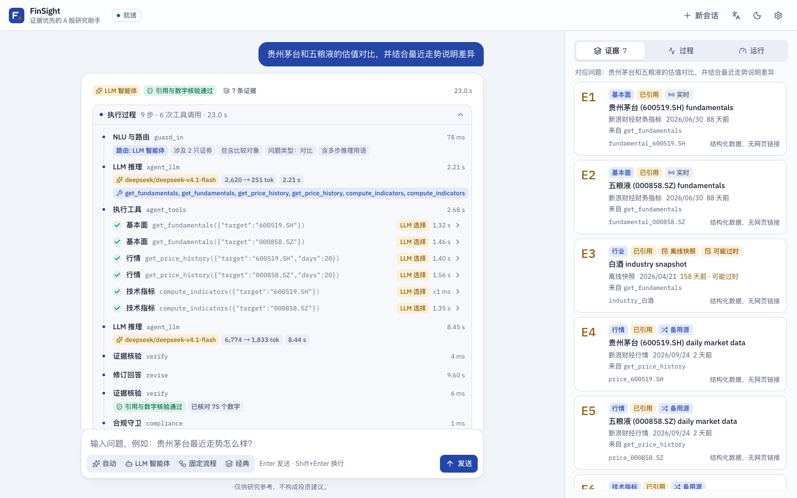
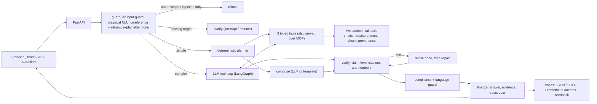
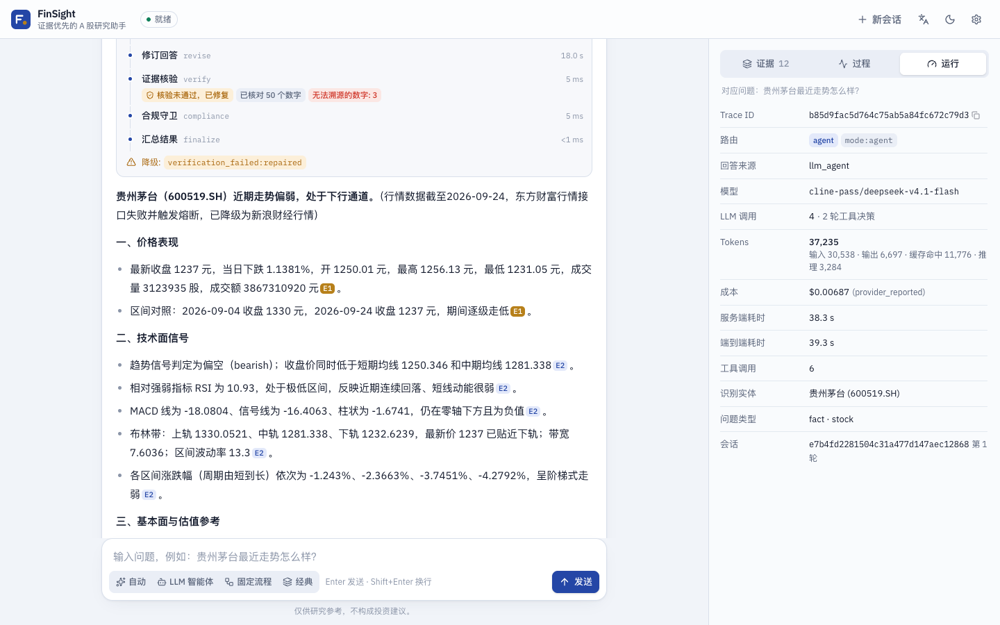
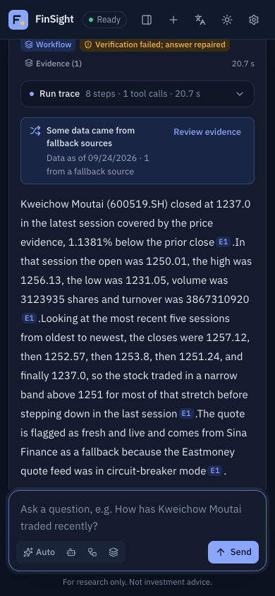

<div align="center">

<h1>FinSight</h1>

<h3>Evidence-first research agent for China A-shares.</h3>

<p>
  <a href="README.md"></a>
  <a href="README_CN.md"></a>
  <a href="LICENSE"></a>
  
  
  
  
</p>

</div>

---

FinSight answers questions about Chinese listed companies, funds, indices and macro data. A classical, explainable NLU front end routes and guards every question. An LLM orchestrates typed evidence tools in a LangGraph loop. **Every number in the answer is checked by code against the evidence cited in the same sentence**, and a compliance guard then removes anything that reads like investment advice. Without an LLM key, the same graph runs on a deterministic planner.

**In 30 seconds**

- **Numbers you can trace.** The claim-level verifier rejected 97.9% of 2,433 corrupted answers and accepted all 159 correct ones. A number swapped from another company passes 0.2% of the time, down from 100% with the original check. Rejected answers are repaired by deleting whole sentences (100% readable, no fragments; it was 29% readable with clause salvage).
- **Tools are what make it work.** An LLM without tools passes 0 of 381 tasks under strict scoring. The tool-using LLM paths pass 0.91–0.98 of the held-out tasks with two model families (DeepSeek V4.1 Flash, GLM-5.3 Flash). They pass 0.76–0.81 of a 121-task test set that was written later, blind, and was untouched when it was run.
- **Honest statistics.** Every rate comes with a 95% bootstrap CI, and paths are compared with paired tests. The LLM agent's lead over "fixed workflow + LLM writing" is **not significant** with DeepSeek. With GLM it is significant on per-run success but not on pass^3, and the agent costs 2–5x as much.
- **Runs like a service.** It works without an LLM, is bounded by deadlines and circuit breakers, and has been load-tested and chaos-tested. It runs on k3s with Postgres-shared sessions, exposes MCP and A2A, and ships with Prometheus/Grafana/Jaeger monitoring.
- **Why not just use 豆包 / 问财?** See [docs/comparison.md](docs/comparison.md): what they do better, what nobody publishes, and a fair head-to-head test (designed but not run).

<p align="center"></p>

## Why it is built this way

| Decision | Reason | Where |
|---|---|---|
| Classical NLU routes; an LLM orchestrates | Routing and guarding must be explainable and cheap, so the LLM is used only where it adds value: choosing tools and writing. A fixed workflow handles simple questions; the LLM loop handles comparisons, "why" questions and multi-hop ones. Every routing decision is logged as a reason. | `agent/router.py`, `agent/graph.py` |
| Claim-level number verification | A number must appear in the evidence cited in *its own sentence*, matched with awareness of units, precision and sign. An unverifiable sentence goes back to the LLM for one revision; if it still fails, it is deleted. | `agent/verifier.py` |
| Deterministic fallback everywhere | No key, a provider outage, an exhausted budget or a passed deadline all degrade to the planner + template answer, which is still cited and verified. | `agent/planner.py`, `agent/llm.py` |
| Evidence as untrusted data | Tool output is wrapped, normalised and filtered for injected instructions; the user's own message goes through an input guard; all tools are read-only. | `agent/injection.py` |

## Results

Strict ("dealbreaker") scoring: a task succeeds only if every one of these holds:

- the behaviour is right (answer, clarify or refuse);
- every required fact is stated **and** cited;
- the required tools were used;
- a judgment question gets hedged;
- no trading instruction appears anywhere.

Online runs use 3 repeats per task, and costs are as billed by the gateway. Each cell below comes from a committed file in [`evaluation/results/`](evaluation/results/), which records the commit, prompts and command of its run. Details, per-category tables and every paired comparison are in [docs/agent-eval.md](docs/agent-eval.md). The three sets:

- **Development set:** 207 tasks, used to drive fixes.
- **Held-out set:** 53 tasks, written after the rules were tuned. It was also used to choose prompts.
- **Test v2:** 121 tasks / 174 turns, written blind in one pass; untouched when the runs below were made (see round 2 below).

Task success, with 95% CIs where the table has room:

| Answer path | Dev · DeepSeek | Held-out · DeepSeek | Test v2 · DeepSeek | Held-out · GLM | Test v2 · GLM | Cost / task (DeepSeek dev) | P95 (DeepSeek dev) |
|---|---|---|---|---|---|---|---|
| Original `/chat`, no LLM | 0.256 | 0.189 | 0.223 | 0.207 | 0.223 | – | 1.0 s |
| Original `/chat` + LLM rewrite (1 run) | 0.440 | 0.679 | not run | not run | not run | not recorded | 13.4 s |
| LLM alone, no tools | 0.000 | 0.000 | 0.000 | – | – | $0.0009 | 18.3 s |
| Deterministic workflow (no LLM) | 0.981 | 0.849 [0.75, 0.94] | 0.727 [0.64, 0.80] | 0.849 | 0.727 | $0 | 0.8 s |
| Workflow + LLM composition | 0.979 | 0.906 [0.83, 0.98] | 0.766 [0.69, 0.83] | 0.906 [0.83, 0.98] | 0.760 [0.68, 0.83] | $0.0008 | 16.7 s |
| **LLM agent (tool loop)** | **0.986** | **0.956** [0.91, 0.99] | **0.804** [0.73, 0.86] | **0.981** [0.94, 1.00] | **0.810** [0.74, 0.87] | $0.0016 | 25.2 s |

Sources:

- DeepSeek dev / held-out: `ablation-final.json`, commit `846bc5e`.
- DeepSeek test v2: `ablation-test_v2-deepseek.json`, commit `38a3069`.
- GLM: `ablation-glm.json`, commit `f7bf624`.

<!-- final2: update after final online run (held-out and test v2, DeepSeek and GLM, at the round-2 commit) -->

What the confidence intervals support:

- **Tools and verification are the precondition.** The LLM alone passes 0 of 381 tasks across the three sets: it cannot cite evidence, and its prices cannot be verified.
- **LLM paths help on phrasings the rules were not written for.** On test v2, both LLM paths beat the deterministic workflow by 3–8 points of per-run success, with both models.
- **Agent vs LLM composition, with DeepSeek: no significant difference.**
  - Held-out: Δ +0.050 [−0.006, +0.119].
  - Test v2, rerun at lower concurrency: Δ +0.036 [−0.011, +0.085].
  - Held-out pass^3 is 0.906 for both paths.
- **Agent vs LLM composition, with GLM: significant on per-run success, not on pass^3.**
  - Held-out: +0.075 [+0.019, +0.151] (pass^3 McNemar p = 0.125).
  - Test v2: +0.050 [+0.008, +0.091] (pass^3 p = 0.23).
  - Dev set: the GLM agent is significantly *worse*, −0.021 [−0.035, −0.008].
- **`mode=auto` is therefore a cost and latency choice, not a proven quality gain.** The agent costs 2–5x as much as LLM composition, and its P95 is 25 s with DeepSeek and about 80 s with GLM.
- **The claimed prompt-v2/v3 quality gain was withdrawn.** It sat inside the run-to-run spread. The supported result is the cost cut: −69% agent cost per dev task from v1 to v2 ($0.0040 → $0.0013).

What changed after these runs (round 2), measured offline:

- **Where test v2 failed:**
  - follow-ups that name no company, e.g. "ROE呢" (multi-turn 0.21–0.32);
  - dangling questions that should get a clarifying question (0.33).
- **The fixes:** elliptical follow-ups, a metric asked without a company, and a fuzzy-concept filter. They were built and validated on new development-style tasks, not on test v2. Because the failure classes were read from test v2, **test v2 is now a validation set too**; a fresh test set is needed for an unbiased estimate.
- **Offline gate at `da3ec8b`:**
  - dev (now 216 tasks): 1.000;
  - held-out, deterministic workflow: 0.849 → 0.906 [0.83, 0.98] (`gate-*.json`);
  - router accuracy: 0.715 on 158 labelled queries at `d78b313` → 0.975 on 162 (`router_eval-*.json`).
  - These labels were written by the author: they check routing policy, not independent quality.

| Other measurements | Result | Evidence |
|---|---|---|
| Verifier stress test: 159 correct answers, 2,433 corrupted variants | False accepts: 34.3% (original run-level check) → **2.1%** (claim-level). Numbers swapped between companies: 100% → **0.2%**. Correct answers accepted: 100%. Repaired answers: 100% readable and verified, 0% fragments (clause salvage before: 29% readable, 97% with fragments). | `verifier_stress.json` (`2494656`) |
| Prompt-injection red team: 17 attacks × 4 obfuscations, planted in search results | Dev attacks: **0** successes in 216 runs on the three paths. Unseen held-out attacks: 0/64 template, 2/64 LLM composition, 1/64 agent (`846bc5e`). Offline template path at `2494656`: holdout2 0/64; holdout3 (the round-2 reviewer's 11 planted attacks, added before the fix) 6/88 → **2/88**. | `redteam-online.json`, `redteam-offline.json` |
| Fault injection: timeouts, 5xx, empty data, huge documents, LLM down, malformed tool calls, endless loops | 11/11 scenarios degrade gracefully | `fault_injection.json` |
| Load, deterministic path | One checkpoint per run instead of per step: 4.8 → 6.5 req/s at 1 user, session store 64 MB → 9.4 MB for the same 820 requests. An earlier "11x" claim did not reproduce; the real gain is 1.3–1.6x. | [performance.md](docs/performance.md) |
| Load, LLM agent path | 0 failed requests at 4, 8 and 16 users. The ceiling is the gateway's rate limit (HTTP 429), not the service: rate-limited turns fell back to the deterministic answer. **¥19.7 per 1,000 agent questions** (4.1 LLM calls, 22k tokens each). | [performance.md](docs/performance.md) |
| k3s, Postgres-shared sessions | 1 → 3 replicas: 3.75 → 11.72 req/s at 32 users, 0 errors. A follow-up sent to pod B resolved "它" from a turn served by pod A. | [performance.md](docs/performance.md) |
| Chaos drill against the real gateway and live sources | **LLM:** primary model broken → breaker opened → GLM answered → half-open trial → closed. **Sources:** Sina/Tencent/Eastmoney blocked → 60 s cache → last-known-good → the answer states the limitation instead of serving an April price. | [a2a-and-observability.md](docs/a2a-and-observability.md#chaos-drill) |
| Live data audit: 64 probes | 49 OK. Fixed a wrong M2 series, stale CPI/PMI, always-null PE/PB and empty announcements. Sina/THS growth rates cross-checked against reported levels. | [data-sources.md](docs/data-sources.md) |

<!-- final2: add the red-team rerun (redteam-final2) at the round-2 commit -->

## Architecture


```mermaid
flowchart LR
  U["Browser (React) / API / A2A client"] --> API["FastAPI"]
  API --> G["guard_in: input guard, classical NLU, coreference + ellipsis, explainable router"]
  G -->|out of scope / injection only| RF["refuse"]
  G -->|missing target| CL["clarify (interrupt / resume)"]
  G -->|simple| WF["deterministic planner"]
  G -->|complex| AL["LLM tool loop (LangGraph)"]
  WF --> T["9 typed tools (also served over MCP)"]
  AL <--> T
  T --> DS["live sources: fallback chains, breakers, cross-check, provenance"]
  WF --> C["compose (LLM or template)"]
  AL --> V["verify: claim-level citations and numbers"]
  C --> V
  V -->|fails| RV["revise once, then repair"] --> V
  V --> K["compliance + language guard"] --> F["finalize: answer, evidence, trace, cost"]
  F --> U
  F -.-> O["traces: JSON / OTLP · Prometheus /metrics · feedback"]
```

Sessions are LangGraph checkpoints (memory, SQLite or Postgres). This lets a clarification pause a run, and lets any replica continue a conversation. Each session is scoped to the API key that created it. See [docs/agent.md](docs/agent.md).

## Features

- **Agent**
  - Routing with logged reasons, parallel tool calls, and step/tool/token budgets.
  - A run deadline that also bounds every LLM request, retry and failover.
  - One LLM revision after failed verification.
  - Clarification interrupts with resume.
  - Session memory: recent targets, stated constraints and holdings.
  - Follow-ups: pronouns ("它"), plurals ("这两家", "both") and elliptical questions ("ROE呢", "换成五粮液呢", "And the P/B?").
  - Per-node reasoning levels, and model failover with a circuit breaker.
  - Versioned prompts pinned by hash.
- **Evidence tools**
  - Entity resolution, price history, technical indicators, fundamentals, macro indicators, news, announcements, knowledge search and document sentiment.
  - Each has a Pydantic schema, a timeout, retries, a TTL cache and actionable error hints.
- **Claim check** (`POST /agent/claim-check`): paste a claim such as "茅台市盈率只有15倍，股价跌了5%". Each number is tied to a metric and compared with market and fundamental data, with no LLM involved. The result is supported, contradicted, partially supported or unverifiable, with the evidence id, source and as-of date.
- **Live data**
  - Eastmoney → Sina → Tencent → cache → last-known-good → snapshot chains, with a circuit breaker per source.
  - Upstream calls run on a bounded pool.
  - Sina vs THS fundamentals are cross-checked against the reported levels.
  - Every record carries its provenance. An active probe is available at `GET /sources/health?probe=1`, rate limited.
- **Protocols**: an MCP server for the tools, and an A2A 1.0 endpoint for the whole agent (a clarification maps to `input-required`).
- **Observability**
  - A trace for every run: nodes, tools, LLM calls with context composition and JSON status, tokens, cost and prompt versions.
  - A run inspector API and OpenTelemetry export.
  - Prometheus metrics, labelled by the model that actually answered.
  - A Grafana dashboard with 19 panels, 10 alert rules, and Jaeger.
  - User feedback (`POST /agent/feedback`), turned into candidate evaluation tasks by `scripts/feedback_to_tasks.py`.
- **Web UI** (React 19, TypeScript, Tailwind v4, Radix, Motion, Lightweight Charts)
  - The answer streams as it is written, next to a streamed run timeline.
  - Citation chips link to an evidence ledger that shows freshness.
  - Price charts, run cost and latency.
  - Feedback buttons and Markdown export.
  - zh/en, dark mode, mobile.
- **Security**
  - Optional API keys, with sessions and traces scoped to the key (a hash, never the key itself).
  - Rate limiting, CORS and body limits.
  - An input guard against instructions in the user turn.
  - The container runs as non-root on a read-only root filesystem.

<p align="center">
  
  
</p>

## Quick start

```bash
pip install -r requirements.txt
uvicorn query_intelligence.api.app:create_app --factory --port 8765   # open http://127.0.0.1:8765
```

Without a key, answers come from the deterministic path. To enable the LLM agent, point it at any OpenAI-compatible endpoint:

```bash
export DEEPSEEK_API_KEY=...                      # read from the environment, never from the config file
export DEEPSEEK_BASE_URL=https://api.deepseek.com # or a gateway, e.g. https://api.cline.bot/api/v1
export DEEPSEEK_MODEL=deepseek-v4-flash
export QI_LLM_FALLBACK_MODELS=...                 # optional failover models on the same endpoint
```

Live market, news, announcement and macro providers are on by default. For the shipped offline snapshot, set `QI_USE_LIVE_MARKET=0` (and the same for `_NEWS`, `_ANNOUNCEMENT` and `_MACRO`).

Docker, Kubernetes and the monitoring stack are covered in [docs/deployment.md](docs/deployment.md). On Kubernetes, replicas share sessions through Postgres and run on a read-only root filesystem.

```bash
docker build -f docker/Dockerfile -t finsight . && docker run -p 8000:8000 finsight
kubectl apply -f deploy/k8s/finsight.yaml
docker compose -f docker/docker-compose.yml --profile monitoring up -d   # + Prometheus, Grafana, Jaeger
```

## API

| Endpoint | Purpose |
|---|---|
| `POST /agent/chat`, `POST /agent/chat/stream` (SSE), `POST /agent/resume` | Agent answer with evidence, verification, trace id and cost. The stream carries node events and `answer_delta` text as it is written. Resume answers a pending clarification. |
| `POST /agent/claim-check` | Check the numbers in a pasted market claim against data (deterministic). |
| `POST /agent/feedback` | Thumbs up/down on an answer, stored with its trace. |
| `GET /agent/sessions/{id}`, `GET /agent/traces`, `GET /agent/traces/{id}` | Session memory, recent runs and a full run trace, scoped to the caller. |
| `GET /.well-known/agent-card.json`, `POST /a2a` | A2A agent card and JSON-RPC endpoint. |
| `GET /metrics`, `GET /sources/health[?probe=1]`, `GET /health` | Prometheus metrics, live source status (active probe on request), health. |
| `POST /chat` | Original chatbot endpoint: `mode=workflow` keeps the original pipeline; `agent` and `auto` use the agent. |
| `POST /nlu/analyze`, `POST /retrieval/search`, `POST /query/intelligence` | Classical NLU and retrieval artifacts. |

Schemas are in `schemas/agent_*.schema.json`, generated from `query_intelligence/contracts.py`.

## Evaluation and tests

```bash
python -m pytest -q tests                                  # offline; live sources off unless QI_TEST_LIVE=1
python -m evaluation.agent_eval.gate                       # replayed dev + held-out against committed baselines
python -m evaluation.agent_eval.router_eval                # route accuracy and confusion matrix
python -m evaluation.agent_eval.ablation --llm deepseek --repeats 3 --workers 3 --sets holdout,test_v2
python -m evaluation.agent_eval.verifier_stress            # verifier false-accept rate
python -m evaluation.agent_eval.redteam --llm deepseek     # prompt-injection red team
python -m evaluation.agent_eval.fault_injection            # graceful degradation
python -m evaluation.agent_eval.report --check             # docs/agent-eval.md matches evaluation/results/
python -m scripts.load_test --base-url http://127.0.0.1:8000 --users 8
python -m scripts.chaos_drill --scenario sources           # blocked upstreams against a live server
```

CI runs the following:

- lint;
- the frontend checks: typecheck, lint, unit tests and a reproducible build;
- the full test suite with a Postgres service;
- the evaluation gate against committed baselines, and a check that the evaluation page is up to date;
- the Docker build with a smoke test;
- Kubernetes manifest validation.

## Documentation

| Topic | Link |
|---|---|
| Agent layer: graph, tools, memory, API, configuration | [docs/agent.md](docs/agent.md) |
| Evaluation: task sets, CIs, online ablation, second model, prompt A/B, red team, verifier stress | [docs/agent-eval.md](docs/agent-eval.md) |
| Comparison with 问财, 豆包, Kimi, Wind Alice, 妙想 | [docs/comparison.md](docs/comparison.md) |
| A2A, model failover, gateway cost, metrics, dashboards, chaos drill | [docs/a2a-and-observability.md](docs/a2a-and-observability.md) |
| Live data sources | [docs/data-sources.md](docs/data-sources.md) |
| Performance, load and scaling | [docs/performance.md](docs/performance.md) |
| Deployment | [docs/deployment.md](docs/deployment.md) |
| Design notes: trade-offs, built vs reused, failure cases (Chinese) | [docs/presentation/agent-design-notes.md](docs/presentation/agent-design-notes.md) |
| Agent and prompt-engineering practice research | [docs/research/agent-architecture-practices-2026.md](docs/research/agent-architecture-practices-2026.md) |
| Query Intelligence (classical NLU and retrieval) | [docs/query-intelligence.md](docs/query-intelligence.md) |
| Web UI | [docs/frontend-chatbot.md](docs/frontend-chatbot.md) |
| All pages | [docs/index.md](docs/index.md) |

## Limits

- **Two model families, both flash-class.** Both online models are served through one gateway, and the online numbers above come from commits before the round-2 fixes.
- **No clean test set remains.** The held-out set was used to choose prompts. Test v2's failure classes drove the round-2 follow-up fixes. Both are now validation sets, and a fresh test set is needed.
- **The agent loop is not proven better than LLM composition.** Its edge is not significant with DeepSeek, and it is smaller than its extra cost with GLM.
- **The verifier proves traceability, not truth.** It checks that numbers come from the cited evidence. It cannot tell whether the right period or metric was chosen when one evidence item holds several. A fake price planted inside a news excerpt passes, because it *is* in the evidence.
- **The injection filter does not generalise.** The lexical filter redacted none of the held-out attacks; protection comes mostly from structure (read-only tools, the untrusted-data envelope, verification, compliance and the language guard).
- **Follow-up handling is rule-based.** Pronouns, plurals and ellipsis are resolved by rules, and English company aliases cover major names only.
- **Latency.** The agent's P95 is 25 s with DeepSeek and about 80 s with GLM. Since the round-2 deadline change, every LLM request is capped by the run deadline (90 s + 20 s for the answer, below the API's 120 s timeout); this has not been re-measured under load.
- **Free data sources throttle.** Eastmoney refused this machine's connections during the audit, and the fallbacks carried the load. The A2A task store, the trace ring and the caches are per replica.

## Safety

FinSight summarises evidence; it is not an investment adviser and must not be the sole basis for trading decisions.
