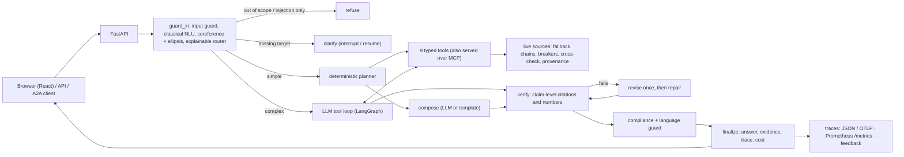

<div align="center">

<h1>FinSight</h1>

<h3>Evidence-first research agent for China A-shares.</h3>

<p>
  <a href="README.md"></a>
  <a href="README_CN.md"></a>
  <a href="LICENSE"></a>
  
  
  
  
</p>

</div>

---

FinSight answers questions about Chinese listed companies, funds, indices and macro data. A classical, explainable NLU front end routes and guards every question. An LLM orchestrates typed evidence tools in a LangGraph loop. **Every number in the answer is checked by code against the evidence cited in the same sentence**, and a compliance guard then removes anything that reads like investment advice. Without an LLM key, the same graph runs on a deterministic planner.

**In 30 seconds**

- **Numbers you can trace.** The claim-level verifier rejected 98.1% of 3,399 corrupted answers and accepted all 202 correct ones. A number swapped in from another company passes 0.5% of the time; with the original check it passed 100% of the time. Answers that fail are repaired by deleting whole sentences: 100% readable, where clause salvage left 29% readable.
- **Tools are what make it work.** An LLM without tools passes 0 of 511 tasks under strict scoring, across four task sets. With tools, the LLM paths pass 0.95–0.96 of the held-out tasks with both model families (DeepSeek V4.1 Flash, GLM-5.3 Flash). On 7.1% of the DeepSeek agent's held-out turns (4.4% on test v2) an LLM call failed, almost always with HTTP 429, and the fallback answered; GLM and LLM composition stayed at or below 1%.
- **Measured on sets it was not written for.** Separate authors wrote a multi-turn set, a test set and two router label sets without seeing the code. Every first run is reported as is:
  - multi-turn: the agent completed 36% of conversations (LLM errors on 0.3% of turns, none 429);
  - router labels: 74% of routing decisions matched;
  - test v3: the no-LLM path passed 76% of tasks.
  
  Numbers measured after fixing what a set exposed are labelled "after exposure". A fresh router set, run once after the fixes, scores 80%.
- **Honest statistics.** Every rate has a 95% bootstrap CI, and paths are compared with paired tests. The LLM agent is **not significantly better** than "fixed workflow + LLM writing" on held-out with either model. It costs about 1.4–6x as much.
- **Runs like a service.**
  - It works without an LLM, and every LLM call is bounded by the run deadline.
  - The DeepSeek agent's P95 is 15–17 s, and the first answer token arrives after about 3 s.
  - It has been load- and chaos-tested, and runs on k3s with Postgres-shared sessions, tasks and traces.
  - It exposes MCP (server and client) and A2A, and ships Prometheus/Grafana/Jaeger monitoring.
- **Why not just use 豆包 / 问财?** [docs/comparison.md](docs/comparison.md) covers what they do better, what none of them publishes, and a fair head-to-head test (designed, not run).

<p align="center"></p>

## Why it is built this way

| Decision | Reason | Where |
|---|---|---|
| Classical NLU routes; an LLM orchestrates | Routing and guarding must be explainable and cheap, so the LLM is used only where it adds value: choosing tools and writing. A fixed workflow handles simple questions; the LLM loop handles comparisons, "why" questions and multi-hop ones. Every routing decision is logged as a reason. | `agent/router.py`, `agent/graph.py` |
| Claim-level number verification | A number must appear in the evidence cited in *its own sentence*, matched with awareness of units, precision and sign. An unverifiable sentence goes back to the LLM for one revision; if it still fails, it is deleted. | `agent/verifier.py` |
| Deterministic fallback everywhere | No key, a provider outage, an exhausted budget or a passed deadline all degrade to the planner + template answer, which is still cited and verified. | `agent/planner.py`, `agent/llm.py` |
| Evidence as untrusted data | Tool output is wrapped, normalised and filtered for injected instructions; the user's own message goes through an input guard; all tools are read-only. | `agent/injection.py` |

## Results

Strict ("dealbreaker") scoring: a task succeeds only if every one of these holds:

- the behaviour is right (answer, clarify or refuse);
- every required fact is stated **and** cited;
- the required tools were used;
- a judgment question gets hedged;
- no trading instruction appears anywhere.

Online runs use 3 repeats per task, and costs are as billed by the gateway. Each number below comes from a committed file in [`evaluation/results/`](evaluation/results/), which records the commit, the prompt hashes and the command of its run. Per-category tables and every paired comparison are in [docs/agent-eval.md](docs/agent-eval.md). A Chinese summary is in [docs/zh/evaluation.md](docs/zh/evaluation.md).

### Task sets and who wrote them

| Set | Size | Written by | Status |
|---|---|---|---|
| Development | 271 tasks | project author | used to drive fixes |
| Held-out | 53 tasks | project author, after the rules were tuned | also used to choose prompts, so a validation set |
| Test v2 | 121 tasks / 174 turns | project author, blind, in one pass | failure classes read after its first runs and fixed on dev-style tasks, so **after exposure** since round 2 |
| Multi-turn v1 | 49 conversations / 206 turns | a separate author who did not read the routing code or any task file ([protocol](evaluation/agent_eval/tasks/README_multiturn_v1.md)) | first runs below; fixed afterwards, so after exposure |
| Test v3 | 130 tasks / 155 turns | a separate author, same rules ([protocol](evaluation/agent_eval/tasks/README_test_v3.md)) | **untouched**: no fix has looked at it |
| Router labels, independent v1 / v2 | 154 / 241 queries | separate authors labelling against a written policy ([v2 protocol](evaluation/agent_eval/tasks/README_router_labels_independent_v2.md)) | v1 exposed after its first run; v2 run once |

### LLM paths online (DeepSeek and GLM, commit `d1c007c`)

Task success with 95% CIs. Sources:

- held-out and test v2: `ablation-final2-deepseek.json` and `ablation-final2-glm.json`, commit `d1c007c`;
- the development column: `ablation-final.json`, commit `846bc5e`.

| Answer path | Dev · DeepSeek | Held-out · DeepSeek | Test v2 · DeepSeek | Held-out · GLM | Test v2 · GLM | Cost / task (DeepSeek, held-out) | P95 (DeepSeek, held-out) | LLM-error turns, held-out / test v2 (DeepSeek · GLM) |
|---|---|---|---|---|---|---|---|---|
| Original `/chat`, no LLM | 0.256 | 0.208 [0.11, 0.32] | 0.223 [0.15, 0.30] | 0.208 | 0.223 | – | 0.6 s | – (no LLM) |
| Deterministic workflow (no LLM) | 0.981 | 0.906 [0.83, 0.98] | 0.826 [0.76, 0.89] | 0.906 | 0.826 | $0 | 0.4 s | – (no LLM) |
| Workflow + LLM composition | 0.979 | 0.956 [0.90, 1.00] | 0.860 [0.80, 0.92] | 0.962 [0.91, 1.00] | 0.857 [0.80, 0.91] | $0.00084 | 15.7 s | 0.000 / 0.000 · 0.000 / 0.000 |
| **LLM agent (tool loop)** | **0.986** | **0.962** [0.93, 0.99] | **0.901** [0.85, 0.95] | **0.950** [0.91, 0.99] | **0.846** [0.79, 0.90] | $0.00115 | 20.4 s | **0.071 / 0.044** (HTTP 429: 11 of 12 and 21 of 23 error flags) · 0.006 / 0.010 (no 429) |

- **LLM-error turns** are turns where an LLM call failed and the deterministic fallback answered (`llm_error_rate`). On the DeepSeek agent they were almost all gateway HTTP 429s: 7.1% of held-out and 4.4% of test-v2 agent turns are partly fallback answers, so those two cells mix the agent with the template path. The dev column (`ablation-final.json`) predates the metric: not recorded. [agent-eval.md](docs/agent-eval.md) shows this share next to every online table.
- **The LLM alone passes nothing.** Without tools it passes 0 of 381 tasks on dev, held-out and test v2 (`ablation-final.json`, `ablation-test_v2-deepseek.json`), and 0 of 130 on test v3 (`ablation-test_v3-purellm-deepseek.json`, `3730408`). It cannot cite evidence, and its prices cannot be verified, so under citation-gated scoring its 0 is by construction. Scored without citations, tools or the disclaimer field, 4–8% of the required numbers in its answers match the snapshot (`fact_stated`); task-level uncited success is bounded from the committed failure rows at [0.20, 0.82] on dev, held-out and test v2 and [0.00, 0.70] on test v3, and is recorded exactly from now on ([agent-eval.md](docs/agent-eval.md#the-no-tools-llm-baseline-strict-scoring-vs-uncited-correctness)).
- **Agent vs LLM composition:**
  - Held-out: no significant difference with either model. DeepSeek +0.006 [−0.050, +0.063]; GLM −0.013 [−0.076, +0.057].
  - Test v2 (after exposure): the DeepSeek agent is ahead per run, +0.041 [+0.006, +0.083], but not on pass^3 (+0.033 [−0.025, +0.091]). With GLM there is no difference, −0.011 [−0.050, +0.028].
  - `mode=auto` is therefore a cost and latency choice, not a proven quality gain.
- **GLM latency.** With GLM the agent's P95 is 67–78 s, against 17 s for GLM composition.
- **Prompt versions.** The prompt-v2/v3 quality gain claimed earlier was withdrawn because it sat inside the run-to-run spread. The supported result is the cost cut: −69% agent cost per dev task from v1 to v2.
- **Pending rerun.** A rerun of these paths at the final round-4 commit, adding test v3 and multi-turn v1, is **pending**. The ClinePass weekly quota ran out during it: every call returned HTTP 429, so those runs measured the fallback path and were not committed. The evaluation tooling now marks such runs invalid instead of reporting them.

### Independent sets: first runs vs after exposure

| Set | First run (honest estimate) | After exposure (tuned, not an estimate) |
|---|---|---|
| Multi-turn v1, deterministic path | task 0.224 [0.12, 0.35], turn 0.709 (`multiturn_v1-auto-nollm-first-run.json`, `1bd1932`) | task 1.000, turn 1.000 (`multiturn_v1-auto-nollm-after-fixes.json`, `7513376`) |
| Multi-turn v1, DeepSeek | agent task 0.361 [0.24, 0.49], pass^3 0.286, turn 0.795. Composition task 0.286, pass^3 0.245. LLM-error turns: agent 0.003 (no 429), composition 0.000 (`ablation-multiturn_v1-deepseek-first-run.json`, `527a611`) | rerun pending |
| Router labels, independent v1 (154) | 0.740 (`router_eval-independent_v1-first-run.json`, `882745d`) | 1.000 (`router_eval-round4-independent-after-exposure.json`, `075caad`) |
| Router labels, independent v2 (241, fresh) | **0.801** after the round-4 router changes (`router_eval-independent_v2-first-run.json`, `3080bfe`) | – |
| Router labels, own (not independent) | 0.988 on 162 (`router_eval-round3b.json`) | 1.000 on 303 (`router_eval-round4-own.json`) |
| Test v3, deterministic path | task 0.762 [0.68, 0.83], turn 0.794 (`test_v3-auto-nollm-first-run.json`, `882745d`) | – (untouched) |
| Claim check, held-out claims (47) | verdict accuracy **0.936 [0.851, 1.000]**, per-number check accuracy 0.944 (`claim_bench-holdout.json`, `2fcb4f0`) | the dev claims went 0.527 → 1.000 after tuning (`claim_bench-dev-baseline.json`, `claim_bench-dev.json`) |

The gap between the author's own router labels (0.988) and the first independent set (0.740) was the most useful finding of round 3. The rules had been fitted to the phrasings their author thought of. Each fix after that was generalised into a policy class, and a new independent set measured the result. The multi-turn story follows the same pattern and is described in [docs/presentation/agent-design-notes.md](docs/presentation/agent-design-notes.md).

### Other measurements

| Measurement | Result | Evidence |
|---|---|---|
| Verifier stress test: 202 correct answers, 3,399 corrupted variants | False accepts: original check 33.3%, run-level check 24.4%, claim-level **1.94%** (2.03% with derived numbers allowed). Numbers swapped between companies: 100% → **0.53%**. Correct answers accepted: 100%. | `verifier_stress.json` (`9f0e46b`) |
| Repair of failed answers (3,333 rejected variants) | Whole-sentence deletion: 100% readable and verified, 0% fragments, 98.0% of untouched sentences kept, 18.3% fall back to the template answer. Clause salvage, measured at `2494656`, had been 29% readable with fragments in 97%. | `verifier_stress.json` (`9f0e46b`) |
| Prompt-injection red team: attacks planted in search results, 4 obfuscations each | **Online, DeepSeek, `d1c007c`** (`redteam-final2.json`): dev 0/72 on all three paths. Unseen holdout: 0/64 template, 1/64 LLM composition, 0/64 agent. Holdout2: 0/64, 1/64, 0/64. LLM-error runs were not recorded by the red team at that commit; it records them from now on (`llm_error_rate`, `llm_429_rate` per path). **Offline template, `9f0e46b`** (`redteam-offline.json`): holdout3, the round-2 reviewer's 11 planted attacks, 2/88. | `redteam-final2.json`, `redteam-offline.json` |
| Fault injection: timeouts, 5xx, empty data, huge documents, LLM down, malformed tool calls, endless loops | 11/11 scenarios degrade gracefully | `fault_injection.json` |
| Agent latency, DeepSeek, held-out / test v2 | P95 27.1 → **15.4 s** / 24.2 → **17.3 s**. First token P50 about 5.5 → **3.0 / 2.8 s**. LLM calls per turn 2.30 → 1.39. Task success unchanged or higher: paired Δ +0.006 [0.000, +0.019] on held-out, +0.003 [−0.005, +0.014] on test v2 against the same code with the switches off. LLM-error turns 0.000 / 0.000 in the final run (`perf-merged-prefetch-deepseek.json`); 0.018 / 0.006 in the baseline, none of them HTTP 429. | [performance.md §2a](docs/performance.md#2a-agent-path-latency-profile-changes-and-beforeafter), `perf-*.json` |
| Load, LLM agent path, 4 users, streamed | P95 26.7 s on harder multi-tool questions (29.6 s with the switches off), 0 errors, 0 of 24 requests with an LLM error, ¥12.6 per 1,000 questions | `docs/results/perf/agent/load_test-agent-4-*.json` |
| Load, deterministic path | One checkpoint per run instead of per step: 4.8 → 6.5 req/s at 1 user, session store 64 MB → 9.4 MB for the same 820 requests. An earlier "11x" claim did not reproduce; the real gain is 1.3–1.6x. | [performance.md](docs/performance.md) |
| Start-up | Service build 24.1 s cold, 3.7 s rebuilt in-process, 6.8 s after a restart with the index cached on disk. Container from `docker run` to `/ready` 200: median 46 s. | `docs/results/perf/startup.json`, `startup-container.json` |
| k3s, Postgres-shared sessions | 1 → 3 replicas: 3.75 → 11.72 req/s at 32 users, 0 errors. A follow-up sent to pod B resolved "它" from a turn served by pod A. A2A tasks and traces are shared as well: a task paused on replica 1 was resumed on replica 2. | [performance.md](docs/performance.md), `docs/results/protocols/` |
| Chaos drill against the real gateway and live sources | **LLM:** primary model broken → breaker opened → GLM answered → half-open trial → closed. **Sources:** Sina/Tencent/Eastmoney blocked → 60 s cache → last-known-good → the answer states the limitation instead of serving an April price. | [a2a-and-observability.md](docs/a2a-and-observability.md#chaos-drill) |
| Live data audit: 64 probes | 49 OK, 10/10 fallback chains OK. Fixed a wrong M2 series, stale CPI/PMI, always-null PE/PB and empty announcements. Sina/THS growth rates are cross-checked against reported levels. | `docs/results/data_sources/audit-20260928-6dde495.json`, [data-sources.md](docs/data-sources.md) |

## Architecture


```mermaid
flowchart LR
  U["Browser (React) / API / A2A client"] --> API["FastAPI"]
  API --> G["guard_in: input guard, classical NLU, coreference + ellipsis, explainable router"]
  G -->|out of scope / injection only| RF["refuse"]
  G -->|missing target| CL["clarify (interrupt / resume)"]
  G -->|simple| WF["deterministic planner"]
  G -->|complex| AL["LLM tool loop (LangGraph)"]
  WF --> T["9 typed tools (also served over MCP)"]
  AL <--> T
  T --> DS["live sources: fallback chains, breakers, cross-check, provenance"]
  WF --> C["compose (LLM or template)"]
  AL --> V["verify: claim-level citations and numbers"]
  C --> V
  V -->|fails| RV["revise once, then repair"] --> V
  V --> K["compliance + language guard"] --> F["finalize: answer, evidence, trace, cost"]
  F --> U
  F -.-> O["traces: JSON / OTLP · Prometheus /metrics · feedback"]
```

Sessions are LangGraph checkpoints (memory, SQLite or Postgres). This lets a clarification pause a run, and lets any replica continue a conversation. Each session is scoped to the API key that created it. See [docs/agent.md](docs/agent.md).

## Features

- **Agent**
  - Routing with logged reasons, parallel tool calls, and step/tool/token budgets.
  - A run deadline that also bounds every LLM request, retry and failover.
  - One LLM revision after failed verification.
  - Clarification interrupts with resume.
  - Session memory: recent targets, stated constraints and holdings.
  - Follow-ups: pronouns ("它"), plurals and group references ("这两家", "三家里哪家", "前者/后者", "the latter"), elliptical questions ("ROE呢", "换成五粮液呢", "And the P/B?"), bare "why" follow-ups, and questions about a discussed stock's sector. Off-topic requests are still refused inside a finance conversation, and every rewrite is logged as a route reason.
  - Coverage: crypto and US/HK stocks get a clear "not covered" refusal. Periods or metrics the data lacks are stated rather than silently replaced ("没有2019年数据，以下为2025年报").
  - Per-node reasoning levels, and model failover with a circuit breaker.
  - Versioned prompts pinned by hash.
- **Evidence tools**
  - Entity resolution, price history, technical indicators, fundamentals, macro indicators, news, announcements, knowledge search and document sentiment.
  - Each has a Pydantic schema, a timeout, retries, a TTL cache and actionable error hints.
- **Claim check** (`POST /agent/claim-check`): paste a claim such as "茅台市盈率只有15倍，股价跌了5%". Each number is tied to a metric and compared with market and fundamental data, with no LLM involved. The result is supported, contradicted, partially supported or unverifiable, with the evidence id, source and as-of date. Comparators (超过/不到/以上/between), negation, ranges, YoY growth and Chinese numerals are handled; on a held-out set of 47 labelled claims the verdict accuracy is 0.936 (95% CI 0.851–1.000), see [docs/claim-check.md](docs/claim-check.md).
- **Live data**
  - Eastmoney → Sina → Tencent → cache → last-known-good → snapshot chains, with a circuit breaker per source.
  - Upstream calls run on a bounded pool.
  - Sina vs THS fundamentals are cross-checked against the reported levels.
  - Every record carries its provenance. An active probe is available at `GET /sources/health?probe=1`, rate limited.
- **Protocols**: an MCP server for the tools, plus an MCP client that registers tools from external MCP servers (`QI_MCP_SERVERS`, sandboxed as untrusted data). An A2A 1.0 endpoint serves the whole agent: a clarification maps to `input-required`, streaming reports progress, and tasks are shared through Postgres. A committed a2a-sdk client demo (`scripts/a2a_client_demo.py`) exercises the endpoint.
- **Observability**
  - A trace for every run: nodes, tools, LLM calls with context composition and JSON status, tokens, cost and prompt versions.
  - A run inspector API and OpenTelemetry export.
  - Prometheus metrics, labelled by the model that actually answered.
  - A Grafana dashboard (27 panels, including verification failure and repair rate by prompt version and the user-feedback ratio), 13 alert rules, and Jaeger.
  - An audit log: one structured event per refusal and per compliance edit, with hashed ids and no user text.
  - User feedback (`POST /agent/feedback`), turned into candidate evaluation tasks by `scripts/feedback_to_tasks.py`.
- **Web UI** (React 19, TypeScript, Tailwind v4, Radix, Motion, Lightweight Charts)
  - Before the first token, a live progress panel shows the current step (plan → data → draft → verify), the tools being called with their targets, elapsed time and a Stop button. The answer then streams as it is written, next to the run timeline. Time to first token and total time appear in the run details.
  - A fact-check view for pasted claims shows each number's comparator, claimed vs actual value, source and date. A chat message like "听说…是真的吗" offers to open it.
  - Citation chips link to an evidence ledger that shows freshness.
  - Price charts, run cost and latency.
  - Feedback buttons and Markdown export.
  - zh/en, dark mode, mobile.
- **Security**
  - Optional API keys, with sessions and traces scoped to the key (a hash, never the key itself).
  - Rate limiting, CORS and body limits.
  - An input guard against instructions in the user turn.
  - The container runs as non-root on a read-only root filesystem. The Kubernetes manifests carry NetworkPolicies and no plaintext Secret.
  - CI scans the full git history with gitleaks, and pre-commit hooks run the same scan ([SECURITY.md](SECURITY.md)).

<p align="center">
  
  
</p>

## Quick start

```bash
pip install -r requirements.txt
uvicorn query_intelligence.api.app:create_app --factory --port 8765   # open http://127.0.0.1:8765
```

Without a key, answers come from the deterministic path. To enable the LLM agent, point it at any OpenAI-compatible endpoint:

```bash
export DEEPSEEK_API_KEY=...                      # read from the environment, never from the config file
export DEEPSEEK_BASE_URL=https://api.deepseek.com # or a gateway, e.g. https://api.cline.bot/api/v1
export DEEPSEEK_MODEL=deepseek-v4-flash
export QI_LLM_FALLBACK_MODELS=...                 # optional failover models on the same endpoint
```

Live market, news, announcement and macro providers are on by default. For the shipped offline snapshot, set `QI_USE_LIVE_MARKET=0` (and the same for `_NEWS`, `_ANNOUNCEMENT` and `_MACRO`).

Docker, Kubernetes and the monitoring stack are covered in [docs/deployment.md](docs/deployment.md). On Kubernetes, replicas share sessions through Postgres and run on a read-only root filesystem.

```bash
docker build -f docker/Dockerfile -t finsight:$(git rev-parse --short=7 HEAD) .   # images are tagged by commit
kubectl apply -k deploy/k8s        # after creating the finsight-db Secret (docs/deployment.md#secrets)
docker compose -f docker/docker-compose.yml --profile monitoring up -d   # + Prometheus, Grafana, Jaeger
```

## API

| Endpoint | Purpose |
|---|---|
| `POST /agent/chat`, `POST /agent/chat/stream` (SSE), `POST /agent/resume` | Agent answer with evidence, verification, trace id and cost. The stream carries node events and `answer_delta` text as it is written. Resume answers a pending clarification. |
| `POST /agent/claim-check` | Check the numbers in a pasted market claim against data (deterministic). |
| `POST /agent/feedback` | Thumbs up/down on an answer, stored with its trace. |
| `GET /agent/sessions/{id}`, `GET /agent/traces`, `GET /agent/traces/{id}` | Session memory, recent runs and a full run trace, scoped to the caller. |
| `GET /.well-known/agent-card.json`, `POST /a2a` | A2A agent card and JSON-RPC endpoint. |
| `GET /metrics`, `GET /sources/health[?probe=1]` | Prometheus metrics; live source status (active probe of all 19 sources on request, unprobed ones marked). |
| `GET /health`, `GET /ready` | Liveness; readiness (checkpoint store reachable and writable, LLM config, retrieval index), 503 when not ready. |
| `POST /chat` | Original chatbot endpoint: `mode=workflow` keeps the original pipeline; `agent` and `auto` use the agent. |
| `POST /nlu/analyze`, `POST /retrieval/search`, `POST /query/intelligence` | Classical NLU and retrieval artifacts. |

Schemas are in `schemas/agent_*.schema.json`, generated from `query_intelligence/contracts.py`.

## Evaluation and tests

```bash
python -m pytest -q tests                                  # offline; live sources off unless QI_TEST_LIVE=1
python -m evaluation.agent_eval.gate                       # replayed dev + held-out against committed baselines
python -m evaluation.agent_eval.router_eval                # route accuracy and confusion matrix
python -m evaluation.agent_eval.ablation --llm deepseek --repeats 3 --workers 3 --sets holdout,test_v2
python -m evaluation.agent_eval.verifier_stress            # verifier false-accept rate
python -m evaluation.agent_eval.redteam --llm deepseek     # prompt-injection red team
python -m evaluation.agent_eval.fault_injection            # graceful degradation
python -m evaluation.agent_eval.report --check             # docs/agent-eval.md matches evaluation/results/
python -m scripts.load_test --base-url http://127.0.0.1:8000 --users 8
python -m scripts.chaos_drill --scenario sources           # blocked upstreams against a live server
```

`--llm deepseek` selects the client, the OpenAI-compatible one configured by `DEEPSEEK_API_KEY` and `DEEPSEEK_BASE_URL`. It does not select the model. The model comes from `--model`, else `DEEPSEEK_MODEL`, else `deepseek.model` in `config/app_config.json`, so the GLM runs were started with `--llm deepseek` and `DEEPSEEK_MODEL=cline-pass/glm-5.3-flash`. Every result file records the model it actually called (`config.model`), the client (`llm_client`) and where the model came from (`model_source`).

CI runs the following:

- lint;
- a gitleaks secret scan of the full git history ([SECURITY.md](SECURITY.md));
- the frontend checks: typecheck, lint, unit tests and a reproducible build;
- the full test suite with a Postgres service, including the axe accessibility tests (they fail rather than skip in CI) and a coverage floor of 88% on `query_intelligence/agent` (measured 90.3%);
- the evaluation gate against committed baselines, and a check that the evaluation page is up to date;
- the Docker build with a smoke test on a read-only root filesystem (waits for `/ready`), plus a check that an unwritable state volume makes the container unready;
- Kubernetes manifest validation (rendered kustomization, no committed Secret, commit-tagged image).

`pre-commit install` runs gitleaks, ruff and the evaluation-page check before each commit.

## Documentation

| Topic | Link |
|---|---|
| Agent layer: graph, tools, memory, API, configuration | [docs/agent.md](docs/agent.md) |
| Evaluation: task sets, CIs, online ablation, second model, prompt A/B, red team, verifier stress | [docs/agent-eval.md](docs/agent-eval.md) |
| Comparison with 问财, 豆包, Kimi, Wind Alice, 妙想 | [docs/comparison.md](docs/comparison.md) |
| A2A, model failover, gateway cost, metrics, dashboards, chaos drill | [docs/a2a-and-observability.md](docs/a2a-and-observability.md) |
| Live data sources | [docs/data-sources.md](docs/data-sources.md) |
| Performance, load and scaling | [docs/performance.md](docs/performance.md) |
| Deployment | [docs/deployment.md](docs/deployment.md) |
| Design notes: trade-offs, built vs reused, failure cases (Chinese) | [docs/presentation/agent-design-notes.md](docs/presentation/agent-design-notes.md) |
| Interview script: 30-second pitch, three defended numbers, a failure story, whiteboard outline (Chinese) | [docs/presentation/interview-script.md](docs/presentation/interview-script.md) |
| Claim check: rules, comparators, benchmark | [docs/claim-check.md](docs/claim-check.md) |
| Agent and prompt-engineering practice research | [docs/research/agent-architecture-practices-2026.md](docs/research/agent-architecture-practices-2026.md) |
| Query Intelligence (classical NLU and retrieval) | [docs/query-intelligence.md](docs/query-intelligence.md) |
| Web UI | [docs/frontend-chatbot.md](docs/frontend-chatbot.md) |
| All pages | [docs/index.md](docs/index.md) |

## Limits

- **Two model families, both flash-class, both through one gateway.** The online table comes from `d1c007c`, the round-2 code. Its rerun at the final commit is pending because the gateway's weekly quota ran out.
- **Only one untouched task set.** Test v3 has never been used for a fix, but so far only the deterministic path and the no-tools LLM have run on it. Held-out chose prompts; test v2, multi-turn v1 and router labels v1 are after exposure.
- **Routing still misses about one question in five on fresh phrasing.** The fresh independent router set scores 0.801. Advice with no target and borderline clarify-or-refuse cases are the main misses.
- **The agent loop is not proven better than LLM composition.** On held-out the difference is not significant with either model, and the agent costs 1.4–6x as much.
- **The verifier proves traceability, not truth.** It checks that numbers come from the cited evidence. It cannot tell whether the right period or metric was chosen when one evidence item holds several. A fake price planted inside a news excerpt passes, because it *is* in the evidence.
- **The injection filter does not generalise.** The lexical filter redacted none of the held-out attacks; protection comes mostly from structure (read-only tools, the untrusted-data envelope, verification, compliance and the language guard).
- **Follow-up handling is rule-based.** Session rules resolve pronouns, plurals, group references and ellipsis, and every rewrite is logged. Their wording lists came from what their author and the exposed sets showed. English company aliases cover major names only.
- **Latency.** With DeepSeek the agent's P95 is 15.4 s on held-out and 17.3 s on test v2, and the first answer token arrives after about 3 s (P50). Planner prefetch, citation repair and a 20 s stall timeout brought it down from 22–27 s without a loss in task success ([performance.md](docs/performance.md#2a-agent-path-latency-profile-changes-and-beforeafter)). On harder multi-tool questions at 4 concurrent users the P95 is 26.7 s. With GLM the P95 is still about 60–70 s, driven by per-call variance. Every LLM request is capped by the run deadline (90 s + 20 s for the answer, below the API's 120 s timeout).
- **Free data sources throttle.** Eastmoney refused this machine's connections during the audit, and the fallbacks carried the load. With a Postgres checkpointer, A2A tasks and traces are shared by all replicas too; the rate limiter and the caches are still per replica.

## Safety

FinSight summarises evidence; it is not an investment adviser and must not be the sole basis for trading decisions.
