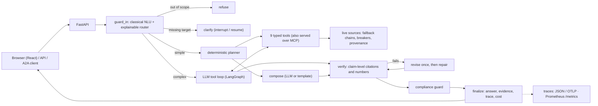

<div align="center">

<h1>FinSight</h1>

<h3>Evidence-first research agent for China A-shares.</h3>

<p>
  <a href="README.md"></a>
  <a href="README_CN.md"></a>
  <a href="LICENSE"></a>
  
  
  
  
</p>

</div>

---

FinSight answers questions about Chinese listed companies, funds, indices and macro data. A classical, explainable NLU front end routes and guards every question; an LLM orchestrates typed evidence tools in a LangGraph loop; and **every number in the answer is checked by code against the evidence cited next to it** before a compliance guard removes anything that reads like investment advice. Without an LLM key the same graph runs on a deterministic planner.

<p align="center"></p>

## Why it is built this way

| Decision | Reason | Where |
|---|---|---|
| Classical NLU routes, an LLM orchestrates | Routing and guarding must be explainable and cheap; the LLM is used where it adds value (choosing tools, writing). A fixed workflow handles simple questions; the LLM loop handles comparisons, "why" questions and multi-hop ones. | `agent/router.py`, `agent/graph.py` |
| Claim-level number verification | A number must appear in the evidence cited in *its own sentence*, with unit- and precision-aware matching. Unverifiable sentences are revised once by the LLM, then deleted. | `agent/verifier.py` |
| Deterministic fallback everywhere | No key, a provider outage or an exhausted budget degrades to the planner + template answer, still cited and verified. | `agent/planner.py`, `agent/llm.py` |
| Evidence as untrusted data | Tool output is wrapped, normalised and filtered for injected instructions; tools are read-only. | `agent/injection.py` |

## Results

All numbers are reproducible with the commands in [docs/agent-eval.md](docs/agent-eval.md); online numbers come from DeepSeek V4.1 Flash through a gateway, 3 repeats per task, costs as billed by the gateway.

Task success is dealbreaker-gated: the behaviour (answer / clarify / refuse) must be right, every required fact stated **and** cited, the required tools used, hedging present where the question asks for a judgment, and no trading instruction anywhere. Development set: 207 tasks / 220 turns; held-out set: 53 tasks written after the rules were tuned.

| Answer path | Success (dev) | Success (held-out) | pass^3 (dev / held-out) | Cost per task (dev / held-out) | P95 latency (dev) |
|---|---|---|---|---|---|
| Original `/chat`, no LLM | 0.256 | 0.189 | – | – | 1.0 s |
| Original `/chat` + LLM rewrite | 0.440 | 0.679 | – | not recorded | 13.4 s |
| LLM alone, no tools | 0.000 | 0.000 | 0.000 / 0.000 | $0.0009 / $0.0009 | 18.3 s |
| Deterministic workflow (no LLM) | 0.981 | 0.849 | – | $0 | 0.8 s |
| Workflow + LLM composition | 0.979 | 0.906 | 0.976 / 0.906 | $0.0008 / $0.0007 | 16.7 s |
| **LLM agent (tool loop)** | **0.986** | **0.956** | **0.971 / 0.906** | **$0.0016 / $0.0010** | 25.2 s |

The LLM alone never passes: it cannot cite evidence and its prices are unverifiable. Prompt v2/v3 cut the agent's cost per task by 60% against v1 (from $0.0040) while raising held-out pass^3 from 0.849 to 0.906.

| Other measurements | Result | Details |
|---|---|---|
| Verifier false-accept rate on 2,315 corrupted gold answers | 35.0% (original run-level check) → **2.8%** (claim-level); numbers swapped between companies 100% → **0.6%**; 157/157 gold answers still accepted | [agent-eval.md](docs/agent-eval.md) |
| Prompt-injection red team (17 attacks × 4 obfuscations, poisoned search results) | Development attacks: **0** successes on all three paths (216 runs). Unseen held-out attacks: 0/64 template, 2/64 LLM composition, 1/64 agent — reported, not hidden (see Limits) | [agent-eval.md](docs/agent-eval.md) |
| Fault injection (timeouts, 5xx, empty data, huge documents, LLM down, malformed tool calls, endless loops) | 11/11 scenarios degrade gracefully | [agent-eval.md](docs/agent-eval.md) |
| Load test of the container (workflow path, no LLM) | 8.4 req/s and P95 0.66 s for one client after cutting checkpoint writes (was 0.7 req/s, P95 4.6 s) | [performance.md](docs/performance.md) |
| Live data audit (64 probes) | 49 OK; fixed a wrong M2 series, stale CPI/PMI, always-null PE/PB and empty announcements | [data-sources.md](docs/data-sources.md) |

## Architecture


```mermaid
flowchart LR
  U["Browser (React) / API / A2A client"] --> API["FastAPI"]
  API --> G["guard_in: classical NLU + explainable router"]
  G -->|out of scope| RF["refuse"]
  G -->|missing target| CL["clarify (interrupt / resume)"]
  G -->|simple| WF["deterministic planner"]
  G -->|complex| AL["LLM tool loop (LangGraph)"]
  WF --> T["9 typed tools (also served over MCP)"]
  AL <--> T
  T --> DS["live sources: fallback chains, breakers, provenance"]
  WF --> C["compose (LLM or template)"]
  AL --> V["verify: claim-level citations and numbers"]
  C --> V
  V -->|fails| RV["revise once, then repair"] --> V
  V --> K["compliance guard"] --> F["finalize: answer, evidence, trace, cost"]
  F --> U
  F -.-> O["traces: JSON / OTLP · Prometheus /metrics"]
```

Sessions are LangGraph checkpoints (memory, SQLite or Postgres), so a clarification can pause a run and any replica can continue a conversation. See [docs/agent.md](docs/agent.md).

## Features

- **Agent**: routing with reasons, parallel tool calls, step/tool/token budgets and a run deadline, one LLM revision after failed verification, coreference and clarification interrupts, per-node reasoning levels, model failover with a circuit breaker, versioned prompts pinned by hash.
- **Evidence tools**: entity resolution, price history, technical indicators, fundamentals, macro indicators, news, announcements, knowledge search and document sentiment — each with a Pydantic schema, timeout, retry, TTL cache and actionable error hints.
- **Live data**: Eastmoney → Sina → Tencent → cache → snapshot chains, per-source circuit breakers, provenance on every record (`GET /sources/health`).
- **Protocols**: MCP server for the tools; A2A 1.0 endpoint for the whole agent (clarification maps to `input-required`).
- **Observability**: per-run traces (nodes, tools, LLM calls, tokens, cost, prompt versions), a run inspector API, OpenTelemetry export and Prometheus metrics.
- **Web UI** (React 19, TypeScript, Tailwind v4, Radix, Motion, Lightweight Charts): streamed run timeline, citation chips linked to an evidence ledger with freshness, price charts, run cost and latency, zh/en, dark mode, mobile.
- **Security**: optional API keys, rate limiting, CORS, body limits, non-root read-only container.

<p align="center">
  
  
</p>

## Quick start

```bash
pip install -r requirements.txt
uvicorn query_intelligence.api.app:create_app --factory --port 8765   # open http://127.0.0.1:8765
```

Without a key, answers come from the deterministic path. To enable the LLM agent with any OpenAI-compatible endpoint:

```bash
export DEEPSEEK_API_KEY=...                      # read from the environment, never from the config file
export DEEPSEEK_BASE_URL=https://api.deepseek.com # or a gateway, e.g. https://api.cline.bot/api/v1
export DEEPSEEK_MODEL=deepseek-v4-flash
export QI_LLM_FALLBACK_MODELS=...                 # optional failover models on the same endpoint
```

Live market, news, announcement and macro providers are on by default; set `QI_USE_LIVE_MARKET=0` (and `_NEWS`, `_ANNOUNCEMENT`, `_MACRO`) for the shipped offline snapshot.

Docker and Kubernetes (replicas sharing sessions through Postgres, read-only root filesystem): see [docs/deployment.md](docs/deployment.md).

```bash
docker build -f docker/Dockerfile -t finsight . && docker run -p 8000:8000 finsight
kubectl apply -f deploy/k8s/finsight.yaml
```

## API

| Endpoint | Purpose |
|---|---|
| `POST /agent/chat`, `POST /agent/chat/stream` (SSE), `POST /agent/resume` | Agent answer with evidence, verification, trace id and cost; streamed node events; clarification resume. |
| `GET /agent/sessions/{id}`, `GET /agent/traces`, `GET /agent/traces/{id}` | Session memory, recent runs, full run trace. |
| `GET /.well-known/agent-card.json`, `POST /a2a` | A2A agent card and JSON-RPC endpoint. |
| `GET /metrics`, `GET /sources/health`, `GET /health` | Prometheus metrics, live source status, health. |
| `POST /chat` | Original chatbot endpoint (`mode=workflow` keeps the original pipeline; `agent`/`auto` use the agent). |
| `POST /nlu/analyze`, `POST /retrieval/search`, `POST /query/intelligence` | Classical NLU and retrieval artifacts. |

Schemas: `schemas/agent_*.schema.json`, generated from `query_intelligence/contracts.py`.

## Evaluation and tests

```bash
python -m pytest -q tests                                  # offline; live providers off in CI
python -m evaluation.agent_eval.gate                       # replayed dev + held-out thresholds
python -m evaluation.agent_eval.ablation --llm deepseek --repeats 3 --workers 6   # online ablation
python -m evaluation.agent_eval.verifier_stress            # verifier false-accept rate
python -m evaluation.agent_eval.redteam --llm deepseek     # prompt-injection red team
python -m evaluation.agent_eval.fault_injection            # graceful degradation
python -m scripts.load_test --base-url http://127.0.0.1:8000 --users 8
```

CI runs lint, the frontend checks (typecheck, lint, unit tests, reproducible build), the full test suite with a Postgres service, the evaluation gates, the Docker build with a smoke test and Kubernetes manifest validation.

## Documentation

| Topic | Link |
|---|---|
| Agent layer: graph, tools, memory, API, configuration | [docs/agent.md](docs/agent.md) |
| Evaluation: task sets, online ablation, prompt A/B, red team, verifier stress | [docs/agent-eval.md](docs/agent-eval.md) |
| A2A, model failover, gateway cost, metrics | [docs/a2a-and-observability.md](docs/a2a-and-observability.md) |
| Live data sources | [docs/data-sources.md](docs/data-sources.md) |
| Performance and load | [docs/performance.md](docs/performance.md) |
| Deployment | [docs/deployment.md](docs/deployment.md) |
| Design notes and trade-offs | [docs/presentation/agent-design-notes.md](docs/presentation/agent-design-notes.md) |
| Agent and prompt-engineering practice research | [docs/research/agent-architecture-practices-2026.md](docs/research/agent-architecture-practices-2026.md) |
| Query Intelligence (classical NLU and retrieval) | [docs/query-intelligence.md](docs/query-intelligence.md) |
| Web UI | [docs/frontend-chatbot.md](docs/frontend-chatbot.md) |
| All pages | [docs/index.md](docs/index.md) |

## Limits

- One LLM family was evaluated online (DeepSeek V4.1 Flash). The held-out set was also used to choose between prompt versions, so it is a validation set for prompts rather than an untouched test set.
- The verifier checks that numbers come from the cited evidence; it cannot tell whether the right period or metric was chosen when one evidence item holds several.
- Pronoun resolution is rule-based; English company aliases are limited to `data/runtime/alias_table.csv`.
- The lexical injection filter does not generalise to unseen phrasings (0% redaction on the held-out attacks); protection comes mostly from structure (read-only tools, untrusted-data envelope, verification, compliance).
- Free data sources throttle: Eastmoney refused this machine's connections during the audit, so fallbacks carried the load.

## Safety

FinSight summarises evidence; it is not an investment adviser and must not be the sole basis for trading decisions.
