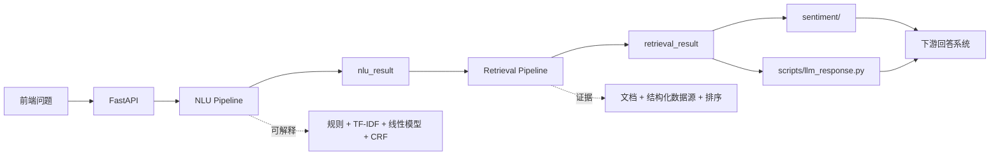

# ARIN Query Intelligence

ARIN Query Intelligence 将用户的金融问题转换成可解释的 JSON 证据产物，供下游分析、情感判断和回答生成使用。

它输出：

- `nlu_result`：规范化问题、产品类型、意图、主题、实体、缺失槽位、风险标记、证据需求和 source plan。
- `retrieval_result`：实际执行的数据源、文档证据、结构化数据、覆盖情况、warning、排序追踪和 `analysis_summary`。

它不直接生成最终投资回答，也不做确定性的买卖结论。自然语言回答、文档情感、统计分析等都属于下游模块。

## 架构



核心边界：NLU 和 Retrieval 以可解释的传统机器学习和规则方法为主。LLM 与 transformer sentiment 模型只作为下游消费者。

## 快速运行

安装依赖：

```bash
pip install -r requirements.txt
```

运行一次人工查询：

```bash
python manual_test/run_manual_query.py --query "你觉得中国平安怎么样？"
```

启动 API：

```bash
uvicorn query_intelligence.api.app:create_app --factory --host 0.0.0.0 --port 8000
```

开启 live 行情、新闻和公告数据源：

```bash
QI_USE_LIVE_MARKET=1 QI_USE_LIVE_NEWS=1 QI_USE_LIVE_ANNOUNCEMENT=1 \
uvicorn query_intelligence.api.app:create_app --factory --host 0.0.0.0 --port 8000
```

用默认 DeepSeek V4 Flash 后端生成下游 LLM 回答 JSON：

```bash
export DEEPSEEK_API_KEY="your_deepseek_api_key_here"
python scripts/llm_response.py --query "你觉得中国平安怎么样？"
```

人工查询输出：

```text
manual_test/output/<timestamp>-<query-slug>/
  query.txt
  nlu_result.json
  retrieval_result.json
```

## API

| Endpoint | 用途 | 输出 |
|---|---|---|
| `GET /health` | 健康检查 | `{"status":"ok"}` |
| `POST /nlu/analyze` | 只执行 NLU | `NLUResult` |
| `POST /retrieval/search` | 基于已有 NLU 结果执行检索 | `RetrievalResult` |
| `POST /query/intelligence` | 端到端 NLU + Retrieval | `PipelineResponse` |
| `POST /query/intelligence/artifacts` | 端到端运行并写出 JSON 文件 | `ArtifactResponse` |

推荐请求：

```json
{
  "query": "你觉得中国平安怎么样？",
  "user_profile": {
    "risk_preference": "balanced",
    "preferred_market": "cn",
    "holding_symbols": ["601318.SH"]
  },
  "dialog_context": [],
  "top_k": 10,
  "debug": false
}
```

完整请求和输出字段见 [Query Intelligence 契约](docs/zh/query-intelligence.md)。

## 模块

| 路径 | 作用 |
|---|---|
| `query_intelligence/api/` | FastAPI 服务边界。 |
| `query_intelligence/nlu/` | 规范化、实体解析、分类器、澄清、越界检测和数据源规划。 |
| `query_intelligence/retrieval/` | Query 构建、文档/结构化检索、排序、去重、打包和市场分析。 |
| `query_intelligence/contracts.py` | Pydantic API 与产物契约。 |
| `query_intelligence/integrations/` | Tushare、AKShare、巨潮、efinance 和宏观数据源。 |
| `sentiment/` | 下游文档情感预处理和 FinBERT 分类器。 |
| `scripts/llm_response.py` | 下游回答和追问 JSON 生成器。 |
| `training/` | 传统机器学习训练入口。 |
| `data/runtime/` | 随仓库发布的运行时实体、alias 和文档库，保证 clone 后可用。 |
| `models/` | 随仓库发布的模型 artifact。 |

## 文档

| 主题 | 中文 | English |
|---|---|---|
| 总览和导航 | [docs/zh/index.md](docs/zh/index.md) | [docs/index.md](docs/index.md) |
| 架构、API 和输出契约 | [docs/zh/query-intelligence.md](docs/zh/query-intelligence.md) | [docs/query-intelligence.md](docs/query-intelligence.md) |
| 训练和运行时资产 | [docs/zh/training.md](docs/zh/training.md) | [docs/training.md](docs/training.md) |
| LLM 回答生成交接 | [docs/zh/llm-response.md](docs/zh/llm-response.md) | [docs/llm-response.md](docs/llm-response.md) |
| 文档情感分析 | [docs/zh/sentiment.md](docs/zh/sentiment.md) | [docs/sentiment.md](docs/sentiment.md) |

## 配置

常用环境变量：

| 变量 | 用途 |
|---|---|
| `TUSHARE_TOKEN` | 优先使用的 A 股行情和财务数据 token。 |
| `QI_POSTGRES_DSN` | 可选的生产文档/结构化数据存储。 |
| `QI_USE_LIVE_MARKET` | 开启 live 行情和基本面数据源。 |
| `QI_USE_LIVE_NEWS` | 开启 live 新闻数据源。 |
| `QI_USE_LIVE_ANNOUNCEMENT` | 开启巨潮公告。 |
| `QI_USE_LIVE_MACRO` | 开启 live 宏观指标。 |
| `QI_MODELS_DIR` | 模型 artifact 目录。 |
| `QI_API_OUTPUT_DIR` | API artifact 输出目录。 |
| `DEEPSEEK_API_KEY` 或 `QI_LLM_API_KEY` | 默认 LLM 回答后端 key。 |

本地可复制 `.env.example` 为 `.env`。不要提交真实 key 或运行生成文件。

## 测试

运行核心测试：

```bash
python -m pytest -q tests/test_query_intelligence.py tests/test_llm_response.py
```

运行分组测试：

```bash
python -m scripts.run_test_suite
```

验证 live source：

```bash
QI_USE_LIVE_MARKET=1 QI_USE_LIVE_NEWS=1 QI_USE_LIVE_ANNOUNCEMENT=1 \
python -m scripts.verify_live_sources --query "你觉得寒武纪值得入手吗" --debug
```

## 支持范围

默认随仓库发布的运行时资产聚焦中国市场 v1：

- A 股、ETF、基金、指数、行业、宏观指标、政策信号、新闻、公告、基本面、估值和风险。
- 港股、美股和海外产品需要额外补充实体、alias、provider、文档和评估样例。
- 非金融问题应识别为 `out_of_scope`，不要强行进入金融检索链路。
