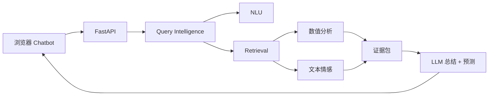

<div align="center">

<h1>FinSight</h1>

<h3>证据优先的金融分析聊天机器人。</h3>

<p>
  <a href="README.md"></a>
  <a href="README_CN.md"></a>
  <a href="LICENSE"></a>
  
  
  
</p>

</div>

---

FinSight 是 ARIN7012 Group 4.2 的证据优先金融分析聊天机器人。它把自然语言金融问题转换为可审计的证据产物，再通过本地网页 Chatbot 输出带风险提示的回答。

项目遵循一个核心原则：先检索和暴露证据，再生成金融回答。后端会识别意图、实体、证据需求、source plan、文档证据、结构化行情数据、数值信号、情感证据和带引用的回答 JSON。

## 特性

- 支持中文和英文问题的浏览器 Chatbot。
- 可解释的 Query Intelligence 后端，负责 NLU 和 Retrieval。
- 面向中国市场的运行时覆盖：A 股、ETF/基金、指数、行业、宏观指标、政策事件、新闻、公告和基本面。
- 数值分析 `analysis_summary`：市场、基本面、宏观、技术指标和数据就绪信号。
- 对检索文档执行文本情感分析。
- 基于紧凑证据生成 LLM 总结和下一问题预测，并控制引用和风险提示。
- `data/runtime/` 和 `models/` 中包含 clone 后可运行的轻量资产。

## 架构



核心产物：

| 产物 | 用途 |
|---|---|
| `nlu_result` | 问题归一化、产品类型、意图、主题、实体、缺失槽位、风险标记、证据需求和 source plan。 |
| `retrieval_result` | 已执行 source、文档、结构化数据、覆盖度、warning、排序 trace 和 `analysis_summary`。 |
| `answer_generation` | 前端可直接渲染的回答 JSON。 |
| `next_question_prediction` | Chatbot 的后续问题建议。 |

FinSight 不输出确定性的买入/卖出决策。它提供证据、解释、不确定性提示和风险声明。

## 快速开始

请使用 Python 3.13 或兼容的 Python 3 版本。

```bash
pip install -r requirements.txt
```

运行一次人工查询：

```bash
python manual_test/run_manual_query.py --query "你觉得中国平安怎么样？"
```

启动本地网页 Chatbot：

```bash
export DEEPSEEK_API_KEY="your_deepseek_api_key_here"
python scripts/launch_chatbot.py
```

启动 FastAPI 服务：

```bash
uvicorn query_intelligence.api.app:create_app --factory --host 0.0.0.0 --port 8000
```

按需启用 live provider：

```bash
QI_USE_LIVE_MARKET=1 QI_USE_LIVE_NEWS=1 QI_USE_LIVE_ANNOUNCEMENT=1 \
uvicorn query_intelligence.api.app:create_app --factory --host 0.0.0.0 --port 8000
```

人工运行会输出本地文件：

```text
manual_test/output/<timestamp>-<query-slug>/
  query.txt
  nlu_result.json
  retrieval_result.json
```

## API 概览

| Endpoint | 用途 |
|---|---|
| `GET /health` | 健康检查。 |
| `GET /` | 本地浏览器 Chatbot UI。 |
| `POST /chat` | 端到端聊天回复，包含证据支撑的 LLM 措辞。 |
| `POST /nlu/analyze` | 只执行 NLU。 |
| `POST /retrieval/search` | 使用已有 NLU 结果执行检索。 |
| `POST /query/intelligence` | 端到端执行 NLU 和 Retrieval。 |
| `POST /query/intelligence/artifacts` | 端到端运行并写出 JSON 产物。 |

示例请求：

```json
{
  "query": "你觉得中国平安怎么样？",
  "user_profile": {
    "risk_preference": "balanced",
    "preferred_market": "cn",
    "holding_symbols": ["601318.SH"]
  },
  "top_k": 10,
  "debug": false
}
```

完整请求和响应契约见 [docs/zh/query-intelligence.md](docs/zh/query-intelligence.md)。

## 模块

| 模块 | 主要路径 | 文档 |
|---|---|---|
| 前端 Chatbot | `query_intelligence/chatbot.py`, `query_intelligence/api/app.py` | [docs/zh/frontend-chatbot.md](docs/zh/frontend-chatbot.md) |
| NLU 和 Retrieval | `query_intelligence/` | [docs/zh/query-intelligence.md](docs/zh/query-intelligence.md) |
| 数值分析 | `query_intelligence/retrieval/market_analyzer.py` | [docs/zh/numerical-analysis.md](docs/zh/numerical-analysis.md) |
| 文本分析 | `sentiment/` | [docs/zh/sentiment.md](docs/zh/sentiment.md) |
| LLM 总结和预测 | `scripts/llm_response.py`, `/chat` | [docs/zh/llm-response.md](docs/zh/llm-response.md) |

模块级说明见 [docs/zh/modules.md](docs/zh/modules.md)。

## 仓库结构

```text
query_intelligence/   FastAPI、NLU、retrieval、contracts、provider
sentiment/            文档情感预处理和分类
scripts/              Chatbot 启动、LLM 交接、评估工具
training/             公开数据同步、训练和运行时资产构建
manual_test/          人工查询和集成测试脚本
tests/                Pytest 测试
schemas/              外部校验 JSON Schema
data/runtime/         clone 后可用的小型运行时资产
models/               随仓库发布的模型产物
docs/                 详细文档
submission/           最终报告包和证据文件
```

## 配置

常用环境变量：

| 变量 | 用途 |
|---|---|
| `DEEPSEEK_API_KEY` | 启用 `/chat` 的 LLM 回答润色。 |
| `DEEPSEEK_MODEL` | 覆盖默认 DeepSeek 模型。 |
| `TUSHARE_TOKEN` | 启用 Tushare 行情和基本面。 |
| `QI_USE_LIVE_MARKET` | 启用 live 行情 provider。 |
| `QI_USE_LIVE_NEWS` | 启用 live 新闻 provider。 |
| `QI_USE_LIVE_ANNOUNCEMENT` | 启用 live 公告 provider。 |
| `QI_USE_LIVE_MACRO` | 启用 live 宏观 provider。 |
| `QI_POSTGRES_DSN` | 可选 PostgreSQL 结构化检索源。 |

不要提交 `.env`、真实 token、生成输出、公开数据缓存或本地临时文件。

## 测试

运行分组测试：

```bash
python -m scripts.run_test_suite
```

运行重点测试：

```bash
python -m pytest tests/test_query_intelligence.py -q
python -m pytest tests/test_analysis_summary.py tests/test_market_analyzer.py -q
python -m pytest tests/test_sentiment_pipeline.py -q
python -m pytest tests/test_llm_response.py -q
```

评估、训练和发布检查见 [docs/zh/training.md](docs/zh/training.md)。

## 文档

从 [docs/zh/index.md](docs/zh/index.md) 开始。

| 主题 | 链接 |
|---|---|
| 模块地图 | [docs/zh/modules.md](docs/zh/modules.md) |
| Query Intelligence | [docs/zh/query-intelligence.md](docs/zh/query-intelligence.md) |
| 前端 Chatbot | [docs/zh/frontend-chatbot.md](docs/zh/frontend-chatbot.md) |
| 数值分析 | [docs/zh/numerical-analysis.md](docs/zh/numerical-analysis.md) |
| 文本情感 | [docs/zh/sentiment.md](docs/zh/sentiment.md) |
| LLM 回答交接 | [docs/zh/llm-response.md](docs/zh/llm-response.md) |
| 训练和运行时资产 | [docs/zh/training.md](docs/zh/training.md) |
| 汇报材料 | [docs/presentation/README.md](docs/presentation/README.md) |

## 风险说明

FinSight 是研究和课程项目原型。它用于汇总证据和辅助查看金融信息，不是投资顾问，也不能作为交易决策的唯一依据。
