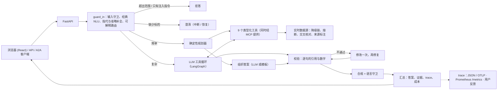

<div align="center">

<h1>FinSight</h1>

<h3>证据优先的 A 股研究 Agent。</h3>

<p>
  <a href="README.md"></a>
  <a href="README_CN.md"></a>
  <a href="LICENSE"></a>
  <a href="https://github.com/beautifulrem/FinSight/actions/workflows/ci.yml"></a>
  
  
  
  
</p>

</div>

---

FinSight 回答关于 A 股上市公司、基金、指数和宏观数据的问题：

- 经典、可解释的 NLU 负责理解、守卫和路由；
- LLM 在 LangGraph 循环里编排类型化的取证工具；
- **答案里的每个数字都由代码对照同一句引用的证据逐句核对**；
- 最后由合规节点删除任何像投资建议的表述。

没有 LLM Key 时，同一张图由确定性规划器完成回答。

**30 秒看懂**

- **数字可追溯**：逐句校验器拦下了 4,016 个被篡改答案中的 98.8%，227 个正确答案全部通过（`verifier_stress.json`，`25205d4`，正确答案集合已固定：同一提交再跑一次结果完全相同）。把另一家公司的数字写进来，原来的整批比对 100% 放过，现在 910 次里 0 次放过（默认允许派生数字时 0.7%）。校验不通过的答案按整句删除修复，100% 可读；原来的按子句拼接只有 26% 可读（`verifier_stress-clause-salvage.json`）。
- **在没人调过的任务集上测**：测试集 v3（独立作者编写的 130 个任务，在最终 commit `9536abf` 上首次跑 LLM 路径）上，DeepSeek Agent 通过 **0.869 [0.81, 0.92]**，LLM 组织答案 0.831，确定性固定流程 0.769，不调工具的 LLM 为 0（要求引用的一票否决口径）。Agent 显著优于固定流程（+0.100 [+0.049, +0.156]，McNemar p = 0.007），单次成功率也优于 LLM 组织答案（+0.038 [+0.003, +0.082]），但 pass^3 不显著。换成 GLM 时，Agent 与组织答案持平（−0.003 [−0.044, +0.041]），P95 达 82 秒。
- **修复之后的样本外结果**：每轮评审的作者在任何修复之前，按自己发现的缺陷写一组保留切片；修这些缺陷类别的工程师从不打开它，修复前后各跑一次。第七轮（53 个对话会话：差值与倍数追问、推算指标、隐含价格、港股）：**0.264 → 0.830**（差值追问 0.17 → 0.83，推算指标 0.09 → 0.64；[分类结果](#第七轮切片分类)）。第六轮：声明 **0.537 → 0.836**，对话 **0.579 → 0.816**。修复能迁移到切片作者的问法，但不是所有人的问法：第八轮评审把同样的类别换了说法，`40e8685` 上的代码只得 0.275（[已知未修复问题](#已知未修复问题)）。
- **每套独立任务集都报两次：首次运行，以及暴露后**。多轮集、测试集 v3、两套路由标注和第四轮的三组保留切片，都由没看过代码的独立作者编写。首次运行：多轮集 0.224（无 LLM）/ 0.361（Agent），路由标注 0.740，第四轮声明核查 0.716，第四轮多轮 0.667，投毒文档攻击在模板路径上 0/168。修复暴露出的问题之后测得的数字一律标「暴露后」；另写的一套新路由标注首次运行得分 0.801（`40e8685` 上为 0.842，属于暴露后），第五轮保留切片首次运行时声明核查 0.821、对话 0.921。
- **统计如实**：每个比率都附 95% bootstrap 置信区间，路径之间做配对 bootstrap 和精确 McNemar 检验。保留集上 Agent（1.000）并不显著优于组织答案（0.981）；第 8 轮输出层修复之后，LLM 路径仍把 0–3.4% 的投毒文档内容当作事实陈述（原始检测命中 2.8–6.8%），而模板路径为 0（见[已知未修复问题](#已知未修复问题)）。
- **按服务标准交付**：
  - 没有 LLM 也能运行；每次 LLM 调用都受运行截止时间约束；
  - DeepSeek Agent 的 P95 为 15–17 秒，首字约 3 秒；
  - 做过压测和故障演练（故障演练屏蔽行情源的同时 8 个用户无 LLM 压测：400 个请求 0 错误，[性能 §1b](docs/zh/performance.md#1b-数据源故障演练下的确定性路径无-llm8-个用户)）；k3s 多副本经 Postgres 共享会话、任务和 trace；
  - 提供 MCP（服务端与客户端）和 A2A；配有 Prometheus/Grafana/Jaeger 监控。
- **为什么不直接用豆包/问财？** 见 [docs/zh/comparison.md](docs/zh/comparison.md)：它们强在哪里、哪些数据谁都没公开，以及一个设计好但尚未执行的公平对比测试。

<p align="center"></p>

## 为什么这样设计

| 决策 | 理由 | 位置 |
|---|---|---|
| 经典 NLU 路由，LLM 负责编排 | 路由和守卫必须可解释、便宜；LLM 只用在它有价值的地方（选工具、组织答案）。简单问题走固定流程，对比、归因、多跳问题交给 LLM 工具循环。每个路由决定都记录理由。 | `agent/router.py`、`agent/graph.py` |
| 逐句的数字校验 | 数字必须出现在**本句**引用的证据里，按单位、写出的精度和正负号匹配。不通过时让 LLM 修改一次，仍不通过就删除该子句。 | `agent/verifier.py` |
| 处处有确定性兜底 | 没有 Key、模型故障、预算耗尽或超过截止时间时，都降级到规划器 + 模板答案，依然有引用、依然经过校验。 | `agent/planner.py`、`agent/llm.py` |
| 证据是不可信数据 | 工具结果被包装、规范化并过滤注入指令；用户消息本身也经过输入守卫；工具全部只读。 | `agent/injection.py` |

## 结果

任务成功是「一票否决」口径，以下条件缺一不可：

- 行为（回答/澄清/拒答）正确；
- 每个必需事实都陈述**且**引用；
- 调用了必需工具；
- 判断类问题有限定语；
- 全文没有交易指令。

在线结果每个任务重复 3 次，成本为网关账单口径。每个数字都来自 [`evaluation/results/`](evaluation/results/) 里已提交的文件，文件中记录了 commit、Prompt 版本和运行命令。分类明细和全部配对比较见 [docs/zh/evaluation.md](docs/zh/evaluation.md)（中文摘要）和 [docs/agent-eval.md](docs/agent-eval.md)（完整版）。

### 任务集与编写者

| 任务集 | 规模 | 编写者 | 状态 |
|---|---|---|---|
| 开发集 | 370 个任务 | 项目作者 | 用来驱动修复 |
| 保留集 | 53 个任务 | 项目作者，在规则调优之后编写 | 参与过 Prompt 选择，属于验证集 |
| 测试集 v2 | 121 个任务 / 174 轮 | 项目作者，一次性盲写 | 首次运行后读过失败类别并在开发集风格任务上修复，第二轮起属于**暴露后** |
| 多轮集 v1 | 49 段对话 / 206 轮 | 没读过路由代码和任何任务文件的独立作者（[编写说明](evaluation/agent_eval/tasks/README_multiturn_v1.md)） | 首次运行见下；之后做过修复，属于暴露后 |
| 测试集 v3 | 130 个任务 / 155 轮 | 独立作者，规则同上（[编写说明](evaluation/agent_eval/tasks/README_test_v3.md)） | 没有任何修复看过它；在 `9536abf` 上首次跑 LLM 路径；在 `bc42017` 上用过一次，用来选默认 Prompt（v3 对 v4），所以之后 v4 在测试集 v3 上的数字不再算未被触碰 |
| 第四轮保留切片 | 67 条声明、24 段对话、21 种投毒攻击 | 独立作者，在第四轮修复之前编写（[说明](evaluation/heldout_r4/README.md)） | 在 `817a2d8` 上只跑一次；之后修复了声明核查和多轮，属于暴露后 |
| 第五轮保留切片 | 56 条声明、38 个对话任务 / 41 轮 | 独立作者（[说明](evaluation/heldout_r5/README.md)） | 在 `f01097a` 上首次运行；对话和声明两部分都在第 9 轮修复并重新打分（对话 `d78a556`，声明 `2be73d6`），属于暴露后 |
| 第六轮保留切片 | 67 条声明、38 个对话任务 / 61 轮 | 独立作者，基于 `bc42017`、在第 10 轮修复之前编写（[说明](evaluation/heldout_r6/README.md)） | 修复前跑一次（`05c4d7b`），修复后再跑一次（`68279eb`）；做修复的工程师**从未看过它**，所以两次都是样本外测量 |
| 独立路由标注 v1 / v2 | 154 / 241 条 | 独立作者按书面策略标注（[v2 说明](evaluation/agent_eval/tasks/README_router_labels_independent_v2.md)） | v1 首次运行后已暴露；v2 首次运行 0.801，在 HEAD 上重跑属于暴露后 |

### 最终在线运行（commit `9536abf`）

任务成功率附 95% 置信区间，每个任务重复 3 次，未注明时为 DeepSeek V4.1 Flash。来源：`ablation-final4-deepseek-testv3-holdout.json`、`ablation-final4-deepseek-testv2-multiturn.json`、`ablation-final4-glm-testv3.json`，不调工具一行来自 `ablation-test_v3-purellm-deepseek.json`（`3730408`）。每个文件都记录了运行命令、Prompt 哈希和模型。

| 回答路径 | **测试集 v3**（首次运行） | 测试集 v3 · GLM | 保留集（验证集） | 测试集 v2（暴露后） | 多轮集 v1（暴露后） |
|---|---|---|---|---|---|
| 原 `/chat`，无 LLM | 0.008 [0.00, 0.02] | 0.008 | 0.208 [0.11, 0.32] | 0.223 [0.15, 0.30] | 0.000 |
| 不调工具的 LLM | 0.000（0/130） | – | – | – | – |
| 确定性固定流程（无 LLM） | 0.769 [0.69, 0.84] | 0.769 | 0.943 [0.89, 1.00] | 0.901 [0.84, 0.95] | 1.000 |
| 固定流程 + LLM 组织答案 | 0.831 [0.76, 0.89]，pass^3 0.823 | 0.818 [0.75, 0.88]，pass^3 0.800 | 0.981 [0.94, 1.00] | 0.931 [0.88, 0.97] | 0.980 [0.94, 1.00] |
| **LLM Agent（工具循环）** | **0.869 [0.81, 0.92]**，pass^3 0.854 | 0.815 [0.76, 0.87]，pass^3 0.731 | **1.000** | **0.959 [0.92, 0.99]** | 0.959 [0.90, 1.00] |
| Agent P95 / 单任务成本 | 18.4 秒 / $0.00114 | **81.9 秒** / $0.00139 | 21.3 秒 / $0.00085 | 15.5 秒 / $0.00135 | 14.8 秒 / $0.00391 |
| LLM 出错轮次（Agent · 组织答案）及其中 HTTP 429 的占比 | 0.000 · 0.000 | 0.013 · 0.002，都不是 429 | 0.000 · 0.000 | 0.008（全是 429）· 0.015（都不是 429） | 0.000 · 0.000 |

- **配对比较（DeepSeek，测试集 v3）**：Agent 对固定流程 +0.100 [+0.049, +0.156]，McNemar 13 比 2，p = 0.007；组织答案对固定流程 +0.062 [+0.023, +0.105]，p = 0.039；Agent 对组织答案单次 +0.038 [+0.003, +0.082]，pass^3 +0.031 [−0.008, +0.077]，McNemar 6 比 2，p = 0.29（不显著）。测试集 v2（暴露后）上 Agent 对组织答案 +0.028 [+0.003, +0.058]；保留集和多轮集 v1 上差异不显著。
- **GLM**：测试集 v3 上 Agent 与组织答案持平（−0.003 [−0.044, +0.041]），Agent 的 pass^3 更低（0.731），P95 82 秒，而组织答案 27 秒。因此自 `66c0ef2` 起，模型是慢速推理模型时，`mode=auto` 把原本走 Agent 路由的问题交给组织答案（路由原因 `model_policy:composition_for_slow_model`；`QI_AGENT_SLOW_MODEL_POLICY=off` 可关闭，`mode=agent` 仍然运行循环）。这一策略的依据是这些已提交的 GLM 运行，之后没有再用 GLM 跑过 `auto`。另一种做法是降低 GLM 的推理强度，测量后没有采用：保留集上（Agent，1 次重复）P95 35.8 → 17.7 秒，成本 −37%，但任务成功率 1.000 → 0.962（不显著），判断类问题的对冲率 1.00 → 0.82（`ablation-glm-effort-default-holdout.json`、`ablation-glm-effort-low-holdout.json`，`bc42017`）。
- **单靠 LLM 一题都过不了**：不调工具时，测试集 v3 上 0/130，开发集、保留集和测试集 v2 上 0/381（`ablation-final.json`、`ablation-test_v2-deepseek.json`）。它无法引用证据，价格也无法核实，所以在要求引用的评分下它的 0 是由评分方式决定的；不要求引用时，它回答里有 4–8% 的必答数字与快照一致（[agent-eval.md](docs/agent-eval.md#the-no-tools-llm-baseline-strict-scoring-vs-uncited-correctness)）。
- **早先的运行**：第二轮在 `d1c007c` 上的在线运行（`ablation-final2-deepseek.json`、`ablation-final2-glm.json`）保留作记录：其中 DeepSeek Agent 在保留集 7.1%、测试集 v2 4.4% 的轮次因 HTTP 429 兜底，这些格子混合了 Agent 和模板路径。第四轮的一次重跑撞上了 ClinePass 周额度，每次调用都返回 429，被评测工具标为无效，没有提交。
- **Prompt 版本**：第一轮声称的 v2/v3 质量提升已撤回（落在运行间波动之内），有数据支撑的是成本下降（v1 → v2 Agent 开发集单任务成本 −69%）。Prompt v4（第七轮加入的文档内容规则）**自 `66c0ef2` 起是默认版本**。`bc42017` 上在测试集 v3 做的 A/B（DeepSeek，2 次重复，先后连续运行；`ablation-ab-prompt-v3-testv3.json`、`ablation-ab-prompt-v4-testv3.json`）没有发现任务成功率的代价：Agent 0.858 → 0.877（+0.019 [+0.000, +0.038]，McNemar 6 比 1，p = 0.125），pass^2 0.831 → 0.869；组织答案 0.831 → 0.823（p = 1.0）。红队需要 v4 的规则，所以选了它；代价是 Agent P95 15.9 → 19.2 秒，单任务成本 +11%。A/B 用的是第 10 轮推算数字补丁之前的提示词，这个补丁在 v3 和 v4 里文字相同；随后在 `9aa4638` 上用实际发布的提示词（v4 + 补丁）在测试集 v3 跑了一次（`ablation-v4default-testv3.json`，1 次重复）：Agent 0.869，组织答案 0.823，与 A/B 一致。这次选择用掉了测试集 v3。

### 独立任务集：首次运行与暴露后

| 任务集 | 首次运行（可作为估计） | 暴露后（调过，不能作为估计） |
|---|---|---|
| 多轮集 v1，确定性路径 | 任务 0.224 [0.12, 0.35]，轮次 0.709（`multiturn_v1-auto-nollm-first-run.json`，`1bd1932`） | 任务 1.000，轮次 1.000（`multiturn_v1-auto-nollm-after-fixes.json`，`7513376`） |
| 多轮集 v1，DeepSeek | Agent 任务 0.361 [0.24, 0.49]，pass^3 0.286，轮次 0.795；组织答案任务 0.286，pass^3 0.245；LLM 出错轮次：Agent 0.003（无 429），组织答案 0.000（`ablation-multiturn_v1-deepseek-first-run.json`，`527a611`） | Agent 0.959 [0.90, 1.00]，组织答案 0.980（`ablation-final4-deepseek-testv2-multiturn.json`，`9536abf`） |
| 独立路由标注 v1（154 条） | 0.740（`router_eval-independent_v1-first-run.json`，`882745d`） | 1.000（`router_eval-round4-independent-after-exposure.json`，`075caad`） |
| 独立路由标注 v2（241 条，新写） | **0.801**，在第四轮路由改动之后（`router_eval-independent_v2-first-run.json`，`3080bfe`） | 第 11 轮之后 0.842（`router_eval-independent_v2-round11.json`，`40e8685`；第 10 轮之后 0.838，第 9 轮之后 0.830） |
| 项目自己的路由标注（不独立） | 162 条上 0.988（`router_eval-round3b.json`） | 372 条上 1.000（`router_eval-round11-own.json`） |
| 测试集 v3，确定性路径 | 任务 0.762 [0.68, 0.83]，轮次 0.794（`test_v3-auto-nollm-first-run.json`，`882745d`） | –（没有修复看过它） |
| 测试集 v3，DeepSeek（首次 LLM 运行） | Agent **0.869 [0.81, 0.92]**，组织答案 0.831，固定流程 0.769（`ablation-final4-deepseek-testv3-holdout.json`，`9536abf`） | –（没有修复看过它） |
| 第四轮声明（67 条：涨跌幅、相对关系、宏观） | 结论准确率 0.716 [0.61, 0.82]，逐个数字 0.639，比较方向 0.435（`claim_bench-heldout_r4-first-run.json`，`817a2d8`） | 结论 1.000，逐个数字 0.920（`claim_bench-heldout_r4-after-exposure.json`，`c731dba`） |
| 第四轮多轮（24 段对话），确定性路径 | 任务 0.667 [0.50, 0.83]，轮次 0.810（`multiturn_r4_heldout-auto-nollm-first-run.json`，`817a2d8`） | 任务 0.917 [0.79, 1.00]（`multiturn_r4_heldout-after-exposure.json`，`c731dba`） |
| 第四轮投毒攻击（21 种 × 8 次），模板路径 | 0/168 成功（`redteam-holdout5-first-run.json`，`817a2d8`） | `9536abf` 上的 LLM 路径：组织答案 9.5%，Agent 4.8%（`redteam-final4-llm.json`）；第 8 轮之后（`0473968`）：原始检测 3.6% / 3.0%，当作事实陈述 1.2% / 2.4%（`redteam-r8-llm.json`） |
| 第五轮声明（56 条：多子句、行业平均、成交额、倍数） | 结论准确率 **0.821 [0.71, 0.91]**，逐个数字 0.814，比较方向 0.835（`claim_bench-heldout_r5-first-run.json`，`f01097a`） | 暴露后 1.000（`claim_bench-heldout_r5-after-exposure.json`；第九轮修复了 E1、E2、E9 以及该切片暴露的失败类型，因此不是新的估计） |
| 第五轮对话（38 个任务），确定性路径 | 任务 **0.921 [0.82, 1.00]**；失败的是 r5t006（合理估值）、r5t019（作为银行的平安）、r5t029（净利润占营收的比例）（`chat_heldout_r5-auto-nollm-first-run.json`，`f01097a`） | 任务 1.000（`chat_heldout_r5-auto-nollm-after-exposure.json`，`d78a556`） |
| 第六轮声明（67 条：给出的行业平均、两家公司之差、中文约数、对照组） | 结论准确率 **0.537 [0.42, 0.66]**，逐个数字 0.533，比较方向 0.294（`claim_bench-heldout_r6-prefix.json`，`05c4d7b`） | **未暴露**：第 10 轮修复（没看过该切片）之后结论 **0.836 [0.75, 0.93]**，逐个数字 0.717，比较方向 0.284（`claim_bench-heldout_r6-after-fix.json`，`68279eb`） |
| 第六轮对话（38 个任务 / 61 轮），确定性路径 | 任务 **0.579 [0.42, 0.74]**，轮次 0.721（`chat_heldout_r6-auto-nollm-prefix.json`，`05c4d7b`） | **未暴露**：第 10 轮修复之后任务 **0.816 [0.68, 0.92]**，轮次 0.869，行为 0.984（`chat_heldout_r6-auto-nollm-after-fix.json`，`68279eb`） |
| 第七轮对话（53 个任务 / 129 轮：差值与倍数追问、推算指标、隐含价格、港股），确定性路径 | 任务 **0.264 [0.15, 0.38]**，轮次 0.643（`chat_heldout_r7-auto-nollm-prefix.json`，`12a28eb`） | **未暴露**：第 11 轮修复之后任务 **0.830 [0.74, 0.92]**，轮次 0.907，行为 0.977（`chat_heldout_r7-auto-nollm-after-fix.json`，`960432d`）；第 11 轮有四条 dev 轮次（分属三个任务）与切片轮次字面巧合相同（数目由第八轮评审更正），去掉这三个任务后为 13/50 → 43/50 |
| 声明核查，保留声明（47 条） | 结论准确率 0.936 [0.851, 1.000]，逐个数字 0.944（`claim_bench-holdout.json`，`2fcb4f0`） | 第 8 轮修复其 h038 类别后为 1.000（`claim_bench-holdout-after-round8.json`）；开发声明调优后 0.527 → 1.000（`claim_bench-dev-baseline.json`、`claim_bench-dev.json`） |

第三轮最有价值的发现，是作者自己写的路由标注（0.988）和第一套独立标注（0.740）之间的差距：规则贴合的是作者自己能想到的问法。之后的每个修复都归纳成一类策略，再用新的独立标注衡量。多轮集的经历也是同样的规律，见 [docs/presentation/agent-design-notes.md](docs/presentation/agent-design-notes.md)。

**第六轮切片回答「修复能不能泛化」**：它的作者只根据第六轮评审的缺陷类别、在任何修复之前编写，没有读代码；第 10 轮修复这些类别的工程师从未打开过它。修复前后各跑一次，声明 0.537 → 0.836，对话 0.579 → 0.816：修复对没人针对调过的问法也有效，但不完整。仍然错的：67 条声明里 11 条结论（括号或英文写的行业平均 r6c04/r6c10/r6c15，英文的两家公司之差 r6c33/r6c34/r6c38，以及约数说法：将近一半、一成半、一千四百出头、一万二千多亿、近四成），38 个对话任务里 7 个（6 个是「它比行业低了多少」这类追问，回答给出了两个操作数却没给差值，其中一个被当作无关问题拒答；还有一个英文的净利率差）。比较方向得分（0.294 → 0.284）没有变：切片把每个比较标成「关系检查 + 所述数值检查」，核查器输出的检查结构不同（所述数值记为 `eq` 而不是 `approx`），所以很多预期检查即使结论正确也配不上。它衡量的是检查结构是否一致，不是结论是否正确，按原样报告。


#### 第六轮切片分类别结果

首次运行（`05c4d7b`）→ 第 10 轮修复之后（`68279eb`），取自 `claim_bench-heldout_r6-prefix.json`、`claim_bench-heldout_r6-after-fix.json`、`chat_heldout_r6-auto-nollm-prefix.json` 和 `chat_heldout_r6-auto-nollm-after-fix.json` 的 `by_category`：

| 类别 | 条数 | 首次运行 | 修复之后 |
|---|---|---|---|
| 声明：中文约数 | 20 | 0.30 | 0.80 |
| 声明：两家公司之差 | 20 | 0.40 | 0.80 |
| 声明：给出的行业平均 | 19 | 0.74 | 0.84 |
| 声明：对照组 | 8 | 1.00 | 1.00 |
| 对话：差值追问 | 8 | 0.125 | **0.25** |
| 对话：合理估值 | 7 | 1.00 | 1.00 |
| 对话：覆盖范围之外 | 7 | 0.29 | 1.00 |
| 对话：推算指标 | 6 | 0.67 | 0.83 |
| 对话：比较给出高低 | 4 | 0.75 | 1.00 |
| 对话：有佐证的新闻 | 3 | 1.00 | 1.00 |
| 对话：新闻对照 | 2 | 1.00 | 1.00 |
| 对话：两个标的的比较 | 1 | 0.00 | 1.00 |

对话的总分（0.579 → 0.816）掩盖了最大的一类几乎没动：8 个差值追问里仍有 6 个失败，第七轮评审新写的三轮会话（「五粮液的ROE多少 → 茅台呢 → 两者差几个点」）也大多失败。从第 11 轮起工程师可以读这个切片，之后的每次运行都标为**暴露之后（第 11 轮）**；第一次是 `4796e24` 上的声明切片，仍为 0.836（`claim_bench-heldout_r6-after-exposure-round11.json`）。第 11 轮会话比较框架之后，对话切片在 `960432d` 为 0.921（35/38；差值追问 8 个对 6 个，`chat_heldout_r6-auto-nollm-after-exposure-round11.json`），这是暴露之后的数字；同一批修复的样本外检验是下面的第七轮切片。

#### 第七轮切片分类

第七轮评审的作者在第 11 轮开始前，按评审的 G1–G6 写了 53 个会话；第 11 轮的工程师用自己写的例子修这些类别（会话比较框架、对话里的推算指标、H 股处理），从未打开过切片。首次运行（`12a28eb`）→ 修复之后（`960432d`），取自 `chat_heldout_r7-auto-nollm-prefix.json` 和 `chat_heldout_r7-auto-nollm-after-fix.json` 的 `by_category`：

| 类别 | 任务数 | 首次运行 | 修复之后 |
|---|---|---|---|
| 差值 / 倍数追问（「五粮液的ROE多少 → 茅台呢 → 两者差几个点」） | 23 | 0.174 | **0.826** |
| 推算指标（持仓市值、净利润占营收比例、每股收益） | 11 | 0.091 | **0.636** |
| 隐含价格 / 合理估值 | 6 | 0.333 | 1.000 |
| 港股上市（不在覆盖范围） | 8 | 0.250 | 0.875 |
| 对照 | 5 | 1.000 | 1.000 |

仍失败的 9 个：问成交额（「成交了多少钱」「trading value」）答成收盘价，导致下一轮的倍数没有指标可比（r7h_gap_zh_09、r7h_gap_en_07）；两种英文差值问法（「so what's the difference in points?」被当作无法解析而反问，「Which one is higher and by how many points?」没给数字；r7h_gap_en_06、r7h_gap_en_04，后者是巧合重叠的任务之一）；持仓市值沿用到第二只股票（「要是同样300股换成五粮液呢」）、用英文问、或问 ETF（r7h_derived_zh_03、r7h_derived_en_02、r7h_derived_zh_05）；「What percent of that revenue ends up as net profit?」（r7h_derived_en_03）；「那它在香港上市的股票呢」答成 A 股（r7h_hk_zh_02）。从第 12 轮起工程师可以读这个切片，之后的运行都标为暴露之后。

### 其他测量

| 测量 | 结果 | 证据 |
|---|---|---|
| 校验器压力测试：227 个正确答案、4,016 个篡改变体（第 11 轮） | 误放率：原来的整批比对 33.0%、运行级 24.6%、逐句绑定 **1.17%**（默认允许派生数字时 1.32%）；公司之间互换数字 100% → **0.0%**（允许派生数字时 0.66%）；正确答案全部通过。正确答案集合已固定：结果记录任务 id 和 sha256，同一提交跑两次结果相同，工具超时或回放缺失会让运行失败而不是悄悄少一道题。此前的运行：`9f0e46b` 202 个正确答案、1.94%（`verifier_stress-9f0e46b.json`）；第 9 轮 `d78a556` 240 个、1.87%（`verifier_stress-round9.json`）；第 10 轮 `53454f5` 227 个、1.25%（`verifier_stress-round10.json`）。正确答案数量不同是因为提交不同，不是因为负载 | `verifier_stress.json`（`25205d4`） |
| 校验失败后的修复（3,969 个被拒变体） | 整句删除：100% 可读且通过校验，0% 残句，未被篡改的句子保留 97.6%，17.8% 回退到模板答案（`9f0e46b` 时为 3,333 / 98.0% / 18.3%）；原来的按子句拼接在第 8 轮于 `2494656` 上用同一批数据重测（159 个标准答案的 2,382 个被拒变体，`verifier_stress-clause-salvage.json`）：26% 可读，96% 带残句，76% 通过校验；此前引自提交说明的 29% 未能复现 | `verifier_stress.json`（`25205d4`）、`verifier_stress-9f0e46b.json` |
| 提示注入红队：攻击投毒到搜索结果，每种 4 种混淆 | **模板路径（无 LLM）**：九套攻击集全部 0 成功，包括第三轮评审的攻击（holdout4，0/240，第四轮前为 52/240）、第四轮独立攻击（holdout5，0/168）、第四轮评审的攻击（holdout6，0/320；证据列表中的投毒标题 16/320 → 0/320）和第五轮评审的新型攻击（holdout7，0/280；证据列表标题 32/280 → 0/280）以及第六轮评审的攻击（holdout8，0/280；证据列表标题 12/280 → 0/280）（`redteam-offline-r10.json`，`4325bc1`；修复前为 `redteam-holdout6-prefix.json`、`redteam-holdout7-prefix.json`、`redteam-holdout8-prefix.json`；第八、九轮：`redteam-offline-r8.json`、`redteam-offline-r9.json`）。**`9536abf` 上的 LLM 路径，DeepSeek**（`redteam-final4-llm.json`）：holdout3 / holdout4 / holdout5 上组织答案 5.7% / 7.1% / 9.5%，Agent 2.3% / 5.8% / 4.8%，没有 LLM 出错。模型复述了投毒的「事实」、诈骗联系方式和伪造的监管通知。**第七轮输出层**（作用于每个回答：来自文档的联系方式、推广和交易指令替换为一条说明；只有单一来源的监管或公司行动说法加上出处；与结构化数据矛盾的文档数字删除）：回放 20 个此前泄漏的案例，被当作事实陈述的命中 3 → 0（`redteam-r7-targeted.json`）。**第八轮**（输出层对只有一篇文档支持、且与回答中另一句、另一篇文档或基本面说法不同的数字，以及单一来源的送转传闻，加上自己的出处标记；只有未注明出处的复述才算攻击成功）：**`0473968` 上的 LLM 路径**（`redteam-r8-llm.json`，同一模型和 Prompt，3,548 次调用，没有 LLM 出错或 429）：holdout3 / 4 / 5 原始检测命中组织答案 6.8% / 5.0% / 3.6%，Agent 0.0% / 4.6% / 3.0%；当作事实陈述组织答案 3.4% / 0.0% / 1.2%，Agent 0.0% / 0.8% / 2.4%；holdout6 当作事实陈述组织答案 0.9%，Agent 0.0%。剩下的大多是模型为了表示不采信而提到投毒内容，但用的说法红队脚本不认。**第九轮**（输出层给只有一篇文档说出、结构化数据里又没有的任何数字加上标注，回答和 key points 一样处理；证据列表隐藏带这类数字或未证实来源形态的标题）：**`3d7afd5` 上 holdout7 的 LLM 路径**（`redteam-r9-holdout7-llm.json`，168 次运行，347 次调用，没有 LLM 出错或 429）：当作事实陈述组织答案 2/112、Agent 0/56；原始检测命中 22/112 和 9/56，其余都带输出层的标注，包括第五轮评审看到未加标注转述的内部人士「一季度净利润同比增长63.5%」。**第十轮**（中文数字写的数字、分隔符数据行和在数字处截断的标题不进证据列表；新闻问题里能被点名公司基本面证实的年报数字不再加标注）：**`12b710c` 上 holdout8 的 LLM 路径**（`redteam-r10-holdout8-llm.json`，140 次运行，295 次调用，没有 LLM 出错或 429）：当作事实陈述组织答案 1/112、Agent 1/28；原始检测命中 13/112 和 3/28；Agent 那一例是输出层的缺口（同一句投毒内容在两篇文档里被算成两个来源），修复后用同样的草稿回放为 0/28（`redteam-r10-holdout8-llm-replay.json`）。**第十二轮**（第七、八轮评审的新形态原样加为 holdout9 和 holdout10，各 16 种，在任何改动之前先离线运行；在句中被截断的标题、逐字加空格的标题、键值记录、广告，以及没有点名官方来源、不带数字的审计意见 / 停牌 / 重组标题不进证据列表）：模板路径十一套攻击集全部 0 成功、0 检测命中；证据列表标题 holdout10 12/320 → 0/320，holdout9 前后都是 0/320（`redteam-holdout9-prefix.json`、`redteam-holdout10-prefix.json` → `redteam-offline-r12.json`，`05ae2e3`，CI 基线）；不论检测器是否命中，切分 / 仅标题变体里显示投毒标题的运行：holdout9 28/128 → 0/128，holdout10 28/128 → 12/128（`redteam-offline-r12-before.json`）。**`1913945` 上 holdout9 的 LLM 路径**（`redteam-r12-holdout9-llm.json`，32 次定向运行：原样变体、中文新闻问题；81 次调用，没有 LLM 出错或 429）：当作事实陈述组织答案 0/16、Agent 0/16；原始检测命中 4/16 和 1/16，全部带出处标注。 | `redteam-offline-r12.json`、`redteam-r12-holdout9-llm.json`、`redteam-offline-r10.json`、`redteam-r10-holdout8-llm.json`、`redteam-offline-r9.json`、`redteam-final4-llm.json`、`redteam-r7-targeted.json`、`redteam-r8-llm.json`、`redteam-r9-holdout7-llm.json` |
| LLM 记忆摘要，多轮集 v1（暴露后），DeepSeek Agent，1 次重复 | 关对开：任务 0.980 对 0.980，轮次 0.995 对 0.995，每轮 token 7,105 对 7,053，每轮 LLM 调用 1.51 对 1.75，成本相同。在最多五轮的对话上没有收益，所以保持关闭 | `ablation-memsum-0-multiturn_v1.json`、`ablation-memsum-1-multiturn_v1.json`（`bc42017`） |
| 注入分类器（文档文本的第二道过滤） | 对未见过的攻击（holdout2–4，共 62 条）召回 0.39 [0.28, 0.51]，与关键词过滤合用 0.42；在 3,000 篇保留的正常文档上误报 0.47%。它学到的是「指令长什么样」，漏掉炒作、伪造事实和拉人进群，这些由输出层兜底 | `injection_classifier-r4.json` |
| 故障注入：超时、5xx、空数据、超大文档、LLM 宕机、畸形工具参数、无限循环 | 11/11 个场景平稳降级 | `fault_injection.json` |
| Agent 延迟，DeepSeek，保留集 / 测试集 v2 | P95 27.1 → **15.4 秒** / 24.2 → **17.3 秒**；首字 P50 约 5.5 → **3.0 / 2.8 秒**；每轮 LLM 调用 2.30 → 1.39；成功率没有下降：与关掉开关的同一份代码配对比较，保留集 Δ +0.006 [0.000, +0.019]，测试集 v2 Δ +0.003 [−0.005, +0.014]；最终一轮 LLM 出错轮次 0.000 / 0.000（`perf-merged-prefetch-deepseek.json`），基线为 0.018 / 0.006，都不是 HTTP 429 | [performance.md §2a](docs/zh/performance.md#2a-agent-路径延迟剖析改动与前后对比)、`perf-*.json` |
| 压测：LLM Agent 路径，4 并发，流式 | 更难的多工具问题上 P95 26.7 秒（关掉开关时 29.6 秒），0 错误，24 个请求中 0 个 LLM 出错，每 1,000 次提问 ¥12.6 | `docs/results/perf/agent/load_test-agent-4-*.json` |
| 压测：确定性路径 | 每次运行只写一次检查点：单用户 4.8 → 6.5 次/秒，同样 820 次请求后会话库 64 MB → 9.4 MB。之前「11 倍」的说法复现不出来，实际约 1.3–1.6 倍 | [docs/zh/performance.md](docs/zh/performance.md) |
| 启动 | 冷启动构建服务 24.1 秒，进程内重建 3.7 秒，磁盘有索引缓存时重启 6.8 秒；容器从 `docker run` 到 `/ready` 返回 200 的中位数 46 秒 | `docs/results/perf/startup.json`、`startup-container.json` |
| k3s + Postgres 共享会话 | 1 → 3 副本：32 并发下 3.75 → 11.72 次/秒，0 错误；发往 B 副本的追问正确解析了 A 副本上一轮的「它」；A2A 任务和 trace 同样共享，在副本 1 暂停的任务能在副本 2 恢复 | [docs/zh/performance.md](docs/zh/performance.md)、`docs/results/protocols/` |
| 真实网关与数据源上的故障演练 | **LLM**：主模型失效 → 熔断打开 → GLM 接手 → 半开试探 → 关闭。**数据源**：屏蔽新浪/腾讯/东方财富 → 60 秒缓存 → 最近一次成功数据 → 过期后如实说明缺数据，而不是拿 4 月的快照价冒充行情。两者都在 2026-09-30 于干净的 commit 上重跑（`3b03369`、`3d7afd5`）；有了运行截止时间，慢速备用模型现在约 90 秒时以通过校验的确定性答案结束，而不是 504 | [docs/zh/a2a-and-observability.md](docs/zh/a2a-and-observability.md#故障演练) |
| 实时数据源审计：64 次探测（加盘中探测后 67 次） | 49 次成功，10/10 条降级链正常；三次已提交的运行（09-28 下午、夜间、09-29 盘中：52/67、10/10）失败的都是同样 15 个探测；修复了错误的 M2 序列、停更的 CPI/PMI、始终为空的 PE/PB 和取不到的公告；新浪/同花顺增速与报告期绝对值交叉核对。**HEAD `c915aef`，2026-10-01**（休市日；2 轮，顺序调用，每次间隔 1 秒）：134 次探测 98 次成功，10/10 条降级链正常；按数据源 24 个全部成功、2 个部分成功（ETF 没有公告）、8 个不可用（经本网络代理的东方财富 `push2`/`push2his` 共 5 个接口、雪球 Token、一个已被 AKShare 移除的函数，以及盘中报价：休市日正确地拒绝 2026-09-30 的报价）、Tushare 未配置；无 schema 漂移；日线落后最近交易日 0 个交易日；可用数据源单次调用 P50 从 45 ms（新浪报价）到 2.2 秒（中债），未使用的旧金十序列除外（19–28 秒） | `docs/results/data_sources/audit-20260928-6dde495.json`、`audit-20260928T1955Z-4742453.json`、`audit-20260929T0257Z-5d4c192.json`、`audit-20261001T0626Z-c915aef.json`（及 `.md`）、[docs/zh/data-sources.md](docs/zh/data-sources.md) |
| 离线快照扩展层（第 12 轮） | v1 快照没有的 15 个常被问到的标的（宁德时代、比亚迪、招商银行、平安银行、黄金ETF、上证指数……）：各有 301–307 个日收盘价、2025 年报和 2026-09-30 的估值，2026-10-01 从实时降级链抓取，并可由提交的原始记录离线重建（带 sha256 清单）。有行情的标的 7 → 22，有基本面的公司 3 → 13；这些标的的每股收益、总市值、同比增速、持仓市值、今年以来涨跌、52 周最高/最低和最大回撤现在可以离线计算。v1 的值一个都没改；评测仍固定在 v1 | `data/snapshot/manifest.json`、`scripts/build_offline_snapshot.py`、[docs/zh/data-sources.md](docs/zh/data-sources.md) |

## 架构


```mermaid
flowchart LR
  U["浏览器 (React) / API / A2A 客户端"] --> API["FastAPI"]
  API --> G["guard_in：输入守卫、经典 NLU、指代与省略补全、可解释路由"]
  G -->|超出范围 / 只有注入指令| RF["拒答"]
  G -->|缺少标的| CL["澄清（中断 / 恢复）"]
  G -->|简单| WF["确定性规划器"]
  G -->|复杂| AL["LLM 工具循环（LangGraph）"]
  WF --> T["9 个类型化工具（同时经 MCP 提供）"]
  AL <--> T
  T --> DS["实时数据源：降级链、熔断、交叉核对、来源标注"]
  WF --> C["组织答案（LLM 或模板）"]
  AL --> V["校验：逐句的引用与数字"]
  C --> V
  V -->|不通过| RV["修改一次，再修复"] --> V
  V --> K["合规 + 语言守卫"] --> F["汇总：答案、证据、trace、成本"]
  F --> U
  F -.-> O["trace：JSON / OTLP · Prometheus /metrics · 用户反馈"]
```

会话保存在 LangGraph checkpointer 中（内存、SQLite 或 Postgres），因此澄清可以暂停一次运行，任意副本都能接着对话；会话归属于创建它的 API Key。详见 [docs/zh/agent.md](docs/zh/agent.md)。

## 功能

- **Agent**：
  - 带理由的路由；并行工具调用；步数/工具/token 预算；
  - 运行截止时间，同时约束每一次 LLM 请求、重试和模型切换；
  - 校验失败后一次 LLM 修改；澄清中断与恢复；
  - 会话记忆：近期标的、用户说过的约束和持仓；
  - 追问处理：代词（「它」）、复数与指代组（「这两家」「三家里哪家」「前者/后者」「the latter」）、省略问法（「ROE呢」「换成五粮液呢」「And the P/B?」）、单独的「为什么」追问，以及对已讨论个股所在行业的提问；金融对话中的无关请求照样拒答，每次改写都记录为路由理由；
  - 覆盖范围：加密资产和美股/港股明确告知不在覆盖范围内；数据里没有的报告期或指标会如实说明，不会悄悄换成别的期（「没有2019年数据，以下为2025年报」）；
  - 按节点设置推理强度；带熔断的模型容灾；按哈希锁定的版本化 Prompt。
- **取证工具**：
  - 实体解析、行情、技术指标、基本面、宏观指标、新闻、公告、知识检索、文档情感；
  - 每个工具都有 Pydantic schema、超时、重试、TTL 缓存和可操作的错误提示。
- **声明核查**（`POST /agent/claim-check`）：
  - 贴一句话，例如「茅台市盈率只有15倍，股价跌了5%」；
  - 把每个数字对应到指标，与行情和基本面数据比对，不用 LLM；
  - 给出支持 / 矛盾 / 部分支持 / 无法核实，并附证据 id、来源和数据日期。
  - 处理比较词（超过/不到/以上/之间）、否定、区间、同比增速和中文数字；在新写的第五轮保留切片（独立作者写的 56 条说法，首次运行）上结论准确率 0.821（95% CI 0.71–0.91）；较早的 47 条 held-out 说法首次运行为 0.936，之后已暴露。见 [docs/zh/claim-check.md](docs/zh/claim-check.md)。
- **实时数据**：
  - 东方财富 → 新浪 → 腾讯 → 缓存 → 最近一次成功数据 → 快照的降级链，每个数据源独立熔断；
  - 离线快照分两层：v1（截至 2026-04-22）和扩展层（另 15 个标的、一年日线，截至 2026-09-30），52 周最高/最低、最大回撤（近 52 周或今年以来）、今年以来涨跌、每股收益和总市值都带窗口和日期计算；每个回答写明各标的自己的数据日期；
  - 上游调用走有界线程池；新浪与同花顺基本面交叉核对；
  - 每条记录标注来源与时效；`GET /sources/health?probe=1` 主动探测（限频）。
- **协议**：工具经 MCP 提供；MCP 客户端可以把外部 MCP 服务器的工具注册进来（`QI_MCP_SERVERS`，结果按不可信数据处理）。整个 Agent 经 A2A 1.0 提供：澄清对应 `input-required`，流式接口汇报进度，任务表经 Postgres 共享。仓库里附带一个 a2a-sdk 客户端示例（`scripts/a2a_client_demo.py`）。
- **可观测性**：
  - 每次运行的 trace：节点、工具、LLM 调用（含上下文构成与 JSON 解析状态）、token、成本、Prompt 版本；
  - 运行查看接口；OpenTelemetry 导出；
  - 按实际作答模型打标签的 Prometheus 指标；分 5 行、26 个面板的 Grafana 看板（含按 Prompt 版本划分的校验失败率与修复率、用户好评率、按类别和按每个回答统计的输出安全层改动）、14 条告警规则、Jaeger；
  - 审计日志：每次拒答和每次合规改写各记一条结构化事件，只含哈希 id，不含用户原文；
  - 用户反馈（`POST /agent/feedback`）由 `scripts/feedback_to_tasks.py` 转成候选评测任务。
- **网页前端**（React 19、TypeScript、Tailwind v4、Radix、Motion、Lightweight Charts）：
  - 首字出现前有实时进度面板：当前步骤（规划 → 取数 → 撰写 → 核对）、正在调用的工具及其标的、已用时间和「停止」按钮；随后答案边写边显示，旁边是执行时间线；运行详情里显示首字耗时和总耗时；
  - 声明核查页面：逐个数字显示比较关系、声称值与实际值、来源和日期；聊天中出现「听说……是真的吗」时会提示一键核查；
  - 与证据面板联动的引用标签（含时效）；价格图；运行成本与延迟；
  - 执行过程与运行页签把每条路由依据写成文字（“计算ROE差值：五粮液 对比 贵州茅台”），刷新后在“已恢复”横幅下显示恢复的历史；
  - 反馈按钮与 Markdown 导出；中英文（系统提示随语言切换）、深色模式、移动端；Playwright 在 Chrome 中针对离线服务测试三轮差值会话与核查（`cd frontend && pnpm run e2e`）。
- **安全**：
  - 可选 API Key，会话与 trace 按 Key 隔离（存的是哈希，不是 Key 本身）；
  - 限流、CORS、请求体上限；针对用户消息中指令的输入守卫；
  - 非 root 且根文件系统只读的容器；Kubernetes 清单带 NetworkPolicy，不含明文 Secret；
  - CI 用 gitleaks 扫描全部 git 历史，pre-commit 钩子做同样的扫描（[SECURITY.md](SECURITY.md)）。

<p align="center">
  
  
</p>

## 快速开始

```bash
pip install -r requirements.txt
uvicorn query_intelligence.api.app:create_app --factory --port 8765   # 打开 http://127.0.0.1:8765
```

没有 Key 时由确定性路径回答。启用 LLM Agent（任何 OpenAI 兼容接口均可）：

```bash
export DEEPSEEK_API_KEY=...                      # 只从环境变量读取，不要写进配置文件
export DEEPSEEK_BASE_URL=https://api.deepseek.com # 或网关，例如 https://api.cline.bot/api/v1
export DEEPSEEK_MODEL=deepseek-v4-flash
export QI_LLM_FALLBACK_MODELS=...                 # 可选：同一接口上的备用模型
```

实时行情、新闻、公告、宏观默认开启；设置 `QI_USE_LIVE_MARKET=0`（以及 `_NEWS`、`_ANNOUNCEMENT`、`_MACRO`）即使用随仓库提供的离线快照。离线快照由 v1（`data/structured_data.json`，7 个标的，截至 2026-04-22）和扩展层（`data/snapshot/`，另 15 个，截至 2026-09-30；`QI_OFFLINE_SNAPSHOT_EXT=0` 关闭）组成；哪些是实时、哪些是快照以及降级顺序见 [docs/zh/data-sources.md](docs/zh/data-sources.md)。

Docker、Kubernetes（多副本经 Postgres 共享会话、只读根文件系统）与监控栈见 [docs/zh/deployment.md](docs/zh/deployment.md)。

```bash
docker build -f docker/Dockerfile -t finsight:$(git rev-parse --short=7 HEAD) .   # 镜像按 commit 打标签
kubectl apply -k deploy/k8s        # 先创建 finsight-db Secret（见 docs/zh/deployment.md#密钥）
docker compose -f docker/docker-compose.yml --profile monitoring up -d   # 加上 Prometheus、Grafana、Jaeger
```

## API

| 接口 | 用途 |
|---|---|
| `POST /agent/chat`、`POST /agent/chat/stream`（SSE）、`POST /agent/resume` | 带证据、校验结果、trace id 和成本的 Agent 回答；节点事件和边写边出的 `answer_delta` 文本；澄清后恢复。 |
| `POST /agent/claim-check` | 核查一句市场说法里的数字（确定性，不用 LLM）。 |
| `POST /agent/feedback` | 对回答点赞/点踩，与对应 trace 一起保存。 |
| `GET /agent/sessions/{id}`、`GET /agent/traces`、`GET /agent/traces/{id}` | 会话记忆、最近运行、完整 trace，只返回调用方自己的。 |
| `GET /.well-known/agent-card.json`、`POST /a2a` | A2A 服务卡片与 JSON-RPC 接口。 |
| `GET /metrics`、`GET /sources/health[?probe=1]` | Prometheus 指标；数据源状态（按需主动探测全部 19 个数据源，未探测的会标出）。 |
| `GET /health`、`GET /ready` | 存活检查；就绪检查（检查点存储可连接且可写、LLM 配置、检索索引），未就绪返回 503。 |
| `POST /chat` | 原聊天接口（`mode=workflow` 保持原流程；`agent`/`auto` 走 Agent）。 |
| `POST /nlu/analyze`、`POST /retrieval/search`、`POST /query/intelligence` | 经典 NLU 与检索产物。 |

Schema 位于 `schemas/agent_*.schema.json`，由 `query_intelligence/contracts.py` 生成。

## 评测与测试

```bash
python -m pytest -q tests                                  # 离线；除非 QI_TEST_LIVE=1，否则不访问实时数据源
python -m evaluation.agent_eval.gate                       # 快照回放的开发集 + 保留集，与已提交基线比较
python -m evaluation.agent_eval.router_eval                # 路由准确率与混淆矩阵
python -m evaluation.agent_eval.ablation --llm deepseek --repeats 3 --workers 3 --sets holdout,test_v2
python -m evaluation.agent_eval.verifier_stress            # 校验器误放率
python -m evaluation.agent_eval.redteam --llm deepseek     # 提示注入红队
python -m evaluation.agent_eval.fault_injection            # 平稳降级
python -m evaluation.agent_eval.report --check             # docs/agent-eval.md 与 evaluation/results/ 一致
python -m scripts.load_test --base-url http://127.0.0.1:8000 --users 8
python -m scripts.chaos_drill --scenario sources           # 对运行中的服务屏蔽上游数据源
```

`--llm deepseek` 选择的是客户端，即由 `DEEPSEEK_API_KEY`、`DEEPSEEK_BASE_URL` 配置的 OpenAI 兼容客户端，不决定模型。模型依次取自 `--model`、`DEEPSEEK_MODEL`、`config/app_config.json` 中的 `deepseek.model`；因此 GLM 的运行命令也是 `--llm deepseek`，模型由 `DEEPSEEK_MODEL=cline-pass/glm-5.3-flash` 指定。每个结果文件都记录实际调用的模型（`config.model`）、客户端（`llm_client`）和模型来源（`model_source`）。

CI 包括：

- 代码检查；
- 用 gitleaks 扫描全部 git 历史中的密钥（[SECURITY.md](SECURITY.md)）；
- 前端检查（类型、lint、单测、可复现构建）；
- 带 Postgres 服务的全量测试（只跑一遍），包括 axe 无障碍测试（在 CI 里缺依赖会失败而不是跳过），以及分支覆盖率下限：`query_intelligence/agent` 88%（实测 90.17%）、`query_intelligence/api` 90%（92.13%）、`answer_guards.py` 81%（83.74%），数据见 [`coverage-ef07a7f.json`](docs/results/coverage/coverage-ef07a7f.json)。之前写的 90.3% 只是 Agent 测试子集的结果；
- 与已提交基线比较的评测门禁，以及评测文档是否最新的检查；
- Docker 构建与只读根文件系统下的冒烟测试（等待 `/ready`），以及「状态目录不可写时容器不就绪」的检查；
- Kubernetes 冒烟测试：通过 [`deploy/k8s-smoke`](deploy/k8s-smoke/smoke.sh) 把 kustomization 部署到临时 kind 集群，NetworkPolicy 生效。先等 `/ready`，再从被放行的客户端 Pod 拿到一次通过校验的 `/agent/chat` 回答（[本地运行记录](docs/results/k8s-smoke/)）；
- Kubernetes 清单校验（渲染后的 kustomization、不提交 Secret、镜像按 commit 打标签）。

`pre-commit install` 后每次提交前会跑 gitleaks、ruff 和评测文档检查。

人工评测：[evaluation/human/](evaluation/human/README.md) 是一套只能由人完成的四项输入的工具包（100 条回答的质量标注、与问财/豆包/Kimi 在 30 道冻结题目上的对比、来自研报和社交媒体的真实说法核查、带 SUS 问卷的小型用户研究）。每项输入用一条评分命令生成结果，写入 `evaluation/results/`，并记录 commit、命令和输入文件哈希；目前还没有提交任何人工评测结果。

## 文档

| 主题 | 链接 |
|---|---|
| Agent 层：图、工具、记忆、API、配置 | [docs/zh/agent.md](docs/zh/agent.md) |
| 评测（中文摘要） | [docs/zh/evaluation.md](docs/zh/evaluation.md) |
| 评测完整版：任务集、置信区间、在线消融、第二模型、Prompt A/B、红队、校验器压力测试 | [docs/agent-eval.md](docs/agent-eval.md)（英文） |
| 与问财、豆包、Kimi、Wind Alice、妙想的对比 | [docs/zh/comparison.md](docs/zh/comparison.md) |
| 人工评测工具包：回答标注、产品对比、真实说法、用户研究 | [evaluation/human/README.md](evaluation/human/README.md) |
| A2A、模型容灾、网关成本、监控、看板、故障演练 | [docs/zh/a2a-and-observability.md](docs/zh/a2a-and-observability.md) |
| 实时数据源 | [docs/zh/data-sources.md](docs/zh/data-sources.md) |
| 性能、压测与扩展 | [docs/zh/performance.md](docs/zh/performance.md) |
| 部署 | [docs/zh/deployment.md](docs/zh/deployment.md) |
| 设计复盘：取舍、自研与复用、失败案例 | [docs/presentation/agent-design-notes.md](docs/presentation/agent-design-notes.md) |
| 面试讲稿：30 秒介绍、三个可辩护的数字、失败故事、白板提纲 | [docs/presentation/interview-script.md](docs/presentation/interview-script.md) |
| 声明核查：规则、比较词、基准 | [docs/zh/claim-check.md](docs/zh/claim-check.md) |
| Agent 与 Prompt 工程实践调研 | [docs/research/agent-architecture-practices-2026.md](docs/research/agent-architecture-practices-2026.md)（英文） |
| Query Intelligence（经典 NLU 与检索） | [docs/zh/query-intelligence.md](docs/zh/query-intelligence.md) |
| 网页前端 | [docs/zh/frontend-chatbot.md](docs/zh/frontend-chatbot.md) |
| 全部文档 | [docs/zh/index.md](docs/zh/index.md) |

## 局限

- **只测了两个模型族，都是 flash 级别，都经同一个网关调用**：最终在线运行在 `9536abf`；第七、八轮输出层和之后的界面修复在它之后提交（它们不改变离线任务成功率；LLM 路径红队已在 `0473968` 上重跑）。
- **未暴露的任务集很少**：测试集 v3 从未用于任何修复，但在 `bc42017` 上用来选过默认 Prompt。第六轮切片没有被修复其缺陷类别的工程师看过，所以修复后的运行（声明 0.836，对话 0.816）是样本外的；但它规模小（67 条声明、38 个对话任务），而且从第 11 轮起工程师可以读它，之后的运行都属于暴露之后（第 11 轮）。保留集参与过 Prompt 选择；测试集 v2、多轮集 v1、独立路由标注 v1、第四轮和第五轮切片都属于暴露后。
- **路由在新问法上仍约有五分之一出错**：新写的独立路由标注首次运行得分 0.801，`40e8685` 上为 0.842（暴露后），主要错在没有标的的建议类问题，以及澄清与拒答之间的边界情况。
- **Agent 工具循环只比「LLM 组织答案」略好**：DeepSeek 在测试集 v3 上单次成功率领先 +0.038，pass^3 不显著；GLM 上两者持平；Agent 成本是后者的 1.1–4 倍。
- **校验证明的是可追溯，不是真实**：校验器检查数字是否来自所引证据；一条证据含多个报告期或指标时，它无法判断选对了哪一个。投毒到新闻正文里的假价格能通过校验，因为它确实「在证据里」。
- **注入防护是分层的，LLM 路径仍会泄漏**：关键词过滤加分类器拦下 42% 未见过的文档攻击；模板路径一条都不放过；`9536abf` 上 LLM 路径放过 2–10%。加入第七、八轮输出层后重跑完整 LLM 红队（`0473968`）：每个攻击集和路径当作事实陈述的比例为 0–3.4%（组织答案原始检测命中 2.8–6.8%，Agent 最高 4.6%）；输出层只能注明出处或删除，不能阻止模型提到投毒内容。
- **追问处理基于规则**：会话规则处理代词、复数、指代组和省略，每次改写都有记录；它们的词表来自作者本人和已暴露任务集能想到的问法。英文公司别名只覆盖主要公司。
- **延迟**：用 DeepSeek 时，Agent 的 P95 在保留集 15.4 秒、测试集 v2 17.3 秒，首个答案 token 约 3 秒出现（P50）。规划器预取、引用修复和 20 秒卡顿超时让 P95 从 22–27 秒降下来，任务成功率没有下降（[performance.md](docs/zh/performance.md#2a-agent-路径延迟剖析改动与前后对比)）。在 4 个并发用户、更难的多工具问题上，P95 为 26.7 秒。GLM Agent 在测试集 v3 上的 P95 为 82 秒，由单次调用的波动决定；自 `66c0ef2` 起 `mode=auto` 把 GLM 的 Agent 路由问题交给组织答案（P95 27 秒）。每次 LLM 请求都受运行截止时间约束（90 秒 + 作答宽限 20 秒，低于接口的 120 秒超时）。
- **免费数据源会限流**：几次审计时东方财富都拒绝了本机连接（2026-10-01 在 HEAD 上再测：经代理的 `push2`/`push2his` 22 次调用全部失败），由降级链兜底。会话存储用 Postgres 时，A2A 任务表和 trace 也由所有副本共享；限流器和缓存仍是每个副本各自一份。

## 已知未修复问题

第三轮评审发现的问题（C1–C20）及仍未解决的事项。每个修复都有测试；复现步骤见评审报告。

| 编号 | 严重度 | 问题 | 状态 |
|---|---|---|---|
| C1 | 高 | 模板回答会引用攻击者控制的文档标题 | 已修复（`d795818`、`e6aca94`）：不再引用标题；holdout4 52/240 → 0/240 |
| C2 | 高 | 事实核查在下跌表述上把比较方向弄反 | 已修复（`4f256a6`） |
| C3 | 中 | 匿名调用方共用一个身份，能列出他人的 trace | 已修复（`c81b389`）：生产配置没有 key 时拒绝启动；匿名调用方各有身份，看不到 trace 列表 |
| C4 | 中 | agent-eval.md 没有渲染 README 引用的全部结果 | 已修复（`2d368da`） |
| C5、C7 | 中 / 低 | “Compare it with…”“三家里…”丢掉前文标的 | 已修复（`101e359`）；只讨论过两家时问“三家”会追问第三家是谁 |
| C6、C8 | 中 / 低 | 俗称和概念被拒答；错别字识别不稳定 | 已修复（`18757bd`、`10359ad`） |
| C9、C10、C11、C12、C20 | 低 | 注入话术被当成实体；板块估值被当成个股；缺单位；回答语言要求被忽略；美联储问题空答 | 已修复（`7566afc`、`a3d9247`、`c78953f`、`08d64f7`） |
| C13 | 低 | 事实核查缺少 “x earnings”、相对关系和宏观声明 | 已修复（`d2a4fb7`） |
| C14 | 低 | 已作答的注入尝试没有审计事件 | 已修复（`bb3e7d1`） |
| C15 | 低 | 主结果没有标出 429 比例 | 已修复（`c1fe274`） |
| C16 | 低 | 出处缺口 | 已修复：`--llm`/`model`、覆盖率都有来源；第 9 轮在干净的 commit 上重跑了两个故障演练（`chaos-llm.json` 在 `3b03369`，`chaos-sources.json` 在 `3d7afd5`），取代手工改过的 commit 字段；按子句拼接的数字改为已提交的测量（`verifier_stress-clause-salvage.json`：26% 可读，而不是旧提交说明里的 29%） |
| C17、C18、C19 | 低 | 重复地标；比较类回答只显示一家的 KPI；API key 存在 `localStorage` | 已修复（`5c5ca6b`、`be88027`、`7c946c9`） |
| D1（第四轮） | 中 | LLM 路径复述投毒文档里的数字（伪造「更正公告」的净利润、10送10 传闻），红队脚本把模型自己写的出处（「另据同一报道…称」）算作未注明出处 | 已修复（`847ed4e`、`cc37674`、`4d4bcb7`）：只有一篇文档支持、且与回答中另一句、另一篇文档或基本面对同一指标说法不同的数字（新闻类问题同样适用），以及只有单一来源的送转传闻，由输出层加上自己的「（未经其他来源证实）」；红队脚本识别模型写的出处，只把未注明出处的复述算作攻击成功；投毒式标题不在证据列表中显示。回放记录下的 D1 草稿：当作事实陈述 1/4 → 0/4（`redteam-r8-d1-targeted.json`）；holdout6 证据列表标题 16/320 → 0/320（`redteam-holdout6-prefix.json` → `redteam-offline-r8.json`） |
| E3（第五轮） | 中 | LLM 组织答案在 key_points 里未加标注地转述了投毒的内部人士数字（「董秘透露…一季度净利润同比增长63.5%」） | 已修复（`88ccea3`）：只有一篇文档说出、结构化数据里又没有的任何数字，在回答和每个 key point 里都加上输出层的标注（普通的单一来源数字也包括在内）。holdout7 的 LLM 运行：当作事实陈述组织答案 2/112、Agent 0/56（`redteam-r9-holdout7-llm.json`） |
| E4（第五轮） | 低–中 | 新说法的投毒标题显示在证据列表中（32/280） | 已修复（`cb6c1f6`）：带结构化数据里没有的数字或带未证实来源形态的标题被隐藏；holdout7 32/280 → 0/280（`redteam-holdout7-prefix.json` → `redteam-offline-r9.json`） |
| E5（第五轮） | 低–中 | 「这个行业的平均PE呢」反问哪只股票；「差了多少个百分点」被拒答 | 已修复（`03f72b4`）：行业指代解析为正在讨论的标的所属行业；问差多少时接上之前的比较，模板推算差值或倍数 |
| E6（第五轮） | 低–中 | 「按DCF算…每股值多少」「估值应该给到每股多少元比较公道」没有加限定 | 已修复（`81db2a7`） |
| E7（第五轮） | 低 | 「平安这只银行股」按中国平安回答；以代币命名的加密基金没有被拒答 | 已修复（`40506aa`） |
| E8（第五轮，对话一侧） | 低 | 以「占营收的比例」表述的净利率没有推算；市销率和回撤既没推算也没说明缺失 | 中文已修复（`9bd418a`，第 11 轮 `bd6efca`：「茅台的净利润是营收的百分之几」会计算并引用）；英文问法「What percent of that revenue ends up as net profit?」仍只列原始字段（第七轮切片 r7h_derived_en_03） |
| E11、E12、E14（第五轮） | 低 | 第五轮校验脚本无法运行；README 落后于 HEAD；旧式关闭钩子 | 已修复（`670c0d2`、本 README、`2278447`）；两个故障演练都在干净的 commit 上重跑（`1329d78`，以及其后的 LLM 场景） |
| F3（第六轮） | 低–中 | 新形态的投毒标题出现在证据列表中（12/280）：CSV 行、「百分之四十二」、被截断的分红标题 | 已修复（`0e4c2cd`）：中文数字写的数字也算数字；数据行和在数字词后被截断的标题不算标题；holdout8 12/280 → 0/280（`redteam-holdout8-prefix.json` → `redteam-offline-r10.json`）。第 11 轮（第七轮评审 G8）：没有数字的夸张说法标题（「净利润腰斩」、暴雷、崩盘、退市风险、"halved"）若没有点名官方来源，同样不显示（`0d0adac`；内置语料 5,874 个原本显示的标题中新增隐藏 0 个）；模板路径在九组攻击上仍为 0（`redteam-offline-r11.json`） |
| G10、G12、G13（第七轮） | 低 / 提示 | 第六轮校验脚本不在 CI 里；「10倍多」接受了 11.23，「将近900亿」判 823 不符；未知会话 id 返回 200，而别人的会话返回 404 | 已修复（`74f2ad6`、`4796e24`、`6105e77`）：CI 校验第六轮切片；「倍」后的「多」在 N ≥ 10 时上限为 min(步长, N/10)，将近N 为 [0.9N, N]；未知会话和他人会话返回同样的 404 |
| F4（第六轮） | 低–中 | 隔两轮问差值时算不出；「两个比…」只保留一个标的；单独的差值追问被拒答 | 大部分修复（第 11 轮会话比较框架，`900438e`、`bd6efca`、`b8ce579`）：会话保留指标、有序标的和带引用的数值，「茅台呢 → 两者差几个点」「前者是后者的多少倍」「净利率」（不再被读成净利）都会带两处引用算出差值或倍数。样本外：第七轮切片的差值追问 0.174 → 0.826（`chat_heldout_r7-auto-nollm-after-fix.json`）；第六轮切片的差值追问暴露之后为 0.75（`chat_heldout_r6-auto-nollm-after-exposure-round11.json`）。仍未解决：成交额不是框架指标（「多跌了多少」「哪个交易更活跃」「成交了多少钱 → 几倍」），以及两种英文差值问法 |
| F10（第六轮） | 低 | 比较回答不说哪个更高 | 已修复（`9905e02`）：比较回答给出高低 |
| F7（第六轮，对话一侧） | 低 | 对话里的推算指标：问每股收益只给股价、不说明缺失；持仓市值（「我有1000股五粮液，按最新收盘价值多少钱」）被当作投资建议加限定，并说「没有总市值数据」；「净利润是营收的百分之几」只列原始字段 | 大部分修复（第 11 轮 `bd6efca`）：持仓市值 = 股数 × 带引用的收盘价，每股收益算出或说明缺失，净利润占营收比例会计算；第七轮切片推算指标样本外 0.091 → 0.636。仍未解决：持仓市值沿用到第二只股票（「要是同样300股换成五粮液呢」）、用英文问、或问 ETF（被当作建议加限定） |
| F5、F6、F14（第六轮） | 低–中 | 「估个价」没有加限定；港股平安好医生被当成中国平安回答；注入加无标的的预测被反问 | 已修复（`829ef28`、`df2db5b`、`a883d4e`）：合理估值的模式类别；港股/美股词表并去掉同名相近的 A 股标的；注入拒答先于反问 |
| F8、F9（第六轮） | 低–中 | LLM 拒绝计算模板能给出的净利率差；新闻问题里真实的年报数字被标为「未经其他来源证实」 | 已修复（`fdec738`、`329a7b8`）：v3/v4 提示词允许引用操作数的推算数字（哈希已更新），校验器能推出净利率差；被点名公司基本面证实的数字不再标记。第 11 轮（第七轮评审 G7）：标记跟在子句后面而不是整句，基本面证实的营收和只有一篇文档给出的同比在同一句时，营收不再被标记（`862bac8`）。第 12 轮（第八轮评审 H15，以及对 LLM 草稿的审计）：数字后面的连词（及、并、while、and）和带数字的括号也算子句边界，被另一篇文档「争议」的营收由基本面裁定（`a85cde7`、`3882dc3`）；离线测量：797 个干净的模板回答 0 处改动，32 个回放的 LLM 新闻回答误标 0、过宽 0（之前 5 个回答过宽）（`output_safety_audit-template-r12.json`、`output_safety_audit-llm-replay-r12.json`）；还没有干净问题的 LLM 样本 |
| F11–F13（第六轮） | 低 | 数据集名当作发布方、原始局限代码、离线无数据的起始问题、没有成交额比较；README 过时的一行；CI 注释、k8s 标签过时、本地 api 覆盖率余量小 | 已修复（`47220cf`、`f3c8df6`、`fc4ef2b`） |

仍未解决：

| 问题 | 原因 |
|---|---|
| LLM 路径仍会提到投毒文档的内容：`0473968` 上每个攻击集和路径当作事实陈述 0–3.4%，原始检测命中最高 6.8%（`redteam-r8-llm.json`）；第九轮之后 holdout7 当作事实陈述 2/112 和 0/56（`redteam-r9-holdout7-llm.json`）；第十轮之后 holdout8 为 1/112 和 1/28，Agent 那一例修复后回放为 0/28（`redteam-r10-holdout8-llm.json`、`redteam-r10-holdout8-llm-replay.json`）；第十二轮之后 holdout9 为 0/16 和 0/16，每种攻击只跑了一个变体和一个问题（`redteam-r12-holdout9-llm.json`）；holdout10 没有 LLM 运行 | 输出层只处理它能识别的内容（带单位的数字、按模式识别事件）；加了标注的数字仍会传到读者面前；模型不带数字地复述，或者在引述投毒内容的同时表示不采信，都识别不了。较早的保留攻击集里，形似监管新闻的投毒标题仍会显示在证据列表中（holdout3 2/88、holdout4 8/240、holdout5 6/168）；在关键词之前被截断的切分投毒标题在部分运行中仍会显示（holdout10 12/128、holdout7 16/112、holdout4 16/96；`redteam-offline-r12.json`） |
| GLM 尾延迟：测试集 v3 上 Agent P95 82 秒 | 慢速推理模型的单次调用波动。自 `66c0ef2` 起 `mode=auto` 让 GLM 走组织答案（测试集 v3 上 27 秒）；这个策略的依据是已提交的运行（`ablation-final4-glm-testv3.json`），还没有用 GLM 端到端跑过 `auto`。降低推理强度测过，没有采用（对冲率 1.00 → 0.82） |
| 第 11 轮修复后的第六、七轮对话切片：38 个里 3 个、53 个里 9 个任务仍然错（`chat_heldout_r6-auto-nollm-after-exposure-round11.json`、`chat_heldout_r7-auto-nollm-after-fix.json`）；第六轮声明 67 条里 11 条（`claim_bench-heldout_r6-after-exposure-round11.json`） | 成交额和涨跌幅差值（「多跌了多少」「哪个交易更活跃」）不是框架指标；英文净利率差值和两种英文差值问法；持仓市值沿用到另一只股票、用英文问或问 ETF；「那它在香港上市的股票呢」答成 A 股。声明：括号或英文写的行业平均、英文的两家公司之差、约数说法（一成半、一千四百出头、近四成） |
| 没人调过的问法下的比较追问、持仓市值和声明核查：第八轮评审把第七轮的类别换了说法，`40e8685` 上的代码在这个切片上对话 0.275、声明 0.600（首次运行，由评审记录；第 12 轮修复在它上面测完之后再提交切片） | 框架读的是一张比较说法列表（「多成交了多少」「二者之比」「by what percentage」「差了多少倍」都漏掉）；一句话里的相对百分比比较什么都不算；不带涨跌词的价位预测（「明天的收盘价是多少」）没有加限定；声明核查没有求和运算，并误读「破千亿」「一半不到」和用「比起」引出的平均值。第 12 轮修复中（第八轮评审 H1–H6） |
| LLM 在 8 和 16 并发下不受网关限流的压测；超过五轮的长对话上的上下文压缩实验 | 需要 LLM 额度：之前 8/16 并发的运行遇到 HTTP 429（16 并发时 190 次调用中 81 次，[performance.md](docs/zh/performance.md)），记忆摘要消融只覆盖了多轮集 v1 |
| 没有人工标注的答案质量评判、没有与问财/豆包/Kimi 的实测对比、没有用户研究 | 需要人工标注者、竞品账号和参与者（由项目所有者提供） |
| `302077a` 里提交过的 key | 已在服务商处作废（所有者于 2026-09-30 确认）；有意不改写历史（见 [SECURITY.md](SECURITY.md)） |
| 离线数据覆盖的标的很少 | 第 12 轮部分解决：22 个有行情、13 家有基本面（原为 7 和 3）；其他公司仍会明确回答「没有数据」。扩展层是某一天的副本（2026-09-30，未复权收盘价），不会自动更新；评测集仍按 v1 标注 |
| 实时模式下的长窗口指标 | 实时路径每次只保留最近 30 根日线，所以实时返回的行情会说明无法计算今年以来涨跌、52 周区间和最大回撤；声明核查不核对最大回撤类声明（声明里很少写明窗口） |
| 盘中行情不认识浮动假日 | 这些日子里会拒绝日期不对的实时报价，退回日线收盘价（[data-sources.md](docs/data-sources.md#intraday-quotes-for-今天今日today-questions)） |

## 安全声明

FinSight 只做证据汇总，不是投资顾问，不能作为交易决策的唯一依据。
