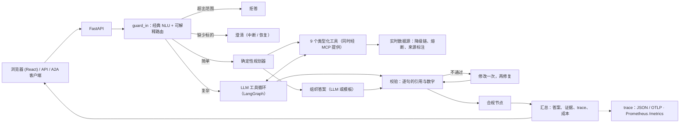

<div align="center">

<h1>FinSight</h1>

<h3>证据优先的 A 股研究 Agent。</h3>

<p>
  <a href="README.md"></a>
  <a href="README_CN.md"></a>
  <a href="LICENSE"></a>
  
  
  
  
</p>

</div>

---

FinSight 回答关于 A 股上市公司、基金、指数和宏观数据的问题。经典、可解释的 NLU 负责理解、守卫和路由；LLM 在 LangGraph 循环里编排类型化的取证工具；**答案里的每个数字都由代码对照它旁边引用的证据逐句核对**，最后由合规节点删除任何像投资建议的表述。没有 LLM Key 时，同一张图由确定性规划器完成回答。

<p align="center"></p>

## 为什么这样设计

| 决策 | 理由 | 位置 |
|---|---|---|
| 经典 NLU 路由，LLM 负责编排 | 路由和守卫必须可解释、便宜；LLM 只用在它有价值的地方（选工具、组织答案）。简单问题走固定流程，对比、归因、多跳问题交给 LLM 工具循环。 | `agent/router.py`、`agent/graph.py` |
| 逐句的数字校验 | 数字必须出现在**本句**引用的证据里，按单位和写出的精度匹配。不通过时让 LLM 修改一次，仍不通过就删除该子句。 | `agent/verifier.py` |
| 处处有确定性兜底 | 没有 Key、模型故障或预算耗尽时，降级到规划器 + 模板答案，依然有引用、依然经过校验。 | `agent/planner.py`、`agent/llm.py` |
| 证据是不可信数据 | 工具结果被包装、规范化并过滤注入指令；工具全部只读。 | `agent/injection.py` |

## 结果

全部数字都能用 [docs/agent-eval.md](docs/agent-eval.md) 中的命令复现。在线结果来自经网关调用的 DeepSeek V4.1 Flash，每个任务重复 3 次，成本为网关账单口径。

任务成功是「一票否决」口径：行为（回答/澄清/拒答）正确、每个必需事实都陈述**且**引用、调用了必需工具、判断类问题有限定语、全文没有交易指令，缺一不可。开发集 207 个任务 / 220 轮；保留集 53 个任务，在规则调优之后才编写。

| 回答路径 | 成功率（开发集） | 成功率（保留集） | pass^3（开发 / 保留） | 单任务成本（开发 / 保留） | P95 延迟（开发集） |
|---|---|---|---|---|---|
| 原 `/chat`，无 LLM | 0.256 | 0.189 | – | – | 1.0 s |
| 原 `/chat` + LLM 改写 | 0.440 | 0.679 | – | 未记录 | 13.4 s |
| 纯 LLM，不调工具 | 0.000 | 0.000 | 0.000 / 0.000 | $0.0009 / $0.0009 | 18.3 s |
| 确定性固定流程（无 LLM） | 0.981 | 0.849 | – | $0 | 0.8 s |
| 固定流程 + LLM 组织答案 | 0.979 | 0.906 | 0.976 / 0.906 | $0.0008 / $0.0007 | 16.7 s |
| **LLM Agent（工具循环）** | **0.986** | **0.956** | **0.971 / 0.906** | **$0.0016 / $0.0010** | 25.2 s |

纯 LLM 一题都过不了：它无法引用证据，报出的价格也无法核实。Prompt v2/v3 相比 v1 把 Agent 单任务成本降低 60%（原为 $0.0040），同时把保留集 pass^3 从 0.849 提到 0.906。

| 其他测量 | 结果 | 详情 |
|---|---|---|
| 校验器误放率（2,315 个被篡改的正确答案） | 35.0%（原来的整批比对）→ **2.8%**（逐句绑定）；公司之间互换数字 100% → **0.6%**；157 个正确答案仍全部通过 | [agent-eval.md](docs/agent-eval.md) |
| 提示注入红队（17 种攻击 × 4 种混淆，投毒到搜索结果） | 开发攻击集：三条路径 **0** 次成功（216 次运行）。未见过的保留攻击集：模板 0/64、LLM 组织答案 2/64、Agent 1/64，如实公开（见局限） | [agent-eval.md](docs/agent-eval.md) |
| 故障注入（超时、5xx、空数据、超大文档、LLM 宕机、畸形工具参数、无限循环） | 11/11 个场景平稳降级 | [agent-eval.md](docs/agent-eval.md) |
| 容器压测（固定流程，无 LLM） | 减少检查点写入后，单客户端 8.4 次/秒、P95 0.66 秒（原为 0.7 次/秒、P95 4.6 秒） | [performance.md](docs/performance.md) |
| 实时数据源审计（64 次探测） | 49 次成功；修复了错误的 M2 序列、停更的 CPI/PMI、始终为空的 PE/PB 和取不到的公告 | [data-sources.md](docs/data-sources.md) |

## 架构


```mermaid
flowchart LR
  U["浏览器 (React) / API / A2A 客户端"] --> API["FastAPI"]
  API --> G["guard_in：经典 NLU + 可解释路由"]
  G -->|超出范围| RF["拒答"]
  G -->|缺少标的| CL["澄清（中断 / 恢复）"]
  G -->|简单| WF["确定性规划器"]
  G -->|复杂| AL["LLM 工具循环（LangGraph）"]
  WF --> T["9 个类型化工具（同时经 MCP 提供）"]
  AL <--> T
  T --> DS["实时数据源：降级链、熔断、来源标注"]
  WF --> C["组织答案（LLM 或模板）"]
  AL --> V["校验：逐句的引用与数字"]
  C --> V
  V -->|不通过| RV["修改一次，再修复"] --> V
  V --> K["合规节点"] --> F["汇总：答案、证据、trace、成本"]
  F --> U
  F -.-> O["trace：JSON / OTLP · Prometheus /metrics"]
```

会话保存在 LangGraph checkpointer 中（内存、SQLite 或 Postgres），因此澄清可以暂停一次运行，任意副本都能接着对话。详见 [docs/zh/agent.md](docs/zh/agent.md)。

## 功能

- **Agent**：带理由的路由、并行工具调用、步数/工具/token 预算与运行截止时间、校验失败后一次 LLM 修改、指代消解与澄清中断、按节点设置推理强度、带熔断的模型容灾、按哈希锁定的版本化 Prompt。
- **取证工具**：实体解析、行情、技术指标、基本面、宏观指标、新闻、公告、知识检索、文档情感，每个都有 Pydantic schema、超时、重试、TTL 缓存和可操作的错误提示。
- **实时数据**：东方财富 → 新浪 → 腾讯 → 缓存 → 快照降级链，每个数据源独立熔断，每条记录标注来源与时效（`GET /sources/health`）。
- **协议**：工具经 MCP 提供；整个 Agent 经 A2A 1.0 提供（澄清对应 `input-required`）。
- **可观测性**：每次运行的 trace（节点、工具、LLM 调用、token、成本、Prompt 版本）、运行查看接口、OpenTelemetry 导出、Prometheus 指标。
- **网页前端**（React 19、TypeScript、Tailwind v4、Radix、Motion、Lightweight Charts）：流式执行时间线、与证据面板联动的引用标签（含时效）、价格图、运行成本与延迟、中英文、深色模式、移动端。
- **安全**：可选 API Key、限流、CORS、请求体上限、非 root 且根文件系统只读的容器。

<p align="center">
  
  
</p>

## 快速开始

```bash
pip install -r requirements.txt
uvicorn query_intelligence.api.app:create_app --factory --port 8765   # 打开 http://127.0.0.1:8765
```

没有 Key 时由确定性路径回答。启用 LLM Agent（任何 OpenAI 兼容接口均可）：

```bash
export DEEPSEEK_API_KEY=...                      # 只从环境变量读取，不要写进配置文件
export DEEPSEEK_BASE_URL=https://api.deepseek.com # 或网关，例如 https://api.cline.bot/api/v1
export DEEPSEEK_MODEL=deepseek-v4-flash
export QI_LLM_FALLBACK_MODELS=...                 # 可选：同一接口上的备用模型
```

实时行情、新闻、公告、宏观默认开启；设置 `QI_USE_LIVE_MARKET=0`（以及 `_NEWS`、`_ANNOUNCEMENT`、`_MACRO`）即使用随仓库提供的离线快照。

Docker 与 Kubernetes（多副本经 Postgres 共享会话、只读根文件系统）见 [docs/deployment.md](docs/deployment.md)。

```bash
docker build -f docker/Dockerfile -t finsight . && docker run -p 8000:8000 finsight
kubectl apply -f deploy/k8s/finsight.yaml
```

## API

| 接口 | 用途 |
|---|---|
| `POST /agent/chat`、`POST /agent/chat/stream`（SSE）、`POST /agent/resume` | 带证据、校验结果、trace id 和成本的 Agent 回答；节点事件流；澄清后恢复。 |
| `GET /agent/sessions/{id}`、`GET /agent/traces`、`GET /agent/traces/{id}` | 会话记忆、最近运行、完整 trace。 |
| `GET /.well-known/agent-card.json`、`POST /a2a` | A2A 服务卡片与 JSON-RPC 接口。 |
| `GET /metrics`、`GET /sources/health`、`GET /health` | Prometheus 指标、数据源状态、健康检查。 |
| `POST /chat` | 原聊天接口（`mode=workflow` 保持原流程；`agent`/`auto` 走 Agent）。 |
| `POST /nlu/analyze`、`POST /retrieval/search`、`POST /query/intelligence` | 经典 NLU 与检索产物。 |

Schema 位于 `schemas/agent_*.schema.json`，由 `query_intelligence/contracts.py` 生成。

## 评测与测试

```bash
python -m pytest -q tests                                  # 离线；CI 中关闭实时数据源
python -m evaluation.agent_eval.gate                       # 快照回放的开发集 + 保留集门槛
python -m evaluation.agent_eval.ablation --llm deepseek --repeats 3 --workers 6   # 在线消融
python -m evaluation.agent_eval.verifier_stress            # 校验器误放率
python -m evaluation.agent_eval.redteam --llm deepseek     # 提示注入红队
python -m evaluation.agent_eval.fault_injection            # 平稳降级
python -m scripts.load_test --base-url http://127.0.0.1:8000 --users 8
```

CI 包括：代码检查、前端检查（类型、lint、单测、可复现构建）、带 Postgres 服务的全量测试、评测门禁、Docker 构建与冒烟测试、Kubernetes 清单校验。

## 文档

| 主题 | 链接 |
|---|---|
| Agent 层：图、工具、记忆、API、配置 | [docs/zh/agent.md](docs/zh/agent.md) |
| 评测：任务集、在线消融、Prompt A/B、红队、校验器压力测试 | [docs/agent-eval.md](docs/agent-eval.md)（英文） |
| A2A、模型容灾、网关成本、监控指标 | [docs/a2a-and-observability.md](docs/a2a-and-observability.md)（英文） |
| 实时数据源 | [docs/data-sources.md](docs/data-sources.md)（英文） |
| 性能与压测 | [docs/performance.md](docs/performance.md)（英文） |
| 部署 | [docs/deployment.md](docs/deployment.md)（英文） |
| 设计复盘与取舍 | [docs/presentation/agent-design-notes.md](docs/presentation/agent-design-notes.md) |
| Agent 与 Prompt 工程实践调研 | [docs/research/agent-architecture-practices-2026.md](docs/research/agent-architecture-practices-2026.md)（英文） |
| Query Intelligence（经典 NLU 与检索） | [docs/zh/query-intelligence.md](docs/zh/query-intelligence.md) |
| 网页前端 | [docs/zh/frontend-chatbot.md](docs/zh/frontend-chatbot.md) |
| 全部文档 | [docs/zh/index.md](docs/zh/index.md) |

## 局限

- 在线评测只覆盖一个模型族（DeepSeek V4.1 Flash）。保留集也参与了 Prompt 版本选择，因此它是 Prompt 的验证集，而不是未触碰的测试集。
- 校验器检查数字是否来自所引证据；当一条证据包含多个报告期或指标时，它无法判断选对了哪一个。
- 指代消解基于规则；英文公司别名只覆盖 `data/runtime/alias_table.csv` 中已有的条目。
- 关键词注入过滤器对没见过的说法不泛化（保留攻击集拦截率 0%）；防护主要来自结构（只读工具、不可信数据信封、数字校验、合规节点）。投毒到新闻正文里的假数字能通过数字校验，因为它确实「在证据里」：校验证明的是可追溯，不是真实。
- 免费数据源会限流：审计时东方财富拒绝了本机连接，由降级链兜底。

## 安全声明

FinSight 只做证据汇总，不是投资顾问，不能作为交易决策的唯一依据。
