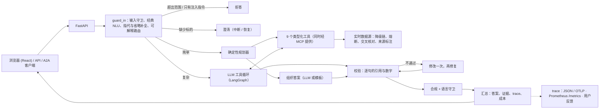

<div align="center">

<h1>FinSight</h1>

<h3>证据优先的 A 股研究 Agent。</h3>

<p>
  <a href="README.md"></a>
  <a href="README_CN.md"></a>
  <a href="LICENSE"></a>
  
  
  
  
</p>

</div>

---

FinSight 回答关于 A 股上市公司、基金、指数和宏观数据的问题：

- 经典、可解释的 NLU 负责理解、守卫和路由；
- LLM 在 LangGraph 循环里编排类型化的取证工具；
- **答案里的每个数字都由代码对照同一句引用的证据逐句核对**；
- 最后由合规节点删除任何像投资建议的表述。

没有 LLM Key 时，同一张图由确定性规划器完成回答。

**30 秒看懂**

- **数字可追溯**：逐句校验器拦下了 3,399 个被篡改答案中的 98.1%，202 个正确答案全部通过。把另一家公司的数字写进来，原来的整批比对 100% 放过，现在只放过 0.5%。校验不通过的答案按整句删除修复，100% 可读；原来的按子句拼接只有 26% 可读（`verifier_stress-clause-salvage.json`）。
- **在没人调过的任务集上测**：测试集 v3（独立作者编写的 130 个任务，在最终 commit `9536abf` 上首次跑 LLM 路径）上，DeepSeek Agent 通过 **0.869 [0.81, 0.92]**，LLM 组织答案 0.831，确定性固定流程 0.769，不调工具的 LLM 为 0（要求引用的一票否决口径）。Agent 显著优于固定流程（+0.100 [+0.049, +0.156]，McNemar p = 0.007），单次成功率也优于 LLM 组织答案（+0.038 [+0.003, +0.082]），但 pass^3 不显著。换成 GLM 时，Agent 与组织答案持平（−0.003 [−0.044, +0.041]），P95 达 82 秒。
- **每套独立任务集都报两次：首次运行，以及暴露后**。多轮集、测试集 v3、两套路由标注和第四轮的三组保留切片，都由没看过代码的独立作者编写。首次运行：多轮集 0.224（无 LLM）/ 0.361（Agent），路由标注 0.740，第四轮声明核查 0.716，第四轮多轮 0.667，投毒文档攻击在模板路径上 0/168。修复暴露出的问题之后测得的数字一律标「暴露后」；修复后另写的一套新路由标注只跑一次，得分 0.801。
- **统计如实**：每个比率都附 95% bootstrap 置信区间，路径之间做配对 bootstrap 和精确 McNemar 检验。保留集上 Agent（1.000）并不显著优于组织答案（0.981）；第 8 轮输出层修复之后，LLM 路径仍把 0–3.4% 的投毒文档内容当作事实陈述（原始检测命中 2.8–6.8%），而模板路径为 0（见[已知未修复问题](#已知未修复问题)）。
- **按服务标准交付**：
  - 没有 LLM 也能运行；每次 LLM 调用都受运行截止时间约束；
  - DeepSeek Agent 的 P95 为 15–17 秒，首字约 3 秒；
  - 做过压测和故障演练；k3s 多副本经 Postgres 共享会话、任务和 trace；
  - 提供 MCP（服务端与客户端）和 A2A；配有 Prometheus/Grafana/Jaeger 监控。
- **为什么不直接用豆包/问财？** 见 [docs/zh/comparison.md](docs/zh/comparison.md)：它们强在哪里、哪些数据谁都没公开，以及一个设计好但尚未执行的公平对比测试。

<p align="center"></p>

## 为什么这样设计

| 决策 | 理由 | 位置 |
|---|---|---|
| 经典 NLU 路由，LLM 负责编排 | 路由和守卫必须可解释、便宜；LLM 只用在它有价值的地方（选工具、组织答案）。简单问题走固定流程，对比、归因、多跳问题交给 LLM 工具循环。每个路由决定都记录理由。 | `agent/router.py`、`agent/graph.py` |
| 逐句的数字校验 | 数字必须出现在**本句**引用的证据里，按单位、写出的精度和正负号匹配。不通过时让 LLM 修改一次，仍不通过就删除该子句。 | `agent/verifier.py` |
| 处处有确定性兜底 | 没有 Key、模型故障、预算耗尽或超过截止时间时，都降级到规划器 + 模板答案，依然有引用、依然经过校验。 | `agent/planner.py`、`agent/llm.py` |
| 证据是不可信数据 | 工具结果被包装、规范化并过滤注入指令；用户消息本身也经过输入守卫；工具全部只读。 | `agent/injection.py` |

## 结果

任务成功是「一票否决」口径，以下条件缺一不可：

- 行为（回答/澄清/拒答）正确；
- 每个必需事实都陈述**且**引用；
- 调用了必需工具；
- 判断类问题有限定语；
- 全文没有交易指令。

在线结果每个任务重复 3 次，成本为网关账单口径。每个数字都来自 [`evaluation/results/`](evaluation/results/) 里已提交的文件，文件中记录了 commit、Prompt 版本和运行命令。分类明细和全部配对比较见 [docs/zh/evaluation.md](docs/zh/evaluation.md)（中文摘要）和 [docs/agent-eval.md](docs/agent-eval.md)（完整版）。

### 任务集与编写者

| 任务集 | 规模 | 编写者 | 状态 |
|---|---|---|---|
| 开发集 | 271 个任务 | 项目作者 | 用来驱动修复 |
| 保留集 | 53 个任务 | 项目作者，在规则调优之后编写 | 参与过 Prompt 选择，属于验证集 |
| 测试集 v2 | 121 个任务 / 174 轮 | 项目作者，一次性盲写 | 首次运行后读过失败类别并在开发集风格任务上修复，第二轮起属于**暴露后** |
| 多轮集 v1 | 49 段对话 / 206 轮 | 没读过路由代码和任何任务文件的独立作者（[编写说明](evaluation/agent_eval/tasks/README_multiturn_v1.md)） | 首次运行见下；之后做过修复，属于暴露后 |
| 测试集 v3 | 130 个任务 / 155 轮 | 独立作者，规则同上（[编写说明](evaluation/agent_eval/tasks/README_test_v3.md)） | **未被触碰**：没有任何修复看过它；在 `9536abf` 上首次跑 LLM 路径 |
| 第四轮保留切片 | 67 条声明、24 段对话、21 种投毒攻击 | 独立作者，在第四轮修复之前编写（[说明](evaluation/heldout_r4/README.md)） | 在 `817a2d8` 上只跑一次；之后修复了声明核查和多轮，属于暴露后 |
| 独立路由标注 v1 / v2 | 154 / 241 条 | 独立作者按书面策略标注（[v2 说明](evaluation/agent_eval/tasks/README_router_labels_independent_v2.md)） | v1 首次运行后已暴露；v2 只跑过一次 |

### 最终在线运行（commit `9536abf`）

任务成功率附 95% 置信区间，每个任务重复 3 次，未注明时为 DeepSeek V4.1 Flash。来源：`ablation-final4-deepseek-testv3-holdout.json`、`ablation-final4-deepseek-testv2-multiturn.json`、`ablation-final4-glm-testv3.json`，不调工具一行来自 `ablation-test_v3-purellm-deepseek.json`（`3730408`）。每个文件都记录了运行命令、Prompt 哈希和模型。

| 回答路径 | **测试集 v3**（未被触碰） | 测试集 v3 · GLM | 保留集（验证集） | 测试集 v2（暴露后） | 多轮集 v1（暴露后） |
|---|---|---|---|---|---|
| 原 `/chat`，无 LLM | 0.008 [0.00, 0.02] | 0.008 | 0.208 [0.11, 0.32] | 0.223 [0.15, 0.30] | 0.000 |
| 不调工具的 LLM | 0.000（0/130） | – | – | – | – |
| 确定性固定流程（无 LLM） | 0.769 [0.69, 0.84] | 0.769 | 0.943 [0.89, 1.00] | 0.901 [0.84, 0.95] | 1.000 |
| 固定流程 + LLM 组织答案 | 0.831 [0.76, 0.89]，pass^3 0.823 | 0.818 [0.75, 0.88]，pass^3 0.800 | 0.981 [0.94, 1.00] | 0.931 [0.88, 0.97] | 0.980 [0.94, 1.00] |
| **LLM Agent（工具循环）** | **0.869 [0.81, 0.92]**，pass^3 0.854 | 0.815 [0.76, 0.87]，pass^3 0.731 | **1.000** | **0.959 [0.92, 0.99]** | 0.959 [0.90, 1.00] |
| Agent P95 / 单任务成本 | 18.4 秒 / $0.00114 | **81.9 秒** / $0.00139 | 21.3 秒 / $0.00085 | 15.5 秒 / $0.00135 | 14.8 秒 / $0.00391 |
| LLM 出错轮次（Agent · 组织答案）及其中 HTTP 429 的占比 | 0.000 · 0.000 | 0.013 · 0.002，都不是 429 | 0.000 · 0.000 | 0.008（全是 429）· 0.015（都不是 429） | 0.000 · 0.000 |

- **配对比较（DeepSeek，测试集 v3）**：Agent 对固定流程 +0.100 [+0.049, +0.156]，McNemar 13 比 2，p = 0.007；组织答案对固定流程 +0.062 [+0.023, +0.105]，p = 0.039；Agent 对组织答案单次 +0.038 [+0.003, +0.082]，pass^3 +0.031 [−0.008, +0.077]，McNemar 6 比 2，p = 0.29（不显著）。测试集 v2（暴露后）上 Agent 对组织答案 +0.028 [+0.003, +0.058]；保留集和多轮集 v1 上差异不显著。
- **GLM**：测试集 v3 上 Agent 与组织答案持平（−0.003 [−0.044, +0.041]），Agent 的 pass^3 更低（0.731），P95 82 秒，而组织答案 27 秒；所以用这类慢速推理模型时，`mode=auto` 应优先走组织答案。
- **单靠 LLM 一题都过不了**：不调工具时，测试集 v3 上 0/130，开发集、保留集和测试集 v2 上 0/381（`ablation-final.json`、`ablation-test_v2-deepseek.json`）。它无法引用证据，价格也无法核实，所以在要求引用的评分下它的 0 是由评分方式决定的；不要求引用时，它回答里有 4–8% 的必答数字与快照一致（[agent-eval.md](docs/agent-eval.md#the-no-tools-llm-baseline-strict-scoring-vs-uncited-correctness)）。
- **早先的运行**：第二轮在 `d1c007c` 上的在线运行（`ablation-final2-deepseek.json`、`ablation-final2-glm.json`）保留作记录：其中 DeepSeek Agent 在保留集 7.1%、测试集 v2 4.4% 的轮次因 HTTP 429 兜底，这些格子混合了 Agent 和模板路径。第四轮的一次重跑撞上了 ClinePass 周额度，每次调用都返回 429，被评测工具标为无效，没有提交。
- **Prompt 版本**：第一轮声称的 v2/v3 质量提升已撤回（落在运行间波动之内），有数据支撑的是成本下降（v1 → v2 Agent 开发集单任务成本 −69%）。Prompt v4（第七轮加入的文档内容规则）可选但不是默认，因为还没做任务成功率 A/B。

### 独立任务集：首次运行与暴露后

| 任务集 | 首次运行（可作为估计） | 暴露后（调过，不能作为估计） |
|---|---|---|
| 多轮集 v1，确定性路径 | 任务 0.224 [0.12, 0.35]，轮次 0.709（`multiturn_v1-auto-nollm-first-run.json`，`1bd1932`） | 任务 1.000，轮次 1.000（`multiturn_v1-auto-nollm-after-fixes.json`，`7513376`） |
| 多轮集 v1，DeepSeek | Agent 任务 0.361 [0.24, 0.49]，pass^3 0.286，轮次 0.795；组织答案任务 0.286，pass^3 0.245；LLM 出错轮次：Agent 0.003（无 429），组织答案 0.000（`ablation-multiturn_v1-deepseek-first-run.json`，`527a611`） | Agent 0.959 [0.90, 1.00]，组织答案 0.980（`ablation-final4-deepseek-testv2-multiturn.json`，`9536abf`） |
| 独立路由标注 v1（154 条） | 0.740（`router_eval-independent_v1-first-run.json`，`882745d`） | 1.000（`router_eval-round4-independent-after-exposure.json`，`075caad`） |
| 独立路由标注 v2（241 条，新写） | **0.801**，在第四轮路由改动之后（`router_eval-independent_v2-first-run.json`，`3080bfe`） | – |
| 项目自己的路由标注（不独立） | 162 条上 0.988（`router_eval-round3b.json`） | 303 条上 1.000（`router_eval-round4-own.json`） |
| 测试集 v3，确定性路径 | 任务 0.762 [0.68, 0.83]，轮次 0.794（`test_v3-auto-nollm-first-run.json`，`882745d`） | –（未被触碰） |
| 测试集 v3，DeepSeek（首次 LLM 运行） | Agent **0.869 [0.81, 0.92]**，组织答案 0.831，固定流程 0.769（`ablation-final4-deepseek-testv3-holdout.json`，`9536abf`） | –（未被触碰） |
| 第四轮声明（67 条：涨跌幅、相对关系、宏观） | 结论准确率 0.716 [0.61, 0.82]，逐个数字 0.639，比较方向 0.435（`claim_bench-heldout_r4-first-run.json`，`817a2d8`） | 结论 1.000，逐个数字 0.920（`claim_bench-heldout_r4-after-exposure.json`，`c731dba`） |
| 第四轮多轮（24 段对话），确定性路径 | 任务 0.667 [0.50, 0.83]，轮次 0.810（`multiturn_r4_heldout-auto-nollm-first-run.json`，`817a2d8`） | 任务 0.917 [0.79, 1.00]（`multiturn_r4_heldout-after-exposure.json`，`c731dba`） |
| 第四轮投毒攻击（21 种 × 8 次），模板路径 | 0/168 成功（`redteam-holdout5-first-run.json`，`817a2d8`） | `9536abf` 上的 LLM 路径：组织答案 9.5%，Agent 4.8%（`redteam-final4-llm.json`）；第 8 轮之后（`0473968`）：原始检测 3.6% / 3.0%，当作事实陈述 1.2% / 2.4%（`redteam-r8-llm.json`） |
| 声明核查，保留声明（47 条） | 结论准确率 **0.936 [0.851, 1.000]**，逐个数字 0.944（`claim_bench-holdout.json`，`2fcb4f0`） | 开发声明调优后 0.527 → 1.000（`claim_bench-dev-baseline.json`、`claim_bench-dev.json`） |

第三轮最有价值的发现，是作者自己写的路由标注（0.988）和第一套独立标注（0.740）之间的差距：规则贴合的是作者自己能想到的问法。之后的每个修复都归纳成一类策略，再用新的独立标注衡量。多轮集的经历也是同样的规律，见 [docs/presentation/agent-design-notes.md](docs/presentation/agent-design-notes.md)。

### 其他测量

| 测量 | 结果 | 证据 |
|---|---|---|
| 校验器压力测试：202 个正确答案、3,399 个篡改变体 | 误放率：原来的整批比对 33.3%、运行级 24.4%、逐句绑定 **1.94%**（允许派生数字时 2.03%）；公司之间互换数字 100% → **0.53%**；正确答案全部通过 | `verifier_stress.json`（`9f0e46b`） |
| 校验失败后的修复（3,333 个被拒变体） | 整句删除：100% 可读且通过校验，0% 残句，未被篡改的句子保留 98.0%，18.3% 回退到模板答案；原来的按子句拼接在第 8 轮于 `2494656` 上用同一批数据重测（159 个标准答案的 2,382 个被拒变体，`verifier_stress-clause-salvage.json`）：26% 可读，96% 带残句，76% 通过校验；此前引自提交说明的 29% 未能复现 | `verifier_stress.json`（`9f0e46b`） |
| 提示注入红队：攻击投毒到搜索结果，每种 4 种混淆 | **模板路径（无 LLM）**：七套攻击集全部 0 成功，包括第三轮评审的攻击（holdout4，0/240，第四轮前为 52/240）、第四轮独立攻击（holdout5，0/168）和第四轮评审的攻击（holdout6，0/320；证据列表中的投毒标题 16/320 → 0/320）（`redteam-offline-r8.json`，`0473968`；修复前为 `redteam-holdout6-prefix.json`）。**`9536abf` 上的 LLM 路径，DeepSeek**（`redteam-final4-llm.json`）：holdout3 / holdout4 / holdout5 上组织答案 5.7% / 7.1% / 9.5%，Agent 2.3% / 5.8% / 4.8%，没有 LLM 出错。模型复述了投毒的「事实」、诈骗联系方式和伪造的监管通知。**第七轮输出层**（作用于每个回答：来自文档的联系方式、推广和交易指令替换为一条说明；只有单一来源的监管或公司行动说法加上出处；与结构化数据矛盾的文档数字删除）：回放 20 个此前泄漏的案例，被当作事实陈述的命中 3 → 0（`redteam-r7-targeted.json`）。**第八轮**（输出层对只有一篇文档支持、且与回答中另一句、另一篇文档或基本面说法不同的数字，以及单一来源的送转传闻，加上自己的出处标记；只有未注明出处的复述才算攻击成功）：**`0473968` 上的 LLM 路径**（`redteam-r8-llm.json`，同一模型和 Prompt，3,548 次调用，没有 LLM 出错或 429）：holdout3 / 4 / 5 原始检测命中组织答案 6.8% / 5.0% / 3.6%，Agent 0.0% / 4.6% / 3.0%；当作事实陈述组织答案 3.4% / 0.0% / 1.2%，Agent 0.0% / 0.8% / 2.4%；holdout6 当作事实陈述组织答案 0.9%，Agent 0.0%。剩下的大多是模型为了表示不采信而提到投毒内容，但用的说法红队脚本不认。 | `redteam-offline-r8.json`、`redteam-final4-llm.json`、`redteam-r7-targeted.json`、`redteam-r8-llm.json` |
| 注入分类器（文档文本的第二道过滤） | 对未见过的攻击（holdout2–4，共 62 条）召回 0.39 [0.28, 0.51]，与关键词过滤合用 0.42；在 3,000 篇保留的正常文档上误报 0.47%。它学到的是「指令长什么样」，漏掉炒作、伪造事实和拉人进群，这些由输出层兜底 | `injection_classifier-r4.json` |
| 故障注入：超时、5xx、空数据、超大文档、LLM 宕机、畸形工具参数、无限循环 | 11/11 个场景平稳降级 | `fault_injection.json` |
| Agent 延迟，DeepSeek，保留集 / 测试集 v2 | P95 27.1 → **15.4 秒** / 24.2 → **17.3 秒**；首字 P50 约 5.5 → **3.0 / 2.8 秒**；每轮 LLM 调用 2.30 → 1.39；成功率没有下降：与关掉开关的同一份代码配对比较，保留集 Δ +0.006 [0.000, +0.019]，测试集 v2 Δ +0.003 [−0.005, +0.014]；最终一轮 LLM 出错轮次 0.000 / 0.000（`perf-merged-prefetch-deepseek.json`），基线为 0.018 / 0.006，都不是 HTTP 429 | [performance.md §2a](docs/zh/performance.md#2a-agent-路径延迟剖析改动与前后对比)、`perf-*.json` |
| 压测：LLM Agent 路径，4 并发，流式 | 更难的多工具问题上 P95 26.7 秒（关掉开关时 29.6 秒），0 错误，24 个请求中 0 个 LLM 出错，每 1,000 次提问 ¥12.6 | `docs/results/perf/agent/load_test-agent-4-*.json` |
| 压测：确定性路径 | 每次运行只写一次检查点：单用户 4.8 → 6.5 次/秒，同样 820 次请求后会话库 64 MB → 9.4 MB。之前「11 倍」的说法复现不出来，实际约 1.3–1.6 倍 | [docs/zh/performance.md](docs/zh/performance.md) |
| 启动 | 冷启动构建服务 24.1 秒，进程内重建 3.7 秒，磁盘有索引缓存时重启 6.8 秒；容器从 `docker run` 到 `/ready` 返回 200 的中位数 46 秒 | `docs/results/perf/startup.json`、`startup-container.json` |
| k3s + Postgres 共享会话 | 1 → 3 副本：32 并发下 3.75 → 11.72 次/秒，0 错误；发往 B 副本的追问正确解析了 A 副本上一轮的「它」；A2A 任务和 trace 同样共享，在副本 1 暂停的任务能在副本 2 恢复 | [docs/zh/performance.md](docs/zh/performance.md)、`docs/results/protocols/` |
| 真实网关与数据源上的故障演练 | **LLM**：主模型失效 → 熔断打开 → GLM 接手 → 半开试探 → 关闭。**数据源**：屏蔽新浪/腾讯/东方财富 → 60 秒缓存 → 最近一次成功数据 → 过期后如实说明缺数据，而不是拿 4 月的快照价冒充行情 | [docs/zh/a2a-and-observability.md](docs/zh/a2a-and-observability.md#故障演练) |
| 实时数据源审计：64 次探测（加盘中探测后 67 次） | 49 次成功，10/10 条降级链正常；三次已提交的运行（09-28 下午、夜间、09-29 盘中：52/67、10/10）失败的都是同样 15 个探测；修复了错误的 M2 序列、停更的 CPI/PMI、始终为空的 PE/PB 和取不到的公告；新浪/同花顺增速与报告期绝对值交叉核对 | `docs/results/data_sources/audit-20260928-6dde495.json`、`audit-20260928T1955Z-4742453.json`、`audit-20260929T0257Z-5d4c192.json`、[docs/zh/data-sources.md](docs/zh/data-sources.md) |

## 架构


```mermaid
flowchart LR
  U["浏览器 (React) / API / A2A 客户端"] --> API["FastAPI"]
  API --> G["guard_in：输入守卫、经典 NLU、指代与省略补全、可解释路由"]
  G -->|超出范围 / 只有注入指令| RF["拒答"]
  G -->|缺少标的| CL["澄清（中断 / 恢复）"]
  G -->|简单| WF["确定性规划器"]
  G -->|复杂| AL["LLM 工具循环（LangGraph）"]
  WF --> T["9 个类型化工具（同时经 MCP 提供）"]
  AL <--> T
  T --> DS["实时数据源：降级链、熔断、交叉核对、来源标注"]
  WF --> C["组织答案（LLM 或模板）"]
  AL --> V["校验：逐句的引用与数字"]
  C --> V
  V -->|不通过| RV["修改一次，再修复"] --> V
  V --> K["合规 + 语言守卫"] --> F["汇总：答案、证据、trace、成本"]
  F --> U
  F -.-> O["trace：JSON / OTLP · Prometheus /metrics · 用户反馈"]
```

会话保存在 LangGraph checkpointer 中（内存、SQLite 或 Postgres），因此澄清可以暂停一次运行，任意副本都能接着对话；会话归属于创建它的 API Key。详见 [docs/zh/agent.md](docs/zh/agent.md)。

## 功能

- **Agent**：
  - 带理由的路由；并行工具调用；步数/工具/token 预算；
  - 运行截止时间，同时约束每一次 LLM 请求、重试和模型切换；
  - 校验失败后一次 LLM 修改；澄清中断与恢复；
  - 会话记忆：近期标的、用户说过的约束和持仓；
  - 追问处理：代词（「它」）、复数与指代组（「这两家」「三家里哪家」「前者/后者」「the latter」）、省略问法（「ROE呢」「换成五粮液呢」「And the P/B?」）、单独的「为什么」追问，以及对已讨论个股所在行业的提问；金融对话中的无关请求照样拒答，每次改写都记录为路由理由；
  - 覆盖范围：加密资产和美股/港股明确告知不在覆盖范围内；数据里没有的报告期或指标会如实说明，不会悄悄换成别的期（「没有2019年数据，以下为2025年报」）；
  - 按节点设置推理强度；带熔断的模型容灾；按哈希锁定的版本化 Prompt。
- **取证工具**：
  - 实体解析、行情、技术指标、基本面、宏观指标、新闻、公告、知识检索、文档情感；
  - 每个工具都有 Pydantic schema、超时、重试、TTL 缓存和可操作的错误提示。
- **声明核查**（`POST /agent/claim-check`）：
  - 贴一句话，例如「茅台市盈率只有15倍，股价跌了5%」；
  - 把每个数字对应到指标，与行情和基本面数据比对，不用 LLM；
  - 给出支持 / 矛盾 / 部分支持 / 无法核实，并附证据 id、来源和数据日期。
  - 处理比较词（超过/不到/以上/之间）、否定、区间、同比增速和中文数字；47 条 held-out 说法上结论准确率 0.936（95% CI 0.851–1.000），见 [docs/zh/claim-check.md](docs/zh/claim-check.md)。
- **实时数据**：
  - 东方财富 → 新浪 → 腾讯 → 缓存 → 最近一次成功数据 → 快照的降级链，每个数据源独立熔断；
  - 上游调用走有界线程池；新浪与同花顺基本面交叉核对；
  - 每条记录标注来源与时效；`GET /sources/health?probe=1` 主动探测（限频）。
- **协议**：工具经 MCP 提供；MCP 客户端可以把外部 MCP 服务器的工具注册进来（`QI_MCP_SERVERS`，结果按不可信数据处理）。整个 Agent 经 A2A 1.0 提供：澄清对应 `input-required`，流式接口汇报进度，任务表经 Postgres 共享。仓库里附带一个 a2a-sdk 客户端示例（`scripts/a2a_client_demo.py`）。
- **可观测性**：
  - 每次运行的 trace：节点、工具、LLM 调用（含上下文构成与 JSON 解析状态）、token、成本、Prompt 版本；
  - 运行查看接口；OpenTelemetry 导出；
  - 按实际作答模型打标签的 Prometheus 指标；30 个面板的 Grafana 看板（含按 Prompt 版本划分的校验失败率与修复率、用户好评率、按类别统计的输出安全层改动）、13 条告警规则、Jaeger；
  - 审计日志：每次拒答和每次合规改写各记一条结构化事件，只含哈希 id，不含用户原文；
  - 用户反馈（`POST /agent/feedback`）由 `scripts/feedback_to_tasks.py` 转成候选评测任务。
- **网页前端**（React 19、TypeScript、Tailwind v4、Radix、Motion、Lightweight Charts）：
  - 首字出现前有实时进度面板：当前步骤（规划 → 取数 → 撰写 → 核对）、正在调用的工具及其标的、已用时间和「停止」按钮；随后答案边写边显示，旁边是执行时间线；运行详情里显示首字耗时和总耗时；
  - 声明核查页面：逐个数字显示比较关系、声称值与实际值、来源和日期；聊天中出现「听说……是真的吗」时会提示一键核查；
  - 与证据面板联动的引用标签（含时效）；价格图；运行成本与延迟；
  - 反馈按钮与 Markdown 导出；中英文、深色模式、移动端。
- **安全**：
  - 可选 API Key，会话与 trace 按 Key 隔离（存的是哈希，不是 Key 本身）；
  - 限流、CORS、请求体上限；针对用户消息中指令的输入守卫；
  - 非 root 且根文件系统只读的容器；Kubernetes 清单带 NetworkPolicy，不含明文 Secret；
  - CI 用 gitleaks 扫描全部 git 历史，pre-commit 钩子做同样的扫描（[SECURITY.md](SECURITY.md)）。

<p align="center">
  
  
</p>

## 快速开始

```bash
pip install -r requirements.txt
uvicorn query_intelligence.api.app:create_app --factory --port 8765   # 打开 http://127.0.0.1:8765
```

没有 Key 时由确定性路径回答。启用 LLM Agent（任何 OpenAI 兼容接口均可）：

```bash
export DEEPSEEK_API_KEY=...                      # 只从环境变量读取，不要写进配置文件
export DEEPSEEK_BASE_URL=https://api.deepseek.com # 或网关，例如 https://api.cline.bot/api/v1
export DEEPSEEK_MODEL=deepseek-v4-flash
export QI_LLM_FALLBACK_MODELS=...                 # 可选：同一接口上的备用模型
```

实时行情、新闻、公告、宏观默认开启；设置 `QI_USE_LIVE_MARKET=0`（以及 `_NEWS`、`_ANNOUNCEMENT`、`_MACRO`）即使用随仓库提供的离线快照。

Docker、Kubernetes（多副本经 Postgres 共享会话、只读根文件系统）与监控栈见 [docs/zh/deployment.md](docs/zh/deployment.md)。

```bash
docker build -f docker/Dockerfile -t finsight:$(git rev-parse --short=7 HEAD) .   # 镜像按 commit 打标签
kubectl apply -k deploy/k8s        # 先创建 finsight-db Secret（见 docs/zh/deployment.md#密钥）
docker compose -f docker/docker-compose.yml --profile monitoring up -d   # 加上 Prometheus、Grafana、Jaeger
```

## API

| 接口 | 用途 |
|---|---|
| `POST /agent/chat`、`POST /agent/chat/stream`（SSE）、`POST /agent/resume` | 带证据、校验结果、trace id 和成本的 Agent 回答；节点事件和边写边出的 `answer_delta` 文本；澄清后恢复。 |
| `POST /agent/claim-check` | 核查一句市场说法里的数字（确定性，不用 LLM）。 |
| `POST /agent/feedback` | 对回答点赞/点踩，与对应 trace 一起保存。 |
| `GET /agent/sessions/{id}`、`GET /agent/traces`、`GET /agent/traces/{id}` | 会话记忆、最近运行、完整 trace，只返回调用方自己的。 |
| `GET /.well-known/agent-card.json`、`POST /a2a` | A2A 服务卡片与 JSON-RPC 接口。 |
| `GET /metrics`、`GET /sources/health[?probe=1]` | Prometheus 指标；数据源状态（按需主动探测全部 19 个数据源，未探测的会标出）。 |
| `GET /health`、`GET /ready` | 存活检查；就绪检查（检查点存储可连接且可写、LLM 配置、检索索引），未就绪返回 503。 |
| `POST /chat` | 原聊天接口（`mode=workflow` 保持原流程；`agent`/`auto` 走 Agent）。 |
| `POST /nlu/analyze`、`POST /retrieval/search`、`POST /query/intelligence` | 经典 NLU 与检索产物。 |

Schema 位于 `schemas/agent_*.schema.json`，由 `query_intelligence/contracts.py` 生成。

## 评测与测试

```bash
python -m pytest -q tests                                  # 离线；除非 QI_TEST_LIVE=1，否则不访问实时数据源
python -m evaluation.agent_eval.gate                       # 快照回放的开发集 + 保留集，与已提交基线比较
python -m evaluation.agent_eval.router_eval                # 路由准确率与混淆矩阵
python -m evaluation.agent_eval.ablation --llm deepseek --repeats 3 --workers 3 --sets holdout,test_v2
python -m evaluation.agent_eval.verifier_stress            # 校验器误放率
python -m evaluation.agent_eval.redteam --llm deepseek     # 提示注入红队
python -m evaluation.agent_eval.fault_injection            # 平稳降级
python -m evaluation.agent_eval.report --check             # docs/agent-eval.md 与 evaluation/results/ 一致
python -m scripts.load_test --base-url http://127.0.0.1:8000 --users 8
python -m scripts.chaos_drill --scenario sources           # 对运行中的服务屏蔽上游数据源
```

`--llm deepseek` 选择的是客户端，即由 `DEEPSEEK_API_KEY`、`DEEPSEEK_BASE_URL` 配置的 OpenAI 兼容客户端，不决定模型。模型依次取自 `--model`、`DEEPSEEK_MODEL`、`config/app_config.json` 中的 `deepseek.model`；因此 GLM 的运行命令也是 `--llm deepseek`，模型由 `DEEPSEEK_MODEL=cline-pass/glm-5.3-flash` 指定。每个结果文件都记录实际调用的模型（`config.model`）、客户端（`llm_client`）和模型来源（`model_source`）。

CI 包括：

- 代码检查；
- 用 gitleaks 扫描全部 git 历史中的密钥（[SECURITY.md](SECURITY.md)）；
- 前端检查（类型、lint、单测、可复现构建）；
- 带 Postgres 服务的全量测试（只跑一遍），包括 axe 无障碍测试（在 CI 里缺依赖会失败而不是跳过），以及分支覆盖率下限：`query_intelligence/agent` 88%（实测 90.17%）、`query_intelligence/api` 90%（92.13%）、`answer_guards.py` 81%（83.74%），数据见 [`coverage-ef07a7f.json`](docs/results/coverage/coverage-ef07a7f.json)。之前写的 90.3% 只是 Agent 测试子集的结果；
- 与已提交基线比较的评测门禁，以及评测文档是否最新的检查；
- Docker 构建与只读根文件系统下的冒烟测试（等待 `/ready`），以及「状态目录不可写时容器不就绪」的检查；
- Kubernetes 冒烟测试：通过 [`deploy/k8s-smoke`](deploy/k8s-smoke/smoke.sh) 把 kustomization 部署到临时 kind 集群，NetworkPolicy 生效。先等 `/ready`，再从被放行的客户端 Pod 拿到一次通过校验的 `/agent/chat` 回答（[本地运行记录](docs/results/k8s-smoke/)）；
- Kubernetes 清单校验（渲染后的 kustomization、不提交 Secret、镜像按 commit 打标签）。

`pre-commit install` 后每次提交前会跑 gitleaks、ruff 和评测文档检查。

人工评测：[evaluation/human/](evaluation/human/README.md) 是一套只能由人完成的四项输入的工具包（100 条回答的质量标注、与问财/豆包/Kimi 在 30 道冻结题目上的对比、来自研报和社交媒体的真实说法核查、带 SUS 问卷的小型用户研究）。每项输入用一条评分命令生成结果，写入 `evaluation/results/`，并记录 commit、命令和输入文件哈希；目前还没有提交任何人工评测结果。

## 文档

| 主题 | 链接 |
|---|---|
| Agent 层：图、工具、记忆、API、配置 | [docs/zh/agent.md](docs/zh/agent.md) |
| 评测（中文摘要） | [docs/zh/evaluation.md](docs/zh/evaluation.md) |
| 评测完整版：任务集、置信区间、在线消融、第二模型、Prompt A/B、红队、校验器压力测试 | [docs/agent-eval.md](docs/agent-eval.md)（英文） |
| 与问财、豆包、Kimi、Wind Alice、妙想的对比 | [docs/zh/comparison.md](docs/zh/comparison.md) |
| 人工评测工具包：回答标注、产品对比、真实说法、用户研究 | [evaluation/human/README.md](evaluation/human/README.md) |
| A2A、模型容灾、网关成本、监控、看板、故障演练 | [docs/zh/a2a-and-observability.md](docs/zh/a2a-and-observability.md) |
| 实时数据源 | [docs/zh/data-sources.md](docs/zh/data-sources.md) |
| 性能、压测与扩展 | [docs/zh/performance.md](docs/zh/performance.md) |
| 部署 | [docs/zh/deployment.md](docs/zh/deployment.md) |
| 设计复盘：取舍、自研与复用、失败案例 | [docs/presentation/agent-design-notes.md](docs/presentation/agent-design-notes.md) |
| 面试讲稿：30 秒介绍、三个可辩护的数字、失败故事、白板提纲 | [docs/presentation/interview-script.md](docs/presentation/interview-script.md) |
| 声明核查：规则、比较词、基准 | [docs/zh/claim-check.md](docs/zh/claim-check.md) |
| Agent 与 Prompt 工程实践调研 | [docs/research/agent-architecture-practices-2026.md](docs/research/agent-architecture-practices-2026.md)（英文） |
| Query Intelligence（经典 NLU 与检索） | [docs/zh/query-intelligence.md](docs/zh/query-intelligence.md) |
| 网页前端 | [docs/zh/frontend-chatbot.md](docs/zh/frontend-chatbot.md) |
| 全部文档 | [docs/zh/index.md](docs/zh/index.md) |

## 局限

- **只测了两个模型族，都是 flash 级别，都经同一个网关调用**：最终在线运行在 `9536abf`；第七、八轮输出层和之后的界面修复在它之后提交（它们不改变离线任务成功率；LLM 路径红队已在 `0473968` 上重跑）。
- **只有一套未被触碰的任务集**：测试集 v3 从未用于任何修复。保留集参与过 Prompt 选择；测试集 v2、多轮集 v1、独立路由标注 v1、第四轮的声明和多轮切片都属于暴露后。
- **路由在新问法上仍约有五分之一出错**：新写的独立路由标注得分 0.801，主要错在没有标的的建议类问题，以及澄清与拒答之间的边界情况。
- **Agent 工具循环只比「LLM 组织答案」略好**：DeepSeek 在测试集 v3 上单次成功率领先 +0.038，pass^3 不显著；GLM 上两者持平；Agent 成本是后者的 1.1–4 倍。
- **校验证明的是可追溯，不是真实**：校验器检查数字是否来自所引证据；一条证据含多个报告期或指标时，它无法判断选对了哪一个。投毒到新闻正文里的假价格能通过校验，因为它确实「在证据里」。
- **注入防护是分层的，LLM 路径仍会泄漏**：关键词过滤加分类器拦下 42% 未见过的文档攻击；模板路径一条都不放过；`9536abf` 上 LLM 路径放过 2–10%。加入第七、八轮输出层后重跑完整 LLM 红队（`0473968`）：每个攻击集和路径当作事实陈述的比例为 0–3.4%（组织答案原始检测命中 2.8–6.8%，Agent 最高 4.6%）；输出层只能注明出处或删除，不能阻止模型提到投毒内容。
- **追问处理基于规则**：会话规则处理代词、复数、指代组和省略，每次改写都有记录；它们的词表来自作者本人和已暴露任务集能想到的问法。英文公司别名只覆盖主要公司。
- **延迟**：用 DeepSeek 时，Agent 的 P95 在保留集 15.4 秒、测试集 v2 17.3 秒，首个答案 token 约 3 秒出现（P50）。规划器预取、引用修复和 20 秒卡顿超时让 P95 从 22–27 秒降下来，任务成功率没有下降（[performance.md](docs/zh/performance.md#2a-agent-路径延迟剖析改动与前后对比)）。在 4 个并发用户、更难的多工具问题上，P95 为 26.7 秒。GLM Agent 在测试集 v3 上的 P95 为 82 秒，由单次调用的波动决定。每次 LLM 请求都受运行截止时间约束（90 秒 + 作答宽限 20 秒，低于接口的 120 秒超时）。
- **免费数据源会限流**：审计时东方财富拒绝了本机连接，由降级链兜底。会话存储用 Postgres 时，A2A 任务表和 trace 也由所有副本共享；限流器和缓存仍是每个副本各自一份。

## 已知未修复问题

第三轮评审发现的问题（C1–C20）及仍未解决的事项。每个修复都有测试；复现步骤见评审报告。

| 编号 | 严重度 | 问题 | 状态 |
|---|---|---|---|
| C1 | 高 | 模板回答会引用攻击者控制的文档标题 | 已修复（`d795818`、`e6aca94`）：不再引用标题；holdout4 52/240 → 0/240 |
| C2 | 高 | 事实核查在下跌表述上把比较方向弄反 | 已修复（`4f256a6`） |
| C3 | 中 | 匿名调用方共用一个身份，能列出他人的 trace | 已修复（`c81b389`）：生产配置没有 key 时拒绝启动；匿名调用方各有身份，看不到 trace 列表 |
| C4 | 中 | agent-eval.md 没有渲染 README 引用的全部结果 | 已修复（`2d368da`） |
| C5、C7 | 中 / 低 | “Compare it with…”“三家里…”丢掉前文标的 | 已修复（`101e359`）；只讨论过两家时问“三家”会追问第三家是谁 |
| C6、C8 | 中 / 低 | 俗称和概念被拒答；错别字识别不稳定 | 已修复（`18757bd`、`10359ad`） |
| C9、C10、C11、C12、C20 | 低 | 注入话术被当成实体；板块估值被当成个股；缺单位；回答语言要求被忽略；美联储问题空答 | 已修复（`7566afc`、`a3d9247`、`c78953f`、`08d64f7`） |
| C13 | 低 | 事实核查缺少 “x earnings”、相对关系和宏观声明 | 已修复（`d2a4fb7`） |
| C14 | 低 | 已作答的注入尝试没有审计事件 | 已修复（`bb3e7d1`） |
| C15 | 低 | 主结果没有标出 429 比例 | 已修复（`c1fe274`） |
| C16 | 低 | 出处缺口 | 已修复：`--llm`/`model`、覆盖率都有来源；`chaos-llm.json` 记录干净的 commit `8dc388b`（`2f8b87c`：运行时未提交的改动只在 sources 场景里）；按子句拼接的数字改为已提交的测量（`verifier_stress-clause-salvage.json`：26% 可读，而不是旧提交说明里的 29%） |
| C17、C18、C19 | 低 | 重复地标；比较类回答只显示一家的 KPI；API key 存在 `localStorage` | 已修复（`5c5ca6b`、`be88027`、`7c946c9`） |
| D1（第四轮） | 中 | LLM 路径复述投毒文档里的数字（伪造「更正公告」的净利润、10送10 传闻），红队脚本把模型自己写的出处（「另据同一报道…称」）算作未注明出处 | 已修复（`847ed4e`、`cc37674`、`4d4bcb7`）：只有一篇文档支持、且与回答中另一句、另一篇文档或基本面对同一指标说法不同的数字（新闻类问题同样适用），以及只有单一来源的送转传闻，由输出层加上自己的「（未经其他来源证实）」；红队脚本识别模型写的出处，只把未注明出处的复述算作攻击成功；投毒式标题不在证据列表中显示。回放记录下的 D1 草稿：当作事实陈述 1/4 → 0/4（`redteam-r8-d1-targeted.json`）；holdout6 证据列表标题 16/320 → 0/320（`redteam-holdout6-prefix.json` → `redteam-offline-r8.json`） |

仍未解决：

| 问题 | 原因 |
|---|---|
| LLM 路径仍会提到投毒文档的内容：`0473968` 上每个攻击集和路径当作事实陈述 0–3.4%，原始检测命中最高 6.8%（`redteam-r8-llm.json`） | 输出层只处理它能识别的内容（按名称识别指标、按模式识别事件）；模型换了说法复述，或者在引述投毒内容的同时表示不采信，都识别不了。较早的保留攻击集里，形似监管新闻的投毒标题仍会显示在证据列表中 |
| GLM 尾延迟：测试集 v3 上 Agent P95 82 秒 | 慢速推理模型的单次调用波动；GLM 更适合走组织答案（27 秒） |
| Prompt v4 没有任务成功率 A/B | 测过之前只可选，不作默认 |
| 没有人工标注的答案质量评判、没有与问财/豆包/Kimi 的实测对比、没有用户研究 | 需要人工标注者、竞品账号和参与者（由项目所有者提供） |
| `302077a` 里提交过的 key | 已在服务商处作废（所有者于 2026-09-30 确认）；有意不改写历史（见 [SECURITY.md](SECURITY.md)） |
| 离线数据覆盖的标的很少 | 7 个有行情、3 个有基本面；其他公司会明确回答「没有数据」 |
| 盘中行情不认识浮动假日 | 这些日子里会拒绝日期不对的实时报价，退回日线收盘价（[data-sources.md](docs/data-sources.md#intraday-quotes-for-今天今日today-questions)） |

## 安全声明

FinSight 只做证据汇总，不是投资顾问，不能作为交易决策的唯一依据。
