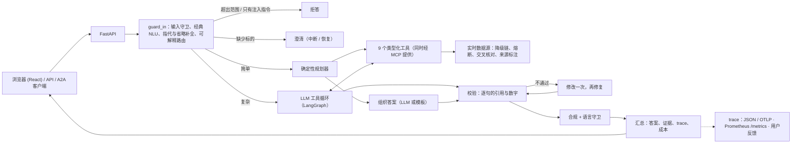

<div align="center">

<h1>FinSight</h1>

<h3>证据优先的 A 股研究 Agent。</h3>

<p>
  <a href="README.md"></a>
  <a href="README_CN.md"></a>
  <a href="LICENSE"></a>
  
  
  
  
</p>

</div>

---

FinSight 回答关于 A 股上市公司、基金、指数和宏观数据的问题：

- 经典、可解释的 NLU 负责理解、守卫和路由；
- LLM 在 LangGraph 循环里编排类型化的取证工具；
- **答案里的每个数字都由代码对照同一句引用的证据逐句核对**；
- 最后由合规节点删除任何像投资建议的表述。

没有 LLM Key 时，同一张图由确定性规划器完成回答。

**30 秒看懂**

- **数字可追溯**：逐句校验器拦下了 2,314 个被篡改答案中的 97.4%，153 个正确答案全部通过。把另一家公司的数字写进来，原来的整批比对 100% 放过，现在只放过 0.6%。
- **靠的是工具**：不调工具的 LLM 在 381 个任务上一题都过不了（一票否决口径）。调工具的 LLM 路径在两个模型族（DeepSeek V4.1 Flash、GLM-5.3 Flash）上：
  - 保留集通过 0.91–0.98；
  - 事后盲写、运行时未被触碰的 121 题测试集通过 0.76–0.81。
- **统计如实**：每个比率都附 95% bootstrap 置信区间，路径之间做配对检验。LLM Agent 相对「固定流程 + LLM 组织答案」的优势：
  - 在 DeepSeek 上**不显著**；
  - 在 GLM 上单次成功率显著，但 pass^3 不显著；
  - Agent 的成本是后者的 2–5 倍。
- **按服务标准交付**：
  - 没有 LLM 也能运行；截止时间和熔断兜底；做过压测和故障演练；
  - k3s 上多副本经 Postgres 共享会话；
  - 提供 MCP 与 A2A 接口；配有 Prometheus/Grafana/Jaeger 监控。
- **为什么不直接用豆包/问财？** 见 [docs/zh/comparison.md](docs/zh/comparison.md)：它们强在哪里、哪些数据谁都没公开，以及一个设计好但尚未执行的公平对比测试。

<p align="center"></p>

## 为什么这样设计

| 决策 | 理由 | 位置 |
|---|---|---|
| 经典 NLU 路由，LLM 负责编排 | 路由和守卫必须可解释、便宜；LLM 只用在它有价值的地方（选工具、组织答案）。简单问题走固定流程，对比、归因、多跳问题交给 LLM 工具循环。每个路由决定都记录理由。 | `agent/router.py`、`agent/graph.py` |
| 逐句的数字校验 | 数字必须出现在**本句**引用的证据里，按单位、写出的精度和正负号匹配。不通过时让 LLM 修改一次，仍不通过就删除该子句。 | `agent/verifier.py` |
| 处处有确定性兜底 | 没有 Key、模型故障、预算耗尽或超过截止时间时，都降级到规划器 + 模板答案，依然有引用、依然经过校验。 | `agent/planner.py`、`agent/llm.py` |
| 证据是不可信数据 | 工具结果被包装、规范化并过滤注入指令；用户消息本身也经过输入守卫；工具全部只读。 | `agent/injection.py` |

## 结果

任务成功是「一票否决」口径，以下条件缺一不可：

- 行为（回答/澄清/拒答）正确；
- 每个必需事实都陈述**且**引用；
- 调用了必需工具；
- 判断类问题有限定语；
- 全文没有交易指令。

在线结果每个任务重复 3 次，成本为网关账单口径。每个数字都来自 [`evaluation/results/`](evaluation/results/) 里已提交的文件，文件中记录了 commit、Prompt 版本和运行命令。分类明细和全部配对比较见 [docs/zh/evaluation.md](docs/zh/evaluation.md)（中文摘要）和 [docs/agent-eval.md](docs/agent-eval.md)（完整版）。

三个任务集：

- **开发集**：207 个任务，用来驱动修复。
- **保留集**：53 个任务，规则调优之后才编写，也参与过 Prompt 选择。
- **测试集 v2**：121 个任务 / 174 轮，一次性盲写，下列运行时未被触碰（见后文第二轮）。

任务成功率，表格放得下的地方附 95% 置信区间：

| 回答路径 | 开发集 · DeepSeek | 保留集 · DeepSeek | 测试集 v2 · DeepSeek | 保留集 · GLM | 测试集 v2 · GLM | 单任务成本（DeepSeek 开发集） | P95（DeepSeek 开发集） |
|---|---|---|---|---|---|---|---|
| 原 `/chat`，无 LLM | 0.256 | 0.189 | 0.223 | 0.207 | 0.223 | – | 1.0 s |
| 原 `/chat` + LLM 改写（跑 1 次） | 0.440 | 0.679 | 未运行 | 未运行 | 未运行 | 未记录 | 13.4 s |
| 纯 LLM，不调工具 | 0.000 | 0.000 | 0.000 | – | – | $0.0009 | 18.3 s |
| 确定性固定流程（无 LLM） | 0.981 | 0.849 [0.75, 0.94] | 0.727 [0.64, 0.80] | 0.849 | 0.727 | $0 | 0.8 s |
| 固定流程 + LLM 组织答案 | 0.979 | 0.906 [0.83, 0.98] | 0.766 [0.69, 0.83] | 0.906 [0.83, 0.98] | 0.760 [0.68, 0.83] | $0.0008 | 16.7 s |
| **LLM Agent（工具循环）** | **0.986** | **0.956** [0.91, 0.99] | **0.804** [0.73, 0.86] | **0.981** [0.94, 1.00] | **0.810** [0.74, 0.87] | $0.0016 | 25.2 s |

来源：

- DeepSeek 开发集/保留集：`ablation-final.json`，commit `846bc5e`；
- DeepSeek 测试集 v2：`ablation-test_v2-deepseek.json`，`38a3069`；
- GLM：`ablation-glm.json`，`f7bf624`。

<!-- final2: update after final online run (held-out and test v2, DeepSeek and GLM, at the round-2 commit) -->

置信区间支持的结论：

- **工具 + 校验是前提**：纯 LLM 在三个任务集的 381 个任务上一题都过不了，因为它无法引用证据，报出的价格也无法核实。
- **LLM 路径在规则没见过的问法上有帮助**：在测试集 v2 上，两种模型的两条 LLM 路径都比确定性固定流程高 3–8 个百分点（单次成功率）。
- **Agent 与 LLM 组织答案相比，DeepSeek 上没有显著差异**：
  - 保留集 Δ +0.050 [−0.006, +0.119]；
  - 测试集 v2 低并发重跑 Δ +0.036 [−0.011, +0.085]；
  - 保留集 pass^3 两者都是 0.906。
- **GLM 上单次成功率显著，但 pass^3 不显著**：
  - 保留集 +0.075 [+0.019, +0.151]，pass^3 McNemar p = 0.125；
  - 测试集 v2 +0.050 [+0.008, +0.091]，pass^3 p = 0.23；
  - 开发集上 GLM Agent 反而**显著更差**：−0.021 [−0.035, −0.008]。
- **所以 `mode=auto` 是成本与延迟上的选择，不是已被证明的质量提升**：
  - Agent 成本是 LLM 组织答案的 2–5 倍；
  - P95：DeepSeek 25 秒，GLM 约 80 秒。
- **撤回 Prompt v2/v3 提升质量的说法**：差异落在运行间波动之内。有数据支撑的是成本：v1 → v2 Agent 开发集单任务成本 −69%（$0.0040 → $0.0013）。

这些运行之后的改动（第二轮），离线测量：

- **测试集 v2 暴露了两类失败**：
  - 不点名公司的追问（如「ROE呢」），多轮类只有 0.21–0.32；
  - 该澄清却没澄清的悬空问题，0.33。
- **修复方式**：新增省略追问补全、「只有指标没有公司」时澄清、模糊概念过滤，都用新写的开发集风格任务验证，没有针对测试集 v2 调整。
- **测试集 v2 的现状**：因为失败类别是从测试集 v2 读出来的，**它现在也只能算验证集**；要得到无偏估计需要新的测试集。
- **`da3ec8b` 的离线门禁**：
  - 开发集（现为 216 个任务）1.000；
  - 保留集（确定性固定流程）0.849 → 0.906 [0.83, 0.98]（`gate-*.json`）；
  - 路由准确率：`d78b313` 在 158 条标注上 0.715 → 162 条上 0.975（`router_eval-*.json`）。
  - 路由标注由作者编写，检验的是路由策略的一致性，不是独立的质量评估。

| 其他测量 | 结果 | 证据 |
|---|---|---|
| 校验器压力测试：153 个正确答案、2,314 个篡改变体 | 误放率 35.0%（原来的整批比对）→ **2.6%**（逐句绑定）；公司之间互换数字 100% → **0.6%**；正确答案全部通过 | `verifier_stress.json`（`f7bf624`） |
| 提示注入红队：17 种攻击 × 4 种混淆，投毒到搜索结果 | 开发攻击集：三条路径共 216 次运行，**0** 次成功。未见过的保留攻击集：模板 0/64、LLM 组织答案 2/64、Agent 1/64（`846bc5e`）。第三套攻击集（离线）：模板路径 2/64（`f7bf624`） | `redteam-online.json`、`redteam-offline.json` |
| 故障注入：超时、5xx、空数据、超大文档、LLM 宕机、畸形工具参数、无限循环 | 11/11 个场景平稳降级 | `fault_injection.json` |
| 压测：确定性路径 | 每次运行只写一次检查点：单用户 4.8 → 6.5 次/秒，同样 820 次请求后会话库 64 MB → 9.4 MB。之前「11 倍」的说法复现不出来，实际约 1.3–1.6 倍 | [docs/zh/performance.md](docs/zh/performance.md) |
| 压测：LLM Agent 路径 | 4/8/16 并发下 0 个失败请求。瓶颈是网关限流（HTTP 429）而不是服务：被限流的轮次降级为确定性答案。**每 1,000 次 Agent 提问约 ¥19.7**（每题 4.1 次 LLM 调用、约 2.2 万 token） | [docs/zh/performance.md](docs/zh/performance.md) |
| k3s + Postgres 共享会话 | 1 → 3 副本：32 并发下 3.75 → 11.72 次/秒，0 错误；发往 B 副本的追问正确解析了 A 副本上一轮的「它」 | [docs/zh/performance.md](docs/zh/performance.md) |
| 真实网关与数据源上的故障演练 | **LLM**：主模型失效 → 熔断打开 → GLM 接手 → 半开试探 → 关闭。**数据源**：屏蔽新浪/腾讯/东方财富 → 60 秒缓存 → 最近一次成功数据 → 过期后如实说明缺数据，而不是拿 4 月的快照价冒充行情 | [docs/zh/a2a-and-observability.md](docs/zh/a2a-and-observability.md#故障演练) |
| 实时数据源审计：64 次探测 | 49 次成功；修复了错误的 M2 序列、停更的 CPI/PMI、始终为空的 PE/PB 和取不到的公告；新浪/同花顺增速与报告期绝对值交叉核对 | [docs/zh/data-sources.md](docs/zh/data-sources.md) |

<!-- final2: add the red-team rerun (redteam-final2) at the round-2 commit -->

## 架构


```mermaid
flowchart LR
  U["浏览器 (React) / API / A2A 客户端"] --> API["FastAPI"]
  API --> G["guard_in：输入守卫、经典 NLU、指代与省略补全、可解释路由"]
  G -->|超出范围 / 只有注入指令| RF["拒答"]
  G -->|缺少标的| CL["澄清（中断 / 恢复）"]
  G -->|简单| WF["确定性规划器"]
  G -->|复杂| AL["LLM 工具循环（LangGraph）"]
  WF --> T["9 个类型化工具（同时经 MCP 提供）"]
  AL <--> T
  T --> DS["实时数据源：降级链、熔断、交叉核对、来源标注"]
  WF --> C["组织答案（LLM 或模板）"]
  AL --> V["校验：逐句的引用与数字"]
  C --> V
  V -->|不通过| RV["修改一次，再修复"] --> V
  V --> K["合规 + 语言守卫"] --> F["汇总：答案、证据、trace、成本"]
  F --> U
  F -.-> O["trace：JSON / OTLP · Prometheus /metrics · 用户反馈"]
```

会话保存在 LangGraph checkpointer 中（内存、SQLite 或 Postgres），因此澄清可以暂停一次运行，任意副本都能接着对话；会话归属于创建它的 API Key。详见 [docs/zh/agent.md](docs/zh/agent.md)。

## 功能

- **Agent**：
  - 带理由的路由；并行工具调用；步数/工具/token 预算；
  - 运行截止时间，同时约束每一次 LLM 请求、重试和模型切换；
  - 校验失败后一次 LLM 修改；澄清中断与恢复；
  - 会话记忆：近期标的、用户说过的约束和持仓；
  - 追问处理：代词（「它」）、复数（「这两家」「both」）、省略问法（「ROE呢」「换成五粮液呢」「And the P/B?」）；
  - 按节点设置推理强度；带熔断的模型容灾；按哈希锁定的版本化 Prompt。
- **取证工具**：
  - 实体解析、行情、技术指标、基本面、宏观指标、新闻、公告、知识检索、文档情感；
  - 每个工具都有 Pydantic schema、超时、重试、TTL 缓存和可操作的错误提示。
- **声明核查**（`POST /agent/claim-check`）：
  - 贴一句话，例如「茅台市盈率只有15倍，股价跌了5%」；
  - 把每个数字对应到指标，与行情和基本面数据比对，不用 LLM；
  - 给出支持 / 矛盾 / 部分支持 / 无法核实，并附证据 id、来源和数据日期。
  - 处理比较词（超过/不到/以上/之间）、否定、区间、同比增速和中文数字；47 条 held-out 说法上结论准确率 0.936（95% CI 0.851–1.000），见 [docs/zh/claim-check.md](docs/zh/claim-check.md)。
- **实时数据**：
  - 东方财富 → 新浪 → 腾讯 → 缓存 → 最近一次成功数据 → 快照的降级链，每个数据源独立熔断；
  - 上游调用走有界线程池；新浪与同花顺基本面交叉核对；
  - 每条记录标注来源与时效；`GET /sources/health?probe=1` 主动探测（限频）。
- **协议**：工具经 MCP 提供；MCP 客户端可以把外部 MCP 服务器的工具注册进来（`QI_MCP_SERVERS`，结果按不可信数据处理）。整个 Agent 经 A2A 1.0 提供：澄清对应 `input-required`，流式接口汇报进度，任务表经 Postgres 共享。仓库里附带一个 a2a-sdk 客户端示例（`scripts/a2a_client_demo.py`）。
- **可观测性**：
  - 每次运行的 trace：节点、工具、LLM 调用（含上下文构成与 JSON 解析状态）、token、成本、Prompt 版本；
  - 运行查看接口；OpenTelemetry 导出；
  - 按实际作答模型打标签的 Prometheus 指标；19 个面板的 Grafana 看板、10 条告警规则、Jaeger；
  - 用户反馈（`POST /agent/feedback`）由 `scripts/feedback_to_tasks.py` 转成候选评测任务。
- **网页前端**（React 19、TypeScript、Tailwind v4、Radix、Motion、Lightweight Charts）：
  - 答案边写边显示；流式执行时间线；
  - 与证据面板联动的引用标签（含时效）；价格图；运行成本与延迟；
  - 反馈按钮与 Markdown 导出；中英文、深色模式、移动端。
- **安全**：
  - 可选 API Key，会话与 trace 按 Key 隔离（存的是哈希，不是 Key 本身）；
  - 限流、CORS、请求体上限；针对用户消息中指令的输入守卫；
  - 非 root 且根文件系统只读的容器。

<p align="center">
  
  
</p>

## 快速开始

```bash
pip install -r requirements.txt
uvicorn query_intelligence.api.app:create_app --factory --port 8765   # 打开 http://127.0.0.1:8765
```

没有 Key 时由确定性路径回答。启用 LLM Agent（任何 OpenAI 兼容接口均可）：

```bash
export DEEPSEEK_API_KEY=...                      # 只从环境变量读取，不要写进配置文件
export DEEPSEEK_BASE_URL=https://api.deepseek.com # 或网关，例如 https://api.cline.bot/api/v1
export DEEPSEEK_MODEL=deepseek-v4-flash
export QI_LLM_FALLBACK_MODELS=...                 # 可选：同一接口上的备用模型
```

实时行情、新闻、公告、宏观默认开启；设置 `QI_USE_LIVE_MARKET=0`（以及 `_NEWS`、`_ANNOUNCEMENT`、`_MACRO`）即使用随仓库提供的离线快照。

Docker、Kubernetes（多副本经 Postgres 共享会话、只读根文件系统）与监控栈见 [docs/zh/deployment.md](docs/zh/deployment.md)。

```bash
docker build -f docker/Dockerfile -t finsight . && docker run -p 8000:8000 finsight
kubectl apply -f deploy/k8s/finsight.yaml
docker compose -f docker/docker-compose.yml --profile monitoring up -d   # 加上 Prometheus、Grafana、Jaeger
```

## API

| 接口 | 用途 |
|---|---|
| `POST /agent/chat`、`POST /agent/chat/stream`（SSE）、`POST /agent/resume` | 带证据、校验结果、trace id 和成本的 Agent 回答；节点事件和边写边出的 `answer_delta` 文本；澄清后恢复。 |
| `POST /agent/claim-check` | 核查一句市场说法里的数字（确定性，不用 LLM）。 |
| `POST /agent/feedback` | 对回答点赞/点踩，与对应 trace 一起保存。 |
| `GET /agent/sessions/{id}`、`GET /agent/traces`、`GET /agent/traces/{id}` | 会话记忆、最近运行、完整 trace，只返回调用方自己的。 |
| `GET /.well-known/agent-card.json`、`POST /a2a` | A2A 服务卡片与 JSON-RPC 接口。 |
| `GET /metrics`、`GET /sources/health[?probe=1]`、`GET /health` | Prometheus 指标、数据源状态（按需主动探测）、健康检查。 |
| `POST /chat` | 原聊天接口（`mode=workflow` 保持原流程；`agent`/`auto` 走 Agent）。 |
| `POST /nlu/analyze`、`POST /retrieval/search`、`POST /query/intelligence` | 经典 NLU 与检索产物。 |

Schema 位于 `schemas/agent_*.schema.json`，由 `query_intelligence/contracts.py` 生成。

## 评测与测试

```bash
python -m pytest -q tests                                  # 离线；除非 QI_TEST_LIVE=1，否则不访问实时数据源
python -m evaluation.agent_eval.gate                       # 快照回放的开发集 + 保留集，与已提交基线比较
python -m evaluation.agent_eval.router_eval                # 路由准确率与混淆矩阵
python -m evaluation.agent_eval.ablation --llm deepseek --repeats 3 --workers 3 --sets holdout,test_v2
python -m evaluation.agent_eval.verifier_stress            # 校验器误放率
python -m evaluation.agent_eval.redteam --llm deepseek     # 提示注入红队
python -m evaluation.agent_eval.fault_injection            # 平稳降级
python -m evaluation.agent_eval.report --check             # docs/agent-eval.md 与 evaluation/results/ 一致
python -m scripts.load_test --base-url http://127.0.0.1:8000 --users 8
python -m scripts.chaos_drill --scenario sources           # 对运行中的服务屏蔽上游数据源
```

CI 包括：

- 代码检查；
- 前端检查（类型、lint、单测、可复现构建）；
- 带 Postgres 服务的全量测试；
- 与已提交基线比较的评测门禁，以及评测文档是否最新的检查；
- Docker 构建与冒烟测试；
- Kubernetes 清单校验。

## 文档

| 主题 | 链接 |
|---|---|
| Agent 层：图、工具、记忆、API、配置 | [docs/zh/agent.md](docs/zh/agent.md) |
| 评测（中文摘要） | [docs/zh/evaluation.md](docs/zh/evaluation.md) |
| 评测完整版：任务集、置信区间、在线消融、第二模型、Prompt A/B、红队、校验器压力测试 | [docs/agent-eval.md](docs/agent-eval.md)（英文） |
| 与问财、豆包、Kimi、Wind Alice、妙想的对比 | [docs/zh/comparison.md](docs/zh/comparison.md) |
| A2A、模型容灾、网关成本、监控、看板、故障演练 | [docs/zh/a2a-and-observability.md](docs/zh/a2a-and-observability.md) |
| 实时数据源 | [docs/zh/data-sources.md](docs/zh/data-sources.md) |
| 性能、压测与扩展 | [docs/zh/performance.md](docs/zh/performance.md) |
| 部署 | [docs/zh/deployment.md](docs/zh/deployment.md) |
| 设计复盘：取舍、自研与复用、失败案例 | [docs/presentation/agent-design-notes.md](docs/presentation/agent-design-notes.md) |
| Agent 与 Prompt 工程实践调研 | [docs/research/agent-architecture-practices-2026.md](docs/research/agent-architecture-practices-2026.md)（英文） |
| Query Intelligence（经典 NLU 与检索） | [docs/zh/query-intelligence.md](docs/zh/query-intelligence.md) |
| 网页前端 | [docs/zh/frontend-chatbot.md](docs/zh/frontend-chatbot.md) |
| 全部文档 | [docs/zh/index.md](docs/zh/index.md) |

## 局限

- **只测了两个模型族，都是 flash 级别**：两个模型经同一个网关调用；上面的在线数字来自第二轮修复之前的 commit。
- **已经没有干净的测试集**：保留集参与过 Prompt 选择，测试集 v2 的失败类别驱动了第二轮的追问修复，两者现在都只能算验证集，需要新的测试集。
- **Agent 工具循环没有被证明优于「LLM 组织答案」**：DeepSeek 上不显著；GLM 上的优势小于它多花的成本。
- **校验证明的是可追溯，不是真实**：校验器检查数字是否来自所引证据；一条证据含多个报告期或指标时，它无法判断选对了哪一个。投毒到新闻正文里的假价格能通过校验，因为它确实「在证据里」。
- **注入过滤器不泛化**：关键词过滤对没见过的说法不泛化（保留攻击集拦截率 0%）；防护主要来自结构：只读工具、不可信数据信封、数字校验、合规节点、语言守卫。
- **追问处理基于规则**：代词、复数、省略都靠规则补全；英文公司别名只覆盖主要公司。
- **延迟**：Agent 的 P95 在 DeepSeek 上 25 秒、GLM 上约 80 秒。第二轮起每次 LLM 请求都受运行截止时间约束（90 秒 + 作答宽限 20 秒，低于接口的 120 秒超时），但还没有在压测下重新测量。
- **免费数据源会限流**：审计时东方财富拒绝了本机连接，由降级链兜底。会话存储用 Postgres 时，A2A 任务表和 trace 也由所有副本共享；限流器和缓存仍是每个副本各自一份。

## 安全声明

FinSight 只做证据汇总，不是投资顾问，不能作为交易决策的唯一依据。
