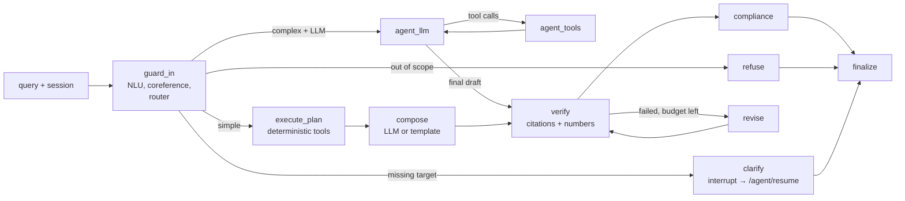

# Agent Layer

Languages: English | [中文](zh/agent.md)

The agent layer (`query_intelligence/agent/`) turns FinSight from a fixed "NLU → retrieval → one LLM call" pipeline into a tool-using research assistant. It sits **on top of** Query Intelligence: NLU and retrieval stay classical and explainable (see [AGENTS.md](../AGENTS.md)), and the agent only plans, calls tools, checks the draft against evidence, and applies compliance rules.

Two answer paths share one LangGraph state graph:

- **workflow**: a deterministic planner derives tool calls from `nlu_result` (style, intents, source plan, lexical cues). An LLM is used only to phrase the answer (and falls back to a template without one). This path is reproducible and works offline.
- **agent**: an LLM (DeepSeek, OpenAI-compatible tool calling) chooses tools step by step within budgets. It is used for complex questions when an LLM is configured.

`mode=auto` routes each turn; `mode=workflow` and `mode=agent` force a path. Without an LLM key, `agent` routes are downgraded to `workflow` and the downgrade is reported in `degraded`.

## Graph



| Node | What it does |
|---|---|
| `guard_in` | Runs NLU with session history as `dialog_context`, rewrites pronouns (它 / it / its) to the last listed entity, corrects NLU out-of-scope false positives for clear finance/macro questions, and routes. Every decision is written to `route_reasons`. |
| `refuse` | Out-of-scope answer and follow-up suggestions, reusing `scripts/llm_response.py` wording. |
| `clarify` | Asks which security is meant. With a checkpointer the graph pauses with `interrupt()` and continues when `/agent/resume` supplies the reply (at most one round per turn). |
| `execute_plan` | Runs the planner's tool calls in parallel (`max_parallel_tools`). |
| `compose` | LLM composition over the collected evidence, or `compose_template` when no LLM is configured or the LLM fails. |
| `agent_llm` / `agent_tools` | The tool-calling loop. Stops on a final answer, `max_llm_steps`, `max_tool_calls`, `token_budget`, or `run_deadline_s`; hitting a limit forces a final answer from the evidence gathered so far. |
| `verify` | Every cited `evidence_id` must exist; every number in the answer must be traceable to evidence (unit scaling such as 亿/万/%, rounding tolerance; dates, tickers and indicator parameters are ignored). |
| `revise` | Sends the verification feedback back to the LLM (`max_revisions`). If it still fails, the answer is repaired clause by clause: unsupported clauses are dropped and `verification_failed:repaired` is recorded. |
| `compliance` | Softens judgment and causal language (conditional wording for "can I buy", caveats for "why did it rise"), removes direct trading instructions, adds a freshness note for stale market data and the risk disclaimer. |
| `finalize` | Builds the response: answer, citations, evidence sources, tool calls, verification, LLM usage/cost, spans, sentiment, next questions. |

## Tools

All tools share one base (`tools/base.py`): Pydantic input schemas (also exported as OpenAI tool schemas and over MCP), a timeout, retries on transient errors, a TTL cache, and normalized error codes (`unknown_tool`, `invalid_arguments`, `timeout`, `upstream_error`, `not_found`, `unavailable`, `internal`). Every successful call returns `AgentEvidence` with a stable `evidence_id`, which is what answers cite.

| Tool | Backed by |
|---|---|
| `resolve_entity` | Entity resolver from NLU (aliases, tickers, fuzzy match) |
| `get_price_history` | Market provider (Tushare/AKShare/efinance when live, seed data offline) |
| `compute_indicators` | `MarketAnalyzer`: returns, MA5/MA20, RSI(14), MACD, volatility, Bollinger bands. Reports indicators it cannot compute from short history instead of returning empty values. |
| `get_fundamentals` | Fundamental SQL / provider rows |
| `get_macro_indicators` | Macro provider (CPI, PMI, M2, LPR, …) |
| `search_news`, `search_announcements`, `search_knowledge` | The existing retrieval pipeline (PostgreSQL full-text search / TF-IDF + learning-to-rank) |
| `analyze_sentiment` | Classical sentiment model by default; FinBERT with `QI_AGENT_SENTIMENT_BACKEND=finbert` |

Document text is untrusted: tool output reaches the LLM inside an explicit untrusted-data envelope, and instruction-like text ("ignore previous instructions", role tags, …) is redacted when evidence is ingested. Redactions are flagged in `degraded` as `instruction_like_text_removed_from_evidence`.

The same tools are published by an MCP server; see [MCP](mcp.md).

## Memory and sessions

- Each `session_id` is a LangGraph thread. The checkpointer is in memory by default; set `QI_AGENT_CHECKPOINT_DB=/path/sessions.sqlite` to persist sessions across restarts.
- Per-turn fields (tool log, evidence, verification, …) are reset at the start of every turn, so one turn's evidence can never be cited in the next.
- Completed turns (query, answer, entities, evidence ids) are kept in `turns` and fed to NLU as dialog context, which is how "那它的市净率呢" resolves to the previous company.
- Requests on the same session are serialized with a per-session lock.

## API

| Method | Path | Purpose |
|---|---|---|
| `POST` | `/agent/chat` | One turn. Body: `AgentChatRequest`. Returns `AgentChatResponse`. |
| `POST` | `/agent/chat/stream` | Same, as Server-Sent Events. |
| `POST` | `/agent/resume` | Answer a pending clarification. Body: `AgentResumeRequest`. 409 if nothing is pending. |
| `GET` | `/agent/sessions/{session_id}` | Session history and any pending clarification. |
| `POST` | `/chat` | Existing endpoint, unchanged by default: `mode` omitted or `workflow` runs the original pipeline. `mode=auto` or `agent` hands the turn to the agent and returns `AgentChatResponse`. |

JSON Schemas, generated from `query_intelligence/contracts.py`:

- [`schemas/agent_chat_request.schema.json`](../schemas/agent_chat_request.schema.json)
- [`schemas/agent_resume_request.schema.json`](../schemas/agent_resume_request.schema.json)
- [`schemas/agent_chat_response.schema.json`](../schemas/agent_chat_response.schema.json)

Regenerate them with `python -m scripts.export_agent_schemas`. `tests/test_agent_schemas.py` fails if they are stale and validates real responses against them.

Example:

```bash
curl -s localhost:8000/agent/chat -H 'Content-Type: application/json' \
  -d '{"query": "贵州茅台的市盈率是多少", "session_id": "demo", "mode": "auto"}'
```

A response with `status: "needs_clarification"` carries `clarification.question`; answer it:

```bash
curl -s localhost:8000/agent/resume -H 'Content-Type: application/json' \
  -d '{"session_id": "demo", "reply": "贵州茅台"}'
```

SSE events from `/agent/chat/stream`, in order: `session`, then `step` (node started), `tool_call`, `tool_result` as they happen, then `answer` (the full response) or `clarification`, then `done`. An `error` event is sent if the run fails.

The browser page at `/` uses these endpoints: pick a mode, watch steps stream in, answer clarifications inline, open "How this answer was produced" for tools and verification, and click suggested next questions.

## Configuration

| Variable | Default | Purpose |
|---|---|---|
| `DEEPSEEK_API_KEY` (or `deepseek.api_key` in config) | unset | Enables the LLM agent path and LLM composition. Without it everything runs on the deterministic path. |
| `DEEPSEEK_MODEL`, `DEEPSEEK_BASE_URL`, `DEEPSEEK_THINKING_TYPE`, `DEEPSEEK_REASONING_EFFORT`, `DEEPSEEK_MAX_TOKENS`, `DEEPSEEK_TIMEOUT_SECONDS` | see `config/app_config.json` | LLM settings shared with `/chat`. |
| `QI_LLM_PRICE_INPUT_MISS`, `QI_LLM_PRICE_INPUT_HIT`, `QI_LLM_PRICE_OUTPUT`, `QI_LLM_PRICE_CURRENCY` | unset | Price per million tokens. Cost is reported only when these are set. |
| `QI_AGENT_CHECKPOINT_DB` | unset (memory) | SQLite file for session persistence. |
| `QI_AGENT_REQUEST_TIMEOUT_S` | `120` | Per-request timeout for `/agent/chat` and `/agent/resume` (504 on expiry). |
| `QI_AGENT_SENTIMENT_BACKEND` | `classical` | `finbert` to use the FinBERT sentiment model (needs `torch`/`transformers`). |
| `QI_AGENT_TRACE_DIR` | `outputs/traces` | Where JSON traces are written; `off` disables them. |
| `QI_AGENT_OTEL`, `OTEL_EXPORTER_OTLP_ENDPOINT`, `OTEL_EXPORTER_OTLP_HEADERS` | unset | Export traces as OpenTelemetry spans over OTLP/HTTP (Jaeger, Tempo, Langfuse, …). |
| `QI_API_KEYS` | unset | Comma-separated API keys; when set, all endpoints except `GET /health`, `GET /` and `/static/*` need `X-API-Key` or `Authorization: Bearer`. |
| `QI_RATE_LIMIT_PER_MINUTE` | `0` (off) | Per-client token bucket; 429 with `Retry-After`. |
| `QI_CORS_ORIGINS` | unset | Comma-separated allowed browser origins. |
| `QI_MAX_REQUEST_BYTES` | `1048576` | Larger bodies get 413. |

Agent budgets (`max_llm_steps=6`, `max_tool_calls=16`, `max_parallel_tools=4`, `token_budget=80000`, `max_revisions=1`, `run_deadline_s=90`) are fields of `AgentConfig` in `agent/state.py`.

## Observability

Every run returns a `trace_id` and per-node `spans`. Traces are written as JSON to `outputs/traces/<date>/<trace_id>.json` (gitignored) and, when OTLP is configured, exported as spans with node, tool, and LLM timings, token usage, cost, and errors. `docker/docker-compose.yml` has a `tracing` profile that starts Jaeger.

## Running

```bash
pip install -r requirements.txt
uvicorn query_intelligence.api.app:create_app --factory --port 8000   # UI at http://localhost:8000/
python -m query_intelligence.agent.mcp_server --transport stdio        # MCP server (add --offline to disable live data)
docker compose -f docker/docker-compose.yml up --build                 # container (see docker/Dockerfile)
```

## Evaluation

The agent is evaluated offline on replayed tool snapshots so results are reproducible; see [Agent Evaluation](agent-eval.md) for the task sets, scoring, ablation, fault injection, and limitations. Commands:

```bash
python -m evaluation.agent_eval.runner --mode workflow      # dev set on the replay snapshot
python -m evaluation.agent_eval.ablation                    # legacy vs workflow (offline)
python -m evaluation.agent_eval.fault_injection             # graceful degradation
python -m evaluation.agent_eval.gate                        # CI thresholds
```

Online numbers (LLM agent, pass^k over repeated runs) need `DEEPSEEK_API_KEY` and are reported separately from offline numbers.

## Tests

```bash
python -m pytest -q tests/test_agent_*.py tests/test_api_security.py
python -m pytest -q tests/test_web_ui.py      # headless Chromium via Playwright
```

All agent tests run offline: `ScriptedLLM` replays fixed assistant turns and `tests/agent_fakes.py` provides stub tools.

## Limits

- The agent path is only as good as the LLM behind it; offline evaluation measures the deterministic path and the graph's safety checks, not LLM reasoning quality.
- Numeric verification checks that numbers appear in the evidence, not that they are used correctly (e.g. the right period).
- Pronoun resolution is rule-based and only resolves to a single previously listed entity; ambiguous references trigger a clarification.
- English aliases are limited to what `data/runtime/alias_table.csv` contains.
