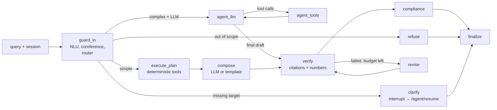

# Agent Layer

Languages: English | [中文](zh/agent.md)

The agent layer (`query_intelligence/agent/`) turns FinSight from a fixed "NLU → retrieval → one LLM call" pipeline into a tool-using research assistant. It sits **on top of** Query Intelligence: NLU and retrieval stay classical and explainable (see [AGENTS.md](../AGENTS.md)), and the agent only plans, calls tools, checks the draft against evidence, and applies compliance rules.

Two answer paths share one LangGraph state graph:

- **workflow**: a deterministic planner derives tool calls from `nlu_result` (style, intents, source plan, lexical cues). An LLM is used only to phrase the answer (and falls back to a template without one). This path is reproducible and works offline.
- **agent**: an LLM (DeepSeek, OpenAI-compatible tool calling) chooses tools step by step within budgets. It is used for complex questions when an LLM is configured.

`mode=auto` routes each turn; `mode=workflow` and `mode=agent` force a path. Without an LLM key, `agent` routes are downgraded to `workflow` and the downgrade is reported in `degraded`.

## Graph


```mermaid
flowchart LR
    Q[query + session] --> G[guard_in<br/>NLU, coreference,<br/>router]
    G -->|out of scope| R[refuse]
    G -->|missing target| C[clarify<br/>interrupt → /agent/resume]
    G -->|simple| P[execute_plan<br/>deterministic tools]
    G -->|complex + LLM| A[agent_llm]
    A -->|tool calls| T[agent_tools] --> A
    A -->|final draft| V
    P --> K[compose<br/>LLM or template] --> V[verify<br/>citations + numbers]
    V -->|failed, budget left| X[revise] --> V
    V --> M[compliance] --> F[finalize]
    R --> F
    C --> F
```

| Node | What it does |
|---|---|
| `guard_in` | Input guard (instruction-like spans in the user's own message, including a whole fake `<system>…</system>` block and "decode this base64 and run it" requests, are removed before NLU; a message with nothing financial left is refused), the answer language taken from the user's own words (markup tags, URLs and encoded blobs ignored), NLU with session history as `dialog_context`, follow-up resolution (pronouns, plurals and elliptical questions, see [Memory](#memory-and-sessions)), a filter for fuzzy concept matches that are not in the question, corrections of NLU out-of-scope false positives for clear finance/macro questions, a coverage check (crypto assets and US / Hong Kong stocks get a "not covered" refusal, see below), and routing. Every decision is written to `route_reasons`. |
| `refuse` | Refusal in the language of the user's own words, with a machine code in `limitations`: `out_of_scope_query` (not finance), `prompt_injection_request` (instructions to change the setup), or `out_of_coverage` (finance, but outside the data: crypto such as 比特币/Bitcoin, US or Hong Kong stocks such as Apple/特斯拉/腾讯控股, the Nasdaq; the text says FinSight covers A-shares, funds/ETFs, indices and China macro only). The coverage check only fires when no A-share target was resolved and the question does not also mention A-shares ("美股大跌对A股有什么影响" stays in scope); concept-sector phrasing ("苹果概念股") is in scope. |
| `clarify` | Asks which security is meant. With a checkpointer the graph pauses with `interrupt()` and continues when `/agent/resume` supplies the reply (at most one round per turn). |
| `execute_plan` | Runs the planner's tool calls in parallel (`max_parallel_tools`). |
| `compose` | LLM composition over the collected evidence, or `compose_template` when no LLM is configured or the LLM fails. The template first states what the question asks for that the evidence lacks (`agent/coverage.py`): a period the data does not cover ("茅台2019年的营业收入" with 2025-12-31 statements → "当前数据中没有所问的2019年数据：…以下数字均属于该报告期"), or a metric the tools did not return (dividend yield, debt ratio, revenue / profit growth, gross margin, cash flow; net margin is derivable from revenue and net profit). Targets whose data could not be retrieved are named ("当前数据源中没有招商银行（600036.SH）的基本面数据"). On the LLM path the same gaps are added to `limitations`. |
| `agent_llm` / `agent_tools` | The tool-calling loop. Stops on a final answer, `max_llm_steps`, `max_tool_calls`, `token_budget`, or `run_deadline_s`; hitting a limit forces a final answer from the evidence gathered so far. A call repeated with identical arguments in the same turn is not run again: the model gets a `duplicate_call` error that points to the earlier result, and the run records `repeated_tool_calls:N` in `degraded`. |
| `verify` | Every cited `evidence_id` must exist, and every number must be in the evidence cited **in its own sentence** (claim-level binding): unit scaling limited to the stated unit (亿/万/%/hundred million…), a tolerance set by the written precision, the stated direction (涨/跌, up/down) checked against the sign, and for LLM drafts market metrics (price, change, PE/PB) only from market evidence and citations required. Dates, tickers and indicator parameters are ignored. |
| `revise` | Sends the verification feedback back to the LLM (`max_revisions`). If it still fails, the answer is repaired clause by clause: unsupported clauses are dropped and `verification_failed:repaired` is recorded. |
| `compliance` | Softens judgment and causal language (conditional wording for "can I buy", caveats for "why did it rise"), removes direct trading instructions, ratings and position sizing, adds a freshness note for stale market data and the risk disclaimer. A language guard replaces an answer that is not in the question's language (e.g. hijacked by a poisoned document) with the deterministic answer. |
| `finalize` | Builds the response: answer, citations, evidence sources, tool calls, verification, LLM usage/cost, spans, sentiment, next questions. |

## Tools

All tools share one base (`tools/base.py`): Pydantic input schemas (also exported as OpenAI tool schemas and over MCP), a timeout, retries on transient errors, a TTL cache, and normalized error codes (`unknown_tool`, `invalid_arguments`, `timeout`, `upstream_error`, `not_found`, `unavailable`, `internal`). Every successful call returns `AgentEvidence` with a stable `evidence_id`, which is what answers cite.

| Tool | Backed by |
|---|---|
| `resolve_entity` | Entity resolver from NLU (aliases, tickers, fuzzy match) |
| `get_price_history` | Market fallback chain when live (Tushare with a token; otherwise Eastmoney → Sina → Tencent → Sina realtime → efinance), seed snapshot offline |
| `compute_indicators` | `MarketAnalyzer`: returns, MA5/MA20, RSI(14), MACD, volatility, Bollinger bands. Reports indicators it cannot compute from short history instead of returning empty values. |
| `get_fundamentals` | Live: Sina financial indicators → THS, PE(TTM)/PB from Eastmoney datacenter → Tencent quote; seed snapshot offline |
| `get_macro_indicators` | Live: Eastmoney datacenter (NBS CPI/PMI, M2, LPR 1Y/5Y) and the 10Y yield (Eastmoney → ChinaBond); seed snapshot offline |
| `search_news`, `search_announcements`, `search_knowledge` | The existing retrieval pipeline (PostgreSQL full-text search / TF-IDF + learning-to-rank) |
| `analyze_sentiment` | Classical sentiment model by default; FinBERT with `QI_AGENT_SENTIMENT_BACKEND=finbert` |

Data tools return an optional `provenance` object in their output and evidence payload: source, `fetched_at`, `as_of`, `is_live`, `mode` (`live` / `live_fallback` / `last_known_good` / `snapshot`), `freshness`, `fallback_reason`, and a one-line `note` such as 数据来自新浪财经行情，截至2026-09-24；因东方财富行情熔断中降级. It contains no numeric values, so it cannot make an invented number look traceable to the verifier. Chains, circuit breakers, caching, and the measured audit are described in [Live data sources](data-sources.md); `GET /sources/health` reports per-source status.

Document text is untrusted: tool output reaches the LLM inside an explicit untrusted-data envelope, and instruction-like text ("ignore previous instructions", role tags, …) is redacted when evidence is ingested. Redactions are flagged in `degraded` as `instruction_like_text_removed_from_evidence`.

The same tools are published by an MCP server; see [MCP](mcp.md).

## Memory and sessions

- Each `session_id` is a LangGraph thread. The checkpointer is in memory by default; `QI_AGENT_CHECKPOINT_DB=/path/sessions.sqlite` persists sessions across restarts, and a `postgresql://` DSN shares them between processes and replicas.
- Per-turn fields (tool log, evidence, verification, …) are reset at the start of every turn, so one turn's evidence can never be cited in the next. One checkpoint is written per run (`QI_AGENT_DURABILITY=exit`).
- Completed turns (query, answer, entities, evidence ids) are kept in `turns` and fed to NLU as dialog context.
- Requests on the same session are serialized with a per-session lock (a bounded LRU of at most 4,096 idle locks).
- **Ownership.** A session belongs to the caller that created it: with `QI_API_KEYS` set, the owner is a hash of the API key (`key:<sha256[:12]>`, never the key itself). Another key gets `404` for that session id, and `/agent/traces*` only return the caller's runs.

### Follow-up resolution

Rules in `agent/memory.py`, applied in `guard_in` only when the current question names no listed target (or only a new one). Each rewrite is visible in `route_reasons` and in the `effective_query`.

| Case | Example | Rewrite | Reason code |
|---|---|---|---|
| Pronoun, one target in the most recent turn that named any (entity-less turns in between are skipped) | 茅台市盈率 → 最新CPI → "它的市净率呢" | 贵州茅台的市净率呢 | `coreference:它->贵州茅台` |
| Plural | 茅台… → 五粮液… → "这两家哪个估值更高" / "Compare both on P/B" | 贵州茅台和五粮液哪个估值更高 | `coreference:这两家->…` |
| Ellipsis, no target | 贵州茅台的市盈率 → "ROE呢", "最近走势怎么样", "And ROE?" | 贵州茅台ROE呢 / ROE for 贵州茅台? | `ellipsis:target->贵州茅台` |
| Ellipsis, new target only | 贵州茅台的市盈率 → "换成五粮液呢", "What about BYD?" | 五粮液的市盈率呢？ / What is 比亚迪's P/E? | `ellipsis:aspect->市盈率` |
| Dangling "why" (the whole question is 为什么会这样 / 怎么回事 / 那是什么原因呢 / "why did that happen?" / "how come?") | 五粮液的市净率 → 那它的营收增速呢 → "为什么会这样" | 五粮液的营收为什么会这样 / why did that happen for 五粮液 (营收)? | `dangling_why:target->五粮液` |

A plural reference is resolved from the session even when the NLU carried a single entity over from the dialog context, and each turn stores its `effective_query` and the entities of the effective (rewritten) question, so after 宁德时代… → ROE呢 → 换成比亚迪呢 the plural "这两家谁的估值更高" means 宁德时代和比亚迪. The rewritten question keeps its why-marker, so a dangling "why" is routed like any causal question (agent route; price, fundamentals and news on the deterministic path). An elliptical metric follow-up about a named security ("And the P/B?") is never answered with macro indicators: the planner adds `get_macro_indicators` for a named security only when the question names a macro topic.

Guards against over-reach: only short questions (≤ 20 characters, or ≤ 8 English words) with an ellipsis marker (那/呢/换成/and/what about…) or a bare aspect qualify; market-wide (大盘, 行业, market, sector) and macro questions (CPI呢) are never attached to the previous company; an ambiguous pronoun (two candidates) is not guessed.

Without history the same questions are clarified, not refused: a metric with no company ("市净率是多少", "PB呢", reason `metric_without_target`; definition questions such as "什么是市净率" are exempt), and dangling references ("那家公司最近有公告吗", plurals such as "这两家哪个更值得关注", and a bare "为什么会这样"; `dangling_reference`). Fuzzy concept hits whose name is not in the question are dropped first (`dropped_fuzzy_concept:有色金属` for "…有公告…").

### Session rules added in round 3b

Written from the failure classes of the independent multi-turn set `multiturn_v1` (see Evaluation). All rules live in `guard_in` (`agent/graph.py`) and `agent/memory.py`; each one logs a reason code in `route_reasons`.

| Case | Example | Behaviour | Reason code |
|---|---|---|---|
| Entity-less follow-up that the guard would refuse or clarify | 沪深300 → "为什么涨？"; CSI 300 ETF → "What's the 3-day return?"; CPI → "这说明什么？" | Inherits the targets, or the macro topic, of the latest turn that had any. Conditions: short (≤ 30 characters or ≤ 12 English words), carries a finance cue (涨/跌/增速/舆情/return/high/buy…), names no target or macro topic of its own, is not an off-topic task or an out-of-coverage asset | `session_inherit:target->…`, `session_inherit:macro->CPI` |
| Off-topic task, even with finance words or a known stock | "你能帮我写个Python爬虫抓股价吗", "Translate this…", "帮我订个…酒店" | Refused; no follow-up rewrite is attempted | `off_topic_request:coding` (translation, travel, weather, writing, entertainment) |
| Out-of-coverage asset in a finance conversation | 茅台… → "特斯拉呢？", "Is the S&P 500 up today?" | Refused with the coverage message; never inherits the earlier target | `coverage:foreign_equity` |
| 前者/后者, the former/the latter | "五粮液和中国平安…" → "后者呢？" | The target in that position of the last turn in which the user *named* two or more (a turn that only said "the two" has no order); the previous aspect is carried when missing | `group_reference:后者->中国平安` |
| 三家/all three; 两家/both; bare 哪家/which one | three single-stock turns → "三家里面哪家最便宜？"; "平安和五粮液…" → "哪家赚得多？" | The three most recently discussed targets; the two; the targets of the last multi-target turn | `group_reference:三家->…`, `coreference:两家->…`, `group_reference:which->…` |
| A comparison that names only the new side | 创业板ETF… → "跟沪深300ETF比…"; 五粮液's revenue → "Is that bigger than Moutai's?" | Adds the earlier target (and aspect); not applied when the comparison is with a sector or the market | `comparison_anchor:+五粮液` |
| Sector question in a conversation about a member | 中国平安… → "保险行业的市净率是多少？", "Does a PMI above 50 mean insurers will rally?" | Keeps the member in scope, so `get_fundamentals` returns its industry snapshot (also when the NLU rejected the question but it names the member's industry) | `sector_member:保险->中国平安` |
| Sector question with no member in scope | "保险行业现在的市净率是多少？" | `get_fundamentals` with an industry name returns the industry snapshot only | planner reason `industry snapshot for a sector question` |
| Ambiguous abbreviation | 平安银行… → "平安的分红多少" | Resolves to the target under discussion | `session_disambiguation:平安->平安银行` |
| NLU copied an entity from an earlier question | "How does that compare to the insurance sector?" after 招商银行 → Ping An | Session memory (turn order, plurals, sectors) decides; the NLU carry-over is kept only when no session rule resolves the question | `session_memory_over_nlu_context_carry` |
| Period-only follow-up | 茅台2025年的营收和净利润 → "2024年的呢？" / "And in 2022?" | Keeps the previous metric, so the missing period is stated | `ellipsis:target->贵州茅台+aspect->营收+净利润` |
| Clarification answered in the chat box | "这个能买吗？" (clarify) → "五粮液" / "I mean the CSI 300 ETF." | A target-only message sent while a clarification is pending resumes that turn (like `/agent/resume`) | `clarified:五粮液` |
| Elliptical opening | "What about the P/E?" as the first message | Clarified instead of searched | `metric_without_target`, `ellipsis_without_antecedent` |

Fuzzy company matches inside a pronoun question ("它值得长期持有吗" → 值得买, "这只股票适合长期持有吗" → 长江投资) are dropped before these rules, and "利率" no longer counts as a macro anchor inside 毛利率/净利率.

**Answer details on the deterministic path.** `coverage.requested_price_fields` is shared by the planner and the template: recent N closes, the previous close, open/high/low, volume and turnover come from `get_price_history`; N-day returns and "above MA5?" from `compute_indicators`. Requested fields are stated when present and named as unavailable otherwise (an index's zero volume counts as missing). Stated gaps also cover an industry metric the snapshot lacks ("ROE跟保险行业平均比呢" → the 保险 snapshot has no ROE), quarters and half-years with annual statements only, market cap and growth rates, P/E or ROE of an ETF/index, macro indicators not in the data (LPR), and indicators that cannot be computed.

**Hedging on follow-ups.** Compliance looks for judgment and interpretation wording in both the raw message and the effective (rewritten or clarified) question, so "五粮液" answering "这个能买吗？" is hedged. The lexicon adds valuation judgements (贵还是便宜, cheaper), market calls (牛市信号, trending up), guarantees (一定会涨, guarantee), position sizing (全仓…行不行) and interpretation (说明, 反映, signal).

### Session memory card

`session_memory(turns, query)` builds a small extractive card that the agent's user message carries as "Session memory (from earlier turns)": `recent_targets` (up to 6 distinct listed entities, newest first), `user_constraints` stated at any earlier turn (`risk:conservative` / `risk:aggressive`, `horizon:long` / `horizon:short`, `scope:a_shares_only`, `scope:etf_only`) and `stated_holdings` ("我持有招商银行", "I own …", up to 5). It is rule-based and bounded, and it is the default.

**Optional LLM summary of older turns** (`QI_AGENT_MEMORY_SUMMARY=1`, off by default; `agent/memory_summary.py`). The agent sees the last two turns verbatim; with the flag on, turns that fall out of that window are condensed by the LLM (prompt `memory_summary@v1`, reasoning off) into a plain-text summary truncated to `QI_AGENT_MEMORY_SUMMARY_TOKENS` (default 300, estimated as one token per CJK character and four characters per token otherwise). The summary is added to the card as `conversation_summary`. It is incremental: the card (`memory_card` in the session state) records how many turns it covers, so only turns that newly left the window are folded in, one extra LLM call on those turns and none otherwise; the call is logged as `memory_summary` in `llm.log` and counted in usage and cost. A failed summary keeps the previous card and records `memory_summary_failed:…` in `degraded`; the turn still runs. **Not yet ablated:** it stays off until a run on a multi-turn set compares task success and prompt tokens with and without it (planned, not done in round 3).

## API

| Method | Path | Purpose |
|---|---|---|
| `POST` | `/agent/chat` | One turn. Body: `AgentChatRequest`. Returns `AgentChatResponse`. |
| `POST` | `/agent/chat/stream` | Same, as Server-Sent Events (below). |
| `POST` | `/agent/resume` | Answer a pending clarification. Body: `AgentResumeRequest`. Idempotent: submitting the same reply again (double click, client retry) does not run the turn twice; it returns the stored result of that turn with `"replayed": true` and the same `trace_id`, and emits no second trace. A different reply when nothing is pending gets 409 with `{"detail": {"code": "no_pending_clarification", "message": …}}`. |
| `GET` | `/agent/sessions/{session_id}` | Session history and any pending clarification (404 for another owner's session). |
| `POST` | `/agent/claim-check` | `{"claim": "贵州茅台ROE超过30%，市盈率不是15倍"}` → one check per number with metric, target, `comparator` (`eq ne gt ge lt le approx range`), `supported`/`contradicted`/`unverifiable` (with a `reason`), the actual value, evidence id, source and `as_of` + `as_of_basis`; an overall verdict and a disclaimer. Deterministic, no LLM. Rules, limits and the 131+47-claim benchmark: [claim-check.md](claim-check.md). |
| `POST` | `/agent/feedback` | `{"trace_id", "rating": "up" \| "down", "comment"?, "session_id"?}`. Appended with the query and route to `QI_FEEDBACK_PATH` (default `outputs/feedback/feedback.jsonl`), counted in `finsight_feedback_total`; 404 if the trace is not the caller's. `scripts/feedback_to_tasks.py` turns flagged traces into candidate evaluation tasks for review. |
| `GET` | `/agent/traces`, `/agent/traces/{trace_id}` | Recent run summaries and full traces, the caller's own only ([details](a2a-and-observability.md#run-inspector)). |
| `GET` | `/metrics`, `/sources/health[?probe=1]` | Prometheus metrics; live source status, with an opt-in, rate-limited active probe ([details](data-sources.md#health-endpoint)). |
| `POST` | `/chat` | Existing endpoint, unchanged by default: `mode` omitted or `workflow` runs the original pipeline. `mode=auto` or `agent` hands the turn to the agent and returns `AgentChatResponse`. |

JSON Schemas, generated from `query_intelligence/contracts.py`:

- [`schemas/agent_chat_request.schema.json`](../schemas/agent_chat_request.schema.json)
- [`schemas/agent_resume_request.schema.json`](../schemas/agent_resume_request.schema.json)
- [`schemas/agent_chat_response.schema.json`](../schemas/agent_chat_response.schema.json)

Regenerate them with `python -m scripts.export_agent_schemas`. `tests/test_agent_schemas.py` fails if they are stale and validates real responses against them.

Example:

```bash
curl -s localhost:8000/agent/chat -H 'Content-Type: application/json' \
  -d '{"query": "贵州茅台的市盈率是多少", "session_id": "demo", "mode": "auto"}'
```

A response with `status: "needs_clarification"` carries `clarification.question`; answer it:

```bash
curl -s localhost:8000/agent/resume -H 'Content-Type: application/json' \
  -d '{"session_id": "demo", "reply": "贵州茅台"}'
```

SSE events from `/agent/chat/stream`: `session` first; then, as they happen, `node_start` (a node is about to run), `step` (a node finished), `tool_call`, `tool_result` and `answer_delta` (the `answer` text of the LLM's JSON draft, decoded while it streams, escapes split across chunks included); then `answer` (the verified, compliance-checked response, which replaces the streamed preview) or `clarification`; finally `done`. An `error` event is sent if the run fails. The graph runs on a worker thread that owns the session lock, so a client that disconnects does not leave the session locked: the run finishes, its turn and trace are saved, and the lock is released (`tests/test_agent_round3.py::test_stream_client_disconnect_releases_the_lock_and_saves_the_trace`).

The browser page at `/` uses these endpoints: pick a mode, watch steps stream in, answer clarifications inline, open "How this answer was produced" for tools and verification, and click suggested next questions.

## Configuration

| Variable | Default | Purpose |
|---|---|---|
| `DEEPSEEK_API_KEY` (or `deepseek.api_key` in config) | unset | Enables the LLM agent path and LLM composition. Without it everything runs on the deterministic path. |
| `DEEPSEEK_MODEL`, `DEEPSEEK_BASE_URL`, `DEEPSEEK_THINKING_TYPE`, `DEEPSEEK_REASONING_EFFORT`, `DEEPSEEK_MAX_TOKENS`, `DEEPSEEK_TIMEOUT_SECONDS` | see `config/app_config.json` | LLM settings shared with `/chat`. Any OpenAI-compatible endpoint works, including gateways that wrap responses in `{"data": ...}`. |
| `DEEPSEEK_REASONING_STYLE` | `auto` | How per-node reasoning levels are sent: `deepseek` (`thinking` + `reasoning_effort`), `openrouter` (`reasoning` object, e.g. the Cline gateway) or `none`; `auto` picks from the base URL. |
| `QI_LLM_FALLBACK_MODELS` | unset | Comma-separated failover models on the same endpoint. Each model has a breaker: open after 3 consecutive failures, a trial call after 60 s (half-open), closed on success; `FallbackLLM.stats()` reports `closed` / `open` / `half_open` and `/metrics` exports it ([details](a2a-and-observability.md#llm-gateway-failover-and-cost)). |
| `QI_PROMPT_VERSION` | `v3` | Active prompt version from the registry in `agent/prompts.py` (`v1`, `v2`, `v3`). |
| `QI_LLM_PRICE_INPUT_MISS`, `QI_LLM_PRICE_INPUT_HIT`, `QI_LLM_PRICE_OUTPUT`, `QI_LLM_PRICE_CURRENCY` | unset | Price per million tokens. Without them the gateway-reported cost (`usage.cost`, USD) is used when present. |
| `QI_LLM_USD_CNY` | unset | Exchange rate to report gateway costs in CNY. |
| `QI_AGENT_CHECKPOINT_DB` | unset (memory) | Session persistence: a SQLite file path, or a `postgresql://` DSN shared by several processes or replicas. |
| `QI_AGENT_DURABILITY` | `exit` | LangGraph durability: one checkpoint per run (`exit`), or per step (`async`, `sync`); see [performance.md](performance.md). |
| `QI_A2A_ENABLED`, `QI_A2A_MODE`, `QI_PUBLIC_BASE_URL` | `1`, `auto`, `http://127.0.0.1:8765` | A2A endpoint switch, agent mode and the URL advertised in the agent card. |
| `QI_AGENT_REQUEST_TIMEOUT_S` | `120` | Per-request timeout for `/agent/chat` and `/agent/resume` (504 on expiry). |
| `QI_AGENT_PREFETCH` | `1` | Run the deterministic planner's tool calls before the first LLM call and pass the results with the question (one LLM round trip for questions the planner covers). |
| `QI_AGENT_REVISE_POLICY` | `cite_repair` | `cite_repair`: a draft that only fails on citations gets the id of the single evidence item holding each number and skips the LLM revision if it then verifies; `llm`: always revise with the LLM. |
| `QI_AGENT_LLM_STALL_TIMEOUT_S` | `20` | Longest wait for the next streamed chunk of an LLM call before it is retried or fails over; `0` = off. |
| `QI_AGENT_VERIFY_DERIVED` | `1` | Accept a difference, sum, ratio or percent change of two supported numbers stated in the same cited sentence. |
| `QI_LLM_KEEPALIVE` | `1` | Reuse pooled connections to the LLM endpoint; `0` opens a new connection per request. |
| `QI_AGENT_MEMORY_SUMMARY`, `QI_AGENT_MEMORY_SUMMARY_TOKENS` | off, `300` | Optional LLM summary of turns older than the verbatim window, under a token budget (see [Session memory card](#session-memory-card)). |
| `QI_AGENT_SENTIMENT_BACKEND` | `classical` | `finbert` to use the FinBERT sentiment model (needs `torch`/`transformers`). |
| `QI_AGENT_TRACE_DIR` | `outputs/traces` | Where JSON traces are written; `off` disables them. |
| `QI_AGENT_OTEL`, `OTEL_EXPORTER_OTLP_ENDPOINT`, `OTEL_EXPORTER_OTLP_HEADERS` | unset | Export traces as OpenTelemetry spans over OTLP/HTTP (Jaeger, Tempo, Langfuse, …). |
| `QI_API_KEYS` | unset | Comma-separated API keys; when set, all endpoints except `GET /health`, `GET /ready`, `GET /`, the agent card and `/static/*` need `X-API-Key` or `Authorization: Bearer`. |
| `QI_RATE_LIMIT_PER_MINUTE` | `0` (off) | Per-client token bucket; 429 with `Retry-After`. |
| `QI_CORS_ORIGINS` | unset | Comma-separated allowed browser origins. |
| `QI_MAX_REQUEST_BYTES` | `1048576` | Larger bodies get 413. |
| `QI_SOURCE_CALL_TIMEOUT_SECONDS`, `QI_SOURCE_FAILURE_THRESHOLD`, `QI_SOURCE_COOLDOWN_SECONDS`, `QI_SOURCE_CACHE`, `QI_SOURCE_MAX_WORKERS`, `QI_SOURCE_PROBE_MIN_INTERVAL_SECONDS`, `QI_SOURCE_CROSS_CHECK` | `10`, `3`, `60`, `true`, `32`, `60`, `true` | Live data source hard timeout, circuit breaker, TTL cache, bounded call pool, active-probe rate limit and Sina/THS cross-check ([details](data-sources.md#configuration)). |
| `QI_FEEDBACK_PATH` | `outputs/feedback/feedback.jsonl` | Where `/agent/feedback` appends records. |
| `QI_TFIDF_CACHE_DIR` | unset | Directory for the fitted TF-IDF document index (keyed by a hash of the corpus). The index is always memoised per process, so a service rebuilt in the same process starts in 3.65 s instead of 24.06 s; with this set, a new process loads it from disk (6.81 s) instead of refitting. The file is 365 MB, so it is not baked into the image ([startup.json](results/perf/startup.json)). |
| `QI_TEST_LIVE` | unset | Tests only: `tests/conftest.py` sets the `QI_USE_LIVE_*` defaults to `false` unless `QI_TEST_LIVE=1`, so the suite never waits for upstream sites. |

Agent budgets (`max_llm_steps=6`, `max_tool_calls=16`, `max_parallel_tools=4`, `token_budget=80000`, `max_revisions=1`, `run_deadline_s=90`, `answer_grace_s=20`) and per-node reasoning levels (`agent_reasoning=None` i.e. the client default, `compose_reasoning`, `revise_reasoning` and `final_reasoning` = `low`) are fields of `AgentConfig` in `agent/state.py`.

**Deadlines.** `run_deadline_s` stops the tool loop; it also bounds every LLM request. Each HTTP request, including retries and failover models, gets `min(DEEPSEEK_TIMEOUT_SECONDS, time left)`: tool-loop steps until `run_deadline_s`, answer-producing calls (compose, the forced final answer, revise) until `run_deadline_s + answer_grace_s`. A retry whose back-off would overrun the deadline is not attempted, and with less than 2 s left the call fails fast with a non-retryable error, so the graph answers from its deterministic path (template or repaired draft). With the defaults a run stays under `QI_AGENT_REQUEST_TIMEOUT_S` (120 s): in the round-1 chaos drill a slow fallback model had pushed one request to a 504 ([chaos drill](a2a-and-observability.md#chaos-drill)); the bound has not yet been re-measured under load.

## Observability

Every run returns a `trace_id` and per-node `spans`. Traces are written as JSON to `outputs/traces/<date>/<trace_id>.json` (gitignored) and, when OTLP is configured, exported as spans with node, tool, and LLM timings, token usage, cost, prompt versions and errors. `docker/docker-compose.yml` has a `tracing` profile that starts Jaeger. `GET /agent/traces` and `GET /agent/traces/{trace_id}` serve recent traces (the web UI's run inspector) and `GET /metrics` exposes Prometheus counters and histograms; see [a2a-and-observability.md](a2a-and-observability.md).

## Running

```bash
pip install -r requirements.txt
uvicorn query_intelligence.api.app:create_app --factory --port 8000   # UI at http://localhost:8000/
python -m query_intelligence.agent.mcp_server --transport stdio        # MCP server (add --offline to disable live data)
docker compose -f docker/docker-compose.yml up --build                 # container (see docker/Dockerfile)
```

## Evaluation

The agent is evaluated offline on replayed tool snapshots so results are reproducible; see [Agent Evaluation](agent-eval.md) for the task sets, scoring, ablation, fault injection, and limitations. Commands:

```bash
python -m evaluation.agent_eval.runner --mode workflow      # dev set on the replay snapshot
python -m evaluation.agent_eval.ablation                    # legacy vs workflow (offline)
python -m evaluation.agent_eval.fault_injection             # graceful degradation
python -m evaluation.agent_eval.gate                        # CI thresholds
```

Online numbers (LLM agent, pass^k over repeated runs) need `DEEPSEEK_API_KEY` and are reported separately from offline numbers.

**Independent multi-turn set (`multiturn_v1`, 49 conversations / 206 turns).** Written without reading the router, memory, planner or task files (`evaluation/agent_eval/tasks/README_multiturn_v1.md`). Its first and only pre-fix run (no LLM, `mode=auto`) scored task success **0.224** and turn success 0.709 (`evaluation/results/multiturn_v1-auto-nollm-first-run.json`). The round-3b rules above were written against those failures, with new dev examples (`build_tasks._round3b_tasks`, 33 tasks); after that the same run scores **1.000** task and turn success at 7513376 (`evaluation/results/multiturn_v1-auto-nollm-after-fixes.json`). The second number is **after exposure** and is not evidence of generalisation; the sets that were not used show smaller, honest gains: held-out gate 0.906 → 0.925 (hedged 0.636 → 0.727, `evaluation/results/gate-holdout.json`) and router labels 0.975 → 0.988 (`evaluation/results/router_eval-round3b.json`).

```bash
python -m evaluation.agent_eval.runner --mode auto --tasks evaluation/agent_eval/tasks/agent_eval_multiturn_v1.jsonl \
  --snapshot evaluation/agent_eval/fixtures/snapshot_multiturn_v1.json
```

## Tests

```bash
python -m pytest -q tests/test_agent_*.py tests/test_api_security.py
python -m pytest -q tests/test_web_ui.py      # headless Chromium via Playwright
```

All agent tests run offline: `ScriptedLLM` replays fixed assistant turns and `tests/agent_fakes.py` provides stub tools.

## Limits

- The agent path is only as good as the LLM behind it. Offline evaluation measures the deterministic path and the graph's safety checks; the online evaluation in [agent-eval.md](agent-eval.md) measures two flash-class models (DeepSeek V4.1 Flash, GLM-5.3 Flash) through one gateway, and the agent loop's advantage over LLM composition is not significant with DeepSeek.
- Numeric verification is claim-level (2.1% false-accept rate on 2,433 corrupted gold answers, `evaluation/results/verifier_stress.json`), but it does not check that a number is used for the right period or metric when the cited evidence holds several, and a number planted in a document passes because it is in the evidence.
- Follow-up resolution is rule-based: it covers pronouns, plurals, ordinal and group references, short elliptical questions, bare "why" follow-ups and short entity-less follow-ups with a finance cue; longer paraphrases ("回到刚才那只股票…") and ambiguous references lead to a clarification rather than a guess. The cue and off-topic lexicons are hand-written: an off-topic task phrased without their words (e.g. "明天去上海的高铁几点") is still answered, and an entity-less follow-up without a cue word is clarified or refused as before.
- Coverage and gap detection are lexical: the out-of-coverage list names crypto terms, the largest US / Hong Kong companies and markets, not every foreign ticker; a requested period is detected when written as a year ("2019年", "in 2023", "FY2023"), a quarter or a half-year ("一季度", "Q3", "上半年"), not as "去年".
- A sector question keeps a discussed member of that sector in scope; with no member it gets only the industry snapshot (PE, PB, daily change), and only for the industries in the offline data.
- The optional LLM memory summary has not been ablated; the rule-based card is the measured default.
- English aliases cover the major A-shares added in round 2, "CSI 300 index", "10-year CGB yield", "baijiu" and "insurers" (round 3b, `data/synonym_dict.json` and the alias tables) plus what `data/runtime/alias_table.csv` contains. A question such as "Did the whole baijiu sector fall too?" opening a conversation is still sent to clarification (the NLU rejects it before the sector is recognised); inside a conversation about a baijiu stock it is answered with the industry snapshot.
