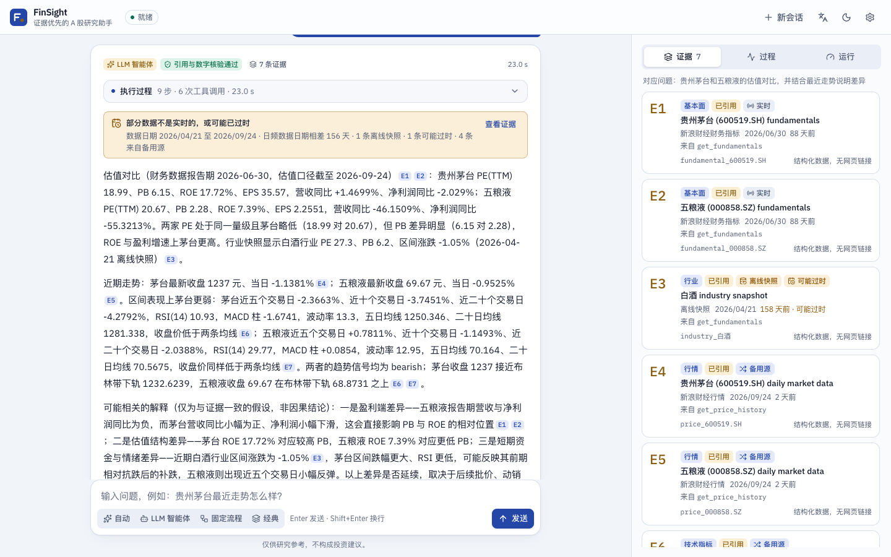
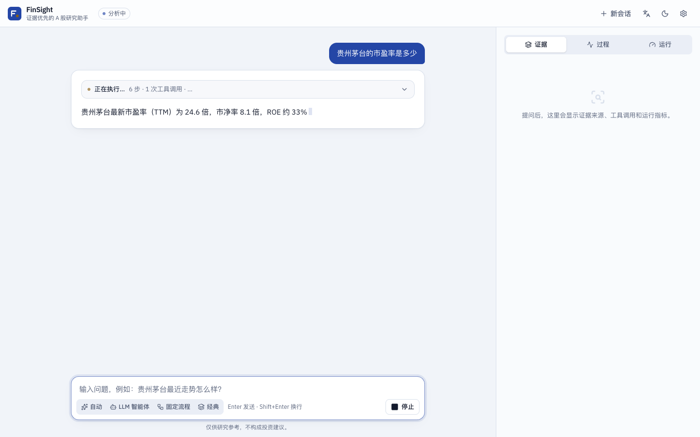
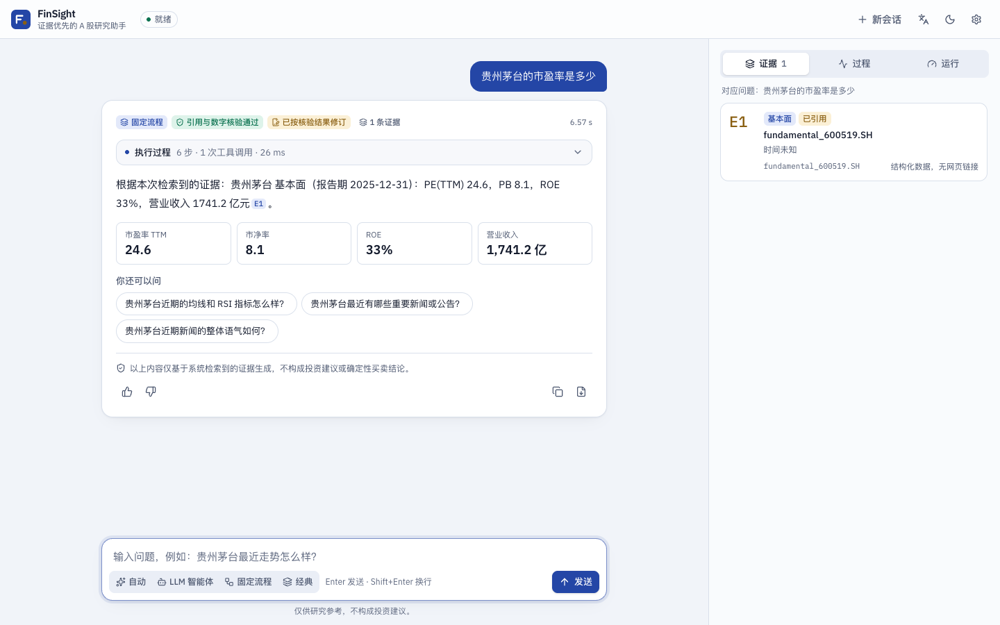
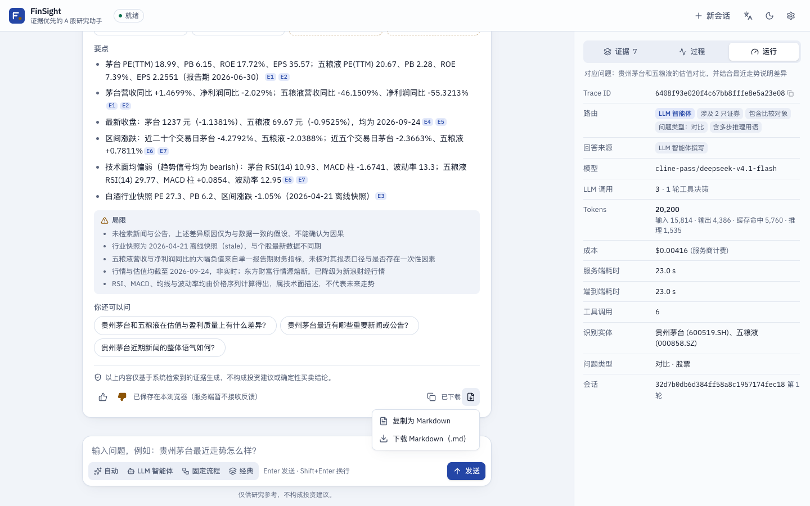
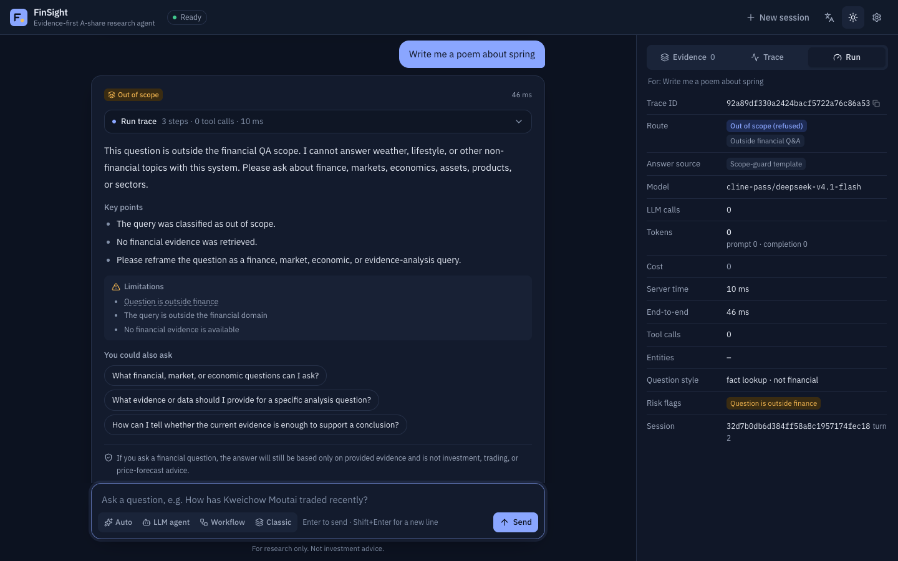
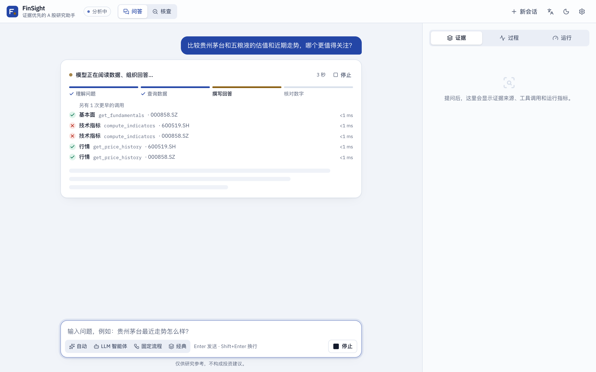
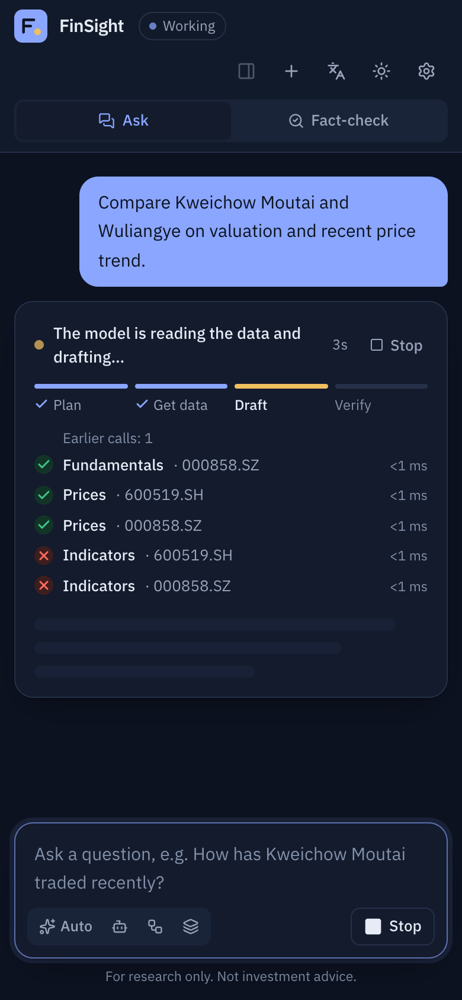
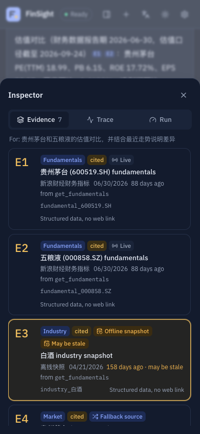
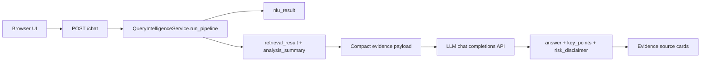

# Local Frontend Chatbot

Languages: English | [中文](zh/frontend-chatbot.md)

The local frontend chatbot is the browser-facing demo for FinSight. The UI streams agent runs from `POST /agent/chat/stream` (or calls the original `POST /chat` in *Classic* mode); the backend runs Query Intelligence and the agent tools, and an OpenAI-compatible LLM API only plans tool calls and phrases answers over the collected evidence. DeepSeek is the default provider configuration in this checkout, not the architecture boundary.

This wrapper must not replace the NLU/Retrieval backbone. Entity resolution, intent, source planning, evidence retrieval, ranking, warnings, and `analysis_summary` still come from Query Intelligence.

## Run

From a fresh clone:

```bash
pip install -r requirements.txt
export DEEPSEEK_API_KEY="your_deepseek_api_key_here"
python scripts/launch_chatbot.py
```

Then open:

```text
http://127.0.0.1:8765/
```

For repeatable local demos, you can disable slow announcement live calls while keeping local announcement seed data available:

```bash
QI_USE_LIVE_ANNOUNCEMENT=0 python scripts/launch_chatbot.py
```

## Browser UI


| | |
|---|---|
|  |  |
|  |  |
|  |  |

<p> </p>

<p> </p>

What the page shows for every answer:

- **Progress before the first token**: an LLM run can take 10–20 s before it writes. Until the first `answer_delta`, the turn shows the current step in plain words ("The model is planning which data to fetch", "Calling data tools", "Checking every number and citation") on a four-part indicator (Plan → Get data → Draft → Verify, the order the graph runs in), every tool called so far with its target (`get_fundamentals · 600519.SH`) and status, the elapsed seconds, a Stop button (the composer's Stop) and a skeleton where the answer will appear; after 8 s of model time it says how long reasoning usually takes. It is driven by `node_start`, `step`, `tool_call` and `tool_result` events (`frontend/src/lib/progress.ts`). When the first token arrives the panel folds into the collapsed run trace, whose header keeps the current step and elapsed time. Screen readers hear one polite status line per step change (`role="status"`); the ticking counter, the tool list and the streaming tokens are not live regions, and the streaming text is `aria-busy`. Pulses and spinners only run without `prefers-reduced-motion`.
- **Run trace**: the graph nodes as they stream in (`step`, `tool_call`, `tool_result` SSE events), then the final trace rebuilt from `spans`, `tool_calls` and `llm.log`: router decision and route reasons, each tool call with arguments, latency, cache hits, retries, errors and produced evidence ids, each LLM step with tokens and latency, the verification result, compliance edits and degradations. It folds away once answer text starts streaming.
- **Streamed answer**: `answer_delta` events (`{"text": "<next chunk>"}`) render progressively with a blinking caret, batched to one render per animation frame. Citation markers, including a half-received `[price_6005`, are hidden while streaming. The final `answer` event is authoritative: its text fades in over the draft, and if verification or compliance changed it, an "Edited after verification" badge shows for a few seconds (the card keeps `data-edited`). Without `answer_delta` (older servers) the card simply appears when the answer arrives.
- **Cited answer**: `[evidence_id]` markers become `E1`, `E2`, … chips. Clicking one opens the evidence ledger (a bottom sheet on phones) and highlights that source. Ids that are not in the run are shown as invalid.
- **Data freshness**: every evidence item shows *Live*, *Fallback source*, *Cached* or *Offline snapshot* from `payload.provenance` (`is_live`, `mode`, `fallback_reason`, `freshness`, `as_of`), with the source, fetch time and humanised fallback reason in a tooltip, plus *May be stale* when the provenance says so or the item is older than its window (10 days for prices, industry and indicators, 200 for fundamentals, 75 for macro, 30 for news, 90 for filings; FAQ and product docs never go stale). The answer gets a banner when any structured or cited evidence is a snapshot, stale, or when daily figures are more than 10 days apart ("Data dated 2026/04/21 to 2026/09/24 · daily figures are 156 days apart · 1 offline snapshot …"), and an informational banner when only fallback sources were used. KPI tiles backed by snapshot or stale evidence get a dashed warning border and label.
- **Readable codes**: route reasons, `degraded` flags, compliance notes, NLU risk flags, retrieval warnings, tool error codes, answer sources, routes, question styles and product types are shown as zh/en labels (`frontend/src/lib/codes.ts`). Parameterised codes are parsed (`budget:step budget of 6 reached` → "Step budget (6) reached; answered early"; `llm_error:<exception>` never shows the exception). Unknown future codes are prettified rather than shown raw. The raw code stays in a tooltip (hover or keyboard focus) and in `data-code`, for power users and tests.
- **Feedback**: thumbs up/down per answer with an optional comment (opened automatically on thumbs-down), posted to `POST /agent/feedback` as `{trace_id, session_id, rating, comment}`. The rating is remembered per `trace_id` in `localStorage` (newest 300). When the server has no such endpoint (404 "Not Found", 405 or 501) the rating is kept locally and the UI says so; a 404 with another detail means the server no longer has the trace; network errors can be retried.
- **Export**: copy the plain answer, or copy / download it as Markdown: the question, route, model, verification, trace id, the answer with `[E1]` references, key points, limitations (with raw codes in parentheses), the numbered evidence list (id, type, source, as-of date, cited / live / fallback / snapshot / stale, URL or "structured data", fallback reason) and the risk disclaimer.
- **Data**: a closing-price chart when a price series is present and KPI tiles (close, change, P/E, P/B, ROE, industry, macro …). A-share colours: red for a rise, green for a fall.
- **Run tab**: `trace_id`, route and its reasons, answer source, model, LLM calls, token usage (prompt / completion / cache hit / reasoning), cost and its source, server latency, and the browser-measured time to first token and end-to-end time, entities, question type and risk flags; a timing waterfall in the Trace tab.
- Mode switcher (Auto / LLM agent / Workflow / Classic), inline clarification (the next message goes to `POST /agent/resume`), suggested next questions, document-tone summary, session memory from `GET /agent/sessions/{id}` (restored after a reload), new session, API key (sent as `X-API-Key`; kept in `sessionStorage` for the tab, in `localStorage` only with the unticked-by-default "Remember on this device" option, see [SECURITY.md](../SECURITY.md#runtime-security-what-the-deployment-enforces-and-its-limits)), Chinese / English, light / dark / system theme, keyboard and screen-reader support, reduced-motion support. The risk disclaimer is always visible and the UI never renders buy/sell calls to action.

### Stack

| Choice | Why |
|---|---|
| React 19 + TypeScript 6 (strict) + Vite 8 | The mainstream 2026 SPA toolchain. No SSR is needed: FastAPI serves the page, so Next.js would add a second server for nothing. TypeScript 6 rather than 7 because typescript-eslint does not support 7 yet. |
| Tailwind CSS v4 (`@tailwindcss/vite`, CSS-first `@theme`) | Design tokens as CSS variables drive light/dark themes without a runtime. Text tokens meet WCAG AA (4.5:1) on every surface in both themes. |
| Radix primitives (`radix-ui`) in shadcn/ui style | Accessible Tabs, Dialog, Tooltip, DropdownMenu and ToggleGroup, with the component code owned in `src/components/ui` as shadcn/ui recommends. The full shadcn chat kits (AI Elements, assistant-ui) assume the Vercel AI SDK message format; FinSight's trace, citation and evidence model is custom, so the chat surface is written directly. |
| Motion (`motion/react`, `LazyMotion` + `m`) | Height animations for the collapsible trace and feedback form, streaming step entrances, the draft-to-final answer fade; `MotionConfig reducedMotion="user"` (the caret stops blinking under reduced motion). |
| TradingView Lightweight Charts v5 | Finance-native canvas chart; loaded lazily only when a price series exists. Recharts/ECharts are larger and less suited to price series. |
| Vitest + Testing Library, Playwright (pytest) + axe-core | Unit tests for parsing (SSE, citations, codes, freshness, export, market data, trace), the feedback client and the answer card; end-to-end tests drive the real FastAPI app, including an axe-core accessibility pass. |

Library APIs were checked against current docs (Context7) before use.

### Bundle

Vite's default 500 kB chunk warning is back in force (the old config raised it to 560 kB to hide a 520 kB entry). Rarely-changing libraries get their own long-cached chunks through Rolldown `output.codeSplitting.groups` (Vite 8's replacement for `manualChunks`), and the price chart and settings dialog load on demand with `React.lazy`.

| Chunk (minified) | Before | After |
|---|---:|---:|
| App entry `index-*.js` | 519.6 kB (gzip 167.9) | 162.3 kB (gzip 54.4) |
| `react` (react, react-dom, scheduler) | in entry | 218.8 kB (gzip 68.3) |
| `radix` (Radix, Floating UI) | in entry | 98.5 kB (gzip 32.3) |
| `motion` | in entry | 81.3 kB (gzip 28.4) |
| `SettingsDialog` (lazy) | in entry | 6.3 kB (gzip 2.3) |
| `PriceChart` (lazy, unchanged) | 167.2 kB (gzip 54.6) | 167.3 kB (gzip 54.6) |

The largest chunk is now 219 kB; nothing triggers the warning. First load transfers about the same bytes as before (the libraries are split, not removed), but the chunks are fetched in parallel and a UI-only change no longer invalidates the cached React/Radix/Motion chunks.

### Accessibility

`tests/test_web_ui.py` injects axe-core (a pinned frontend devDependency, `frontend/node_modules/axe-core/axe.min.js`) and fails on any *serious* or *critical* violation of WCAG 2.0/2.1/2.2 A/AA and axe best practices in: the empty state; an answer with the trace expanded; the inspector trace and run tabs; the feedback form; the export menu; the settings dialog; a refusal; the price chart and KPI tiles; dark English; a clarification; a canned answer with the freshness banner, a snapshot tile and uncited evidence; and on a 390 px phone (empty, answer, evidence sheet). The tests skip the axe checks when `pnpm install` has not been run in `frontend/`.

Issues the pass found and fixed: `--faint` / `--muted` / `--gilt` / `--warn` / `--up` / `--down` text below 4.5:1 in the light theme (e.g. the risk footer at 2.7:1) and `--faint` in the dark theme (4.2:1); inspector tab triggers whose `aria-controls` pointed at panels that were not rendered in the empty state; the chart container being `role="img"` around the library's focusable attribution link (`nested-interactive`); a missing `h1` once the conversation starts and `h3` section headings under it (`heading-order`); dimmed uncited evidence numbers (3.0:1). The pass also surfaced a layout bug: visually hidden text inside the chat pane escaped the scroll container and made the whole page scrollable, so `scrollIntoView` could push the header off screen (the scroll containers are now `relative`; a test asserts the document never scrolls).

In the live Chrome run below, axe reported **0 violations of any impact** on every checked state.

### Develop and build

```bash
cd frontend
pnpm install
pnpm dev          # http://localhost:5173, proxies /chat, /agent, /health to uvicorn on :8765
pnpm typecheck && pnpm lint && pnpm test
pnpm build        # writes query_intelligence/web/dist (commit it)
```

The build is committed so the Python package runs the UI without Node: `GET /` renders `web/dist/index.html` (the configured `ui.title`, and `ui.input_placeholder` / `ui.submit_text` when customized, are injected into it) and `/static/app/*` serves the hashed assets. If `web/dist` is missing, or `QI_WEB_UI=legacy` is set, the original single-file page in `web/static` is served instead. CI rebuilds the app and fails if the committed `dist` differs from the source (two consecutive builds are byte-identical). The Docker image copies the committed build and needs no Node stage.

Browser tests: `python -m playwright install chromium && (cd frontend && pnpm install) && python -m pytest -q tests/test_web_ui.py`. The streaming test wraps the agent service so it emits `answer_delta` events per the contract below; the feedback and freshness tests stub `/agent/feedback` and a canned SSE answer with `page.route`, so they do not depend on backend changes.

### Backend contracts the UI consumes

| Contract | UI behaviour | When the server does not provide it |
|---|---|---|
| SSE `answer_delta` `{"text": "<chunk>"}` on `POST /agent/chat/stream`, before the final `answer` | Progressive text with a caret; final answer replaces it, "edited" badge if different | No streamed text; the answer card appears with the final answer, as before |
| `POST /agent/feedback` `{trace_id, session_id, rating: "up"\|"down", comment}` → `{"ok": true}`, 404 for an unknown trace | Rating and comment sent; state remembered per trace | 404 "Not Found" / 405 / 501: kept in the browser with a notice (Chrome logs the 404 in the console) |
| `evidence_sources[].payload.provenance` (or a top-level `provenance`) | Live / fallback / cached / snapshot / stale badges, answer banner, KPI tile marks | Age-based staleness from `as_of` only |
| Codes in `route_reasons`, `degraded`, `compliance_notes`, `limitations`, `risk_flags`, retrieval `warnings`, tool `error.code` | zh/en labels with the raw code in a tooltip | Unknown codes are prettified (`brand_new_reason` → "Brand new reason") |

### Backend gaps

- `answer_delta` and `POST /agent/feedback` exist on the `round2` backend branch (verified end to end below); against an older server the UI degrades as described above.
- `step` events are emitted when a node finishes, not when it starts, so the live trace shows completed steps plus a "running" row.
- Verification is reported once per run, so only the last `verify` node shows the result.
- Document evidence (news, filings) is sent without `payload`, so its provenance (live source vs local corpus) is not visible; only its age is.
- On the pre-round2 backend the out-of-scope refusal text is the same "weather, lifestyle" template for every non-finance question (round-1 review B6); round2 uses category wording, and the UI labels the limitation either way.

### Verified in Chrome (2026-09-26)

Google Chrome 154 via Playwright (`channel="chrome"`, `--no-proxy-server`) against `uvicorn query_intelligence.api.app:create_app --factory --port 8811` with live market/news/macro data and `cline-pass/deepseek-v4.1-flash`, then against the `round2` backend (18 LLM calls in total across both).

| Check | Result |
|---|---|
| Compare question (agent route, 3–4 LLM calls, 23–31 s) | Cited answer; banner "数据日期 2026/04/21 至 2026/09/24 · 日频数据日期相差 156 天 · 1 条离线快照 · 1 条可能过时 · 4 条来自备用源"; no raw code in the card; run tab labels such as "涉及 2 只证券", "问题类型：对比", "LLM 智能体撰写", "服务商计费" |
| Feedback without the backend endpoint | "已保存在本浏览器（服务端暂不接收反馈）"; the only console messages were Chrome's two 404 lines for those POSTs |
| Markdown export | `finsight-2026-09-26-贵州茅台和五粮液的估值对比….md` with `[E1]` references, 7 evidence entries with provenance and the disclaimer |
| Refusal in dark English | Limitation reads "Question is outside finance" (raw `out_of_scope_query` in the tooltip) |
| Mobile 390 px, dark, English | 0 px horizontal overflow; the document does not scroll; evidence sheet shows Live / Fallback source / Offline snapshot / May be stale |
| axe-core on every state above | 0 violations (any impact) |
| Page errors / failed requests | none |

| Against the `round2` backend (`vite preview` of this build proxying to it, offline snapshot data) | First streamed text after 9.5 s, 336 `answer_delta` events, final answer at 15.9 s swapped in and flagged edited; thumbs-up and a comment → 200 `{"ok": true}`, both stored with the trace; a feedback POST for an unknown trace → 404 → "服务端已找不到这次运行，反馈已保存在本浏览器"; the refusal uses round2's category wording; axe 0 violations while streaming and after |

The streaming screenshots come from the test harness (fake tools, a service that emits `answer_delta`), so they are deterministic.

## Request Flow



If the LLM API is missing, unreachable, or returns invalid JSON, `/chat` returns a structured-summary fallback with `llm.status="fallback"`. It still includes `nlu_result`, `retrieval_result`, and evidence sources.

## LLM API Configuration

Defaults live in `config/app_config.json` and can be overridden by environment variables. The current config namespace is named `deepseek` because DeepSeek is the shipped default. Architecturally, the client calls a chat-completions endpoint and can be pointed at another compatible provider by changing `DEEPSEEK_BASE_URL`, `DEEPSEEK_CHAT_PATH`, and `DEEPSEEK_MODEL`.

| Field | Env var | Default |
|---|---|---|
| `deepseek.api_key` | `DEEPSEEK_API_KEY` | empty |
| `deepseek.base_url` | `DEEPSEEK_BASE_URL` | `https://api.deepseek.com` |
| `deepseek.chat_path` | `DEEPSEEK_CHAT_PATH` | `/chat/completions` |
| `deepseek.model` | `DEEPSEEK_MODEL` | `deepseek-v4-flash` |
| `deepseek.timeout_seconds` | `DEEPSEEK_TIMEOUT_SECONDS` | `60` |
| `deepseek.thinking_type` | `DEEPSEEK_THINKING_TYPE` | `enabled` |
| `deepseek.reasoning_effort` | `DEEPSEEK_REASONING_EFFORT` | `high` |
| `deepseek.max_tokens` | `DEEPSEEK_MAX_TOKENS` | `8192` |

Use `DEEPSEEK_MODEL=deepseek-v4-pro` when you want the higher-capability default-provider model, or set it to another compatible provider's model name when changing the base URL. Use `DEEPSEEK_REASONING_EFFORT=max` for providers that support reasoning controls. The backend sends `response_format={"type":"json_object"}` and prompts the model for one strict JSON object.

## API Contract

`POST /chat` accepts the same frontend context fields as the core pipeline:

```json
{
  "query": "你觉得中国平安怎么样？",
  "user_profile": {},
  "dialog_context": [],
  "top_k": 20,
  "debug": false
}
```

Response fields:

| Field | Meaning |
|---|---|
| `answer` | Final user-facing wording generated by the LLM API or fallback summary. |
| `key_points` | Short bullet points grounded in retrieved evidence. |
| `risk_disclaimer` | Investment-risk disclaimer. |
| `evidence_used` | Evidence IDs selected by the answer layer. |
| `evidence_sources` | UI-ready source cards with title, type, source name, and optional URL. |
| `llm` | `{provider, model, status, error}` for model observability. |
| `nlu_result` | Full Query Intelligence NLU artifact. |
| `retrieval_result` | Full retrieval artifact, including warnings and `analysis_summary`. |

## Verified Local Run

The following screenshots came from real local browser runs on May 3, 2026. The service was started with the default DeepSeek-compatible settings: `deepseek-v4-flash`, thinking enabled, `reasoning_effort=high`, and a local environment variable for the API key. The key is not written to the repository.

Chinese query:

```text
你觉得中国平安怎么样？
```


English query:

```text
What do you think about Ping An Insurance (601318.SH)?
```


Observed checks:

| Check | Result |
|---|---|
| `GET /health` | `{"status":"ok"}` |
| `POST /chat` Chinese query | `llm.status="ok"`, response in Chinese |
| `POST /chat` English query | `llm.status="ok"`, response in English |
| Browser interaction | Input, submit button, answer card, key points, evidence cards, and disclaimer rendered |
| Dependency issue fixed | Added `socksio` so `httpx` can use local SOCKS proxy variables |

## Troubleshooting

If the LLM API falls back with a SOCKS proxy error, install dependencies again:

```bash
pip install -r requirements.txt
```

If live providers fail, inspect `retrieval_result.warnings`. The pipeline is expected to degrade gracefully and still answer from fallback providers or shipped runtime assets when possible.
