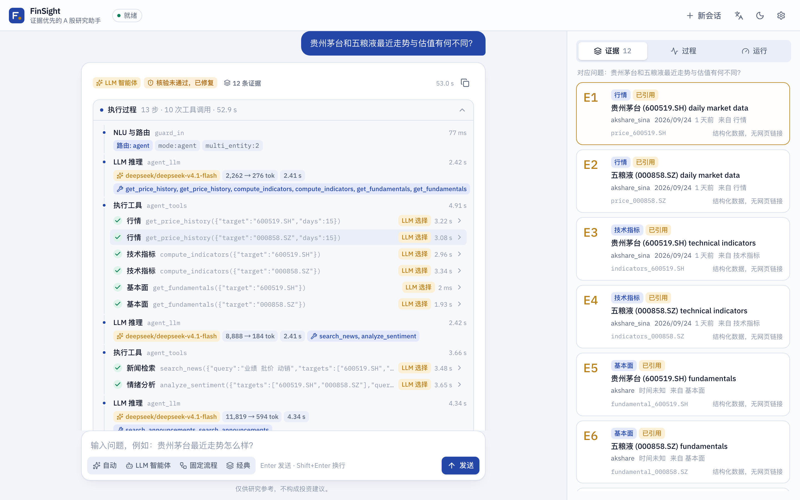
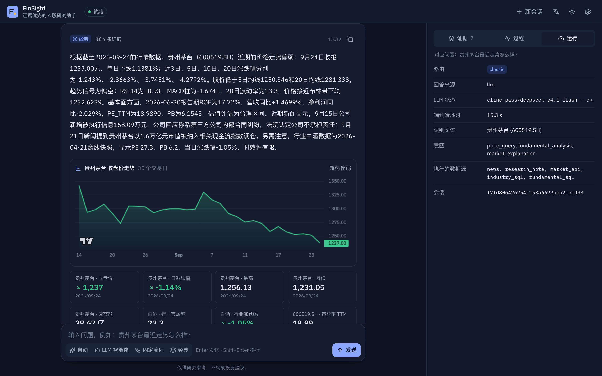
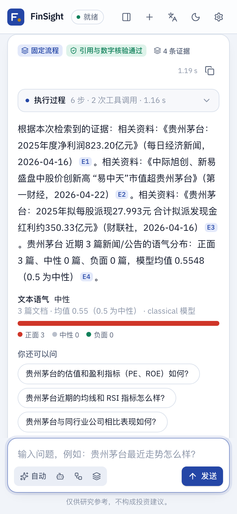
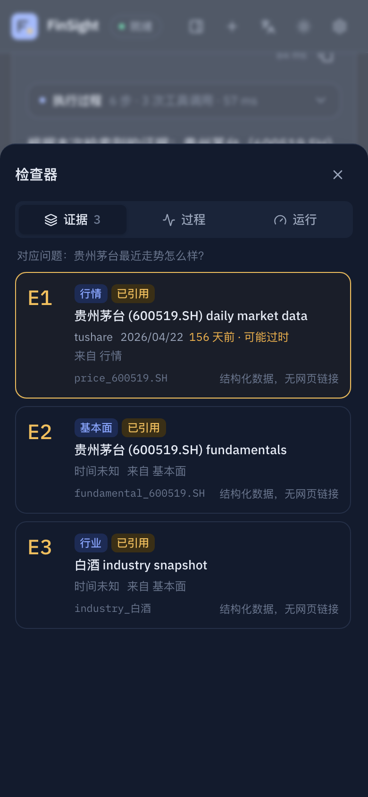
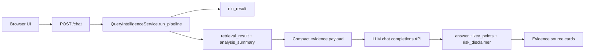

# Local Frontend Chatbot

Languages: English | [中文](zh/frontend-chatbot.md)

The local frontend chatbot is the browser-facing demo for FinSight. The UI streams agent runs from `POST /agent/chat/stream` (or calls the original `POST /chat` in *Classic* mode); the backend runs Query Intelligence and the agent tools, and an OpenAI-compatible LLM API only plans tool calls and phrases answers over the collected evidence. DeepSeek is the default provider configuration in this checkout, not the architecture boundary.

This wrapper must not replace the NLU/Retrieval backbone. Entity resolution, intent, source planning, evidence retrieval, ranking, warnings, and `analysis_summary` still come from Query Intelligence.

## Run

From a fresh clone:

```bash
pip install -r requirements.txt
export DEEPSEEK_API_KEY="your_deepseek_api_key_here"
python scripts/launch_chatbot.py
```

Then open:

```text
http://127.0.0.1:8765/
```

For repeatable local demos, you can disable slow announcement live calls while keeping local announcement seed data available:

```bash
QI_USE_LIVE_ANNOUNCEMENT=0 python scripts/launch_chatbot.py
```

## Browser UI



| | |
|---|---|
|  |   |

What the page shows for every answer:

- **Run trace**: the graph nodes as they stream in (`step`, `tool_call`, `tool_result` SSE events), then the final trace rebuilt from `spans`, `tool_calls` and `llm.log`: router decision and `route_reasons`, each tool call with arguments, latency, cache hits, retries, errors and produced evidence ids, each LLM step with tokens and latency, the verification result, compliance edits and `degraded` flags. It collapses once the answer arrives.
- **Cited answer**: `[evidence_id]` markers become `E1`, `E2`, … chips. Clicking one opens the evidence ledger (a bottom sheet on phones) and highlights that source. Ids that are not in the run are shown as invalid.
- **Evidence ledger**: numbered sources with type, source, timestamp, age (flagged when possibly stale), the tool that produced it, and a link when the source has an http(s) URL.
- **Data**: a closing-price chart when a price series is present and KPI tiles (close, change, P/E, P/B, ROE, industry, macro …). A-share colours: red for a rise, green for a fall. Today the series is only available in *Classic* mode (see "Backend gaps" below).
- **Run tab**: `trace_id`, route, answer source, model, LLM calls, token usage (prompt / completion / cache hit / reasoning), cost and its source, server and end-to-end latency, entities and risk flags; a timing waterfall in the Trace tab.
- Mode switcher (Auto / LLM agent / Workflow / Classic), inline clarification (the next message goes to `POST /agent/resume`), suggested next questions, document-tone summary, session memory from `GET /agent/sessions/{id}` (restored after a reload), new session, API key (sent as `X-API-Key`), Chinese / English, light / dark / system theme, keyboard and screen-reader support, reduced-motion support. The risk disclaimer is always visible and the UI never renders buy/sell calls to action.

### Stack

| Choice | Why |
|---|---|
| React 19 + TypeScript 6 (strict) + Vite 8 | The mainstream 2026 SPA toolchain. No SSR is needed: FastAPI serves the page, so Next.js would add a second server for nothing. TypeScript 6 rather than 7 because typescript-eslint does not support 7 yet. |
| Tailwind CSS v4 (`@tailwindcss/vite`, CSS-first `@theme`) | Design tokens as CSS variables drive light/dark themes without a runtime. |
| Radix primitives (`radix-ui`) in shadcn/ui style | Accessible Tabs, Dialog, Tooltip and ToggleGroup, with the component code owned in `src/components/ui` as shadcn/ui recommends. The full shadcn chat kits (AI Elements, assistant-ui) assume the Vercel AI SDK message format; FinSight's trace, citation and evidence model is custom, so the chat surface is written directly. |
| Motion (`motion/react`, `LazyMotion` + `m`) | Height animations for the collapsible trace, streaming step entrances; `MotionConfig reducedMotion="user"`. |
| TradingView Lightweight Charts v5 | Finance-native canvas chart, about 35 kB core; loaded lazily only when a price series exists. Recharts/ECharts are larger and less suited to price series. |
| Vitest + Testing Library, Playwright (pytest) | Unit tests for parsing (SSE, citations, market data, trace) and components; end-to-end tests drive the real FastAPI app. |

Library APIs were checked against current docs (Context7) before use.

### Develop and build

```bash
cd frontend
pnpm install
pnpm dev          # http://localhost:5173, proxies /chat, /agent, /health to uvicorn on :8765
pnpm typecheck && pnpm lint && pnpm test
pnpm build        # writes query_intelligence/web/dist (commit it)
```

The build is committed so the Python package runs the UI without Node: `GET /` renders `web/dist/index.html` (the configured `ui.title`, and `ui.input_placeholder` / `ui.submit_text` when customized, are injected into it) and `/static/app/*` serves the hashed assets. If `web/dist` is missing, or `QI_WEB_UI=legacy` is set, the original single-file page in `web/static` is served instead. CI rebuilds the app and fails if the committed `dist` differs from the source. The Docker image copies the committed build and needs no Node stage.

Browser tests: `python -m playwright install chromium && python -m pytest -q tests/test_web_ui.py`.

### Backend gaps

- Agent responses do not include structured payloads: `evidence_sources` omit `payload` and `tool_calls` omit `data`, so agent answers cannot be charted. The UI already renders `evidence_sources[].payload` (`recent_closes`, `close`, `pe_ttm`, …) when present; adding `"payload"` to `_source_view` in `query_intelligence/agent/graph.py` would enable charts in agent mode.
- `step` events are emitted when a node finishes, not when it starts, so the live trace shows completed steps plus a "running" row.
- Verification is reported once per run, so only the last `verify` node shows the result.

## Request Flow



If the LLM API is missing, unreachable, or returns invalid JSON, `/chat` returns a structured-summary fallback with `llm.status="fallback"`. It still includes `nlu_result`, `retrieval_result`, and evidence sources.

## LLM API Configuration

Defaults live in `config/app_config.json` and can be overridden by environment variables. The current config namespace is named `deepseek` because DeepSeek is the shipped default. Architecturally, the client calls a chat-completions endpoint and can be pointed at another compatible provider by changing `DEEPSEEK_BASE_URL`, `DEEPSEEK_CHAT_PATH`, and `DEEPSEEK_MODEL`.

| Field | Env var | Default |
|---|---|---|
| `deepseek.api_key` | `DEEPSEEK_API_KEY` | empty |
| `deepseek.base_url` | `DEEPSEEK_BASE_URL` | `https://api.deepseek.com` |
| `deepseek.chat_path` | `DEEPSEEK_CHAT_PATH` | `/chat/completions` |
| `deepseek.model` | `DEEPSEEK_MODEL` | `deepseek-v4-flash` |
| `deepseek.timeout_seconds` | `DEEPSEEK_TIMEOUT_SECONDS` | `60` |
| `deepseek.thinking_type` | `DEEPSEEK_THINKING_TYPE` | `enabled` |
| `deepseek.reasoning_effort` | `DEEPSEEK_REASONING_EFFORT` | `high` |
| `deepseek.max_tokens` | `DEEPSEEK_MAX_TOKENS` | `8192` |

Use `DEEPSEEK_MODEL=deepseek-v4-pro` when you want the higher-capability default-provider model, or set it to another compatible provider's model name when changing the base URL. Use `DEEPSEEK_REASONING_EFFORT=max` for providers that support reasoning controls. The backend sends `response_format={"type":"json_object"}` and prompts the model for one strict JSON object.

## API Contract

`POST /chat` accepts the same frontend context fields as the core pipeline:

```json
{
  "query": "你觉得中国平安怎么样？",
  "user_profile": {},
  "dialog_context": [],
  "top_k": 20,
  "debug": false
}
```

Response fields:

| Field | Meaning |
|---|---|
| `answer` | Final user-facing wording generated by the LLM API or fallback summary. |
| `key_points` | Short bullet points grounded in retrieved evidence. |
| `risk_disclaimer` | Investment-risk disclaimer. |
| `evidence_used` | Evidence IDs selected by the answer layer. |
| `evidence_sources` | UI-ready source cards with title, type, source name, and optional URL. |
| `llm` | `{provider, model, status, error}` for model observability. |
| `nlu_result` | Full Query Intelligence NLU artifact. |
| `retrieval_result` | Full retrieval artifact, including warnings and `analysis_summary`. |

## Verified Local Run

The following screenshots came from real local browser runs on May 3, 2026. The service was started with the default DeepSeek-compatible settings: `deepseek-v4-flash`, thinking enabled, `reasoning_effort=high`, and a local environment variable for the API key. The key is not written to the repository.

Chinese query:

```text
你觉得中国平安怎么样？
```


English query:

```text
What do you think about Ping An Insurance (601318.SH)?
```


Observed checks:

| Check | Result |
|---|---|
| `GET /health` | `{"status":"ok"}` |
| `POST /chat` Chinese query | `llm.status="ok"`, response in Chinese |
| `POST /chat` English query | `llm.status="ok"`, response in English |
| Browser interaction | Input, submit button, answer card, key points, evidence cards, and disclaimer rendered |
| Dependency issue fixed | Added `socksio` so `httpx` can use local SOCKS proxy variables |

## Troubleshooting

If the LLM API falls back with a SOCKS proxy error, install dependencies again:

```bash
pip install -r requirements.txt
```

If live providers fail, inspect `retrieval_result.warnings`. The pipeline is expected to degrade gracefully and still answer from fallback providers or shipped runtime assets when possible.
