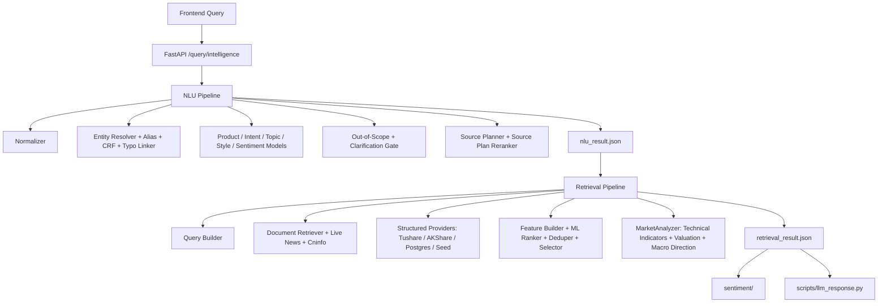

# Query Intelligence

Query Intelligence is the owned core of ARIN. It turns a financial query into two evidence artifacts:

- `nlu_result`: what the user asked, what entities were resolved, what evidence is needed, and which sources should run.
- `retrieval_result`: what evidence was found, how complete it is, how it was ranked, and what structured analysis signals are available.

Downstream systems must consume these artifacts instead of re-inferring intent, targets, or source plans.

## Scope and Boundaries

Default shipped runtime coverage is China-market v1:

- A-share stocks: price, news, announcements, financials, industry, fundamentals, valuation, risk, comparison.
- ETF/funds: NAV, fixed investment, fees, subscription/redemption, product mechanics, ETF/LOF/index-fund comparison.
- Index/market/sectors: CSI 300, SSE Composite, sector indexes such as liquor or semiconductors.
- Macro/policy/indicators: CPI, PMI, M2, treasury yields, rate cuts, policy impact.
- Question styles: factual lookup, why up/down, hold judgment, buy/sell timing, comparison, fundamentals, risk, forecast-like questions.

Unsupported or non-financial questions should be marked `out_of_scope`.

NLU and Retrieval use explainable methods as their main path: rules, dictionaries, TF-IDF, linear classifiers, CRF, tree models, learning-to-rank, and provider-backed structured retrieval. `sentiment/` and `scripts/llm_response.py` are downstream exceptions and may use transformer or LLM models over compact evidence.

## Architecture



## Key Paths

| Path | Description |
|---|---|
| `query_intelligence/api/app.py` | FastAPI app. |
| `query_intelligence/service.py` | Orchestrates NLU and retrieval. |
| `query_intelligence/contracts.py` | Pydantic request/response contracts. |
| `query_intelligence/config.py` | Environment-driven settings. |
| `query_intelligence/data_loader.py` | Runtime CSV/JSON loaders. |
| `query_intelligence/nlu/pipeline.py` | NLU chain. |
| `query_intelligence/retrieval/pipeline.py` | Retrieval chain. |
| `query_intelligence/retrieval/market_analyzer.py` | Technical indicators and `analysis_summary`. |
| `query_intelligence/integrations/` | Tushare, AKShare, Cninfo, efinance providers. |
| `schemas/` | JSON Schemas for external validation. |

## API

API code is in `query_intelligence/api/app.py`.

| Endpoint | Purpose | Input | Output |
|---|---|---|---|
| `GET /health` | Health check | none | `{"status":"ok"}` |
| `POST /nlu/analyze` | NLU only | `AnalyzeRequest` | `NLUResult` |
| `POST /retrieval/search` | Retrieval from an existing NLU result | `RetrievalRequest` | `RetrievalResult` |
| `POST /query/intelligence` | End-to-end NLU + Retrieval | `PipelineRequest` | `PipelineResponse` |
| `POST /query/intelligence/artifacts` | End-to-end run and write files | `ArtifactRequest` | `ArtifactResponse` |

### Pipeline Request

```json
{
  "query": "你觉得中国平安怎么样？",
  "user_profile": {
    "risk_preference": "balanced",
    "preferred_market": "cn",
    "holding_symbols": ["601318.SH"]
  },
  "dialog_context": [
    {
      "role": "user",
      "content": "我持有中国平安"
    }
  ],
  "top_k": 10,
  "debug": false
}
```

| Field | Type | Required | Description |
|---|---:|---:|---|
| `query` | string | yes | Raw user query, 1 to 2000 characters. |
| `user_profile` | object | no | Holdings, risk preference, preferred market, or other caller metadata. |
| `dialog_context` | array | no | Prior turns, previous entities, or clarification state. |
| `top_k` | integer | no | Retrieval output limit, 1 to 100, default 20. |
| `debug` | boolean | no | Enables extra debug traces. Keep `false` in production. |

`ArtifactRequest` adds optional `session_id` and `message_id`; the response includes paths for `query.txt`, `nlu_result.json`, `retrieval_result.json`, and `manifest.json`.

## NLUResult

| Field | Type | Description |
|---|---:|---|
| `query_id` | string | UUID shared by NLU and retrieval outputs. |
| `raw_query` | string | Original frontend query. |
| `normalized_query` | string | Normalized query text. |
| `question_style` | enum | `fact`, `why`, `compare`, `advice`, `forecast`. |
| `product_type` | object | Single-label product prediction with `label` and `score`. |
| `intent_labels` | array | Multi-label intent predictions with scores. |
| `topic_labels` | array | Multi-label topic predictions with scores. |
| `entities` | array | Entity resolution results. |
| `comparison_targets` | array | Targets in comparison queries. |
| `keywords` | array | Retrieval keywords. |
| `time_scope` | enum | `today`, `recent_3d`, `recent_1w`, `recent_1m`, `recent_1q`, `long_term`, `unspecified`. |
| `forecast_horizon` | string | Forecast or holding horizon, usually `short_term`, `medium_term`, or `long_term`. |
| `sentiment_of_user` | string | User tone, such as `positive`, `neutral`, `negative`, `bullish`, `bearish`, or `anxious`. |
| `operation_preference` | enum | `buy`, `sell`, `hold`, `reduce`, `observe`, `unknown`. |
| `required_evidence_types` | array | Evidence requirements for downstream retrieval and answer generation. |
| `source_plan` | array | Sources retrieval should try to execute. |
| `risk_flags` | array | Risk and safety flags. |
| `missing_slots` | array | Missing required slots. |
| `confidence` | float | Overall NLU confidence. |
| `explainability` | object | Matched rules and top model features. |

### NLU Labels

| Field | Values |
|---|---|
| `product_type.label` | `stock`, `etf`, `fund`, `index`, `macro`, `generic_market`, `unknown`, `out_of_scope` |
| `intent_labels[].label` | `price_query`, `market_explanation`, `hold_judgment`, `buy_sell_timing`, `product_info`, `risk_analysis`, `peer_compare`, `fundamental_analysis`, `valuation_analysis`, `macro_policy_impact`, `event_news_query`, `trading_rule_fee` |
| `topic_labels[].label` | `price`, `news`, `industry`, `macro`, `policy`, `fundamentals`, `valuation`, `risk`, `comparison`, `product_mechanism` |
| `required_evidence_types[]` | `price`, `news`, `industry`, `fundamentals`, `valuation`, `risk`, `macro`, `comparison`, `product_mechanism` |
| `risk_flags[]` | `investment_advice_like`, `out_of_scope_query`, `entity_not_found`, `entity_ambiguous`, `clarification_required` |
| `missing_slots[]` | `missing_entity`, `comparison_target` |

### Entity Fields

| Field | Description |
|---|---|
| `mention` | Text span from the query. |
| `entity_type` | Usually `stock`, `etf`, `fund`, `index`, `sector`, `macro_indicator`, or `policy`. |
| `confidence` | Entity confidence. |
| `match_type` | Current matching paths include `alias_exact`, `alias_fuzzy`, `fuzzy`, `crf_fuzzy`, `linked`, `context_dialog`, `context_profile`. |
| `entity_id` | Runtime entity ID. |
| `canonical_name` | Canonical entity name. |
| `symbol` | Security or indicator symbol when available. |
| `exchange` | Exchange code when known. |

## RetrievalResult

| Field | Type | Description |
|---|---:|---|
| `query_id` | string | Same query ID as `NLUResult`. |
| `nlu_snapshot` | object | Key NLU fields used by retrieval. |
| `executed_sources` | array | Sources actually executed; may be smaller than `source_plan`. |
| `documents` | array | Unstructured evidence. |
| `structured_data` | array | Structured evidence rows. |
| `evidence_groups` | array | Deduplication or clustering groups. |
| `coverage` | object | High-level evidence coverage. |
| `coverage_detail` | object | Fine-grained coverage flags. |
| `warnings` | array | Retrieval warnings. |
| `retrieval_confidence` | float | Overall retrieval confidence. |
| `analysis_summary` | object | Pre-computed market/fundamental/macro/data-readiness signals. |
| `debug_trace` | object | Candidate counts and top-ranked evidence IDs. |

### Document Evidence

| Field | Description |
|---|---|
| `evidence_id` | Unique evidence ID. |
| `source_type` | Document source type. |
| `source_name` | Source name, such as `cninfo`, `akshare_sina`, or a news outlet. |
| `source_url` | Web or PDF URL. Dataset-only notes may use `dataset://...`. |
| `provider` | Provider name. |
| `title`, `summary`, `text_excerpt`, `body` | Text fields for downstream reading. |
| `body_available` | Whether full body text is available. |
| `publish_time`, `retrieved_at` | Time metadata. |
| `entity_hits` | Matched symbols or entity names. |
| `retrieval_score`, `rank_score` | Initial and reranked scores. |
| `reason` | Ranking reasons. |
| `payload` | Optional raw extension object. |

### Structured Evidence

| Field | Description |
|---|---|
| `evidence_id` | Unique structured evidence ID. |
| `source_type` | Structured source type. |
| `source_name`, `provider` | Source metadata. |
| `source_url` | Public page URL when available; API-only rows may keep this null. |
| `provider_endpoint` | API/function endpoint, such as `akshare.stock_zh_a_hist` or `tushare.daily`. |
| `query_params` | Provider query parameters. |
| `source_reference` | Traceable reference such as `provider://akshare_sina/stock_zh_a_hist`. |
| `as_of`, `period`, `retrieved_at` | Time metadata. |
| `field_coverage` | Field completeness summary. |
| `quality_flags` | Data quality flags. |
| `payload` | Business payload consumed by downstream models. |

### Source Types

| Type | Used In | Meaning |
|---|---|---|
| `news` | documents | News articles from live or local providers. |
| `announcement` | documents | Exchange or Cninfo-style public company announcement. |
| `research_note` | documents | Research report, analyst note, or research-style dataset document. |
| `faq` | documents | Curated FAQ for rules, fees, or product mechanics. |
| `product_doc` | documents | Product document or explainer. |
| `market_api` | structured | Stock/ETF/fund/index quote or price-history data. |
| `fundamental_sql` | structured | Company financial indicators, valuation, profitability, or fundamentals. |
| `industry_sql` | structured | Industry identity, sector trend, or sector context. |
| `macro_sql` | structured | Macro seed or macro table data. |
| `fund_nav`, `fund_fee`, `fund_redemption`, `fund_profile` | structured | Fund and ETF product data. |
| `index_daily`, `index_valuation` | structured | Index quote and valuation data. |
| `macro_indicator`, `policy_event` | structured | Live macro indicators or policy records. |

### Coverage

| Key | Meaning |
|---|---|
| `coverage.price` | Price, NAV, or market evidence exists. |
| `coverage.news` | At least one news document exists. |
| `coverage.industry` | Industry evidence exists. |
| `coverage.fundamentals` | Fundamental evidence exists. |
| `coverage.announcement` | Announcement evidence exists. |
| `coverage.product_mechanism` | FAQ/product/fund mechanism evidence exists. |
| `coverage.macro` | Macro or policy evidence exists. |
| `coverage.risk` | Risk-relevant evidence exists. |
| `coverage.comparison` | Comparison query has evidence for at least two targets. |

`coverage_detail` uses more specific keys such as `price_history`, `financials`, `valuation`, `industry_snapshot`, `fund_nav`, `fund_fee`, `fund_redemption`, `fund_profile`, `index_daily`, `index_valuation`, `macro_indicator`, and `policy_event`.

### Warnings and Quality Flags

| Field | Value | Meaning |
|---|---|---|
| `warnings` | `out_of_scope_query` | NLU classified the query as out of scope; retrieval abstained. |
| `warnings` | `clarification_required_missing_entity` | Query needs clarification, usually because an entity is missing or unresolved. |
| `warnings` | `announcement_not_found_recent_window` | Announcements were requested but no recent matching announcement was found. |
| `quality_flags` | `seed_source` | Row came from bundled seed data, not a live provider. |
| `quality_flags` | `missing_source_url` | No public page URL is attached. |
| `quality_flags` | `empty_payload` | No business payload fields are present. |
| `quality_flags` | `missing_values` | At least one business payload field is null. |

### Ranking Reasons

Current reason values include `lexical_score`, `trigram_similarity`, `entity_exact_match`, `alias_match`, `title_hit`, `keyword_coverage`, `intent_compatibility`, `topic_compatibility`, `product_type_match`, `source_credibility`, `recency_score`, `is_primary_disclosure`, `doc_length`, `time_window_match`, and `ticker_hit`.

## Analysis Summary

`analysis_summary` is built by `query_intelligence/retrieval/market_analyzer.py`. It summarizes evidence; it is not investment advice.

Typical shape:

```text
analysis_summary
├── market_signal
│   ├── trend_signal
│   ├── rsi_14
│   ├── ma5 / ma20
│   ├── macd
│   ├── bollinger
│   ├── volatility_20d
│   └── pct_change_nd
├── fundamental_signal
│   ├── pe_ttm / pb / roe
│   └── valuation_assessment
├── macro_signal
│   ├── indicators[]
│   └── overall
└── data_readiness
    ├── has_price_data / has_fundamentals / has_macro / has_news
    ├── has_technical_indicators
    ├── relevant_intents
    └── relevant_topics
```

## Live Providers

| Source type | Provider | Endpoint or source | Notes |
|---|---|---|---|
| `market_api` | Tushare | `tushare.daily` | Requires `TUSHARE_TOKEN`; preferred for A-share data. |
| `fundamental_sql` | Tushare | `tushare.fina_indicator` | Preferred for financial indicators. |
| `market_api` | AKShare / efinance | `stock_zh_a_hist`, Sina quote, efinance fallback | Token-free fallback. |
| `news` | AKShare / Eastmoney | `stock_news_em` | Returns web URLs for valid symbols where available. |
| `news` | Tushare | `major_news` | May not include public URLs. |
| `announcement` | Cninfo | `hisAnnouncement/query`, static PDF base | Announcement metadata and PDF URLs. |
| `macro_sql` | AKShare | CPI, PMI, M2, China/US yield functions | Macro indicators. |
| `fund/etf` | AKShare | ETF history, open-fund info, fund detail | NAV, fee, redemption, profile. |
| `index` | AKShare | index daily and CSIndex valuation | Index market and valuation data. |
| `research_note`, `faq`, `product_doc` | local runtime | `data/runtime/documents.jsonl` | Clone-usable local corpus. |
| optional | PostgreSQL | `QI_POSTGRES_DSN` | Production document and structured stores. |

For pure API structured rows, `source_url` may be null. Use `provider_endpoint`, `query_params`, and `source_reference` for traceability.

## Environment Variables

| Variable | Default | Description |
|---|---|---|
| `TUSHARE_TOKEN` | empty | Tushare API token. |
| `QI_POSTGRES_DSN` | empty | PostgreSQL DSN. |
| `CNINFO_ANNOUNCEMENT_URL` | Cninfo default | Cninfo announcement endpoint. |
| `CNINFO_STATIC_BASE` | `https://static.cninfo.com.cn/` | Cninfo PDF base URL. |
| `QI_HTTP_TIMEOUT_SECONDS` | `15` | Live provider HTTP timeout. |
| `QI_USE_LIVE_MARKET` | `false` | Enable live market/fundamental providers. |
| `QI_USE_LIVE_NEWS` | follows `QI_USE_LIVE_MARKET` | Enable live news. |
| `QI_USE_LIVE_ANNOUNCEMENT` | follows `QI_USE_LIVE_MARKET` | Enable Cninfo announcements. |
| `QI_USE_LIVE_MACRO` | `false` | Enable live macro indicators. |
| `QI_USE_POSTGRES_RETRIEVAL` | `false` | Enable PostgreSQL retrieval. |
| `QI_MODELS_DIR` | `models` | Model directory. |
| `QI_API_OUTPUT_DIR` | `outputs/query_intelligence` | Artifact output directory. |
| `QI_ENTITY_MASTER_PATH` | auto | Runtime entity CSV override. |
| `QI_ALIAS_TABLE_PATH` | auto | Runtime alias CSV override. |
| `QI_DOCUMENTS_PATH` | auto | Runtime document corpus override. |

Runtime load order:

- Entity master: `QI_ENTITY_MASTER_PATH` > `data/runtime/entity_master.csv` > `data/entity_master.csv`
- Alias table: `QI_ALIAS_TABLE_PATH` > `data/runtime/alias_table.csv` > `data/alias_table.csv`
- Documents: `QI_DOCUMENTS_PATH` > `data/runtime/documents.jsonl` or `.json` > `data/documents.json`
- Structured seed fallback: `data/structured_data.json`

## Troubleshooting

| Symptom | Check |
|---|---|
| A trained stock cannot be resolved | Training data does not populate runtime entity stores. Run `python -m scripts.materialize_runtime_entity_assets`. |
| `source_url` is null | Structured API rows may not have URLs; inspect `provider_endpoint`, `query_params`, and `source_reference`. |
| `executed_sources` is smaller than `source_plan` | Live flags, tokens, entity symbols, provider availability, or safety skipping can reduce executed sources. |
| API returns JSON but no natural-language answer | Expected. Use `scripts/llm_response.py` for downstream answer JSON. |
| Production rows come from `seed` | Enable live providers or PostgreSQL and verify provider credentials. |
