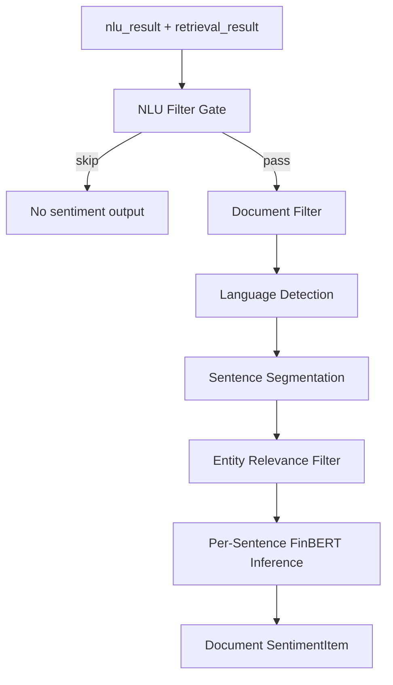

# Document Sentiment Analysis

`sentiment/` is an implemented downstream module that consumes Query Intelligence artifacts and classifies retrieved documents as `positive`, `negative`, or `neutral`.

It is separate from the NLU/Retrieval backbone. It should use upstream `nlu_result` and `retrieval_result` instead of redoing query understanding.

## Status

| Component | File | Status |
|---|---|---|
| Schemas | `sentiment/schemas.py` | implemented |
| Preprocessor | `sentiment/preprocessor.py` | implemented |
| FinBERT classifier | `sentiment/classifier.py` | implemented |
| Manual runner | `manual_test/run_sentiment_test.py` | implemented |
| Integrated manual flag | `manual_test/run_manual_query.py --sentiment` | implemented |
| FastAPI sentiment routes | none | not wired into `query_intelligence/api/app.py` |
| Lightweight classifier | training path exists for NLU sentiment; document-sentiment lightweight mode is planned |

## Pipeline



## Input Rules

The preprocessor uses `nlu_result` for skip decisions and entity names:

| Field | Usage |
|---|---|
| `product_type.label` | Skip entirely if `out_of_scope`. |
| `intent_labels` | Skip entirely if `product_info` or `trading_rule_fee`. |
| `risk_flags` | Skip if `out_of_scope_query` is present. |
| `missing_slots` | Skip if `missing_entity` is present. |
| `entities` | Build entity name and symbol maps for relevance filtering. |
| `query_id` | Propagate traceability. |

The module analyzes `retrieval_result.documents[]` entries with supported source types:

| Source type | Behavior |
|---|---|
| `news` | analyzed |
| `announcement` | analyzed |
| `research_note` | analyzed |
| `product_doc` | analyzed |
| `faq` | skipped |

If body text is unavailable, title and summary are used as short-text fallback.

## Preprocessing

1. Extract documents from retrieval output.
2. Detect language. `lingua-language-detector` is preferred when available; a character-ratio fallback is used otherwise.
3. Split sentences. Chinese uses punctuation rules; English uses an abbreviation-aware tokenizer when available.
4. Filter by entity relevance. Exact substring matching is the fast path; fuzzy matching handles variants.
5. Fall back to title plus the first sentences when no entity-specific sentence matches.
6. Send relevant sentences to the classifier.

## Classifier

The implemented high-resource path uses FinBERT-family models:

| Language | Model path |
|---|---|
| Chinese | Chinese FinBERT-family model for financial tone |
| English | `ProsusAI/finbert` family |
| mixed | Route sentence groups by language and aggregate |
| unknown | Fallback or neutral handling |

The classifier runs per-sentence inference and aggregates to a document label. This matches FinBERT's sentence-level training distribution better than feeding long documents directly.

## Usage

Run sentiment as part of a manual Query Intelligence run:

```bash
python manual_test/run_manual_query.py --query "茅台最近有什么消息" --sentiment
```

Use real FinBERT models:

```bash
python manual_test/run_manual_query.py --query "茅台最近有什么消息" --sentiment --real-models
```

Run the standalone sentiment tester:

```bash
python manual_test/run_sentiment_test.py
python manual_test/run_sentiment_test.py --real-models
python manual_test/run_sentiment_test.py --input manual_test/output/<run-dir>
python manual_test/run_sentiment_test.py --json-file data.json
```

Python boundary:

```python
from sentiment import Preprocessor, SentimentClassifier

preprocessor = Preprocessor()
skip_reason, docs, filter_meta = preprocessor.process_query(nlu_result, retrieval_result)

if not skip_reason:
    classifier = SentimentClassifier()
    results = classifier.analyze_documents(docs)
```

## Output

`SentimentItem` fields:

| Field | Type | Description |
|---|---|---|
| `evidence_id` | string | Same ID as `retrieval_result.documents[].evidence_id`. |
| `source_type` | string | `news`, `announcement`, `research_note`, or `product_doc`. |
| `title` | string | Document title. |
| `publish_time` | string or null | Upstream publish timestamp. |
| `source_name` | string or null | Upstream source name. |
| `entity_symbols` | array | Symbols from entity hits. |
| `sentiment_label` | string | `positive`, `negative`, or `neutral`. |
| `sentiment_score` | float | 0.0 to 1.0; close to 1.0 is positive, close to 0.0 is negative. |
| `confidence` | float | Model confidence, 0.0 to 1.0. |
| `text_level` | string | `full` or `short`. |
| `relevant_excerpt` | string or null | Text segments sent to the model. |
| `rank_score` | float or null | Propagated from retrieval output. |

`FilterMeta` fields:

| Field | Description |
|---|---|
| `skipped_by_product_type` | Query skipped because product type is unsupported. |
| `skipped_by_intent` | Query skipped because the intent does not need sentiment. |
| `skipped_docs_count` | Documents skipped because of source type or empty text. |
| `short_text_fallback_count` | Documents analyzed with title/summary only. |
| `analyzed_docs_count` | Documents sent to the classifier. |

## Tests

```bash
python -m pytest -q tests/test_sentiment_preprocessor.py tests/test_sentiment_classifier.py tests/test_sentiment_pipeline.py
python manual_test/test_fuzz_sentiment.py
python manual_test/test_coverage_sentiment.py --quick
```

## Design Notes

- The module reuses Query Intelligence entity resolution instead of running a second NER system.
- Per-sentence inference keeps long documents within model limits and improves relevance.
- `rank_score` is currently propagated for future weighted aggregation; the MVP output is document-level.
- A future aggregate layer can weight by rank, source type, or recency without changing upstream QI contracts.
