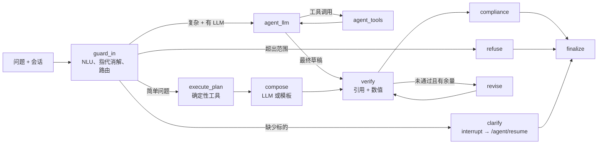

# Agent 层

语言：[English](../agent.md) | 中文

Agent 层（`query_intelligence/agent/`）把 FinSight 从固定的「NLU → 检索 → 一次 LLM 调用」流水线升级为会调用工具的研究助手。它**建立在** Query Intelligence 之上：NLU 与检索仍然是经典、可解释的方法（见 [AGENTS.md](../../AGENTS.md)），Agent 只负责规划、调用工具、用证据校验草稿，并执行合规规则。

两条回答路径共用一张 LangGraph 状态图：

- **workflow**：确定性规划器根据 `nlu_result`（问题类型、意图、source plan、词法线索）生成工具调用。LLM 只负责组织语言（未配置时退回模板）。这条路径可复现，可离线运行。
- **agent**：由 LLM（DeepSeek，OpenAI 兼容的 tool calling）在预算内逐步选择工具。配置了 LLM 时用于复杂问题。

`mode=auto` 逐轮路由；`mode=workflow` 与 `mode=agent` 强制指定路径。没有 LLM 密钥时，`agent` 路由会降级为 `workflow`，并在 `degraded` 中说明。

## 状态图



| 节点 | 作用 |
|---|---|
| `guard_in` | 以会话历史作为 `dialog_context` 运行 NLU；把代词（它 / it / its）改写为上一轮的唯一上市实体；对明确的金融/宏观问题纠正 NLU 的 out-of-scope 误判；然后路由。每个决策都写入 `route_reasons`。 |
| `refuse` | 超范围回答与后续问题建议，复用 `scripts/llm_response.py` 的措辞。 |
| `clarify` | 询问用户指的是哪只证券。有 checkpointer 时用 `interrupt()` 暂停，`/agent/resume` 提供回复后继续（每轮最多一次）。 |
| `execute_plan` | 并发执行规划器给出的工具调用（`max_parallel_tools`）。 |
| `compose` | 基于已收集证据由 LLM 组织答案；未配置 LLM 或 LLM 失败时使用 `compose_template`。 |
| `agent_llm` / `agent_tools` | 工具调用循环。遇到最终答案、`max_llm_steps`、`max_tool_calls`、`token_budget` 或 `run_deadline_s` 时停止；触达上限会强制基于已有证据给出最终答案。 |
| `verify` | 引用的 `evidence_id` 必须存在；答案中的每个数字必须能在证据中找到（支持 亿/万/% 等单位换算与四舍五入容差；日期、代码与指标参数不计入）。 |
| `revise` | 把校验反馈交回 LLM 修改（`max_revisions`）。仍不通过时按子句修复：删除无证据支撑的子句，并记录 `verification_failed:repaired`。 |
| `compliance` | 软化判断与归因表述（「能买吗」改为条件性判断，「为什么涨」加限定说明），删除直接交易指令，对过期行情加新鲜度提示，并附加风险免责声明。 |
| `finalize` | 组装响应：答案、引用、证据来源、工具调用、校验结果、LLM 用量/成本、spans、情感、下一问建议。 |

## 工具

所有工具共用同一个基座（`tools/base.py`）：Pydantic 输入 schema（同时导出为 OpenAI tool schema 并通过 MCP 发布）、超时、瞬时错误重试、TTL 缓存，以及规范化的错误码（`unknown_tool`、`invalid_arguments`、`timeout`、`upstream_error`、`not_found`、`unavailable`、`internal`）。每次成功调用都返回带稳定 `evidence_id` 的 `AgentEvidence`，答案引用的就是这些 id。

| 工具 | 数据来源 |
|---|---|
| `resolve_entity` | NLU 的实体解析器（别名、代码、模糊匹配） |
| `get_price_history` | 行情 provider（live 时为 Tushare/AKShare/efinance，离线为种子数据） |
| `compute_indicators` | `MarketAnalyzer`：收益率、MA5/MA20、RSI(14)、MACD、波动率、布林带。历史太短无法计算时明确列出，而不是返回空值。 |
| `get_fundamentals` | 基本面 SQL / provider 数据 |
| `get_macro_indicators` | 宏观 provider（CPI、PMI、M2、LPR 等） |
| `search_news`、`search_announcements`、`search_knowledge` | 现有检索流水线（PostgreSQL 全文检索 / TF-IDF + Learning to Rank） |
| `analyze_sentiment` | 默认经典情感模型；`QI_AGENT_SENTIMENT_BACKEND=finbert` 时使用 FinBERT |

文档文本被视为不可信数据：工具输出以明确的不可信数据信封交给 LLM，指令类文本（「忽略之前的指令」、角色标签等）在证据入库时即被脱敏，并在 `degraded` 中标记 `instruction_like_text_removed_from_evidence`。

同一组工具也通过 MCP Server 发布，见 [MCP](../mcp.md)。

## 记忆与会话

- 每个 `session_id` 对应一个 LangGraph thread。默认使用内存 checkpointer；设置 `QI_AGENT_CHECKPOINT_DB=/path/sessions.sqlite` 可在重启后保留会话。
- 每轮开始时重置本轮字段（工具日志、证据、校验结果等），因此上一轮的证据不会在下一轮被引用。
- 完成的轮次（问题、答案、实体、证据 id）保存在 `turns` 中，并作为对话上下文传给 NLU，「那它的市净率呢」就是这样解析到上一轮的公司。
- 同一会话的请求通过会话级锁串行执行。

## API

| 方法 | 路径 | 用途 |
|---|---|---|
| `POST` | `/agent/chat` | 单轮对话。请求体：`AgentChatRequest`；返回 `AgentChatResponse`。 |
| `POST` | `/agent/chat/stream` | 同上，以 Server-Sent Events 流式返回。 |
| `POST` | `/agent/resume` | 回答待处理的澄清问题。请求体：`AgentResumeRequest`；没有待澄清问题时返回 409。 |
| `GET` | `/agent/sessions/{session_id}` | 会话历史与待处理的澄清问题。 |
| `POST` | `/chat` | 原有端点，默认行为不变：不传 `mode` 或 `mode=workflow` 走原流水线；`mode=auto` 或 `agent` 交给 Agent，并返回 `AgentChatResponse`。 |

JSON Schema 由 `query_intelligence/contracts.py` 生成：

- [`schemas/agent_chat_request.schema.json`](../../schemas/agent_chat_request.schema.json)
- [`schemas/agent_resume_request.schema.json`](../../schemas/agent_resume_request.schema.json)
- [`schemas/agent_chat_response.schema.json`](../../schemas/agent_chat_response.schema.json)

用 `python -m scripts.export_agent_schemas` 重新生成。`tests/test_agent_schemas.py` 会在 schema 过期时失败，并用真实响应做校验。

示例：

```bash
curl -s localhost:8000/agent/chat -H 'Content-Type: application/json' \
  -d '{"query": "贵州茅台的市盈率是多少", "session_id": "demo", "mode": "auto"}'
```

`status: "needs_clarification"` 的响应带有 `clarification.question`，回答方式：

```bash
curl -s localhost:8000/agent/resume -H 'Content-Type: application/json' \
  -d '{"session_id": "demo", "reply": "贵州茅台"}'
```

`/agent/chat/stream` 的 SSE 事件顺序：先 `session`，然后随执行过程发出 `step`（节点开始）、`tool_call`、`tool_result`，接着是 `answer`（完整响应）或 `clarification`，最后 `done`。运行失败时发出 `error` 事件。

`/` 的浏览器页面使用这些端点：选择模式、实时查看步骤、在对话中回答澄清问题、展开「How this answer was produced」查看工具与校验、点击推荐的下一问。

## 配置

| 变量 | 默认值 | 用途 |
|---|---|---|
| `DEEPSEEK_API_KEY`（或配置中的 `deepseek.api_key`） | 未设置 | 启用 LLM Agent 路径与 LLM 组答；未设置时全部走确定性路径。 |
| `DEEPSEEK_MODEL`、`DEEPSEEK_BASE_URL`、`DEEPSEEK_THINKING_TYPE`、`DEEPSEEK_REASONING_EFFORT`、`DEEPSEEK_MAX_TOKENS`、`DEEPSEEK_TIMEOUT_SECONDS` | 见 `config/app_config.json` | 与 `/chat` 共用的 LLM 设置。 |
| `QI_LLM_PRICE_INPUT_MISS`、`QI_LLM_PRICE_INPUT_HIT`、`QI_LLM_PRICE_OUTPUT`、`QI_LLM_PRICE_CURRENCY` | 未设置 | 每百万 token 价格；只有设置后才报告成本。 |
| `QI_AGENT_CHECKPOINT_DB` | 未设置（内存） | 会话持久化用的 SQLite 文件。 |
| `QI_AGENT_REQUEST_TIMEOUT_S` | `120` | `/agent/chat` 与 `/agent/resume` 的单次请求超时（超时返回 504）。 |
| `QI_AGENT_SENTIMENT_BACKEND` | `classical` | 设为 `finbert` 使用 FinBERT（需要 `torch`/`transformers`）。 |
| `QI_AGENT_TRACE_DIR` | `outputs/traces` | JSON trace 输出目录；`off` 表示关闭。 |
| `QI_AGENT_OTEL`、`OTEL_EXPORTER_OTLP_ENDPOINT`、`OTEL_EXPORTER_OTLP_HEADERS` | 未设置 | 通过 OTLP/HTTP 导出 OpenTelemetry span（Jaeger、Tempo、Langfuse 等）。 |
| `QI_API_KEYS` | 未设置 | 逗号分隔的 API Key；设置后，除 `GET /health`、`GET /` 与 `/static/*` 外都需要 `X-API-Key` 或 `Authorization: Bearer`。 |
| `QI_RATE_LIMIT_PER_MINUTE` | `0`（关闭） | 按客户端的令牌桶限流；超限返回 429 与 `Retry-After`。 |
| `QI_CORS_ORIGINS` | 未设置 | 逗号分隔的允许来源。 |
| `QI_MAX_REQUEST_BYTES` | `1048576` | 超过该大小的请求体返回 413。 |

Agent 预算（`max_llm_steps=6`、`max_tool_calls=16`、`max_parallel_tools=4`、`token_budget=80000`、`max_revisions=1`、`run_deadline_s=90`）是 `agent/state.py` 中 `AgentConfig` 的字段。

## 可观测性

每次运行返回 `trace_id` 与各节点的 `spans`。Trace 以 JSON 写入 `outputs/traces/<date>/<trace_id>.json`（已 gitignore）；配置 OTLP 后，还会以 span 形式导出节点、工具与 LLM 的耗时、token 用量、成本和错误。`docker/docker-compose.yml` 的 `tracing` profile 会启动 Jaeger。

## 运行

```bash
pip install -r requirements.txt
uvicorn query_intelligence.api.app:create_app --factory --port 8000   # 页面：http://localhost:8000/
python -m query_intelligence.agent.mcp_server --transport stdio        # MCP Server（加 --offline 关闭 live 数据）
docker compose -f docker/docker-compose.yml up --build                 # 容器（见 docker/Dockerfile）
```

## 评测

Agent 在回放的工具快照上离线评测，结果可复现；任务集、评分、消融、故障注入与局限见 [Agent 评测](../agent-eval.md)。命令：

```bash
python -m evaluation.agent_eval.runner --mode workflow      # 在回放快照上跑 dev 集
python -m evaluation.agent_eval.ablation                    # legacy vs workflow（离线）
python -m evaluation.agent_eval.fault_injection             # 体面降级
python -m evaluation.agent_eval.gate                        # CI 阈值
```

在线结果（LLM Agent、多次运行的 pass^k）需要 `DEEPSEEK_API_KEY`，并与离线结果分开报告。

## 测试

```bash
python -m pytest -q tests/test_agent_*.py tests/test_api_security.py
python -m pytest -q tests/test_web_ui.py      # 通过 Playwright 驱动无头 Chromium
```

所有 Agent 测试都离线运行：`ScriptedLLM` 回放固定的助手回复，`tests/agent_fakes.py` 提供替身工具。

## 局限

- Agent 路径的质量取决于背后的 LLM；离线评测衡量的是确定性路径和图中的安全检查，而不是 LLM 的推理质量。
- 数值校验只检查数字是否出现在证据中，不检查使用是否正确（例如报告期是否对应）。
- 代词消解基于规则，只会解析到上一轮唯一的上市实体；有歧义时会发起澄清。
- 英文别名仅限 `data/runtime/alias_table.csv` 中已有的条目。
