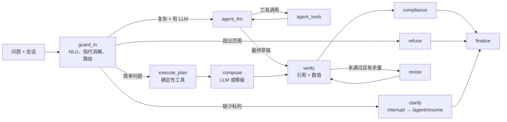

# Agent 层

语言：[English](../agent.md) | 中文

Agent 层（`query_intelligence/agent/`）把 FinSight 从固定的「NLU → 检索 → 一次 LLM 调用」流水线升级为会调用工具的研究助手。它**建立在** Query Intelligence 之上：NLU 与检索仍然是经典、可解释的方法（见 [AGENTS.md](../../AGENTS.md)），Agent 只负责规划、调用工具、用证据校验草稿，并执行合规规则。

两条回答路径共用一张 LangGraph 状态图：

- **workflow**：确定性规划器根据 `nlu_result`（问题类型、意图、source plan、词法线索）生成工具调用。LLM 只负责组织语言（未配置时退回模板）。这条路径可复现，可离线运行。
- **agent**：由 LLM（DeepSeek，OpenAI 兼容的 tool calling）在预算内逐步选择工具。配置了 LLM 时用于复杂问题。

`mode=auto` 逐轮路由；`mode=workflow` 与 `mode=agent` 强制指定路径。没有 LLM 密钥时，`agent` 路由会降级为 `workflow`，并在 `degraded` 中说明。

## 状态图


```mermaid
flowchart LR
    Q[问题 + 会话] --> G[guard_in<br/>NLU、指代消解、<br/>路由]
    G -->|超出范围| R[refuse]
    G -->|缺少标的| C[clarify<br/>interrupt → /agent/resume]
    G -->|简单问题| P[execute_plan<br/>确定性工具]
    G -->|复杂 + 有 LLM| A[agent_llm]
    A -->|工具调用| T[agent_tools] --> A
    A -->|最终草稿| V
    P --> K[compose<br/>LLM 或模板] --> V[verify<br/>引用 + 数值]
    V -->|未通过且有余量| X[revise] --> V
    V --> M[compliance] --> F[finalize]
    R --> F
    C --> F
```

| 节点 | 作用 |
|---|---|
| `guard_in` | 输入守卫（先删掉用户消息里的指令类片段再交给 NLU，包括整段伪造的 `<system>…</system>` 和「先 base64 解码再执行」这类请求；删完没有金融内容就拒答）；回答语言取自用户自己的文字（忽略标记标签、URL 和编码串）；以会话历史作为 `dialog_context` 运行 NLU；追问补全（代词、复数、省略问法，见[记忆与会话](#记忆与会话)）；丢弃问题里并不存在的模糊概念匹配；对明确的金融/宏观问题纠正 NLU 的 out-of-scope 误判；覆盖范围检查（加密资产、美股/港股给出「不在覆盖范围」的拒答，见下）；然后路由。每个决策都写入 `route_reasons`。 |
| `refuse` | 用用户自己文字的语言拒答，并在 `limitations` 里给出机器码：`out_of_scope_query`（不是金融问题）、`prompt_injection_request`（要求改变设定的指令）、`out_of_coverage`（是金融问题，但不在数据范围内：比特币/Bitcoin 等加密资产，Apple/特斯拉/腾讯控股等美股、港股，纳斯达克等；回答说明 FinSight 只覆盖 A 股、基金/ETF、指数和中国宏观）。覆盖范围检查只在没有解析到 A 股标的、且问题没有同时提到 A 股时触发（「美股大跌对A股有什么影响」仍在范围内）；「苹果概念股」这类 A 股题材也在范围内。 |
| `clarify` | 询问用户指的是哪只证券。有 checkpointer 时用 `interrupt()` 暂停，`/agent/resume` 提供回复后继续（每轮最多一次）。 |
| `execute_plan` | 并发执行规划器给出的工具调用（`max_parallel_tools`）。 |
| `compose` | 基于已收集证据由 LLM 组织答案；未配置 LLM 或 LLM 失败时使用 `compose_template`。模板会先说明问题要的、证据里却没有的东西（`agent/coverage.py`）：数据不覆盖的期间（「茅台2019年的营业收入」而财报期是 2025-12-31 → 「当前数据中没有所问的2019年数据：……以下数字均属于该报告期」），或工具没有返回的指标（股息率、资产负债率、营收/净利润增速、毛利率、现金流；净利率可由营收和净利润推出，不算缺失）。取不到数据的标的会点名（「当前数据源中没有招商银行（600036.SH）的基本面数据」）。LLM 路径上同样的缺口写入 `limitations`。 |
| `agent_llm` / `agent_tools` | 工具调用循环。遇到最终答案、`max_llm_steps`、`max_tool_calls`、`token_budget` 或 `run_deadline_s` 时停止；触达上限会强制基于已有证据给出最终答案。同一轮里参数完全相同的重复调用不会再执行：模型收到指向先前结果的 `duplicate_call` 错误，`degraded` 记录 `repeated_tool_calls:N`。 |
| `verify` | 引用的 `evidence_id` 必须存在；每个数字必须出现在**本句**引用的证据里（逐句绑定）：只按写出的单位换算（亿/万/%/hundred million 等），容差由写出的精度决定，写出的方向（涨/跌、up/down）要与正负号一致；LLM 草稿里的行情指标（价格、涨跌幅、PE/PB）只认行情类证据，并且必须带引用。日期、代码与指标参数不计入。 |
| `revise` | 把校验反馈交回 LLM 修改（`max_revisions`）。仍不通过时按子句修复：删除无证据支撑的子句，并记录 `verification_failed:repaired`。 |
| `compliance` | 软化判断与归因表述（「能买吗」改为条件性判断，「为什么涨」加限定说明），删除直接交易指令、评级和仓位建议，对过期行情加新鲜度提示，并附加风险免责声明。语言守卫：答案语言与提问不一致（例如被投毒文档劫持）时，改用确定性答案。 |
| `finalize` | 组装响应：答案、引用、证据来源、工具调用、校验结果、LLM 用量/成本、spans、情感、下一问建议。 |

## 工具

所有工具共用同一个基座（`tools/base.py`）：Pydantic 输入 schema（同时导出为 OpenAI tool schema 并通过 MCP 发布）、超时、瞬时错误重试、TTL 缓存，以及规范化的错误码（`unknown_tool`、`invalid_arguments`、`timeout`、`upstream_error`、`not_found`、`unavailable`、`internal`）。每次成功调用都返回带稳定 `evidence_id` 的 `AgentEvidence`，答案引用的就是这些 id。

| 工具 | 数据来源 |
|---|---|
| `resolve_entity` | NLU 的实体解析器（别名、代码、模糊匹配） |
| `get_price_history` | live 时走行情降级链（有 token 时用 Tushare，否则东方财富 → 新浪 → 腾讯 → 新浪实时 → efinance），离线为种子快照 |
| `compute_indicators` | `MarketAnalyzer`：收益率、MA5/MA20、RSI(14)、MACD、波动率、布林带。历史太短无法计算时明确列出，而不是返回空值。 |
| `get_fundamentals` | live 时：新浪财务指标 → 同花顺；PE(TTM)/PB 来自东方财富数据中心 → 腾讯行情；离线为种子快照 |
| `get_macro_indicators` | live 时：东方财富数据中心（统计局 CPI/PMI、M2、LPR 1年/5年）及10年期国债收益率（东方财富 → 中债）；离线为种子快照 |
| `search_news`、`search_announcements`、`search_knowledge` | 现有检索流水线（PostgreSQL 全文检索 / TF-IDF + Learning to Rank） |
| `analyze_sentiment` | 默认经典情感模型；`QI_AGENT_SENTIMENT_BACKEND=finbert` 时使用 FinBERT |

数据类工具在输出和证据 payload 中附带可选的 `provenance`：来源、`fetched_at`、`as_of`、`is_live`、`mode`（`live` / `live_fallback` / `last_known_good` / `snapshot`）、`freshness`、`fallback_reason`，以及一行 `note`，例如「数据来自新浪财经行情，截至2026-09-24；因东方财富行情熔断中降级」。它不含任何数值，因此不会让编造的数字在校验时看起来「可溯源」。降级链、熔断、缓存与实测审计见[实时数据源](data-sources.md)；`GET /sources/health` 返回各数据源状态。

文档文本被视为不可信数据：工具输出以明确的不可信数据信封交给 LLM，指令类文本（「忽略之前的指令」、角色标签等）在证据入库时即被脱敏，并在 `degraded` 中标记 `instruction_like_text_removed_from_evidence`。

同一组工具也通过 MCP Server 发布，见 [MCP](../mcp.md)。

## 记忆与会话

- 每个 `session_id` 对应一个 LangGraph thread。默认使用内存 checkpointer；设置 `QI_AGENT_CHECKPOINT_DB=/path/sessions.sqlite` 可在重启后保留会话；设置为 `postgresql://...` 则多个进程/副本共享会话。
- 每轮开始时重置本轮字段（工具日志、证据、校验结果等），因此上一轮的证据不会在下一轮被引用。每次运行只写一次检查点（`QI_AGENT_DURABILITY=exit`）。
- 完成的轮次（问题、答案、实体、证据 id）保存在 `turns` 中，并作为对话上下文传给 NLU。
- 同一会话的请求通过会话级锁串行执行（空闲锁按 LRU 最多保留 4,096 个）。
- **会话归属**：会话属于创建它的调用方。设置 `QI_API_KEYS` 后，归属者是 API Key 的哈希（`key:<sha256 前 12 位>`，不保存 Key 本身）；其他 Key 访问该会话一律得到 `404`，`/agent/traces*` 也只返回调用方自己的运行。

### 追问补全

规则位于 `agent/memory.py`，只在当前问题没有点名上市标的（或只点名了一个新标的）时由 `guard_in` 使用。每次改写都会出现在 `route_reasons` 和 `effective_query` 中。

| 情形 | 例子 | 改写结果 | 理由代码 |
|---|---|---|---|
| 代词：指向最近一个点名了标的的轮次（中间没有实体的轮次会被跳过） | 茅台市盈率 → 最新CPI → 「它的市净率呢」 | 贵州茅台的市净率呢 | `coreference:它->贵州茅台` |
| 复数 | 茅台… → 五粮液… → 「这两家哪个估值更高」/「Compare both on P/B」 | 贵州茅台和五粮液哪个估值更高 | `coreference:这两家->…` |
| 省略，缺标的 | 贵州茅台的市盈率 → 「ROE呢」「最近走势怎么样」「And ROE?」 | 贵州茅台ROE呢 / ROE for 贵州茅台? | `ellipsis:target->贵州茅台` |
| 省略，只换了标的 | 贵州茅台的市盈率 → 「换成五粮液呢」「What about BYD?」 | 五粮液的市盈率呢？/ What is 比亚迪's P/E? | `ellipsis:aspect->市盈率` |
| 悬空的「为什么」（整句就是 为什么会这样 / 怎么回事 / 那是什么原因呢 / "why did that happen?" / "how come?"） | 五粮液的市净率 → 那它的营收增速呢 → 「为什么会这样」 | 五粮液的营收为什么会这样 / why did that happen for 五粮液 (营收)? | `dangling_why:target->五粮液` |

复数指代即使 NLU 已从对话上下文带出一个实体，也会按会话来解析；每一轮都保存 `effective_query` 和改写后问题的实体，所以在 宁德时代… → ROE呢 → 换成比亚迪呢 之后，「这两家谁的估值更高」指的是宁德时代和比亚迪。改写后的问题保留「为什么」，因此悬空的「为什么」按普通因果问题路由（Agent 路由；确定性路径上取行情、基本面和新闻）。对已点名证券的省略指标追问（「And the P/B?」）不会用宏观指标回答：只有问题点名宏观主题时，规划器才为已点名的证券加 `get_macro_indicators`。

防止过度补全：
- **适用范围**：只处理短问题（不超过 20 个字符，或不超过 8 个英文词），并且问题要带省略标记（那/呢/换成/and/what about 等）或只有一个指标。
- **不挂到上一家公司**：大盘、行业、market、sector 这类全市场问题，以及宏观问题（CPI呢）。
- **不猜**：有两个候选的代词。

没有历史时，同样的问题会澄清而不是拒答：
- **只有指标没有公司**（「市净率是多少」「PB呢」）：理由 `metric_without_target`。「什么是市净率」这类定义问题不受影响。
- **悬空指代**（「那家公司最近有公告吗」、复数「这两家哪个更值得关注」、单独一句「为什么会这样」）：理由 `dangling_reference`。

此前会先丢弃名称并不在问题里的模糊概念匹配（「…有公告…」曾被模糊匹配成行业「有色金属」，理由 `dropped_fuzzy_concept:有色金属`）。

### 会话记忆卡片

`session_memory(turns, query)` 生成一张抽取式的小卡片，以「Session memory (from earlier turns)」的形式放进 Agent 的用户消息。卡片包含：
- `recent_targets`：最多 6 个去重的上市标的，最新的在前；
- `user_constraints`：用户在任一轮说过的约束，包括 `risk:conservative` / `risk:aggressive`、`horizon:long` / `horizon:short`、`scope:a_shares_only`、`scope:etf_only`；
- `stated_holdings`：「我持有招商银行」「I own …」这类说过的持仓，最多 5 个。

卡片完全基于规则、大小有界，是默认方案。

**可选：用 LLM 摘要较早的轮次**（`QI_AGENT_MEMORY_SUMMARY=1`，默认关闭；`agent/memory_summary.py`）。Agent 原样看到最近两轮；打开开关后，移出这个窗口的轮次由 LLM（提示词 `memory_summary@v1`，关闭推理）压缩成纯文本摘要，并截断到 `QI_AGENT_MEMORY_SUMMARY_TOKENS`（默认 300；按每个汉字 1 token、其他字符每 4 个 1 token 估算），以 `conversation_summary` 加进卡片。摘要是增量的：卡片（会话状态中的 `memory_card`）记录已覆盖的轮数，只有新移出窗口的轮次才会并入，这些轮多一次 LLM 调用，其余轮不调用；该调用在 `llm.log` 中记为 `memory_summary`，计入用量和成本。摘要失败时保留旧卡片，在 `degraded` 中记 `memory_summary_failed:…`，本轮照常执行。**尚未做消融**：在多轮评测集上比较开/关的任务成功率和提示 token 之前，它保持关闭（已计划，第三轮未做）。

## API

| 方法 | 路径 | 用途 |
|---|---|---|
| `POST` | `/agent/chat` | 单轮对话。请求体：`AgentChatRequest`；返回 `AgentChatResponse`。 |
| `POST` | `/agent/chat/stream` | 同上，以 Server-Sent Events 流式返回（见下）。 |
| `POST` | `/agent/resume` | 回答待处理的澄清问题。请求体：`AgentResumeRequest`。幂等：重复提交同一回复（双击、客户端重试）不会让这一轮跑两次，而是返回该轮保存的结果，带 `"replayed": true` 和相同的 `trace_id`，也不会再写一条 trace。没有待澄清问题时提交不同的回复，返回 409：`{"detail": {"code": "no_pending_clarification", "message": …}}`。 |
| `GET` | `/agent/sessions/{session_id}` | 会话历史与待处理的澄清问题（别人的会话返回 404）。 |
| `POST` | `/agent/claim-check` | 请求体如 `{"claim": "贵州茅台ROE超过30%，市盈率不是15倍"}`。逐个数字给出指标、标的、比较符 `comparator`（`eq ne gt ge lt le approx range`）、`supported`/`contradicted`/`unverifiable`（附原因 `reason`）、实际值、证据 id、来源和 `as_of` 及其依据 `as_of_basis`，再给整体结论和免责声明。全程确定性，不用 LLM。规则、局限和 131+47 条说法的基准见 [claim-check.md](claim-check.md)。 |
| `POST` | `/agent/feedback` | 请求体为 `{"trace_id", "rating": "up" \| "down", "comment"?, "session_id"?}`。连同问题和路由追加写入 `QI_FEEDBACK_PATH`（默认 `outputs/feedback/feedback.jsonl`），并计入 `finsight_feedback_total`；trace 不属于调用方时返回 404。`scripts/feedback_to_tasks.py` 会把点踩的 trace 转成待人工审核的候选评测任务。 |
| `GET` | `/agent/traces`、`/agent/traces/{trace_id}` | 最近运行摘要与完整 trace，只返回调用方自己的（[详情](a2a-and-observability.md#运行查看器)）。 |
| `GET` | `/metrics`、`/sources/health[?probe=1]` | Prometheus 指标；数据源状态，可选的限频主动探测（[详情](data-sources.md#健康检查接口)）。 |
| `POST` | `/chat` | 原有端点，默认行为不变：不传 `mode` 或 `mode=workflow` 走原流水线；`mode=auto` 或 `agent` 交给 Agent，并返回 `AgentChatResponse`。 |

JSON Schema 由 `query_intelligence/contracts.py` 生成：

- [`schemas/agent_chat_request.schema.json`](../../schemas/agent_chat_request.schema.json)
- [`schemas/agent_resume_request.schema.json`](../../schemas/agent_resume_request.schema.json)
- [`schemas/agent_chat_response.schema.json`](../../schemas/agent_chat_response.schema.json)

用 `python -m scripts.export_agent_schemas` 重新生成。`tests/test_agent_schemas.py` 会在 schema 过期时失败，并用真实响应做校验。

示例：

```bash
curl -s localhost:8000/agent/chat -H 'Content-Type: application/json' \
  -d '{"query": "贵州茅台的市盈率是多少", "session_id": "demo", "mode": "auto"}'
```

`status: "needs_clarification"` 的响应带有 `clarification.question`，回答方式：

```bash
curl -s localhost:8000/agent/resume -H 'Content-Type: application/json' \
  -d '{"session_id": "demo", "reply": "贵州茅台"}'
```

`/agent/chat/stream` 的 SSE 事件：
- **开头**：`session`。
- **运行过程中**：
  - `node_start`：节点即将运行；
  - `step`：节点完成；
  - `tool_call`、`tool_result`；
  - `answer_delta`：LLM 的 JSON 草稿在流式生成时，把其中 `answer` 字段的文本边解码边发出，跨 chunk 的转义也能处理。
- **之后**：`answer` 或 `clarification`。`answer` 是经过校验和合规处理的最终响应，会替换流式预览。
- **最后**：`done`。

运行失败时发出 `error` 事件。图在持有会话锁的工作线程上运行，客户端断开也不会把会话锁住：这一轮会跑完，轮次和 trace 照常保存，锁随后释放（`tests/test_agent_round3.py::test_stream_client_disconnect_releases_the_lock_and_saves_the_trace`）。

`/` 的浏览器页面使用这些端点：选择模式、实时查看步骤、在对话中回答澄清问题、展开「How this answer was produced」查看工具与校验、点击推荐的下一问。

## 配置

| 变量 | 默认值 | 用途 |
|---|---|---|
| `DEEPSEEK_API_KEY`（或配置中的 `deepseek.api_key`） | 未设置 | 启用 LLM Agent 路径与 LLM 组答；未设置时全部走确定性路径。 |
| `DEEPSEEK_MODEL`、`DEEPSEEK_BASE_URL`、`DEEPSEEK_THINKING_TYPE`、`DEEPSEEK_REASONING_EFFORT`、`DEEPSEEK_MAX_TOKENS`、`DEEPSEEK_TIMEOUT_SECONDS` | 见 `config/app_config.json` | 与 `/chat` 共用的 LLM 设置。 |
| `DEEPSEEK_REASONING_STYLE` | `auto` | 按节点设置推理强度时的参数写法：`deepseek`（`thinking` + `reasoning_effort`）、`openrouter`（`reasoning` 对象，例如 Cline 网关）或 `none`；`auto` 按接口地址判断。 |
| `QI_LLM_FALLBACK_MODELS` | 未设置 | 同一接口上的备用模型（逗号分隔）。每个模型一个熔断器：连续失败 3 次打开，60 秒后放一次试探调用（半开），成功即关闭；`FallbackLLM.stats()` 报告 `closed` / `open` / `half_open`，并由 `/metrics` 导出（[详情](a2a-and-observability.md#llm-网关容灾与成本)）。 |
| `QI_PROMPT_VERSION` | `v3` | 使用 `agent/prompts.py` 注册表中的哪个 Prompt 版本（`v1`、`v2`、`v3`）。 |
| `QI_LLM_PRICE_INPUT_MISS`、`QI_LLM_PRICE_INPUT_HIT`、`QI_LLM_PRICE_OUTPUT`、`QI_LLM_PRICE_CURRENCY` | 未设置 | 每百万 token 价格；未设置时若网关返回 `usage.cost`（美元）则使用它。 |
| `QI_LLM_USD_CNY` | 未设置 | 把网关成本换算为人民币的汇率。 |
| `QI_AGENT_CHECKPOINT_DB` | 未设置（内存） | 会话持久化：SQLite 文件路径，或多个进程/副本共享的 `postgresql://` 连接串。 |
| `QI_AGENT_DURABILITY` | `exit` | LangGraph 持久化模式：每次运行写一次检查点（`exit`），或每步写（`async`、`sync`），见 [performance.md](performance.md)。 |
| `QI_A2A_ENABLED`、`QI_A2A_MODE`、`QI_PUBLIC_BASE_URL` | `1`、`auto`、`http://127.0.0.1:8765` | A2A 开关、使用的 Agent 模式、服务卡片中公布的地址。 |
| `QI_AGENT_REQUEST_TIMEOUT_S` | `120` | `/agent/chat` 与 `/agent/resume` 的单次请求超时（超时返回 504）。 |
| `QI_AGENT_MEMORY_SUMMARY`、`QI_AGENT_MEMORY_SUMMARY_TOKENS` | 关闭、`300` | 可选：在 token 预算内用 LLM 摘要移出原文窗口的较早轮次（见[会话记忆卡片](#会话记忆卡片)）。 |
| `QI_AGENT_SENTIMENT_BACKEND` | `classical` | 设为 `finbert` 使用 FinBERT（需要 `torch`/`transformers`）。 |
| `QI_AGENT_TRACE_DIR` | `outputs/traces` | JSON trace 输出目录；`off` 表示关闭。 |
| `QI_AGENT_OTEL`、`OTEL_EXPORTER_OTLP_ENDPOINT`、`OTEL_EXPORTER_OTLP_HEADERS` | 未设置 | 通过 OTLP/HTTP 导出 OpenTelemetry span（Jaeger、Tempo、Langfuse 等）。 |
| `QI_API_KEYS` | 未设置 | 逗号分隔的 API Key；设置后，除 `GET /health`、`GET /ready`、`GET /`、Agent Card 与 `/static/*` 外都需要 `X-API-Key` 或 `Authorization: Bearer`。 |
| `QI_RATE_LIMIT_PER_MINUTE` | `0`（关闭） | 按客户端的令牌桶限流；超限返回 429 与 `Retry-After`。 |
| `QI_CORS_ORIGINS` | 未设置 | 逗号分隔的允许来源。 |
| `QI_MAX_REQUEST_BYTES` | `1048576` | 超过该大小的请求体返回 413。 |
| `QI_SOURCE_CALL_TIMEOUT_SECONDS`、`QI_SOURCE_FAILURE_THRESHOLD`、`QI_SOURCE_COOLDOWN_SECONDS`、`QI_SOURCE_CACHE`、`QI_SOURCE_MAX_WORKERS`、`QI_SOURCE_PROBE_MIN_INTERVAL_SECONDS`、`QI_SOURCE_CROSS_CHECK` | `10`、`3`、`60`、`true`、`32`、`60`、`true` | live 数据源硬超时、熔断器、TTL 缓存、有界调用池、主动探测限频、新浪/同花顺交叉核对（[详情](data-sources.md#配置)）。 |
| `QI_FEEDBACK_PATH` | `outputs/feedback/feedback.jsonl` | `/agent/feedback` 追加写入的文件。 |
| `QI_TFIDF_CACHE_DIR` | 未设置 | 保存拟合好的 TF-IDF 文档索引的目录（按语料哈希区分）。索引本来就会在进程内缓存，同一进程内重建服务只要 3.65 秒，冷启动则是 24.06 秒；设置该目录后，新进程从磁盘加载（6.81 秒）而不必重新拟合。文件 365 MB，因此没有打进镜像（[startup.json](../results/perf/startup.json)）。 |
| `QI_TEST_LIVE` | 未设置 | 仅测试用：除非 `QI_TEST_LIVE=1`，`tests/conftest.py` 会把 `QI_USE_LIVE_*` 默认设为 `false`，测试不会等待上游网站。 |

Agent 预算（`max_llm_steps=6`、`max_tool_calls=16`、`max_parallel_tools=4`、`token_budget=80000`、`max_revisions=1`、`run_deadline_s=90`、`answer_grace_s=20`）和按节点的推理强度（`agent_reasoning=None` 即客户端默认，`compose_reasoning`、`revise_reasoning`、`final_reasoning` 为 `low`）是 `agent/state.py` 中 `AgentConfig` 的字段。

**截止时间。** `run_deadline_s` 既让工具循环停下，也约束每一次 LLM 请求：
- **单次请求超时**：每个 HTTP 请求（包括重试和切换到备用模型）的超时是 `min(DEEPSEEK_TIMEOUT_SECONDS, 剩余时间)`。
- **两类调用的截止点**：工具循环的调用最晚到 `run_deadline_s`；产出答案的调用（组织答案、强制收尾、修改）最晚到 `run_deadline_s + answer_grace_s`。
- **快速失败**：退避后会超时的重试不再发起；剩余不足 2 秒时直接以不可重试的错误失败，图改用确定性路径作答（模板或修复后的草稿）。

按默认值，一次运行不会超过 `QI_AGENT_REQUEST_TIMEOUT_S`（120 秒）。第一轮故障演练中，慢速备用模型曾让一次请求超时返回 504（见[故障演练](a2a-and-observability.md#故障演练)）；这个上限还没有在压测下重新测量。

## 可观测性

- **trace 与 spans**：每次运行返回 `trace_id` 与各节点的 `spans`。Trace 以 JSON 写入 `outputs/traces/<date>/<trace_id>.json`（已 gitignore）。
- **OTLP 导出**：配置后以 span 形式导出节点、工具与 LLM 的耗时、token 用量、成本、Prompt 版本和错误。
- **Jaeger**：`docker/docker-compose.yml` 的 `tracing` profile 会启动 Jaeger，`monitoring` profile 再加上 Prometheus 和 Grafana。
- **查询接口**：`GET /agent/traces` 与 `GET /agent/traces/{trace_id}` 返回最近的 trace（网页的运行查看器用的就是它），`GET /metrics` 暴露 Prometheus 指标。

详见 [A2A、容灾与可观测性](a2a-and-observability.md)。

## 运行

```bash
pip install -r requirements.txt
uvicorn query_intelligence.api.app:create_app --factory --port 8000   # 页面：http://localhost:8000/
python -m query_intelligence.agent.mcp_server --transport stdio        # MCP Server（加 --offline 关闭 live 数据）
docker compose -f docker/docker-compose.yml up --build                 # 容器（见 docker/Dockerfile）
```

## 评测

Agent 在回放的工具快照上离线评测，结果可复现；任务集、评分、消融、故障注入与局限见 [评测](evaluation.md)。命令：

```bash
python -m evaluation.agent_eval.runner --mode workflow      # 在回放快照上跑 dev 集
python -m evaluation.agent_eval.ablation                    # legacy vs workflow（离线）
python -m evaluation.agent_eval.fault_injection             # 体面降级
python -m evaluation.agent_eval.gate                        # CI 阈值
```

在线结果（LLM Agent、多次运行的 pass^k）需要 `DEEPSEEK_API_KEY`，并与离线结果分开报告。

## 测试

```bash
python -m pytest -q tests/test_agent_*.py tests/test_api_security.py
python -m pytest -q tests/test_web_ui.py      # 通过 Playwright 驱动无头 Chromium
```

所有 Agent 测试都离线运行：`ScriptedLLM` 回放固定的助手回复，`tests/agent_fakes.py` 提供替身工具。

## 局限

- **Agent 的质量取决于背后的 LLM**：离线评测衡量的是确定性路径和图中的安全检查；[在线评测](evaluation.md)覆盖两个 flash 级模型（DeepSeek V4.1 Flash、GLM-5.3 Flash），经同一个网关调用。在 DeepSeek 上，工具循环相对 LLM 组织答案的优势不显著。
- **数值校验只证明可追溯**：校验是逐句的，在 2,433 个篡改答案上误放率 2.1%（`evaluation/results/verifier_stress.json`）。但当所引证据包含多个报告期或指标时，它不检查用的是否正确；投毒到文档里的数字也能通过，因为它就在证据里。
- **覆盖范围和缺口检测基于词表**：加密资产、最大的一批美股/港股公司和海外市场，不是所有海外代码；期间只识别写成年份的（「2019年」「in 2023」「FY2023」），不识别「去年」或季度。
- **可选的 LLM 记忆摘要尚未消融**；规则卡片是经过测量的默认方案。
- **追问补全基于规则**：覆盖代词、复数、短的省略问法和单独的「为什么」追问；更长的转述（「回到刚才那只股票…」）和有歧义的指代会触发澄清而不是猜测。
- **英文别名覆盖有限**：包括第二轮加入的主要 A 股英文名，以及 `data/runtime/alias_table.csv` 中已有的条目。
