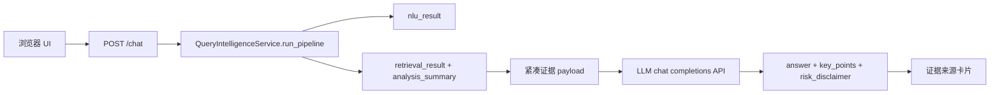

# 本地网页 Chatbot

语言：[English](../frontend-chatbot.md) | 中文

本地网页 Chatbot 是 FinSight 的浏览器演示入口。它刻意保持轻量：前端把用户问题发到 `POST /chat`，后端先跑 Query Intelligence，再把紧凑证据交给 OpenAI-compatible LLM API 生成面向用户的回答措辞。DeepSeek 是当前 checkout 的默认 provider 配置，不是架构边界。

这个包装层不能替代 NLU/Retrieval 主干。实体识别、意图、source plan、证据检索、排序、warnings 和 `analysis_summary` 仍全部来自 Query Intelligence。

## 运行

从 fresh clone 开始：

```bash
pip install -r requirements.txt
export DEEPSEEK_API_KEY="your_deepseek_api_key_here"
python scripts/launch_chatbot.py
```

然后打开：

```text
http://127.0.0.1:8765/
```

如果只是本地演示，希望减少慢速公告 live 请求，可以关闭 live 公告源；本地 seed 公告数据仍可使用：

```bash
QI_USE_LIVE_ANNOUNCEMENT=0 python scripts/launch_chatbot.py
```

## 浏览器界面


| | |
|---|---|
|  |  |
|  |  |
|  |  |

<p> </p>

<p> </p>

页面源码在 `frontend/`（React 19 + TypeScript + Vite 8 + Tailwind CSS v4 + Radix/shadcn 风格组件 + Motion + TradingView Lightweight Charts），构建产物提交在 `query_intelligence/web/dist`，因此只装 Python 也能直接使用。每个回答展示：

- **首字之前的进度**：LLM 路径在输出第一个字之前可能要 10–20 秒。收到第一个 `answer_delta` 之前，回合卡片用平实的话显示当前步骤（“模型正在规划要查询的数据”“正在调用数据工具”“逐一核对回答中的数字与引用”），配一个四段进度条（理解问题 → 查询数据 → 撰写回答 → 核对数字，按图的实际执行顺序），列出已调用的工具及其目标（`get_fundamentals · 600519.SH`）和状态、已用秒数、停止按钮（与输入框的停止相同）以及回答区的骨架；模型耗时超过 8 秒时提示推理通常需要多久。数据来自 `node_start`、`step`、`tool_call`、`tool_result` 事件（`frontend/src/lib/progress.ts`）。第一个字到达后，进度面板收进折叠的执行过程，其标题继续显示当前步骤和用时。读屏只在步骤变化时通过一个 `role="status"` 播报一句；计时、工具列表和流式文本都不是 live region，流式文本标记 `aria-busy`。脉冲和旋转动画只在未开启“减少动态效果”时运行。运行详情里另有浏览器计时的“首字耗时”和“端到端耗时”。
- **执行过程**：流式展示路由依据、每次工具调用的参数/耗时/状态、LLM 步骤 token、核验结果、合规改写、降级标记；回答文本开始流式输出后自动折叠。
- **流式回答**：`answer_delta` 事件（`{"text": "<下一段>"}`）逐段渲染并显示闪烁光标（每帧最多渲染一次，流式过程中隐藏引用标记，包括只收到一半的 `[price_6005`）。最终的 `answer` 事件为准：正文淡入替换草稿；若核验或合规改写了内容，会短暂显示“已按核验结果修订”。服务端不发送 `answer_delta` 时行为与之前一致。
- **数据时效**：每条证据根据 `payload.provenance`（`is_live`、`mode`、`fallback_reason`、`freshness`、`as_of`）显示“实时 / 备用源 / 缓存 / 离线快照”，并在超出时效窗口（行情、行业、技术指标 10 天，财务 200 天，宏观 75 天，新闻 30 天，公告 90 天；知识库与产品文档不过期）或 provenance 标记为 stale 时显示“可能过时”；悬停可看到来源、获取时间和可读的降级原因。只要结构化或被引用的证据中有离线快照、过时数据，或日频数据日期相差超过 10 天，回答顶部就显示横幅（如“数据日期 2026/04/21 至 2026/09/24 · 日频数据日期相差 156 天 · 1 条离线快照……”）；只用了备用源时显示提示性横幅。对应的 KPI 卡片用虚线警示边框标出。
- **可读的内部代码**：路由依据、`degraded`、合规改写、NLU 风险标记、检索告警、工具错误码、回答来源、路由、问题类型与品种都显示为中英文标签（`frontend/src/lib/codes.ts`）。带参数的代码会被解析（`budget:step budget of 6 reached` → “达到推理步数上限（6 步），提前作答”；`llm_error:<异常>` 不会显示异常原文）；第十二轮（H14）起后端会发出的每一种路由依据都有标签：比较帧的 `frame:difference:roe:五粮液|贵州茅台` 显示为“计算ROE差值：五粮液 对比 贵州茅台”（英文界面为 “Computed the ROE gap: Wuliangye vs Kweichow Moutai”），慢速模型策略、简称默认解析、会话指代、拒答原因等依据（`model_policy:composition_for_slow_model`、`alias_default:平安->中国平安|平安银行`、`session_inherit:…`、`group_reference:…`、`off_topic_request:coding` 等）同样写成文字，英文的过程/运行页签用英文证券名。未知的新代码会被整理成可读文字（“Frame: brand new · roe · A, B”），而不是原样显示。原始代码保留在提示框（悬停或键盘聚焦）和 `data-code` 属性中。
- **反馈**：每个回答可点赞/点踩并附可选说明（点踩时自动展开），以 `{trace_id, session_id, rating, comment}` 调用 `POST /agent/feedback`；按 `trace_id` 保存在 `localStorage`（最近 300 条）。服务端没有该接口（404 “Not Found”、405、501）时保存在本地并提示；其他 404 表示服务端已找不到这次运行；网络错误可重试。
- **导出**：复制纯文本，或复制/下载 Markdown：问题、路由、模型、核验、trace id、带 `[E1]` 引用的回答、要点、局限（附原始代码）、编号证据列表（id、类型、来源、截至日期、已引用/实时/备用源/快照/过时、URL 或“结构化数据”、降级原因）和风险提示。
- 可点击的 `E1` 引用标记与证据面板、有价格序列时的收盘价走势图和 KPI（A 股配色：红涨绿跌）、运行指标（trace_id、路由、模型、token、成本、耗时）。另有模式切换、澄清续答（`/agent/resume`）、推荐追问、文本语气、会话记忆（刷新后恢复的历史默认展开在“已恢复本会话的 N 轮历史”下方，可收起）、新会话、API Key（默认只存在当前标签页的 `sessionStorage`；勾选默认关闭的“在此设备上记住”后才写入 `localStorage`）、中英文切换（“已开始新会话”等系统提示随界面语言切换）、深浅色主题、移动端布局和键盘/读屏支持；风险提示始终可见，界面不给出买卖建议。

**打包体积**：恢复 Vite 默认的 500 kB 告警阈值（旧配置调到 560 kB 以掩盖 520 kB 的入口 chunk）。通过 Rolldown `output.codeSplitting.groups`（Vite 8 中替代 `manualChunks` 的方式）把 React、Radix、Motion 拆成可长期缓存的 chunk，价格图与设置对话框用 `React.lazy` 按需加载。入口从 519.6 kB（gzip 167.9）降到 162.3 kB（gzip 54.4），最大 chunk 为 react 218.8 kB，不再触发告警。详细表格见[英文文档](../frontend-chatbot.md#bundle)。

**无障碍**：`tests/test_web_ui.py` 注入 axe-core（前端 devDependency），在空状态、回答与执行过程、检查器各页签、反馈表单、导出菜单、设置对话框、拒答、价格图、深色英文、澄清、带时效横幅的回答以及 390 px 手机界面上检查 WCAG 2.0/2.1/2.2 A/AA 与最佳实践，出现 serious/critical 问题即失败。本轮修复了浅色与深色主题中低于 4.5:1 的文字对比度、空状态下 Tabs 的 `aria-controls` 指向不存在的面板、图表容器 `role="img"` 内含可聚焦链接、对话开始后缺少 `h1` 和标题层级跳级，以及聊天区内的读屏隐藏文本撑高整个页面导致页头被滚出屏幕的问题。真实 Chrome 运行中各状态 axe 结果均为 0 个问题。

**后端契约与降级**：`answer_delta` 与 `POST /agent/feedback` 已在后端 `round2` 分支实现，并已端到端验证（首段流式文本 9.5 秒出现，共 336 个 `answer_delta` 事件，反馈返回 `{"ok": true}`，未知 trace 返回 404 后保存在本地）；对接旧版服务端时界面按上述方式降级。证据时效依赖 `evidence_sources[].payload.provenance`，缺失时只按 `as_of` 计算。

开发与构建：`cd frontend && pnpm install && pnpm dev`（代理到 :8765 的 uvicorn）；`pnpm typecheck && pnpm lint && pnpm test && pnpm build`。浏览器测试：`python -m playwright install chromium && (cd frontend && pnpm install) && python -m pytest -q tests/test_web_ui.py`。第十二轮新增的浏览器回归测试：`cd frontend && pnpm run build && FINSIGHT_PYTHON=<装好后端的 python> pnpm run e2e`，用 `@playwright/test` 驱动本机安装的 Google Chrome（`channel: "chrome"`），由 `frontend/playwright.config.ts` 在 8905 端口启动关闭所有实时数据源、trace 和 LLM 的离线服务；覆盖三轮中文差值会话（“两者相差 3.6 个百分点（贵州茅台更高）”同时引用两家公司的基本面、帧路由依据以文字显示、刷新后显示恢复的三轮历史）和带“说法给出的行业平均值”的核查（关系行“贵州茅台 < 白酒行业”与 30 倍对 27.3 倍的行），出现控制台错误即失败；CI 在 `tests` 任务中运行（约 2 分钟，主要是服务加载模型）。缺少 `web/dist` 或设置 `QI_WEB_UI=legacy` 时回退到 `web/static` 的旧页面。技术选型理由、后端缺口与 2026-09-26 的 Chrome 实测记录见[英文文档](../frontend-chatbot.md#browser-ui)。

## 请求流程



如果没有配置 LLM API、网络不可达或模型返回非法 JSON，`/chat` 会返回结构化摘要 fallback，并把 `llm.status` 标为 `"fallback"`。即使 fallback，响应仍保留 `nlu_result`、`retrieval_result` 和证据来源。

## LLM API 配置

默认值在 `config/app_config.json`，环境变量优先级更高。当前配置命名空间仍叫 `deepseek`，因为 DeepSeek 是随仓库提供的默认示例 provider。架构上客户端调用的是 chat-completions endpoint，可以通过修改 `DEEPSEEK_BASE_URL`、`DEEPSEEK_CHAT_PATH` 和 `DEEPSEEK_MODEL` 指向其他兼容 provider。

| 字段 | 环境变量 | 默认值 |
|---|---|---|
| `deepseek.api_key` | `DEEPSEEK_API_KEY` | 空 |
| `deepseek.base_url` | `DEEPSEEK_BASE_URL` | `https://api.deepseek.com` |
| `deepseek.chat_path` | `DEEPSEEK_CHAT_PATH` | `/chat/completions` |
| `deepseek.model` | `DEEPSEEK_MODEL` | `deepseek-v4-flash` |
| `deepseek.timeout_seconds` | `DEEPSEEK_TIMEOUT_SECONDS` | `60` |
| `deepseek.thinking_type` | `DEEPSEEK_THINKING_TYPE` | `enabled` |
| `deepseek.reasoning_effort` | `DEEPSEEK_REASONING_EFFORT` | `high` |
| `deepseek.max_tokens` | `DEEPSEEK_MAX_TOKENS` | `8192` |

如果需要默认 provider 的更强模型，使用 `DEEPSEEK_MODEL=deepseek-v4-pro`；如果切换 base URL，也可以把它设置为其他兼容 provider 的模型名。支持 reasoning controls 的 provider 可使用 `DEEPSEEK_REASONING_EFFORT=max`。后端请求会发送 `response_format={"type":"json_object"}`，并要求模型只返回一个严格 JSON object。

## API 契约

`POST /chat` 支持和主 pipeline 相同的前端上下文字段：

```json
{
  "query": "你觉得中国平安怎么样？",
  "user_profile": {},
  "dialog_context": [],
  "top_k": 20,
  "debug": false
}
```

响应字段：

| 字段 | 含义 |
|---|---|
| `answer` | LLM API 或 fallback 生成的最终用户回复。 |
| `key_points` | 基于检索证据的简短要点。 |
| `risk_disclaimer` | 投资风险提示。 |
| `evidence_used` | 回答层使用的 evidence IDs。 |
| `evidence_sources` | 前端可直接渲染的来源卡片，包含标题、类型、来源名和可选 URL。 |
| `llm` | `{provider, model, status, error}`，用于观察模型状态。 |
| `nlu_result` | 完整 Query Intelligence NLU 产物。 |
| `retrieval_result` | 完整 Retrieval 产物，包含 warnings 和 `analysis_summary`。 |

## 本地实测

以下截图来自 2026-05-03 的真实本地浏览器运行。服务使用默认 DeepSeek-compatible 配置：`deepseek-v4-flash`、thinking enabled、`reasoning_effort=high`，API key 只通过本地环境变量注入，没有写入仓库。

中文问题：

```text
你觉得中国平安怎么样？
```


英文问题：

```text
What do you think about Ping An Insurance (601318.SH)?
```


实测检查：

| 检查项 | 结果 |
|---|---|
| `GET /health` | `{"status":"ok"}` |
| `POST /chat` 中文问题 | `llm.status="ok"`，中文回答 |
| `POST /chat` 英文问题 | `llm.status="ok"`，英文回答 |
| 浏览器交互 | 输入框、提交按钮、回答卡片、要点、证据来源和免责声明均可渲染 |
| 已修复依赖问题 | 新增 `socksio`，让 `httpx` 能使用本机 SOCKS 代理环境变量 |

## 排错

如果 LLM API fallback 中出现 SOCKS proxy 相关错误，重新安装依赖：

```bash
pip install -r requirements.txt
```

如果 live provider 失败，检查 `retrieval_result.warnings`。pipeline 应该优雅降级，在可用时使用 fallback provider 或仓库自带 runtime assets 继续回答。
