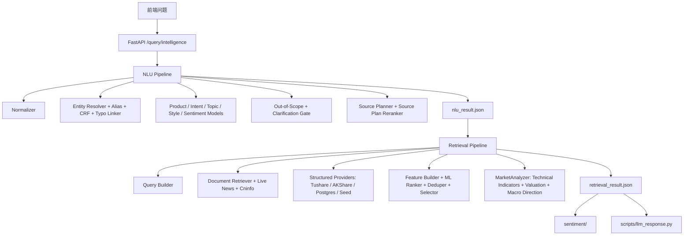

# Query Intelligence

语言：[English](../query-intelligence.md) | 中文

Query Intelligence 是 ARIN 的核心模块。它把金融问题转换为两个证据产物：

- `nlu_result`：用户问了什么、识别到哪些实体、需要哪些证据、应该执行哪些 source。
- `retrieval_result`：找到了哪些证据、证据是否完整、如何排序，以及有哪些结构化分析信号。

下游系统应消费这些产物，不应重新推断用户意图、目标实体或 source plan。

## 支持范围和边界

默认运行时资产聚焦中国市场 v1：

- A 股：行情、新闻、公告、财务、行业、基本面、估值、风险、比较。
- ETF/基金：净值、定投、费用、申赎、产品机制、ETF/LOF/指数基金比较。
- 指数/市场/行业：沪深 300、上证指数、白酒/半导体等行业指数。
- 宏观/政策/指标：CPI、PMI、M2、国债收益率、降息、政策影响。
- 问题样式：事实查询、涨跌原因、持有判断、买卖时机、比较、基本面、风险、预测类问题。

非金融或不支持的问题应识别为 `out_of_scope`。

NLU 和 Retrieval 主路径使用可解释方法：规则、词典、TF-IDF、线性分类器、CRF、树模型、Learning to Rank 和 provider 支撑的结构化检索。`sentiment/` 和 `scripts/llm_response.py` 是下游例外，可以在紧凑证据上使用 transformer 或 LLM。

## 架构



## 关键路径

| 路径 | 说明 |
|---|---|
| `query_intelligence/api/app.py` | FastAPI 应用。 |
| `query_intelligence/service.py` | 编排 NLU 和 retrieval。 |
| `query_intelligence/contracts.py` | Pydantic 请求/响应契约。 |
| `query_intelligence/config.py` | 环境变量配置。 |
| `query_intelligence/data_loader.py` | 运行时 CSV/JSON 加载。 |
| `query_intelligence/nlu/pipeline.py` | NLU 链路。 |
| `query_intelligence/retrieval/pipeline.py` | Retrieval 链路。 |
| `query_intelligence/retrieval/market_analyzer.py` | 技术指标和 `analysis_summary`。 |
| `query_intelligence/integrations/` | Tushare、AKShare、巨潮、efinance provider。 |
| `schemas/` | 输出 JSON Schema。 |

## API

API 代码位于 `query_intelligence/api/app.py`。

| Endpoint | 用途 | 输入 | 输出 |
|---|---|---|---|
| `GET /health` | 健康检查 | 无 | `{"status":"ok"}` |
| `POST /nlu/analyze` | 只执行 NLU | `AnalyzeRequest` | `NLUResult` |
| `POST /retrieval/search` | 基于已有 NLU 执行检索 | `RetrievalRequest` | `RetrievalResult` |
| `POST /query/intelligence` | 端到端 NLU + Retrieval | `PipelineRequest` | `PipelineResponse` |
| `POST /query/intelligence/artifacts` | 端到端运行并写文件 | `ArtifactRequest` | `ArtifactResponse` |

### Pipeline Request

```json
{
  "query": "你觉得中国平安怎么样？",
  "user_profile": {
    "risk_preference": "balanced",
    "preferred_market": "cn",
    "holding_symbols": ["601318.SH"]
  },
  "dialog_context": [
    {
      "role": "user",
      "content": "我持有中国平安"
    }
  ],
  "top_k": 10,
  "debug": false
}
```

| 字段 | 类型 | 必填 | 说明 |
|---|---:|---:|---|
| `query` | string | 是 | 原始用户问题，1 到 2000 字符。 |
| `user_profile` | object | 否 | 持仓、风险偏好、偏好市场等调用方信息。 |
| `dialog_context` | array | 否 | 上下文、历史实体或澄清状态。 |
| `top_k` | integer | 否 | 检索输出数量，1 到 100，默认 20。 |
| `debug` | boolean | 否 | 是否输出额外 debug trace，生产默认 `false`。 |

`ArtifactRequest` 额外支持 `session_id` 和 `message_id`；响应会返回 `query.txt`、`nlu_result.json`、`retrieval_result.json`、`manifest.json` 的路径。

## NLUResult

| 字段 | 类型 | 说明 |
|---|---:|---|
| `query_id` | string | NLU 和 retrieval 共用的 UUID。 |
| `raw_query` | string | 前端原始问题。 |
| `normalized_query` | string | 规范化后的问题。 |
| `question_style` | enum | `fact`、`why`、`compare`、`advice`、`forecast`。 |
| `product_type` | object | 单标签产品预测，含 `label` 和 `score`。 |
| `intent_labels` | array | 多标签意图预测。 |
| `topic_labels` | array | 多标签主题预测。 |
| `entities` | array | 实体解析结果。 |
| `comparison_targets` | array | 比较问题中的比较对象。 |
| `keywords` | array | 检索关键词。 |
| `time_scope` | enum | `today`、`recent_3d`、`recent_1w`、`recent_1m`、`recent_1q`、`long_term`、`unspecified`。 |
| `forecast_horizon` | string | 预测或持有周期，常见为 `short_term`、`medium_term`、`long_term`。 |
| `sentiment_of_user` | string | 用户语气，如 `positive`、`neutral`、`negative`、`bullish`、`bearish`、`anxious`。 |
| `operation_preference` | enum | `buy`、`sell`、`hold`、`reduce`、`observe`、`unknown`。 |
| `required_evidence_types` | array | 下游需要的证据类型。 |
| `source_plan` | array | Retrieval 应尝试执行的数据源。 |
| `risk_flags` | array | 风险和安全标记。 |
| `missing_slots` | array | 缺失槽位。 |
| `confidence` | float | NLU 总体置信度。 |
| `explainability` | object | 命中规则和 top features。 |

### NLU 标签

| 字段 | 取值 |
|---|---|
| `product_type.label` | `stock`, `etf`, `fund`, `index`, `macro`, `generic_market`, `unknown`, `out_of_scope` |
| `intent_labels[].label` | `price_query`, `market_explanation`, `hold_judgment`, `buy_sell_timing`, `product_info`, `risk_analysis`, `peer_compare`, `fundamental_analysis`, `valuation_analysis`, `macro_policy_impact`, `event_news_query`, `trading_rule_fee` |
| `topic_labels[].label` | `price`, `news`, `industry`, `macro`, `policy`, `fundamentals`, `valuation`, `risk`, `comparison`, `product_mechanism` |
| `required_evidence_types[]` | `price`, `news`, `industry`, `fundamentals`, `valuation`, `risk`, `macro`, `comparison`, `product_mechanism` |
| `risk_flags[]` | `investment_advice_like`, `out_of_scope_query`, `entity_not_found`, `entity_ambiguous`, `clarification_required` |
| `missing_slots[]` | `missing_entity`, `comparison_target` |

### Entity 字段

| 字段 | 说明 |
|---|---|
| `mention` | 问题中的文本片段。 |
| `entity_type` | 常见为 `stock`、`etf`、`fund`、`index`、`sector`、`macro_indicator`、`policy`。 |
| `confidence` | 实体置信度。 |
| `match_type` | 当前路径包括 `alias_exact`、`alias_fuzzy`、`fuzzy`、`crf_fuzzy`、`linked`、`context_dialog`、`context_profile`。 |
| `entity_id` | 运行时实体 ID。 |
| `canonical_name` | 标准实体名。 |
| `symbol` | 证券或指标代码。 |
| `exchange` | 交易所代码。 |

## RetrievalResult

| 字段 | 类型 | 说明 |
|---|---:|---|
| `query_id` | string | 与 `NLUResult` 相同。 |
| `nlu_snapshot` | object | Retrieval 使用的关键 NLU 字段快照。 |
| `executed_sources` | array | 实际执行的数据源，可能少于 `source_plan`。 |
| `documents` | array | 非结构化证据。 |
| `structured_data` | array | 结构化证据。 |
| `evidence_groups` | array | 去重或聚类分组。 |
| `coverage` | object | 高层证据覆盖。 |
| `coverage_detail` | object | 细粒度覆盖。 |
| `warnings` | array | 检索 warning。 |
| `retrieval_confidence` | float | 检索总体置信度。 |
| `analysis_summary` | object | 市场、基本面、宏观和数据就绪信号。 |
| `debug_trace` | object | 候选数量和 top-ranked evidence IDs。 |

### Source Types

| 类型 | 位置 | 含义 |
|---|---|---|
| `news` | documents | 新闻。 |
| `announcement` | documents | 交易所或巨潮公告。 |
| `research_note` | documents | 研报、分析师材料或研究数据集文档。 |
| `faq` | documents | 规则、费用、产品机制 FAQ。 |
| `product_doc` | documents | 产品说明或机制文档。 |
| `market_api` | structured | 股票/ETF/基金/指数行情或历史价格。 |
| `fundamental_sql` | structured | 财务指标、估值、盈利能力和基本面。 |
| `industry_sql` | structured | 行业身份、行业走势和行业上下文。 |
| `macro_sql` | structured | 宏观 seed 或宏观表数据。 |
| `fund_nav`, `fund_fee`, `fund_redemption`, `fund_profile` | structured | 基金/ETF 产品数据。 |
| `index_daily`, `index_valuation` | structured | 指数行情和估值。 |
| `macro_indicator`, `policy_event` | structured | live 宏观指标或政策事件。 |

### Coverage

| Key | 含义 |
|---|---|
| `coverage.price` | 存在行情、净值或价格证据。 |
| `coverage.news` | 存在新闻。 |
| `coverage.industry` | 存在行业证据。 |
| `coverage.fundamentals` | 存在基本面证据。 |
| `coverage.announcement` | 存在公告。 |
| `coverage.product_mechanism` | 存在 FAQ、产品机制或基金机制证据。 |
| `coverage.macro` | 存在宏观或政策证据。 |
| `coverage.risk` | 存在风险相关证据。 |
| `coverage.comparison` | 比较问题至少有两个对象具备证据。 |

`coverage_detail` 使用更细 key，如 `price_history`、`financials`、`valuation`、`industry_snapshot`、`fund_nav`、`fund_fee`、`fund_redemption`、`fund_profile`、`index_daily`、`index_valuation`、`macro_indicator`、`policy_event`。

### Warning 和质量标记

| 字段 | 取值 | 含义 |
|---|---|---|
| `warnings` | `out_of_scope_query` | NLU 判定越界，retrieval abstain。 |
| `warnings` | `clarification_required_missing_entity` | 缺少或无法解析实体，需要澄清。 |
| `warnings` | `announcement_not_found_recent_window` | 请求了公告但最近窗口没有匹配公告。 |
| `quality_flags` | `seed_source` | 来自内置 seed，不是 live provider。 |
| `quality_flags` | `missing_source_url` | 没有 public URL。 |
| `quality_flags` | `empty_payload` | 没有业务 payload 字段。 |
| `quality_flags` | `missing_values` | 业务 payload 中存在 null 字段。 |

## Analysis Summary

`analysis_summary` 由 `query_intelligence/retrieval/market_analyzer.py` 生成，是证据摘要，不是投资建议。

```text
analysis_summary
├── market_signal
│   ├── trend_signal
│   ├── rsi_14
│   ├── ma5 / ma20
│   ├── macd
│   ├── bollinger
│   ├── volatility_20d
│   └── pct_change_nd
├── fundamental_signal
│   ├── pe_ttm / pb / roe
│   └── valuation_assessment
├── macro_signal
│   ├── indicators[]
│   └── overall
└── data_readiness
    ├── has_price_data / has_fundamentals / has_macro / has_news
    ├── has_technical_indicators
    ├── relevant_intents
    └── relevant_topics
```

## Live Provider

| Source type | Provider | Endpoint 或来源 | 说明 |
|---|---|---|---|
| `market_api` | Tushare | `tushare.daily` | 需要 `TUSHARE_TOKEN`，A 股优先。 |
| `fundamental_sql` | Tushare | `tushare.fina_indicator` | 财务指标优先来源。 |
| `market_api` | AKShare / efinance | `stock_zh_a_hist`、Sina quote、efinance fallback | 无 token fallback。 |
| `news` | AKShare / 东方财富 | `stock_news_em` | provider 支持时返回 URL。 |
| `announcement` | 巨潮 | `hisAnnouncement/query`、static PDF base | 公告元数据和 PDF URL。 |
| `macro_sql` | AKShare | CPI、PMI、M2、中美国债收益率函数 | 宏观指标。 |
| `fund/etf` | AKShare | ETF 历史、开放基金信息、基金详情 | 净值、费用、申赎、profile。 |
| `index` | AKShare | 指数日线和中证指数估值 | 指数行情和估值。 |
| `research_note`, `faq`, `product_doc` | 本地 runtime | `data/runtime/documents.jsonl` | clone 后可用的本地语料。 |
| optional | PostgreSQL | `QI_POSTGRES_DSN` | 生产文档和结构化存储。 |

纯 API 结构化行的 `source_url` 可以为 null；应使用 `provider_endpoint`、`query_params` 和 `source_reference` 追踪来源。

## 环境变量

| 变量 | 默认值 | 说明 |
|---|---|---|
| `TUSHARE_TOKEN` | empty | Tushare token。 |
| `QI_POSTGRES_DSN` | empty | PostgreSQL DSN。 |
| `CNINFO_ANNOUNCEMENT_URL` | 巨潮默认 | 巨潮公告 endpoint。 |
| `CNINFO_STATIC_BASE` | `https://static.cninfo.com.cn/` | 巨潮 PDF base URL。 |
| `QI_HTTP_TIMEOUT_SECONDS` | `15` | live provider 超时。 |
| `QI_USE_LIVE_MARKET` | `false` | 开启 live 行情/基本面。 |
| `QI_USE_LIVE_NEWS` | 跟随 `QI_USE_LIVE_MARKET` | 开启 live 新闻。 |
| `QI_USE_LIVE_ANNOUNCEMENT` | 跟随 `QI_USE_LIVE_MARKET` | 开启巨潮公告。 |
| `QI_USE_LIVE_MACRO` | `false` | 开启 live 宏观指标。 |
| `QI_USE_POSTGRES_RETRIEVAL` | `false` | 开启 PostgreSQL 检索。 |
| `QI_MODELS_DIR` | `models` | 模型目录。 |
| `QI_API_OUTPUT_DIR` | `outputs/query_intelligence` | artifact 输出目录。 |
| `QI_ENTITY_MASTER_PATH` | auto | 实体主表覆盖。 |
| `QI_ALIAS_TABLE_PATH` | auto | alias 表覆盖。 |
| `QI_DOCUMENTS_PATH` | auto | 文档库覆盖。 |

运行时加载顺序：

- 实体主表：`QI_ENTITY_MASTER_PATH` > `data/runtime/entity_master.csv` > `data/entity_master.csv`
- Alias 表：`QI_ALIAS_TABLE_PATH` > `data/runtime/alias_table.csv` > `data/alias_table.csv`
- 文档库：`QI_DOCUMENTS_PATH` > `data/runtime/documents.jsonl` 或 `.json` > `data/documents.json`
- 结构化 seed fallback：`data/structured_data.json`

## 排错

| 现象 | 检查点 |
|---|---|
| 训练后某只股票仍找不到 | 训练数据不会自动填充 runtime entity。运行 `python -m scripts.materialize_runtime_entity_assets`。 |
| `source_url` 为 null | 结构化 API 行可以没有 URL；检查 `provider_endpoint`、`query_params`、`source_reference`。 |
| `executed_sources` 少于 `source_plan` | 检查 live 开关、token、实体 symbol、provider 可用性或安全跳过。 |
| API 返回 JSON 但没有自然语言回答 | 正常。自然语言回答用 `scripts/llm_response.py`。 |
| 生产行来自 `seed` | 开启 live provider 或 PostgreSQL，并验证凭据。 |
