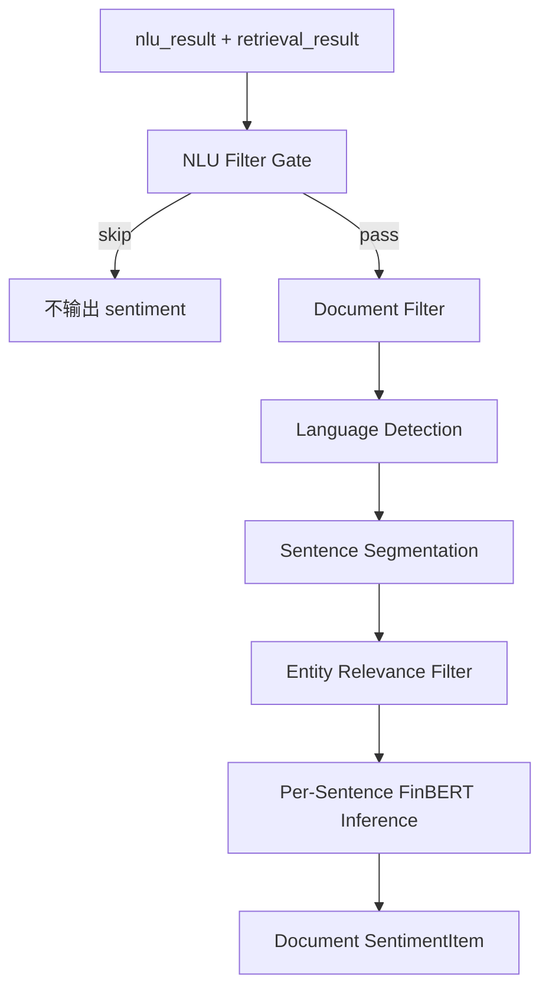

# 文档情感分析

语言：[English](../sentiment.md) | 中文

`sentiment/` 是已实现的下游模块，用 Query Intelligence 产物分析检索到的文档，并输出 `positive`、`negative` 或 `neutral`。

它独立于 NLU/Retrieval 主干，应复用上游 `nlu_result` 和 `retrieval_result`，不要重新做 query understanding。

## 状态

| 组件 | 文件 | 状态 |
|---|---|---|
| Schemas | `sentiment/schemas.py` | 已实现 |
| Preprocessor | `sentiment/preprocessor.py` | 已实现 |
| FinBERT classifier | `sentiment/classifier.py` | 已实现 |
| 独立手动测试 | `manual_test/run_sentiment_test.py` | 已实现 |
| 集成手动参数 | `manual_test/run_manual_query.py --sentiment` | 已实现 |
| FastAPI sentiment routes | 无 | 目前没有挂到 `query_intelligence/api/app.py` |
| 轻量文档情感分类器 | 规划中 | 现有 `training/train_sentiment.py` 是 NLU 用户情绪模型路径 |

## Pipeline



## 输入规则

Preprocessor 使用 `nlu_result` 做跳过判断和实体名称映射：

| 字段 | 用途 |
|---|---|
| `product_type.label` | `out_of_scope` 时整体跳过。 |
| `intent_labels` | `product_info` 或 `trading_rule_fee` 时整体跳过。 |
| `risk_flags` | 存在 `out_of_scope_query` 时跳过。 |
| `missing_slots` | 存在 `missing_entity` 时跳过。 |
| `entities` | 构建实体名和 symbol 映射。 |
| `query_id` | 用于追踪。 |

支持分析的 `retrieval_result.documents[]` 类型：

| Source type | 行为 |
|---|---|
| `news` | 分析 |
| `announcement` | 分析 |
| `research_note` | 分析 |
| `product_doc` | 分析 |
| `faq` | 跳过 |

没有 body 时，使用 title + summary 作为短文本 fallback。

## 预处理

1. 从 retrieval 输出提取文档。
2. 检测语言。优先用 `lingua-language-detector`；不可用时使用字符比例 fallback。
3. 分句。中文用标点规则，英文优先使用能处理缩写的 tokenizer。
4. 做实体相关性过滤。精确包含是 fast path，模糊匹配处理变体。
5. 如果没有匹配实体相关句，fallback 到标题和前几句。
6. 将相关句送入 classifier。

## 分类器

已实现的高资源路径使用 FinBERT 系列模型：

| 语言 | 模型路径 |
|---|---|
| 中文 | 中文金融 tone FinBERT 系列模型 |
| 英文 | `ProsusAI/finbert` 系列 |
| 混合 | 按句子语言路由并聚合 |
| unknown | fallback 或 neutral 处理 |

分类器逐句推理后聚合为文档标签，比直接把长文档塞进 FinBERT 更符合模型训练分布。

## 使用

在人工 Query Intelligence 运行中追加 sentiment：

```bash
python manual_test/run_manual_query.py --query "茅台最近有什么消息" --sentiment
```

使用真实 FinBERT 模型：

```bash
python manual_test/run_manual_query.py --query "茅台最近有什么消息" --sentiment --real-models
```

独立 sentiment 测试：

```bash
python manual_test/run_sentiment_test.py
python manual_test/run_sentiment_test.py --real-models
python manual_test/run_sentiment_test.py --input manual_test/output/<run-dir>
python manual_test/run_sentiment_test.py --json-file data.json
```

Python 边界：

```python
from sentiment import Preprocessor, SentimentClassifier

preprocessor = Preprocessor()
skip_reason, docs, filter_meta = preprocessor.process_query(nlu_result, retrieval_result)

if not skip_reason:
    classifier = SentimentClassifier()
    results = classifier.analyze_documents(docs)
```

## 输出

`SentimentItem` 字段：

| 字段 | 类型 | 说明 |
|---|---|---|
| `evidence_id` | string | 与 `retrieval_result.documents[].evidence_id` 相同。 |
| `source_type` | string | `news`、`announcement`、`research_note` 或 `product_doc`。 |
| `title` | string | 文档标题。 |
| `publish_time` | string or null | 上游发布时间。 |
| `source_name` | string or null | 上游来源名。 |
| `entity_symbols` | array | 上游 entity hits 中的 symbol。 |
| `sentiment_label` | string | `positive`、`negative` 或 `neutral`。 |
| `sentiment_score` | float | 0.0 到 1.0；越接近 1 越正面，越接近 0 越负面。 |
| `confidence` | float | 模型置信度，0.0 到 1.0。 |
| `text_level` | string | `full` 或 `short`。 |
| `relevant_excerpt` | string or null | 送入模型的文本片段。 |
| `rank_score` | float or null | 从 retrieval 透传。 |

`FilterMeta` 字段：

| 字段 | 说明 |
|---|---|
| `skipped_by_product_type` | 因产品类型不支持而跳过。 |
| `skipped_by_intent` | 因意图不需要 sentiment 而跳过。 |
| `skipped_docs_count` | 因 source type 或空文本跳过的文档数。 |
| `short_text_fallback_count` | 只用 title/summary 分析的文档数。 |
| `analyzed_docs_count` | 送入 classifier 的文档数。 |

## 测试

```bash
python -m pytest -q tests/test_sentiment_preprocessor.py tests/test_sentiment_classifier.py tests/test_sentiment_pipeline.py
python manual_test/test_fuzz_sentiment.py
python manual_test/test_coverage_sentiment.py --quick
```

## 设计记录

- 复用 Query Intelligence 的实体解析结果，不再跑第二套 NER。
- 逐句推理可以控制长文档长度并提升相关性。
- `rank_score` 当前只透传，后续可用于加权聚合。
- 后续可以按 rank、source type 或 recency 加权，不需要改变上游 QI 契约。
